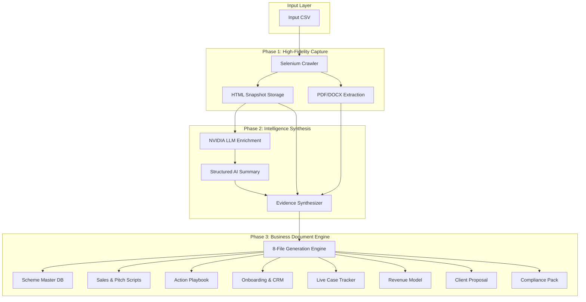

# Scheme Intelligence Pipeline: High-Density Business Document Engine

A sophisticated, industry-grade intelligence pipeline that transforms fragmented government policy data into a complete, audit-ready business document suite. Powered by NVIDIA LLMs, Selenium-based deep crawling, and a multi-stage evidence synthesis layer.

## 🚀 Key Capabilities

- **Deep Multi-Source Crawling**: Selenium (Chrome Headless) engine with depth-2 traversal, handling same-domain discovery and linked document extraction.
- **Full Document Ingestion**: Native extraction from `.pdf`, `.docx`, and `.doc` files, integrating regulatory text as first-class evidence.
- **Evidence Synthesis Layer**: Merges structured AI summaries, raw web snapshots, and document text into a high-density knowledge block.
- **8-File Business Document Engine**: A dedicated LLM pipeline that produces 8 specialized, template-driven assets per scheme:
    1. **Scheme Master Database**: The AI "brain" for client qualification.
    2. **Pitch & Sales Scripts**: Tailored discovery calls and objection handlers.
    3. **Application Playbook**: 5-stage operational execution manual.
    4. **Client Onboarding & CRM**: Specialized intake forms and pipeline stages.
    5. **Live Case Tracker**: Real-time operations and document dashboard.
    6. **Fee & Revenue Model**: Tiered pricing and financial projections.
    7. **Client Proposal Template**: Ready-to-send professional proposals.
    8. **Compliance & Legal Pack**: NDAs, disclaimers, and data policies.

---

## 🏗️ Project Architecture



---

## ⚙️ Setup & Installation

### 1. Environment Setup
Create a virtual environment and install dependencies:
```bash
python -m venv .venv
source .venv/bin/activate  # Windows: .venv\Scripts\activate
pip install -r requirements.txt
pip install -e .
```

### 2. Configuration
Create a `.env` file from the example:
```bash
cp .env.example .env
```
Configure your `NVIDIA_API_KEY` (using Llama-3-70B-Instruct or equivalent).

---

## 🛠️ Usage Instructions

### Run Full Pipeline
Executes crawl, extraction, enrichment, and 8-file report generation:
```bash
python -m scheme_scraper.main --input data/input/sample_schemes.csv --config config/settings.yaml --output-root runs
```

### Resume a Previous Run
Uses a checkpoint to skip already processed schemes:
```bash
python -m scheme_scraper.main --input <CSV_PATH> --resume
```

### Regenerate Business Documents Only
If you have artifacts but need to rebuild the reports (e.g., after a prompt update):
```bash
python -m scheme_scraper.generate_reports --run-dir runs/run_20260418_1703
```

### Smoke Test (Check Setup)
Run only the first scheme to verify the pipeline:
```bash
python -m scheme_scraper.main --max-schemes 1
```

---

## 📂 Data Layout

For every scheme, the pipeline creates an artifact directory:
```
runs/<run_id>/artifacts/<scheme-id>-<slug>/
├── ai_summary.json       # Structured data (Pydantic)
├── evidence_bundle.json  # Raw web content
├── documents/            # Original PDF/DOCX downloads
├── html/                 # Full HTML mirrors
└── [8 Business Documents]
    ├── SCHEME_MASTER_DATABASE.md
    ├── PITCH_AND_SALES_SCRIPTS.md
    └── ... (and 6 others)
```

---

## 🛡️ Notes & Compliance
- **Parallel Execution**: Supports multi-threaded processing with per-worker browser isolation.
- **Idempotency**: Report generator skips existing files > 100 bytes, allowing for safe incremental updates.
- **Browser State**: Chrome runs in ephemeral headless mode, ensuring no session leakage between runs.
