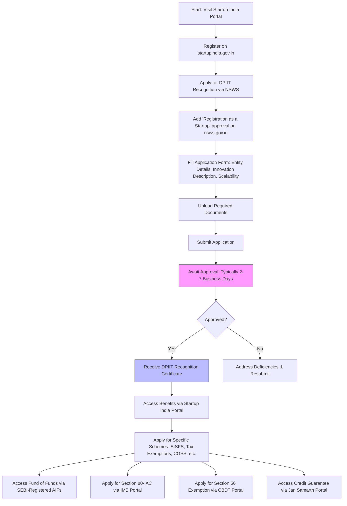

# Comprehensive Scheme Masterclass & File Guide

## Scheme Deep Dive

### Overview
The **Startup India Initiative** is a flagship program launched by the Government of India on January 16, 2016, aimed at fostering innovation, supporting startups, and building a robust ecosystem for entrepreneurship across the country. Administered by the **Department for Promotion of Industry and Internal Trade (DPIIT)** under the **Ministry of Commerce and Industry**, the initiative operates on a **pan-India** geographic scope with **rolling admissions**—applications are accepted year-round with no fixed deadline. As of the latest update in **2026**, the scheme has recognized **170,743 startups** via DPIIT certification and has onboarded **534,319 users** on the **BHASKAR** knowledge platform.

The initiative’s core mission is to reduce regulatory burdens, provide funding support, offer tax incentives, and ease compliance for startups, enabling them to focus on innovation and scalability. It functions primarily as a **recognition-based scheme**, where DPIIT recognition unlocks access to a wide array of benefits, including tax exemptions, funding avenues, intellectual property support, and public procurement advantages.

### Objectives
The Startup India Initiative pursues the following strategic objectives:

- Reduce regulatory burden on startups to allow focus on core business and lower compliance costs  
- Provide funding support through the **Fund of Funds for Startups (FFS)** with a total corpus of **INR 10,000 crore**  
- Offer **100% tax exemption on profits for 3 consecutive years** under **Section 80-IAC** of the Income Tax Act  
- Enable **fast-tracking of patent applications with an 80% rebate in fees**  
- Facilitate easier public procurement by exempting startups from prior experience/turnover criteria  
- Support faster exit for startups within **90 days** under the Insolvency and Bankruptcy Code (IBC), 2016  
- Promote industry-academia partnerships and incubation through initiatives like the **Atal Innovation Mission (AIM)**  
- Encourage innovation-driven manufacturing and development of long gestation technologies  

These objectives are operationalized through multiple sub-schemes and policy instruments detailed below.

### Eligibility Matrix
To qualify for DPIIT recognition under the Startup India Initiative, an entity must meet all the following criteria:

| Criteria | Requirement | Notes |
|--------|-------------|-------|
| **Entity Type** | Private Limited Company, Registered Partnership Firm, or Limited Liability Partnership (LLP) | Must be incorporated or registered in India |
| **Age of Entity** | ≤10 years from incorporation/registration ≤20 years for DeepTech startups | Status ceases upon exceeding age limit or turnover threshold |
| **Annual Turnover** | ≤ INR 100 crore in any financial year since incorporation ≤ INR 300 crore for DeepTech startups | Turnover as defined under Companies Act, 2013 |
| **Innovation & Scalability** | Must work towards innovation, development, or improvement of products/services/processes OR have a scalable business model with high potential for employment generation or wealth creation | Must not be formed by splitting up or reconstructing an existing business |
| **Original Entity** | Not formed by splitting up or reconstructing an existing business | Prevents shell companies from availing benefits |
| **Additional for Tax Benefits (Section 80-IAC)** | Must be a Private Limited Company or LLP Incorporated on or after **1st April 2016** | Requires separate Inter-Ministerial Board (IMB) approval |
| **Additional for Section 56(2)(VIIB) Exemption** | Must be DPIIT recognised Private Limited Company Aggregate paid-up share capital + share premium ≤ INR 25 crore No investment in specified assets (e.g., residential property, loans to related parties, capital contributions to other entities) for 7 years post-issue of shares at premium | Requires self-declaration to CBDT; exemption capped at INR 25 crore consideration |

> **Key Caveats**:
> - DPIIT recognition **only makes startups eligible to apply** for benefits; it does **not automatically entitle** them to all listed benefits  
> - Each incentive (tax exemption, credit guarantee, seed fund, etc.) requires a **separate application and qualification**  
> - Tax benefits under Section 80-IAC require **separate IMB approval**  
> - Startup status expires when turnover exceeds INR 100 Cr (INR 300 Cr for DeepTech) or after 10 years (20 years for DeepTech)  
> - The government may **revoke recognition** if obtained via false information or non-compliance with declarations  

### Benefits & Financial Support
DPIIT recognition unlocks access to a comprehensive suite of benefits across financial, regulatory, and operational domains. These are administered through various sub-schemes and partner platforms.

#### Financial Support Schemes
| Scheme | Implementing Agency | Support Mechanism | Maximum Support | Key Details |
|-------|---------------------|-------------------|-----------------|-------------|
| **Fund of Funds for Startups (FFS)** | SIDBI (managed by DPIIT) | Investment in SEBI-registered AIFs, which in turn fund startups | Total corpus: **INR 10,000 crore** | Segmented AIFs under FFS 2.0 support deep tech, early-stage, manufacturing, and sector/stage agnostic startups |
| **Startup India Seed Fund Scheme (SISFS)** | DPIIT | Financial assistance for PoC, prototype, trials, market entry, commercialisation | Up to **INR 20 lakhs** per entity | Covers proof of concept, prototype development, product trials, market entry, and commercialisation |
| **Credit Guarantee Scheme for Startups (CGSS)** | NCGTC (Trustee), via Member Lending Institutions | Credit guarantee against loans from banks/NBFCs/VDFs | Up to **INR 20 crore** per borrower | 85% cover for loans ≤₹10 crore; 75% for loans >₹10 crore (transaction-based); umbrella-based cover up to 5% of pooled investment or actual losses, max ₹20 crore |
| **Fund of Funds 2.0** | SIDBI | Segmented AIFs for deep tech, early-stage, manufacturing, sector/stage agnostic | Part of INR 10,000 crore corpus | Targets high-potential, long-gestation sectors |

#### Regulatory & Operational Benefits
| Benefit | Description | Eligibility / Notes |
|--------|-------------|---------------------|
| **Tax Exemption under Section 80-IAC** | 100% exemption on profits for 3 consecutive financial years out of first 10 years | DPIIT recognised Private Limited Company or LLP; incorporated after 1st April 2016; requires IMB approval |
| **Exemption under Section 56(2)(VIIB)** | Exemption on investments above fair market value; aggregate consideration exempt up to **INR 25 crore** | DPIIT recognised Private Limited Company; no investment in specified assets for 7 years; self-declaration to CBDT |
| **Self-Certification under Labour & Environment Laws** | Self-certify compliance with **6 labour laws** and **3 environment laws**; no inspections for 5 years unless credible complaint | Applicable to all DPIIT recognised startups |
| **Fast-Tracking of Patent Applications** | Expedited examination; 80% rebate on statutory fees; government bears facilitator fees | DPIIT recognition required; facilitators empanelled by CGPDTM |
| **Exemption from Earnest Money Deposit (EMD)** | No EMD required in government tenders | DPIIT recognised startups |
| **Relaxed Norms in Public Procurement** | Exemption from prior experience/turnover criteria in government tenders (GeM) | Applicable to manufacturing startups; must have own facility in India |
| **Faster Winding Up** | Exit within **90 days** under IBC 2016 for eligible debt structures | Applicable to startups meeting income/specified criteria |
| **Access to MAARG Mentorship Platform** | Intelligent mentor-startup matchmaking across sectors, stages, geographies | Free access via Startup India portal |
| **Access to BHASKAR Knowledge Registry** | One-stop platform for connection, knowledge sharing, searchability | Over 534,319 users; enables collaboration across ecosystem |
| **Participation in National Startup Awards** | Recognition, cash prize (up to ₹10 lakhs), mentorship, growth support | Annual event; open to DPIIT recognised startups |
| **Startup India Investor Connect** | Platform connecting startups with investors across sectors, stages, geographies | Launched March 2023; facilitates investment opportunities |
| **States’ Startup Ranking** | Annual capacity-building exercise to build conducive ecosystem across states/UTs | Encourages state-level policy innovation |

> **Note**: The **Fund of Funds (FFS)** does not provide direct funding to startups. It invests in SEBI-registered Alternative Investment Funds (AIFs), which then invest in startups. Startups must approach these AIFs directly for funding.

### Application Process
The process to obtain DPIIT recognition and access benefits involves sequential steps via the **Startup India portal** and the **National Single Window System (NSWS)**.

#### Required Documents
Applicants must upload the following documents during the NSWS application:

1. Certificate of Incorporation / Registration  
2. PAN of the entity  
3. Memorandum of Association (for Pvt. Ltd.) / LLP Deed  
4. Board Resolution (if any)  
5. Annual Accounts of the startup for the last three financial years  
6. Income Tax returns for the last three financial years  
7. Pitch deck or business description  
8. Authorization letter from authorized signatory  
9. Details of funding received (if any)

#### Key Portals
- **Startup India Portal**: https://www.startupindia.gov.in/ (Main hub for registration, benefits access, schemes)  
- **National Single Window System (NSWS)**: https://nsws.gov.in/ (Used for DPIIT recognition application)  
- **Jan Samarth Portal**: For Credit Guarantee Scheme for Startups (CGSS) applications  
- **IMB Portal**: For Section 80-IAC tax exemption applications (accessed post-recognition)  
- **BHASKAR**: https://startupindia.gov.in/bhaskar/register (Knowledge and collaboration platform)  
- **MAARG Mentorship**: https://www.startupindia.gov.in/maarg/ (Mentorship matchmaking)  

#### Contact Details
- **Email**: startupindia@dipp.gov.in  
- **Helpline**: 1800-11-5565  

### Supporting Evidence Summary
As of 2026:
- **170,743** DPIIT recognised startups  
- **534,319** users on BHASKAR platform  
- **Fund of Funds corpus**: INR 10,000 crore  
- **SISFS support**: Up to INR 20 lakhs per entity  
- **CGSS guarantee**: Up to INR 20 crore per borrower  
- **Section 56 exemption limit**: INR 25 crore aggregate consideration  
- **Section 80-IAC benefit**: 3-year tax holiday on profits  
- **Patent fee rebate**: 80% for recognised startups  
- **EMD exemption**: Applicable in government tenders  
- **Winding up**: Within 90 days under IBC  

The initiative has evolved through annual Finance Acts and regulatory updates, including the removal of angel tax (Section 56(2)(VIIB)) effective April 1, 2025, and periodic extensions of eligibility windows for tax benefits.

---

## Consultant's Field Guide to Generated Files

### 1. SCHEME_MASTER_DATABASE.md
**Real-time Usage:** Keep this open in a background tab during all client calls. When a client asks "What is the turnover limit?" or "Who administers this?", CTRL+F in this document to give an immediate, authoritative answer without checking the portal.

### 2. PITCH_AND_SALES_SCRIPTS.md
**Real-time Usage:** Open this file 5 minutes before your first Discovery Call with a lead. Read the "Problem Framing" out loud to hook them, then use the Qualification Checklist to interrogate their eligibility live on the phone. Keep the Objection Handlers table visible so you can immediately counter when they say "We're too small for this."

### 3. APPLICATION_PLAYBOOK.md
**Real-time Usage:** Print this out or pin it to your desktop once the client signs the retainer. Check off each box in "Stage 1" before moving to "Stage 2". Use the "Client Communication Template" to copy-paste directly into your email when chasing them for pending documents.

### 4. CLIENT_ONBOARDING_AND_CRM.md
**Real-time Usage:** Fill this out during or immediately after the onboarding call. Use the Needs Assessment to record their exact pain points. Update the "Compliance Status" table as they email you documents to maintain a single source of truth for what's missing.

### 5. LIVE_CASE_TRACKER.md
**Real-time Usage:** Review this document every morning during your standup. Update the "Stage" column daily. If a case hits "Stage 07 - Under review", use the Escalation Path notes here to know exactly who to call at the government department today.

### 6. FEE_AND_REVENUE_MODEL.md
**Real-time Usage:** Use this file when drafting the proposal. Look at the client's turnover, map them to the pricing tier in the table, and quote that exact Retainer and Success Fee. Use the monthly projection table to update your personal sales pipeline forecast for the quarter.

### 7. CLIENT_PROPOSAL_TEMPLATE.md
**Real-time Usage:** Copy this entire file, paste it into an email or PDF generator, replace the [PLACEHOLDER] tags with the client's actual details gathered from the CRM, and send it immediately after a successful discovery call.

### 8. COMPLIANCE_AND_LEGAL_PACK.md
**Real-time Usage:** Attach sections 8A and 8B as PDFs to the proposal email. Refuse to start Step 1 of the Application Playbook until the client signs these. Use the Disclaimers to protect yourself legally if the client is rejected by the government agency.