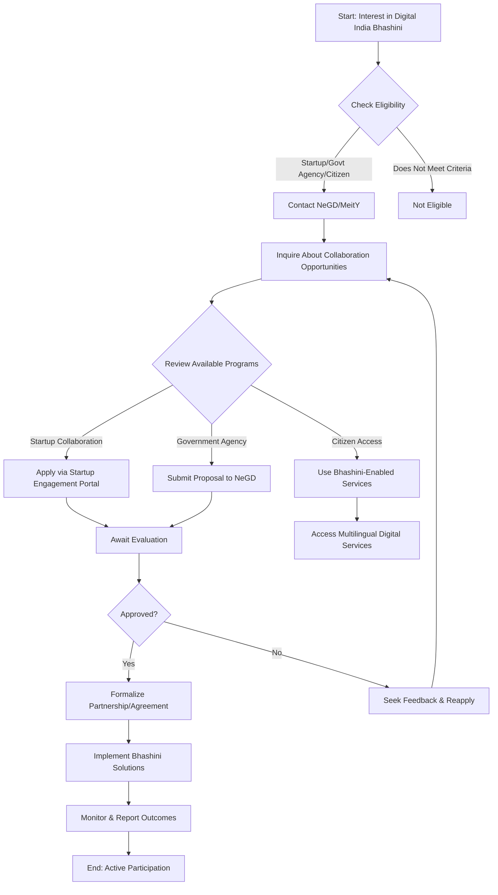

# Comprehensive Scheme Masterclass & File Guide

## Scheme Deep Dive

### Overview
**Scheme Name:** Digital India Bhashini  
**Scheme ID:** row-4  
**Ministry / Category:** Electronics & IT  
**Scheme Type:** other  
**Geographic Scope:** Pan-India  
**Implementing Agency:** National e-Governance Division (NeGD) under the Ministry of Electronics and Information Technology (MeitY), Government of India  
**Status / Deadlines:** No application window, submission dates, or deadline information is provided in the evidence.  
**Confidence:** medium  

### Objectives
- Facilitate seamless communication between various Indian languages and English  
- Bridge linguistic divides through technology  
- Promote digital inclusivity  
- Foster a unique ecosystem where linguistic diversity finds technological resonance  
- Accelerate technological innovation through collaboration  
- Celebrate linguistic pluralism  
- Ensure language is no longer a barrier in a rapidly digitising landscape  
- Transcend linguistic frontiers in digital inclusivity  

### Benefits
- Enables seamless multilingual communication  
- Promotes digital inclusivity  
- Supports linguistic diversity through technological innovation  
- Empowers citizens by breaking language barriers  
- Enhances access to digital services across Indian languages  

### Eligibility Matrix
| Criteria | Detail | Source |
|---------|--------|--------|
| Target Beneficiaries | startups; government agencies; citizens | KEY FACTS |
| Collaboration Scope | The initiative collaborates with startups and government agencies | KEY FACTS |
| Specific Eligibility Criteria | Not detailed in the provided evidence | KEY FACTS |
| Geographic Eligibility | Pan-India | KEY FACTS |
| Administrative Oversight | National e-Governance Division (NeGD) under MeitY | KEY FACTS |

### Financial Support & Benefits Table
| Aspect | Detail | Source |
|--------|--------|--------|
| Financial Support Mechanism | No specific financial support mechanism, quantum, or type is mentioned in the evidence for beneficiaries or participating entities | KEY FACTS |
| Quantum of Support | Not specified | KEY FACTS |
| Type of Support | Not specified | KEY FACTS |
| Primary Non-Financial Benefit | Enables seamless multilingual communication, promotes digital inclusivity, supports linguistic diversity through technological innovation, empowers citizens by breaking language barriers, and enhances access to digital services across Indian languages | KEY FACTS |

### Application Process
No step-by-step application procedure is described in the evidence for accessing or participating in Digital India Bhashini.

### Mermaid.js Flowchart: Application Process

### Key Caveats
> **Warning:** The initiative is nested within MeitY under Digital India Corporation (DIC). Specific eligibility, financial support, or application details are not disclosed in the evidence.  
> **Note:** No application window, submission dates, or deadline information is provided in the evidence.  

### Key Sources
- Scheme Key Facts: Extracted structured data  
- Digital India Bhashini Initiative Page: https://digitalindia.gov.in/initiative/digital-india-bhashini-2  
- Digital India Portal: https://digitalindia.gov.in/  
- myScheme Portal: https://digitalindia.gov.in/initiative/myscheme  
- National e-Governance Division (NeGD) Information: https://digitalindia.gov.in/meity-organisations/  

---

## Consultant's Field Guide to Generated Files

### 1. SCHEME_MASTER_DATABASE.md
**Real-time Usage:** Keep this open in a background tab during all client calls. When a client asks "What is the turnover limit?" or "Who administers this?", CTRL+F in this document to give an immediate, authoritative answer without checking the portal.

### 2. PITCH_AND_SALES_SCRIPTS.md
**Real-time Usage:** Open this file 5 minutes before your first Discovery Call with a lead. Read the "Problem Framing" out loud to hook them, then use the Qualification Checklist to interrogate their eligibility live on the phone. Keep the Objection Handlers table visible so you can immediately counter when they say "We're too small for this."

### 3. APPLICATION_PLAYBOOK.md
**Real-time Usage:** Print this out or pin it to your desktop once the client signs the retainer. Check off each box in "Stage 1" before moving to "Stage 2". Use the "Client Communication Template" to copy-paste directly into your email when chasing them for pending documents.

### 4. CLIENT_ONBOARDING_AND_CRM.md
**Real-time Usage:** Fill this out during or immediately after the onboarding call. Use the Needs Assessment to record their exact pain points. Update the "Compliance Status" table as they email you documents to maintain a single source of truth for what's missing.

### 5. LIVE_CASE_TRACKER.md
**Real-time Usage:** Review this document every morning during your standup. Update the "Stage" column daily. If a case hits "Stage 07 - Under review", use the Escalation Path notes here to know exactly who to call at the government department today.

### 6. FEE_AND_REVENUE_MODEL.md
**Real-time Usage:** Use this file when drafting the proposal. Look at the client's turnover, map them to the pricing tier in the table, and quote that exact Retainer and Success Fee. Use the monthly projection table to update your personal sales pipeline forecast for the quarter.

### 7. CLIENT_PROPOSAL_TEMPLATE.md
**Real-time Usage:** Copy this entire file, paste it into an email or PDF generator, replace the [PLACEHOLDER] tags with the client's actual details gathered from the CRM, and send it immediately after a successful discovery call.

### 8. COMPLIANCE_AND_LEGAL_PACK.md
**Real-time Usage:** Attach sections 8A and 8B as PDFs to the proposal email. Refuse to start Step 1 of the Application Playbook until the client signs these. Use the Disclaimers to protect yourself legally if the client is rejected by the government agency.