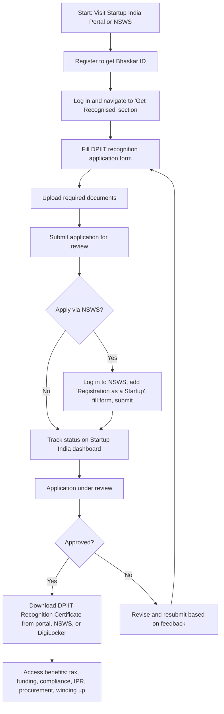

# Comprehensive Scheme Masterclass & File Guide

## Scheme Deep Dive

### Overview
The Startup India Initiative is a flagship program launched by the Government of India to foster innovation, support entrepreneurs, and build a robust startup ecosystem. Administered by the Department for Promotion of Industry and Internal Trade (DPIIT) under the Ministry of Commerce and Industry, the initiative provides recognition, financial support, tax benefits, regulatory ease, and access to various government schemes. Applications are accepted on a rolling basis via the Startup India portal (https://www.startupindia.gov.in/) or the National Single Window System (NSWS) at www.nsws.gov.in. As of the latest data, 237,472 startups have been DPIIT recognised, and 740,129 users are registered on the BHASKAR knowledge platform.

### Objectives
- Reduce regulatory burden on startups to allow focus on core business and lower compliance costs.
- Create a single point of contact for the startup ecosystem to enable knowledge exchange and funding access.
- Promote awareness and adoption of Intellectual Property Rights (IPRs) by providing fast-tracking, facilitator support, and fee rebates.
- Provide an equal platform for startups in public procurement by exempting them from prior experience/turnover requirements and Earnest Money Deposit (EMD).
- Facilitate easier winding up of operations within 90 days under the Insolvency and Bankruptcy Code.
- Provide funding support through the Fund of Funds for Startups (FFS), Credit Guarantee Scheme for Startups (CGSS), and Startup India Seed Fund Scheme (SISFS).
- Catalyse entrepreneurship by extending credit to innovators across society.
- Promote investments by mobilising capital gains from sale of capital assets.

### Eligibility Matrix
Eligibility for DPIIT recognition under Startup India is based on entity type, age, turnover, innovation, and originality. The criteria differ for regular startups and DeepTech startups.

| Criteria | Regular Startup | DeepTech Startup |
|---------|------------------|-------------------|
| **Entity Type** | Private Limited Company (Companies Act, 2013), Partnership Firm (Partnership Act, 1932), Limited Liability Partnership (LLP Act, 2008), Multi-State Cooperative Society (Multi-State Cooperative Societies Act, 2002), or Cooperative Society (State/UT Cooperative Societies Act) | Same as Regular Startup |
| **Age Limit** | Up to 10 years from incorporation/registration | Up to 20 years from incorporation/registration |
| **Turnover Limit** | Not exceeding ₹200 crore in any financial year since incorporation | Not exceeding ₹300 crore in any financial year since incorporation |
| **Innovation & Scalability** | Working towards innovation, development, or improvement of products/processes/services; or scalable business model with high potential for employment generation or wealth creation | Same as Regular Startup |
| **Original Entity** | Must not be formed by splitting up or reconstruction of an existing business | Same as Regular Startup |
| **Additional Notes** | Startup status ceases upon completion of 10 years or if turnover exceeds ₹200 crore in any financial year | Startup status ceases upon completion of 20 years or if turnover exceeds ₹300 crore in any financial year |
| **Tax Exemption (80-IAC) Eligibility** | Only Private Limited Companies or LLPs; incorporated after 1st April 2016 | Same as Regular Startup |

> **Key Caveats**  
> - Tax benefits under Section 80-IAC require separate Inter-Ministerial Board (IMB) approval.  
> - DPIIT recognition does not automatically entitle a startup to all benefits; each incentive requires separate application and qualification.  
> - Benefits are time-bound and subject to change based on evolving rules and regulations.  
> - Recognition can be revoked if obtained via false information or without uploading relevant documents.  
> - As per DPIIT Gazette Notification 108(E) dated 4 February 2026, the turnover threshold was revised from ₹100 crore to ₹200 crore (₹300 crore for DeepTech).

### Benefits & Financial Support
Startups recognised by DPIIT gain access to a wide range of benefits across compliance, taxation, IPR, procurement, funding, and exit mechanisms.

| Benefit Category | Specific Benefits | Details |
|------------------|-------------------|---------|
| **Compliance & Regulatory Ease** | Self-certification under 9 labour and environment laws | No inspections for 3 years for labour laws (only on credible complaint); random checks for white-category environment laws. Laws include: Building & Other Construction Workers Act, Inter-State Migrant Workmen Act, Payment of Gratuity Act, Contract Labour Act, EPF Act, ESI Act, Water (Prevention & Control) Act, Water Cess Act, Air (Prevention & Control) Act. |
| **IPR Support** | Fast-tracking of patent applications; 80% rebate on filing fees; government bears facilitator costs | Panel of facilitators empanelled by CGPDTM; startups pay only statutory fees. Trademark filing fee rebate of 50%. |
| **Tax Exemptions** | Income tax exemption for 3 consecutive years out of first 10 years under Section 80-IAC; exemption from tax on investments above fair market value; exemption from angel tax (Section 56(2)(viib)) | 80-IAC requires IMB approval; angel tax removed via Finance Act (No. 2) 2024 effective 1 April 2025; long-term capital gains tax on unlisted shares reduced from 20% to 12.5% (Finance Act 2024). |
| **Public Procurement** | Exemption from prior experience/turnover; exemption from EMD in government tenders; access to Government e-Marketplace (GeM) | Startups can register as sellers on GeM; no compromise on quality/technical parameters; must have own manufacturing facility in India. |
| **Winding Up** | Fast-track exit within 90 days under Insolvency and Bankruptcy Code, 2016 | Applicable to startups with simple debt structures or meeting income-specified criteria; insolvency professional appointed for liquidation. |
| **Funding Access** | Fund of Funds for Startups (FFS); Credit Guarantee Scheme for Startups (CGSS); Startup India Seed Fund Scheme (SISFS) | FFS: ₹10,000 crore corpus managed by SIDBI, investing in SEBI-registered AIFs. CGSS: Credit guarantee up to ₹20 crore per borrower. SISFS: Financial assistance for proof of concept, prototype, trials, market entry, commercialisation. |
| **Other Benefits** | Access to MAARG mentorship platform; BHASKAR knowledge registry; Startup India Investor Connect; State/UT incentives; SCO Startup Forum (India as chair) | MAARG: intelligent mentor-startup matchmaking; BHASKAR: one-stop knowledge platform; Investor Connect: launched March 2023 to link startups with investors. |

| Financial Support Mechanism | Managing Agency | Corpus / Limit | Key Details |
|-----------------------------|------------------|----------------|-------------|
| **Fund of Funds for Startups (FFS)** | SIDBI | ₹10,000 crore | Invests in SEBI-registered Alternative Investment Funds (AIFs), which in turn invest in startups. |
| **Credit Guarantee Scheme for Startups (CGSS)** | NCGTC (Trustee) | Up to ₹20 crore per borrower | Covers loans from Scheduled Commercial Banks, NBFCs (rating BBB+), and SEBI-registered AIFs. Guarantee: 85% for loans ≤₹10 crore, 75% for loans >₹10 crore (transaction-based); umbrella-based covers actual losses or up to 5% of pooled investment, max ₹20 crore. |
| **Startup India Seed Fund Scheme (SISFS)** | DPIIT (via implementing agencies) | Up to ₹20 lakhs per entity | For early-stage validation: proof of concept, prototype development, product trials, market entry, commercialisation. |

### Application Process
The application process for DPIIT recognition involves registration on the Startup India portal or NSWS, form submission, document upload, and tracking. Upon approval, the recognition certificate is downloadable from the portal, NSWS, or DigiLocker.

**Required Documents**  
1. Certificate of Incorporation / Registration  
2. PAN of the entity  
3. Pitch deck or business description  
4. Authorization letter from authorized signatory  
5. Details of funding received (if any)  
6. Memorandum of Association for Pvt. Ltd. / LLP Deed  
7. Board Resolution (if any)  
8. Annual Accounts of the startup for the last three financial years  
9. Income Tax returns for the last three financial years  
10. Incorporation number (CIN)  
11. LLPIN (if applicable)  
12. Registered Mobile Number  
13. Email ID of Authorized Representative  

**Application Portals**  
- Primary: https://www.startupindia.gov.in/  
- Alternative: National Single Window System (NSWS) at www.nsws.gov.in  

**Contact Details**  
- Email: startupindia@dipp.gov.in  
- Helpline: 1800-11-5565  
- EPABX: 011-23061222  
- Fax: 011-23062626  
- Address: Udyog Bhawan, New Delhi 110011  

**Status / Deadlines**  
- Rolling basis — no fixed deadline. Applications accepted year-round.  
- Last Updated: 2026  

---

## Consultant's Field Guide to Generated Files

### 1. SCHEME_MASTER_DATABASE.md
**Real-time Usage:** Keep this open in a background tab during all client calls. When a client asks "What is the turnover limit?" or "Who administers this?", CTRL+F in this document to give an immediate, authoritative answer without checking the portal.

### 2. PITCH_AND_SALES_SCRIPTS.md
**Real-time Usage:** Open this file 5 minutes before your first Discovery Call with a lead. Read the "Problem Framing" out loud to hook them, then use the Qualification Checklist to interrogate their eligibility live on the phone. Keep the Objection Handlers table visible so you can immediately counter when they say "We're too small for this."

### 3. APPLICATION_PLAYBOOK.md
**Real-time Usage:** Print this out or pin it to your desktop once the client signs the retainer. Check off each box in "Stage 1" before moving to "Stage 2". Use the "Client Communication Template" to copy-paste directly into your email when chasing them for pending documents.

### 4. CLIENT_ONBOARDING_AND_CRM.md
**Real-time Usage:** Fill this out during or immediately after the onboarding call. Use the Needs Assessment to record their exact pain points. Update the "Compliance Status" table as they email you documents to maintain a single source of truth for what's missing.

### 5. LIVE_CASE_TRACKER.md
**Real-time Usage:** Review this document every morning during your standup. Update the "Stage" column daily. If a case hits "Stage 07 - Under review", use the Escalation Path notes here to know exactly who to call at the government department today.

### 6. FEE_AND_REVENUE_MODEL.md
**Real-time Usage:** Use this file when drafting the proposal. Look at the client's turnover, map them to the pricing tier in the table, and quote that exact Retainer and Success Fee. Use the monthly projection table to update your personal sales pipeline forecast for the quarter.

### 7. CLIENT_PROPOSAL_TEMPLATE.md
**Real-time Usage:** Copy this entire file, paste it into an email or PDF generator, replace the [PLACEHOLDER] tags with the client's actual details gathered from the CRM, and send it immediately after a successful discovery call.

### 8. COMPLIANCE_AND_LEGAL_PACK.md
**Real-time Usage:** Attach sections 8A and 8B as PDFs to the proposal email. Refuse to start Step 1 of the Application Playbook until the client signs these. Use the Disclaimers to protect yourself legally if the client is rejected by the government agency.