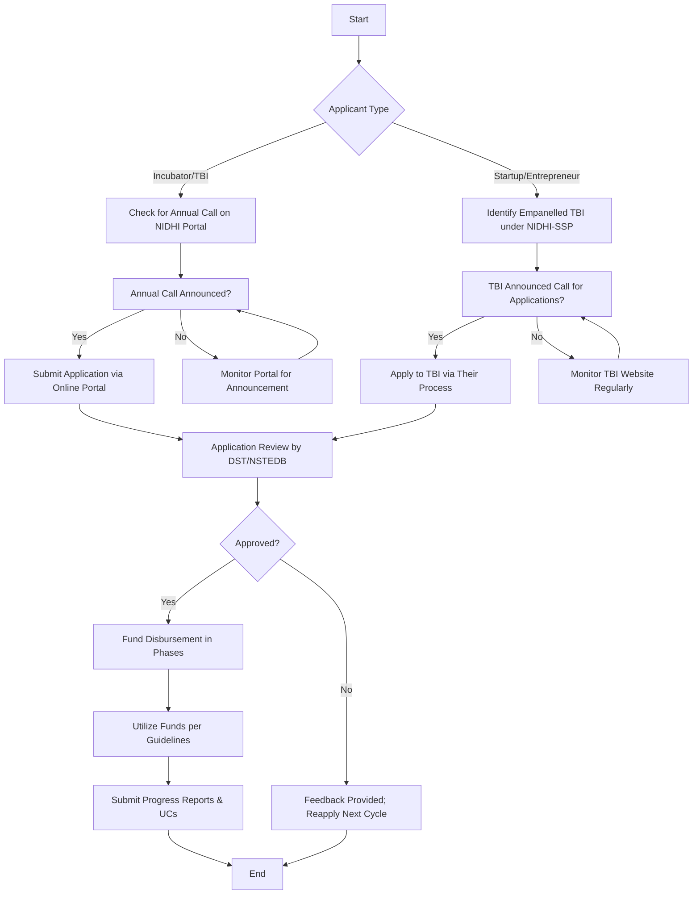

# Comprehensive Scheme Masterclass & File Guide

## Scheme Deep Dive

### Overview
The **NIDHI Seed Support Program (NIDHI-SSP)** is a grant-based initiative implemented by the **Department of Science and Technology (DST), Government of India**, under the National Initiative for Developing and Harnessing Innovations (NIDHI). It aims to provide timely financial assistance to incubators and startups to bridge the gap between development and commercialization of innovative technologies, products, and services. The scheme operates pan-India and accepts applications once per year through an online portal, with calls announced periodically.

### Objectives
- Ensure availability of seed support through incubators for timely support to potential startups.
- Enable startups to advance their ventures and succeed in the marketplace.
- Enable incubators to widen their pipeline of startups.
- Share startup success to ensure long-term operational sustainability of incubators.
- Act as a bridge between development and commercialization of innovative technologies, products, and services.
- Facilitate the success of incubatee startups in a relatively hassle-free manner.

### Eligibility Matrix
| Beneficiary Type | Eligibility Criteria | Application Process |
|------------------|----------------------|---------------------|
| **Incubators/TBIs** | Applications accepted once per year via online portal; call announced at appropriate time. Must be a DST-recognized TBI. | Apply through the NIDHI online portal when the annual call is announced. |
| **Startups/Entrepreneurs** | Must apply to a listed Startup Incubator/TBI under NIDHI-SSP. Innovators encouraged to monitor TBI websites for periodic calls. | Apply directly to empanelled TBIs during their announced application windows. |
| **Target Beneficiaries** | Startups, entrepreneurs, students, researchers, innovators. | — |

> **Note**: Startups cannot apply directly to DST; they must apply through empanelled TBIs. TBIs must be empaneled under NIDHI to participate.

### Benefits & Financial Support
| Entity Type | Maximum Financial Support | Disbursement Mechanism | Purpose |
|-------------|----------------------------|-------------------------|---------|
| **Incubators/TBIs** | Up to INR 1000 lakh (INR 10 Crore) | Released in phases based on incubator needs, capacity, and capabilities, following a proper process. | To strengthen incubator capacity and pipeline. |
| **Startups/Entrepreneurs** | Up to INR 100 lakh (INR 1 Crore) per startup | Provided to help startups get off the ground and grow, increasing marketplace success chances. | Seed support for proof of concept, prototype, trials, market entry, commercialization. |

> **Fund Size**: The overall fund size for NIDHI-SSP is INR 1000 Crore (as per Scheme Key Facts).

### Application Process
The application process differs for incubators/TBIs and startups/entrepreneurs. Below is a Mermaid.js flowchart illustrating the end-to-end flow:

**Key Steps**:
1. **For Incubators/TBIs**: Wait for annual call on [NIDHI Portal](https://nidhi.dst.gov.in/), submit via online portal.
2. **For Startups/Entrepreneurs**: Regularly check websites of empanelled TBIs (list available at [List of NIDHI Seed Supported TBI](https://nidhi.dst.gov.in/document/list-of-nidhi-seed-supported-tbi/)) for their application windows.
3. All applications undergo review by DST/NSTEDB.
4. Approved funds released in phases (for TBIs) or as lump sum/tranche (for startups).
5. Grantees must submit progress reports, audited accounts, and utilization certificates.

> **Portal URL**: Applications are accepted via the online portal at [https://onlinedst.gov.in](https://onlinedst.gov.in) (referenced in multiple guidelines).  
> **Contact**: For queries, email rajivarc[at]nic[dot]in (Scientist 'F', NIDHI Seed Support Program).

### Critical Details from Evidence
- **Status**: Applications accepted once per year; call announced at appropriate time (no fixed deadline).
- **Geographic Scope**: Pan-India.
- **Implementing Agency**: Department of Science and Technology (DST).
- **Scheme Type**: Grant.
- **Confidence Level**: Medium (per Key Facts).
- **Supporting Documents**: 
  - Guidelines: [NIDHI Seed Support Program (NIDHI-SSP) Guidelines](https://nidhi.dst.gov.in/document/nidhi-seed-support-program-nidhi-ssp-guidelines/) (PDF, 731 KB).
  - List of Empanelled TBIs: [List of NIDHI Seed Supported TBI](https://nidhi.dst.gov.in/document/list-of-nidhi-seed-supported-tbi/) (PDF, 331 KB).
  - Compendium: [75 Promising Startups – NIDHI Seed Support Programme](https://nidhi.dst.gov.in/) (PDF, 23.9 MB).

> **Warning**: The scheme does not specify turnover limits, age restrictions, or educational qualifications for startups—eligibility is contingent on selection by empanelled TBIs. TBIs must be DST-recognized and empaneled under NIDHI-SSP to participate.

---

## Consultant's Field Guide to Generated Files

### 1. SCHEME_MASTER_DATABASE.md
**Real-time Usage**: Keep this open in a background tab during all client calls. When a client asks "What is the turnover limit?" or "Who administers this?", CTRL+F in this document to give an immediate, authoritative answer without checking the portal.  
*Example Use Case*: During a discovery call, a client asks, "Is there a revenue cap for startups applying?" You search "turnover" in SCHEME_MASTER_DATABASE.md and confirm: "No turnover limit is specified in the scheme; eligibility is determined by the empanelled TBI’s selection criteria."

### 2. PITCH_AND_SALES_SCRIPTS.md
**Real-time Usage**: Open this file 5 minutes before your first Discovery Call with a lead. Read the "Problem Framing" out loud to hook them, then use the Qualification Checklist to interrogate their eligibility live on the phone. Keep the Objection Handlers table visible so you can immediately counter when they say "We're too small for this."  
*Example Use Case*: A lead says, "We’re just a two-person team with no prototype—can we still qualify?" You refer to the Objection Handlers table and respond: "The NIDHI Seed Support is designed for early-stage ideas; many supported startups were at the idea/prototype stage. Let’s check if your TBI partner accepts pre-revenue applicants."

### 3. APPLICATION_PLAYBOOK.md
**Real-time Usage**: Print this out or pin it to your desktop once the client signs the retainer. Check off each box in "Stage 1" before moving to "Stage 2". Use the "Client Communication Template" to copy-paste directly into your email when chasing them for pending documents.  
*Example Use Case*: After signing the retainer, you check Stage 1: "Confirm client’s TBI partner is empaneled under NIDHI-SSP." You verify via the TBI list, then move to Stage 2: "Help client prepare application documents per TBI’s specific call."

### 4. CLIENT_ONBOARDING_AND_CRM.md
**Real-time Usage**: Fill this out during or immediately after the onboarding call. Use the Needs Assessment to record their exact pain points. Update the "Compliance Status" table as they email you documents to maintain a single source of truth for what's missing.  
*Example Use Case*: During onboarding, you note in Needs Assessment: "Client struggles with prototyping costs." Later, when they send their TBI acceptance letter, you update Compliance Status: "TBI nomination letter – RECEIVED."

### 5. LIVE_CASE_TRACKER.md
**Real-time Usage**: Review this document every morning during your standup. Update the "Stage" column daily. If a case hits "Stage 07 - Under review", use the Escalation Path notes here to know exactly who to call at the government department today.  
*Example Use Case*: At standup, you see a case is at "Stage 07 - Under review." You check the Escalation Path: "Contact Shri Rajiv Kumar (rajivarc[at]nic[dot]in) for status updates on NIDHI-SSP applications."

### 6. FEE_AND_REVENUE_MODEL.md
**Real-time Usage**: Use this file when drafting the proposal. Look at the client's turnover, map them to the pricing tier in the table, and quote that exact Retainer and Success Fee. Use the monthly projection table to update your personal sales pipeline forecast for the quarter.  
*Example Use Case*: A client has INR 50 lakh turnover. You map them to Tier 2 in FEE_AND_REVENUE_MODEL.md and quote: "Retainer: INR 1.5 lakh; Success Fee: 8% of grant amount." You then update your pipeline forecast with this value.

### 7. CLIENT_PROPOSAL_TEMPLATE.md
**Real-time Usage**: Copy this entire file, paste it into an email or PDF generator, replace the [PLACEHOLDER] tags with the client's actual details gathered from the CRM, and send it immediately after a successful discovery call.  
*Example Use Case*: After a discovery call where the client confirmed their TBI partner and idea stage, you open CLIENT_PROPOSAL_TEMPLATE.md, replace [CLIENT_NAME], [TBI_NAME], [IDEA_STAGE], and send the proposal within 1 hour.

### 8. COMPLIANCE_AND_LEGAL_PACK.md
**Real-time Usage**: Attach sections 8A and 8B as PDFs to the proposal email. Refuse to start Step 1 of the Application Playbook until the client signs these. Use the Disclaimers to protect yourself legally if the client is rejected by the government agency.  
*Example Use Case*: Before sending the proposal, you attach COMPLIANCE_AND_LEGAL_PACK.md Sections 8A (NDA) and 8B (Engagement Terms). You email the client: "Please sign and return these before we proceed to document preparation." If the TBI rejects the application, you cite the disclaimer: "Our fee is for application support only; approval rests with DST/TBI."