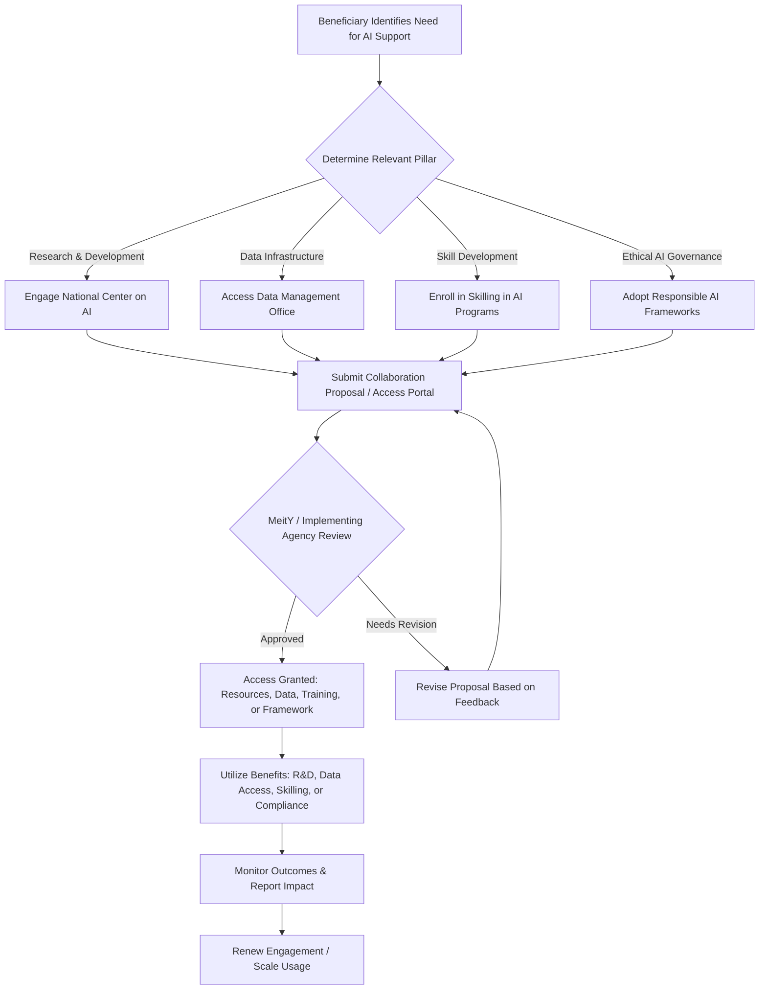

# Comprehensive Scheme Masterclass & File Guide

## Scheme Deep Dive

### Overview
The **IndiaAI Mission – National Program on Artificial Intelligence** (Scheme ID: row-21) is an umbrella initiative under the **Ministry of Electronics and Information Technology (MeitY)**, Government of India, designed to harness transformative AI technologies for social impact, innovation, and inclusion. It operates with a **Pan-India** geographic scope and is structured as an ongoing national program without discrete application windows or deadlines. The mission is implemented through four core pillars: the **National Center on AI**, **Data Management Office**, **Skilling in AI**, and **Responsible AI**. While the scheme does not provide direct financial grants or subsidies to individual beneficiaries, it enables access to AI research, data infrastructure, skill development, and governance frameworks that collectively support AI adoption across startups, researchers, students, government agencies, and industry.

### Objectives
The IndiaAI Mission aims to:
- Promote **inclusion, innovation, and adoption of AI for social impact**
- Establish a **National Center on AI** as a hub for AI research and development
- Build a **Data Management Office** to support AI data infrastructure
- Implement **Skilling in AI** programs to develop AI talent
- Advance **Responsible AI** practices and governance frameworks

These objectives align with the broader vision of the Digital India Programme to transform India into a digitally empowered society and knowledge economy.

### Eligibility Matrix
The evidence does not specify explicit eligibility criteria for entities or individuals to benefit from the IndiaAI Mission. The program is structured as a strategic national initiative with defined pillars rather than an application-based scheme. However, based on the stated target beneficiaries and program design, the following matrix outlines likely eligibility pathways:

| **Beneficiary Category** | **Eligibility Pathway**                                                                 | **Access Mechanism**                                                                 |
|--------------------------|----------------------------------------------------------------------------------------|------------------------------------------------------------------------------------|
| Startups                 | Must be DPIIT-recognized or engaged in AI/ML innovation                                | Access via National Center on AI, Data Management Office, or Skilling programs       |
| Researchers              | Affiliated with academic institutions or R&D labs working on AI                        | Access to National Center on AI, data infrastructure, and AIRAWAT testbed            |
| Students                 | Enrolled in recognized educational institutions                                        | Participation in Skilling in AI programs, workshops, and internships               |
| Government Agencies      | Central/State/UT departments seeking AI integration                                    | Access to Responsible AI frameworks, UX4G, and API SETU for interoperability         |
| Industry                 | Enterprises seeking AI adoption or collaboration                                       | Engagement via National Center on AI, Data Management Office, and industry-academia partnerships |

> **Note**: Direct application-based eligibility is not detailed in the evidence. Benefits are accessed through program participation rather than individual financial disbursement.

### Benefits & Financial Support
The IndiaAI Mission does not detail direct financial support mechanisms (e.g., grants, subsidies) to individual beneficiaries. Financial aspects are discussed in the context of overall Digital India Programme budget allocations, which include provisions for the IndiaAI Mission following separate Cabinet approval. The following table summarizes non-financial benefits derived from the four pillars:

| **Pillar**                          | **Benefits Provided**                                                                                                 | **Target Users**                                                                 |
|-------------------------------------|-----------------------------------------------------------------------------------------------------------------------|----------------------------------------------------------------------------------|
| National Center on AI               | Hub for AI research and development; collaboration platform for academia, industry, and government                      | Researchers, startups, industry R&D labs                                         |
| Data Management Office              | Provides data infrastructure, data governance, and access to datasets for AI training                                 | AI developers, data scientists, government agencies                              |
| Skilling in AI                      | Training programs, workshops, and certification initiatives to build AI talent                                        | Students, professionals, government employees                                    |
| Responsible AI                      | Frameworks for ethical AI development, bias mitigation, transparency, and accountability                              | All AI practitioners, policymakers, auditors                                     |

Financial support for the mission is embedded within the Digital India Programme budget. The following table shows budget allocation and expenditure trends (in Rs. Crore), with specific provision for the IndiaAI Mission marked:

| **Financial Year** | **Budget Allocated (Rs. in Crore)** | **Expenditure (Rs. in Crore)** | **Notes**                                                                 |
|--------------------|-------------------------------------|--------------------------------|---------------------------------------------------------------------------|
| 2015-16            | 1,465.80                            | 1,384.50                       | Pre-AI Mission                                                            |
| 2016-17            | 1,246.16                            | 1,217.65                       | Pre-AI Mission                                                            |
| 2017-18            | 1,425.63                            | 1,451.59                       | Pre-AI Mission                                                            |
| 2018-19            | 3,352.81                            | 3,328.54                       | Pre-AI Mission                                                            |
| 2019-20            | 3,212.52                            | 3,191.09                       | Pre-AI Mission                                                            |
| 2020-21            | 3,044.82                            | 3,030.54                       | Pre-AI Mission                                                            |
| 2021-22            | 6,388.00                            | 4,504.36                       | Includes provision for IndiaAI Mission (Cabinet approved separately)      |
| 2022-23            | 5,400.50                            | 3,863.13                       | Includes provision for IndiaAI Mission                                    |
| 2023-24            | 4,428.01                            | 4,174.14                       | Includes provision for IndiaAI Mission; reduced due to transfer of Digital Payments scheme to DFS |
| 2024-25*           | 4,173.00                            | 3,779.61                       | Includes provision for IndiaAI Mission                                    |
| 2025-26*           | …..                                 | 2,660.32 (as on 01.12.2025)    | Includes provision for IndiaAI Mission                                    |

> *Figures include provision/expenditure in respect of IndiaAI Mission for which separate approval from the Cabinet was obtained.*  
> **Source**: [Digital India Programme Budget Allocation and Expenditure (PDF)](https://digitalindia.gov.in/about-us/) (p. 2 of downloaded PDF)

### Application Process
The evidence does not describe a numbered step-by-step application process for availing benefits under the IndiaAI Mission. The program is presented as a strategic initiative with defined pillars rather than a scheme with individual applications. Access to benefits is facilitated through program engagement rather than formal submissions.

However, based on the program structure and related Digital India initiatives, the following **Mermaid.js flowchart** illustrates the typical engagement pathway for beneficiaries seeking to leverage IndiaAI Mission resources:

> **Key Access Points**:
> - **National Center on AI**: Likely accessible via MeitY portals or direct engagement with C-DAC, IITs, or NIELIT
> - **Data Management Office**: Access through data.gov.in or dedicated AI data portals
> - **Skilling in AI**: Delivered via FutureSkills Prime, NIELIT, or AICTE-approved courses
> - **Responsible AI**: Guidelines available via MeitY’s AI ethics framework documents

> **Portal Reference**: While no direct application portal exists for the IndiaAI Mission, beneficiaries can explore related initiatives via the [myScheme portal](https://www.myscheme.gov.in/) or the [Digital India Initiatives page](https://digitalindia.gov.in/initiatives/) to discover AI-linked programs.

### Key Caveats
> - The IndiaAI Mission is implemented as an **umbrella initiative with specific pillars**; direct beneficiary access mechanisms are not detailed in the evidence.
> - Financial provisions for the IndiaAI Mission are included under the Digital India Programme budget but require **separate Cabinet approval**.
> - The scheme does not offer direct financial transfers; value is derived from **access to infrastructure, knowledge, and frameworks**.
> - As an ongoing program, there are **no published application deadlines or windows**; engagement is continuous and initiative-driven.

---

## Consultant's Field Guide to Generated Files

### 1. SCHEME_MASTER_DATABASE.md
**Real-time Usage:** Keep this open in a background tab during all client calls. When a client asks "What is the turnover limit?" or "Who administers this?", CTRL+F in this document to give an immediate, authoritative answer without checking the portal.

### 2. PITCH_AND_SALES_SCRIPTS.md
**Real-time Usage:** Open this file 5 minutes before your first Discovery Call with a lead. Read the "Problem Framing" out loud to hook them, then use the Qualification Checklist to interrogate their eligibility live on the phone. Keep the Objection Handlers table visible so you can immediately counter when they say "We're too small for this."

### 3. APPLICATION_PLAYBOOK.md
**Real-time Usage:** Print this out or pin it to your desktop once the client signs the retainer. Check off each box in "Stage 1" before moving to "Stage 2". Use the "Client Communication Template" to copy-paste directly into your email when chasing them for pending documents.

### 4. CLIENT_ONBOARDING_AND_CRM.md
**Real-time Usage:** Fill this out during or immediately after the onboarding call. Use the Needs Assessment to record their exact pain points. Update the "Compliance Status" table as they email you documents to maintain a single source of truth for what's missing.

### 5. LIVE_CASE_TRACKER.md
**Real-time Usage:** Review this document every morning during your standup. Update the "Stage" column daily. If a case hits "Stage 07 - Under review", use the Escalation Path notes here to know exactly who to call at the government department today.

### 6. FEE_AND_REVENUE_MODEL.md
**Real-time Usage:** Use this file when drafting the proposal. Look at the client's turnover, map them to the pricing tier in the table, and quote that exact Retainer and Success Fee. Use the monthly projection table to update your personal sales pipeline forecast for the quarter.

### 7. CLIENT_PROPOSAL_TEMPLATE.md
**Real-time Usage:** Copy this entire file, paste it into an email or PDF generator, replace the [PLACEHOLDER] tags with the client's actual details gathered from the CRM, and send it immediately after a successful discovery call.

### 8. COMPLIANCE_AND_LEGAL_PACK.md
**Real-time Usage:** Attach sections 8A and 8B as PDFs to the proposal email. Refuse to start Step 1 of the Application Playbook until the client signs these. Use the Disclaimers to protect yourself legally if the client is rejected by the government agency.