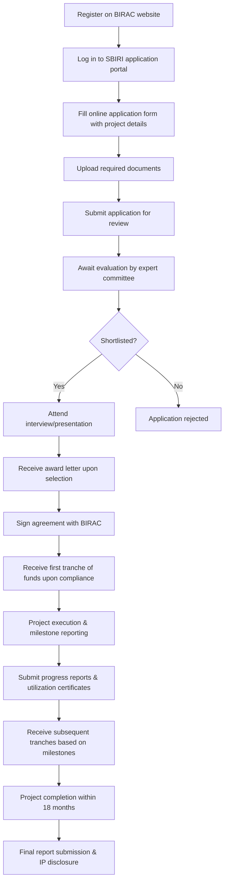

# Comprehensive Scheme Masterclass & File Guide

## Scheme Deep Dive

### Scheme Overview
**Scheme Name:** SBIRI (Small Business Innovation Research Initiative)  
**Scheme ID:** row-25  
**Ministry / Category:** Biotechnology  
**Scheme Type:** Grant  
**Geographic Scope:** Pan-India  
**Implementing Agency:** Department of Biotechnology (DBT), Ministry of Science & Technology, Government of India  
**Application Portal:** https://www.birac.nic.in/  
**Status / Deadlines:** Rolling basis — applications are accepted throughout the year with periodic review cycles.  
**Confidence Level:** Medium  

### Objectives
- Promote innovation and entrepreneurship in the biotechnology sector  
- Support proof-of-concept and prototype development for biotech startups and MSMEs  
- Facilitate industry-academia collaboration for technology translation  
- Provide financial assistance for early-stage validation of biotech ideas  
- Encourage development of commercially viable biotech products and processes  
- Strengthen the biotech startup ecosystem in India  

### Eligibility Matrix
| Eligibility Criteria | Details |
|----------------------|---------|
| **Applicant Type** | Indian startups and MSMEs registered under the Companies Act, 2013 or LLP Act, 2008 |
| **Sector Focus** | Biotechnology sector |
| **Project Stage** | Innovative ideas requiring proof-of-concept or prototype development |
| **Legal Status** | Must be a legal entity registered in India |
| **Commercial Potential** | Technology should have potential for commercialization |
| **Preference** | Given to ventures with strong technical feasibility and market potential |
| **Target Beneficiaries** | Startups; MSME; biotech entrepreneurs |

### Benefits & Financial Support
| Support Type | Details |
|--------------|---------|
| **Financial Support** | Grant-based financial support of up to INR 50 lakhs per project for proof-of-concept and prototype development |
| **Disbursement** | Funding is disbursed in milestones based on project progress and is managed through the Biotechnology Industry Research Assistance Council (BIRAC) |
| **Equity Dilution** | The grant does not require equity dilution |
| **Intended Use** | Intended for early-stage validation activities |
| **Additional Benefits** | Mentorship and technical guidance from DBT and BIRAC, access to DBT’s network of laboratories and research institutions, assistance in IP filing and technology transfer, support for scaling up successful prototypes to market-ready products |

### Key Caveats
> - Funding is strictly for proof-of-concept and prototype development only  
> - Projects must be completed within 18 months from date of sanction  
> - Grantees must submit periodic progress reports and utilization certificates  
> - Intellectual property generated must be disclosed to DBT/BIRAC  
> - Funding cannot be used for salaries, infrastructure, or working capital  

### Required Documents
1. Project proposal detailing objectives, methodology, and expected outcomes  
2. Incorporation/registration certificate of the startup/MSME  
3. CVs of key team members  
4. Proof of concept note or preliminary data (if available)  
5. Bank account details  
6. Authorization letter from the signatory  
7. Declaration of no duplicate funding  

### Application Process (Mermaid Flowchart)

### Contact Details
- **Email:** sbiri@birac.nic.in  
- **Phone:** 011-24363012  

### Supporting Evidence Sources
- **Application Portal:** https://www.birac.nic.in/  
- **Implementing Agency:** Department of Biotechnology (https://dbtindia.gov.in/)  
- **Key Caveats & Objectives:** Extracted from SBIRI scheme facts  

---

## Consultant's Field Guide to Generated Files

### 1. SCHEME_MASTER_DATABASE.md
**Real-time Usage:** Keep this open in a background tab during all client calls. When a client asks "What is the turnover limit?" or "Who administers this?", CTRL+F in this document to give an immediate, authoritative answer without checking the portal.

### 2. PITCH_AND_SALES_SCRIPTS.md
**Real-time Usage:** Open this file 5 minutes before your first Discovery Call with a lead. Read the "Problem Framing" out loud to hook them, then use the Qualification Checklist to interrogate their eligibility live on the phone. Keep the Objection Handlers table visible so you can immediately counter when they say "We're too small for this."

### 3. APPLICATION_PLAYBOOK.md
**Real-time Usage:** Print this out or pin it to your desktop once the client signs the retainer. Check off each box in "Stage 1" before moving to "Stage 2". Use the "Client Communication Template" to copy-paste directly into your email when chasing them for pending documents.

### 4. CLIENT_ONBOARDING_AND_CRM.md
**Real-time Usage:** Fill this out during or immediately after the onboarding call. Use the Needs Assessment to record their exact pain points. Update the "Compliance Status" table as they email you documents to maintain a single source of truth for what's missing.

### 5. LIVE_CASE_TRACKER.md
**Real-time Usage:** Review this document every morning during your standup. Update the "Stage" column daily. If a case hits "Stage 07 - Under review", use the Escalation Path notes here to know exactly who to call at the government department today.

### 6. FEE_AND_REVENUE_MODEL.md
**Real-time Usage:** Use this file when drafting the proposal. Look at the client's turnover, map them to the pricing tier in the table, and quote that exact Retainer and Success Fee. Use the monthly projection table to update your personal sales pipeline forecast for the quarter.

### 7. CLIENT_PROPOSAL_TEMPLATE.md
**Real-time Usage:** Copy this entire file, paste it into an email or PDF generator, replace the [PLACEHOLDER] tags with the client's actual details gathered from the CRM, and send it immediately after a successful discovery call.

### 8. COMPLIANCE_AND_LEGAL_PACK.md
**Real-time Usage:** Attach sections 8A and 8B as PDFs to the proposal email. Refuse to start Step 1 of the Application Playbook until the client signs these. Use the Disclaimers to protect yourself legally if the client is rejected by the government agency.