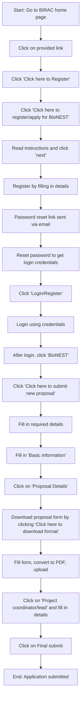

# Comprehensive Scheme Masterclass & File Guide

## Scheme Deep Dive

### Overview
BioNEST Incubation (Scheme ID: row-27) is a Biotechnology sector incubation scheme implemented pan-India by the Biotechnology Industry Research Assistance Council (BIRAC), a Public Sector Enterprise set up by the Department of Biotechnology (DBT), Government of India. The scheme aims to foster a globally competent bioincubation ecosystem by providing incubation space, infrastructure, mentorship, and support services to startups and entrepreneurs in the biotech sector. The application portal is https://birac.nic.in/bionest.php, last updated in 2026.

### Objectives
- Support and encourage startups and entrepreneurs in the biotech sector
- Connect Industry and Academia and enable interactions for efficient exchange of knowledge as well as facilitate technical and business mentorship
- Provide enabling services and required mentorship for IP and Technology management, legal support, certifications, validation, regulatory requirements, resource mobilization and a unique networking platform
- Establish an efficient governance model for bioincubators

### Eligibility Matrix
| Eligibility Criteria | Details | Source |
|----------------------|---------|--------|
| **Applicant Type** | Indian institutions including Universities/ Research Institutes/ Colleges/ Management Institutes/ Business Schools/ Business Incubators/Biotech-Parks/State government S & T bodies/ Biotech State Councils/Research Hospitals | Key Facts |
| **Legal Entity Requirement** | Incorporation of an Indian legal entity* is recommended for Bioincubators, however it is not a must for new applicants especially from Indian Institutions including Universities/ Research Institutes/Colleges/ Management Institutes/ Business Schools etc. *Private Company/ Not for profit Section 8 company/Trust/Society - The legal entities under the relevant Law of India having at least 51% Indian (Citizen) stakeholders (owners/partners/trustees/members/associates/directors etc. as applicable) | Key Facts |
| **Target Beneficiaries** | startups; entrepreneurs | Key Facts |

### Benefits & Financial Support
| Benefit Category | Details | Source |
|------------------|---------|--------|
| **Financial Support** | BIRAC funding for BioNEST Centres aligned with Bio-RIDE umbrella scheme. Funding support from BIRAC in form of grant in aid for both Capital and Operational expenses based on need and scope of project as adjudged by BioNEST committee. Private entities/Institutions require minimum 30% contribution of total project cost. Funding to Government entities: <ul><li>Government Academic Institutions (Centre/State-owned): Grant-in-aid</li><li>Central Government owned Section-8 company(ies): Grant-in-aid</li><li>State Government-Owned Section-8 company(ies)/Councils: Minimum 50% contribution from applicant required (for Category 4 applications)</li></ul> | Key Facts |
| **Incubation Space** | Incubation space for startups and entrepreneurs | Key Facts |
| **Knowledge Exchange** | Connection between industry and academia for knowledge exchange | Key Facts |
| **Mentorship** | Technical and business mentorship | Key Facts |
| **IP & Tech Management** | Enabling services for IP and Technology management | Key Facts |
| **Legal Support** | Legal and contractual support | Key Facts |
| **Resource Mobilization** | Resource mobilization support | Key Facts |
| **Networking Platform** | Networking platform for startups | Key Facts |
| **Governance Model** | Establishment of an efficient governance model | Key Facts |
| **Impact Metrics (Cumulative)** | 73 bio-incubators supported, 1045470 sq. ft. incubation area, 4273655139.6 amount committed, 2515 incubatees supported, 1560 resident incubatees, 955 non-resident incubatees, 800+ total products/technologies commercialized, 3500 total employment generated, 1300+ total IPs filed | Crawled Web Page (bionest.php) |

### Application Process Flowchart

### Key Timelines & Deadlines
| Item | Detail | Source |
|------|--------|--------|
| **Last Updated** | 2026 (scheme), 04 June 2026 (website) | Key Facts, Crawled Web Page |
| **BioNEST APEX Committee Meeting** | Held on 29th November 2025 (recommendations published 05.01.2026) | PDF: result-bionest-acm.pdf |
| **Application Window** | Advertised on website; proposals submitted online only | Guidelines: bionest-guidelines-2025.pdf |
| **Funding Duration** | Initial funding period up to three years, with possibility of two-year extension based on performance evaluation and fund availability | Guidelines: bionest-guidelines-2025.pdf |
| **Operational Continuation** | After successful execution, BioNEST Center expected to continue operations through self-funding or host institute support | Guidelines: bionest-guidelines-2025.pdf |

### Critical Notes & Warnings
> **Warning**: Private entities/institutions must contribute a minimum of 30% of the total project cost. For State Government-Owned Section-8 companies/councils applying under Category 4, a minimum 50% contribution from the applicant is required. Failure to meet these contribution requirements will result in application rejection.

> **Note**: The BioNEST scheme provides grant-in-aid for both capital and operational expenses, with funding amounts based on project need and scope as adjudged by the BioNEST committee. There is no fixed upper limit specified in the evidence; funding is project-specific.

> **Note**: Applicants must submit proposals online only via the BIRAC portal. Offline or email submissions are not accepted.

> **Note**: The scheme supports four categories: (1) Establishing New BioNEST Incubators at Academic/Research Institutes/Research Hospitals/Organizations fostering Innovation, (2a) Establishing BioNEST Bioincubation facility to strengthen existing non-biotech incubators, (2b) Integration of non-BIRAC supported Bioincubators with BioNEST network, (3) Scaling/Strengthening of existing BioNEST Incubators, (4) Establishing new BioNEST Incubators with State Government.

> **Note**: Space recommendation: Allocate about 10,000 sq ft or more for the bioincubation facility to cater to minimum 25 startup teams with average dedicated space of up to 200 sq. ft./startup in cabin layout. Joint applications from multiple institutions committing to total space of ~10,000 sq. ft. or more may be considered. Special cases may receive relaxation on space requirements based on merit, location, and regional capacities.

> **Note**: BIRAC may exercise provision to take equity in startups incubated in the facility as per competent authority norms and its policies.

## Consultant's Field Guide to Generated Files

### 1. SCHEME_MASTER_DATABASE.md
**Real-time Usage:** Keep this open in a background tab during all client calls. When a client asks "What is the turnover limit?" or "Who administers this?", CTRL+F in this document to give an immediate, authoritative answer without checking the portal.

### 2. PITCH_AND_SALES_SCRIPTS.md
**Real-time Usage:** Open this file 5 minutes before your first Discovery Call with a lead. Read the "Problem Framing" out loud to hook them, then use the Qualification Checklist to interrogate their eligibility live on the phone. Keep the Objection Handlers table visible so you can immediately counter when they say "We're too small for this."

### 3. APPLICATION_PLAYBOOK.md
**Real-time Usage:** Print this out or pin it to your desktop once the client signs the retainer. Check off each box in "Stage 1" before moving to "Stage 2". Use the "Client Communication Template" to copy-paste directly into your email when chasing them for pending documents.

### 4. CLIENT_ONBOARDING_AND_CRM.md
**Real-time Usage:** Fill this out during or immediately after the onboarding call. Use the Needs Assessment to record their exact pain points. Update the "Compliance Status" table as they email you documents to maintain a single source of truth for what's missing.

### 5. LIVE_CASE_TRACKER.md
**Real-time Usage:** Review this document every morning during your standup. Update the "Stage" column daily. If a case hits "Stage 07 - Under review", use the Escalation Path notes here to know exactly who to call at the government department today.

### 6. FEE_AND_REVENUE_MODEL.md
**Real-time Usage:** Use this file when drafting the proposal. Look at the client's turnover, map them to the pricing tier in the table, and quote that exact Retainer and Success Fee. Use the monthly projection table to update your personal sales pipeline forecast for the quarter.

### 7. CLIENT_PROPOSAL_TEMPLATE.md
**Real-time Usage:** Copy this entire file, paste it into an email or PDF generator, replace the [PLACEHOLDER] tags with the client's actual details gathered from the CRM, and send it immediately after a successful discovery call.

### 8. COMPLIANCE_AND_LEGAL_PACK.md
**Real-time Usage:** Attach sections 8A and 8B as PDFs to the proposal email. Refuse to start Step 1 of the Application Playbook until the client signs these. Use the Disclaimers to protect yourself legally if the client is rejected by the government agency.