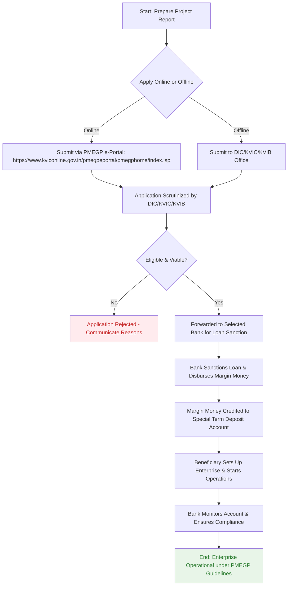

# Comprehensive Scheme Masterclass & File Guide

## Scheme Deep Dive

### Overview
The Prime Minister's Employment Generation Programme (PMEGP) is a central sector scheme administered by the Khadi and Village Industries Commission (KVIC) under the Ministry of Micro, Small & Medium Enterprises (MSME). It aims to generate employment opportunities through the establishment of micro-enterprises in both rural and urban areas of India. The scheme operates on a rolling basis with no fixed deadline, accepting applications throughout the year via the online portal or offline submission to designated agencies.

### Objectives
- To generate employment opportunities in rural and urban areas through setting up of new self-employment ventures/projects/micro enterprises.
- To bring together widely dispersed traditional artisans, rural and urban unemployed youth and provide them self-employment opportunities to the extent possible, at their place of residence.
- To provide continuous and sustainable employment to a large segment of traditional and prospective artisans and rural and urban unemployed youth in the country, thereby helping to arrest migration of rural youth to urban areas.
- To increase the wage-earning capacity of artisans and contribute to increasing the growth rate of rural and urban employment.

### Eligibility Matrix
| Criteria | Details |
|---------|--------|
| **Age** | Minimum 18 years of age |
| **Educational Qualification** | For projects costing > Rs. 10 lakh (manufacturing) or > Rs. 5 lakh (business/service): At least VIII standard pass. No educational qualification required for projects below these thresholds. |
| **Beneficiary Type** | Individuals, Self-Help Groups (SHGs), Institutions (including societies registered under Societies Registration Act, 1860; trusts registered under Indian Trusts Act, 1882; cooperative societies), MSMEs |
| **Ineligibility** | - Existing units under PMRY, REGP, or any other central/state government scheme - Units that have already availed government subsidy under any other central or state government scheme - Beneficiaries who have previously received subsidy under any other government scheme |
| **Geographic Scope** | Pan-India (applicable across all states and union territories) |
| **Project Cost Limits** | - Manufacturing Sector: Maximum project cost of Rs. 50 lakh - Business/Service Sector: Maximum project cost of Rs. 20 lakh *(Note: There is no ceiling on loan amount under the scheme; only the government subsidy component is capped.)* |

### Financial Support & Benefits
| Parameter | Details |
|---------|--------|
| **Maximum Project Cost** | - Manufacturing: Rs. 50 lakh - Business/Service: Rs. 20 lakh |
| **Government Subsidy (Margin Money)** | Ranges from 15% to 35% of project cost, based on beneficiary category and location: - **General Category**: 15% (urban), 25% (rural) - **Special Categories** (SC/ST/OBC/women/ex-servicemen/physically handicapped/NER/hill and border areas): 25% (urban), 35% (rural) |
| **Loan Component** | Balance of project cost (after margin money) provided as loan by banks |
| **Interest Rate on Loan** | As per prevailing norms of the respective banks (not subsidized under scheme) |
| **Subsidy Disbursement** | Released by nodal banks in instalments into a special term deposit account; not withdrawable until lock-in period ends |
| **Additional Support** | Training and technical support through KVIC and its affiliated institutions (KVIB, DIC) |
| **Key Benefit** | Subsidy (margin money) is **non-repayable** |

> **Important Caveats**  
> - The margin money subsidy is locked in for a specific period and **cannot be withdrawn prematurely**.  
> - The project must be **technically feasible and economically viable** to qualify for both bank loan and government subsidy.  
> - Beneficiaries who have availed subsidy under any other central or state government scheme are **not eligible**.  
> - Existing units under PMRY, REGP, or any other government scheme are **not eligible** for financial assistance under PMEGP.  
> - There is **no upper limit on the loan amount**; only the government subsidy component is capped based on project cost ceilings.

### Application Process Flowchart

> **Application Portal**: https://www.kviconline.gov.in/pmegpeportal/pmegphome/index.jsp  
> **Implementing Agency**: Khadi and Village Industries Commission (KVIC)  
> **Status**: Rolling basis — applications accepted throughout the year  
> **Confidence Level**: Medium (based on evidence consistency)

---

## Consultant's Field Guide to Generated Files

### 1. SCHEME_MASTER_DATABASE.md
**Real-time Usage:** Keep this open in a background tab during all client calls. When a client asks "What is the turnover limit?" or "Who administers this?", CTRL+F in this document to give an immediate, authoritative answer without checking the portal.  
*Example Use Case:* During a discovery call, a client asks, "Is there a revenue cap for existing businesses to qualify?" You instantly search for "turnover" or "existing unit" and respond: "There is no turnover ceiling, but existing units under PMRY, REGP, or any other government scheme are ineligible."

### 2. PITCH_AND_SALES_SCRIPTS.md
**Real-time Usage:** Open this file 5 minutes before your first Discovery Call with a lead. Read the "Problem Framing" out loud to hook them, then use the Qualification Checklist to interrogate their eligibility live on the phone. Keep the Objection Handlers table visible so you can immediately counter when they say "We're too small for this."  
*Example Use Case:* Before calling a rural artisan cooperative, you review the script: "Many artisans struggle to scale due to lack of collateral for loans." You then use the checklist to verify VIII standard pass status and rural location, and counter the objection "We’re too small" with: "PMEGP specifically supports micro-enterprises as low as project cost under Rs. 5 lakh in service sector — ideal for startups and small groups."

### 3. APPLICATION_PLAYBOOK.md
**Real-time Usage:** Print this out or pin it to your desktop once the client signs the retainer. Check off each box in "Stage 1" before moving to "Stage 2". Use the "Client Communication Template" to copy-paste directly into your email when chasing them for pending documents.  
*Example Use Case:* After retainer signing, you print the playbook. As the client emails their project report, you check off "Project Report Received" under Stage 1. When they delay sending caste certificate, you use the template: "Dear [Name], to keep your PMEGP application on track for bank submission, we still need your caste certificate. Kindly share it by [Date] to avoid delays."

### 4. CLIENT_ONBOARDING_AND_CRM.md
**Real-time Usage:** Fill this out during or immediately after the onboarding call. Use the Needs Assessment to record their exact pain points. Update the "Compliance Status" table as they email you documents to maintain a single source of truth for what's missing.  
*Example Use Case:* During onboarding, you note in Needs Assessment: "Client struggles with working capital despite having skills in handicrafts." As they submit Aadhaar and photos, you update the CRM table: Identity Proof ✅, Address Proof ❌, Project Report ❌. This becomes your live tracking sheet.

### 5. LIVE_CASE_TRACKER.md
**Real-time Usage:** Review this document every morning during your standup. Update the "Stage" column daily. If a case hits "Stage 07 - Under review", use the Escalation Path notes here to know exactly who to call at the government department today.  
*Example Use Case:* At 9 AM standup, you see a case moved to "Stage 07 - Under review" at KVIC. You check the escalation path: "Contact District Nodal Officer at KVIC after 48hrs of no update." You call the Dindigul KVIC officer by 11 AM, reference the application ID, and get confirmation that verification is pending site inspection.

### 6. FEE_AND_REVENUE_MODEL.md
**Real-time Usage:** Use this file when drafting the proposal. Look at the client's turnover, map them to the pricing tier in the table, and quote that exact Retainer and Success Fee. Use the monthly projection table to update your personal sales pipeline forecast for the quarter.  
*Example Use Case:* A client has Rs. 8 lakh turnover. Per the pricing tier table (Rs. 5-15 lakh turnover → Retainer: Rs. 25,000, Success Fee: 8%), you quote Rs. 25,000 upfront and 8% of sanctioned subsidy. You then add this to your Q3 forecast: "1 PMEGP case @ Rs. 25k retainer + potential Rs. 16k success fee (assuming Rs. 2 lakh subsidy)."

### 7. CLIENT_PROPOSAL_TEMPLATE.md
**Real-time Usage:** Copy this entire file, paste it into an email or PDF generator, replace the [PLACEHOLDER] tags with the client's actual details gathered from the CRM, and send it immediately after a successful discovery call.  
*Example Use Case:* After a positive discovery call with a women’s SHG in Rajasthan, you open the template, replace:  
- [CLIENT_NAME] → "Shakti Mahila Samuh"  
- [PROJECT_TYPE] → "Handicrafts Manufacturing Unit"  
- [LOCATION] → "Udaipur, Rajasthan (Rural)"  
- [SUBSIDY_ELIGIBILITY] → "35% (Women + Rural)"  
- [PROJECT_COST] → "Rs. 18 lakh"  
You generate a PDF and send it within 1 hour of the call ending.

### 8. COMPLIANCE_AND_LEGAL_PACK.md
**Real-time Usage:** Attach sections 8A and 8B as PDFs to the proposal email. Refuse to start Step 1 of the Application Playbook until the client signs these. Use the Disclaimers to protect yourself legally if the client is rejected by the government agency.  
*Example Use Case:* You attach "8A_Letter_of_Engagement.pdf" and "8B_Data_Consent.pdf" to your proposal email. You state: "Per our compliance policy, we cannot begin document preparation until these are signed." If the client’s application is rejected due to prior subsidy availing (undisclosed), you cite Section 8B: "Client warrants full disclosure of prior government benefits; consultant not liable for rejection due to undisclosed ineligible history."