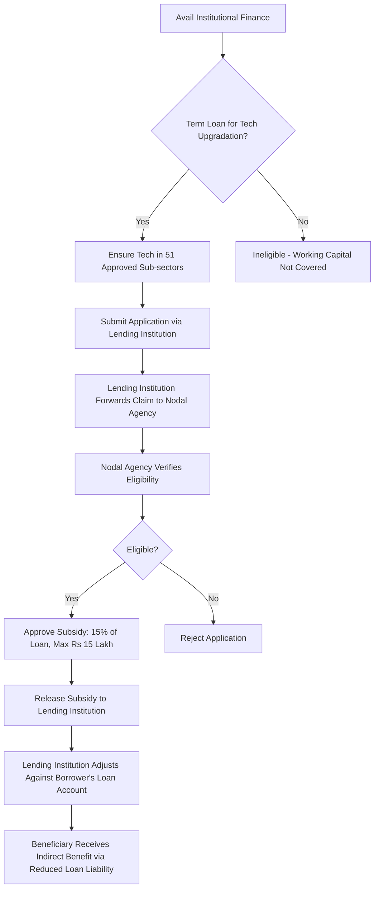

# Comprehensive Scheme Masterclass & File Guide

## Scheme Deep Dive

### Scheme Overview
The **Credit Linked Capital Subsidy Scheme for Technology Upgradation (CLCSS)** is a subsidy scheme implemented by the **Ministry of Micro, Small and Medium Enterprises (MSME), Government of India**. It operates on a **rolling basis** with pan-India geographic scope. The scheme is administered by the Ministry of MSME and aims to facilitate technology upgradation in Micro and Small Enterprises (MSEs).

### Objectives
- Facilitate technology up-gradation in MSEs
- Provide upfront capital subsidy of 15% on institutional finance up to Rs 1 crore
- Support induction of well-established and improved technology in 51 specified sub-sectors/products
- Upgrade plant & machinery with state-of-the-art technology, with or without expansion
- Support new MSEs that have set up facilities with approved eligible and proven technology

### Eligibility Matrix
| Criteria | Details |
|---------|---------|
| **Beneficiary Type** | Micro and Small Enterprises (MSEs) |
| **Enterprise Status** | Both existing and new MSEs |
| **Financial Criteria** | Must have availed institutional finance (term loan) of up to Rs 1 crore for technology upgradation |
| **Technology Requirement** | Technology must be among the 51 approved sub-sectors/products under CLCSS guidelines |
| **Technology Status** | Must be well-established and improved technology duly approved under scheme guidelines |
| **Registration** | Must possess UDYAM Registration Certificate |
| **Loan Type** | Only term loans eligible; working capital finance not covered |
| **Claim Timeline** | Must be submitted within a specified period after loan disbursement and installation |

### Benefits & Financial Support
| Benefit Category | Details |
|------------------|---------|
| **Subsidy Rate** | 15% upfront capital subsidy on eligible institutional finance |
| **Maximum Loan Eligibility** | Rs 1 crore per unit |
| **Maximum Subsidy Amount** | Rs 15 lakh per unit (15% of Rs 1 crore) |
| **Disbursement Mechanism** | Subsidy released directly to the lending institution, which adjusts it against the borrower's loan account |
| **Key Advantages** | Technology upgradation with state-of-the-art machinery, improved productivity and competitiveness |
| **Coverage** | Supports both technology upgradation and new facility setup with approved technology |

### Required Documents
1. Loan sanction letter from bank/financial institution
2. Proof of loan disbursement
3. Invoice and payment proof for machinery/technology purchased
4. Certificate of installation and commissioning
5. Details of technology adopted (specification, approval under 51 sub-sectors)
6. UDYAM Registration Certificate
7. Bank account details
8. Authorization letter for subsidy claim

### Application Process Flowchart

### Key Caveats
> **Subsidy Limitations**: The subsidy is strictly limited to institutional finance of up to Rs 1 crore per unit. Claims exceeding this loan amount will only receive subsidy on the first Rs 1 crore.
>
> **Technology Restriction**: Only technologies explicitly listed in the 51 approved sub-sectors/products are eligible. No exceptions are permitted for similar or equivalent technologies not on the list.
>
> **Loan Type Specificity**: The scheme covers **only term loans**. Working capital finance, bridge loans, or any non-term loan instruments are expressly excluded.
>
> **Timely Submission**: Claims must be submitted within a specified period after both loan disbursement **and** installation/commissioning of the technology. Delays in either step may invalidate the claim.
>
> **Indirect Disbursement**: The subsidy is **not paid directly to the beneficiary**. It is remitted to the lending institution, which then adjusts the amount against the outstanding loan principal. Beneficiaries benefit through reduced EMI burden or shortened loan tenure.
>
> **Nodal Agency Dependency**: The lending institution acts as the intermediary; beneficiaries cannot apply directly. All documentation and follow-up must be coordinated through the bank.

### Application Portal & Sources
- **Primary Portal**: https://nimsme.gov.in/about-scheme/credit-linked-capital-subsidy-scheme-for-technology-upgradation
- **Implementing Agency**: Ministry of Micro, Small and Medium Enterprises (MSME), Government of India
- **Nodal Agency Reference**: National Institute for Micro, Small and Medium Enterprises (ni-msme) supports scheme implementation and awareness

---

## Consultant's Field Guide to Generated Files

### 1. SCHEME_MASTER_DATABASE.md
**Real-time Usage:** Keep this open in a background tab during all client calls. When a client asks "What is the turnover limit?" or "Who administers this?", CTRL+F in this document to give an immediate, authoritative answer without checking the portal.

### 2. PITCH_AND_SALES_SCRIPTS.md
**Real-time Usage:** Open this file 5 minutes before your first Discovery Call with a lead. Read the "Problem Framing" out loud to hook them, then use the Qualification Checklist to interrogate their eligibility live on the phone. Keep the Objection Handlers table visible so you can immediately counter when they say "We're too small for this."

### 3. APPLICATION_PLAYBOOK.md
**Real-time Usage:** Print this out or pin it to your desktop once the client signs the retainer. Check off each box in "Stage 1" before moving to "Stage 2". Use the "Client Communication Template" to copy-paste directly into your email when chasing them for pending documents.

### 4. CLIENT_ONBOARDING_AND_CRM.md
**Real-time Usage:** Fill this out during or immediately after the onboarding call. Use the Needs Assessment to record their exact pain points. Update the "Compliance Status" table as they email you documents to maintain a single source of truth for what's missing.

### 5. LIVE_CASE_TRACKER.md
**Real-time Usage:** Review this document every morning during your standup. Update the "Stage" column daily. If a case hits "Stage 07 - Under review", use the Escalation Path notes here to know exactly who to call at the government department today.

### 6. FEE_AND_REVENUE_MODEL.md
**Real-time Usage:** Use this file when drafting the proposal. Look at the client's turnover, map them to the pricing tier in the table, and quote that exact Retainer and Success Fee. Use the monthly projection table to update your personal sales pipeline forecast for the quarter.

### 7. CLIENT_PROPOSAL_TEMPLATE.md
**Real-time Usage:** Copy this entire file, paste it into an email or PDF generator, replace the [PLACEHOLDER] tags with the client's actual details gathered from the CRM, and send it immediately after a successful discovery call.

### 8. COMPLIANCE_AND_LEGAL_PACK.md
**Real-time Usage:** Attach sections 8A and 8B as PDFs to the proposal email. Refuse to start Step 1 of the Application Playbook until the client signs these. Use the Disclaimers to protect yourself legally if the client is rejected by the government agency.