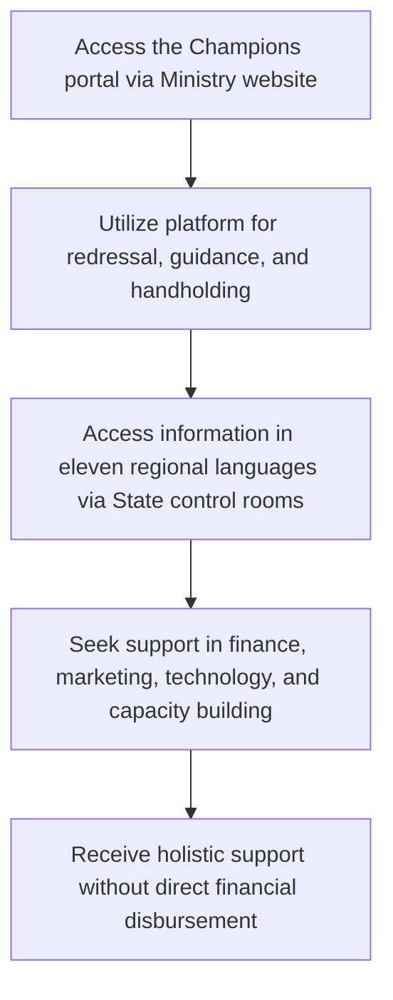

# Comprehensive Scheme Masterclass & File Guide

## Scheme Deep Dive

### Scheme Overview
The **MSME Champions Scheme** (Scheme ID: row-32) is a pan-India initiative implemented by the **Ministry of Micro, Small & Medium Enterprises** through its application portal at [https://msme.gov.in](https://msme.gov.in). The scheme operates on a rolling basis with no fixed deadlines and was last updated in 2025. It does not provide direct financial support but serves as a holistic platform for redressal, guidance, and handholding for MSMEs.

### Objectives
- Provide support in finance, marketing, technology, and capacity building to MSMEs  
- Disseminate information in eleven regional languages via 69 State control rooms nationwide  
- Serve as a holistic platform for redressal, guidance, and handholding of MSMEs  

### Eligibility Matrix
| Criteria | Details |
|---------|---------|
| **Target Beneficiaries** | MSMEs (Micro, Small, and Medium Enterprises) |
| **Geographic Scope** | Pan-India |
| **Eligibility** | All MSMEs are eligible to benefit from the Champions portal as part of the Ministry's initiatives for redressal, guidance, and handholding. No specific turnover or investment limits are imposed for eligibility under this scheme. |
| **Implementing Agency** | Ministry of Micro, Small & Medium Enterprises |

### Benefits & Financial Support
| Benefit Category | Details |
|------------------|---------|
| **Financial Support** | The Champions portal does not provide direct financial support but facilitates access to finance through guidance and handholding. |
| **Non-Financial Support** | Support in finance, marketing, technology, and capacity building; information dissemination in eleven regional languages through 69 State control rooms nationwide; redressal, guidance, and handholding for MSMEs. |
| **Languages Supported** | Hindi, English, Assamese, Bengali, Bodo, Dogri, Goan Konkani, Gujarati, Kannada, Kashmiri, Maithili, Malayalam, Manipuri, Marathi, Nepali, Odia, Punjabi, Sanskrit, Santali, Sindhi, Tamil, Telugu, Urdu (as per portal language options) |
| **State Control Rooms** | 69 nationwide, providing localized support in regional languages |

### Application Process
The application process for the MSME Champions Scheme is designed for ease of access and immediate utilization:

**Key Steps:**
1. Access the Champions portal through the Ministry's website ([https://msme.gov.in](https://msme.gov.in))
2. Utilize the platform for redressal, guidance, and handholding
3. Access information in eleven regional languages via 69 State control rooms nationwide
4. Seek support in finance, marketing, technology, and capacity building

**Important Notes:**
- The scheme is purely facilitative; no funds are disbursed directly to beneficiaries
- Support is provided through guidance, information access, and referral mechanisms
- The portal acts as a single window for MSME-related queries and assistance
- No application forms or documentation are required to access basic portal services
- For scheme-specific benefits (like credit guarantees or subsidies), users are guided to relevant Ministry schemes

### Key Takeaways
> The MSME Champions Scheme is not a financial assistance program but a **support ecosystem** designed to empower MSMEs through information access, grievance redressal, and handholding services. Its strength lies in its accessibility—any MSME can access support instantly via the portal without eligibility barriers or application complexity.

> **Critical Distinction:** Unlike credit-linked schemes (e.g., PMEGP, CGTMSE), the Champions Scheme does not require Udyam Registration for basic access, though registration enhances eligibility for other Ministry schemes accessible through the portal.

> **Operational Reality:** The 69 State control rooms function as the scheme's delivery mechanism, providing localized support in regional languages—making it uniquely accessible to grassroots MSMEs across India's linguistic diversity.

## Consultant's Field Guide to Generated Files

### 1. SCHEME_MASTER_DATABASE.md
**Real-time Usage:** Keep this open in a background tab during all client calls. When a client asks "What is the turnover limit?" or "Who administers this?", CTRL+F in this document to give an immediate, authoritative answer without checking the portal.

### 2. PITCH_AND_SALES_SCRIPTS.md
**Real-time Usage:** Open this file 5 minutes before your first Discovery Call with a lead. Read the "Problem Framing" out loud to hook them, then use the Qualification Checklist to interrogate their eligibility live on the phone. Keep the Objection Handlers table visible so you can immediately counter when they say "We're too small for this."

### 3. APPLICATION_PLAYBOOK.md
**Real-time Usage:** Print this out or pin it to your desktop once the client signs the retainer. Check off each box in "Stage 1" before moving to "Stage 2". Use the "Client Communication Template" to copy-paste directly into your email when chasing them for pending documents.

### 4. CLIENT_ONBOARDING_AND_CRM.md
**Real-time Usage:** Fill this out during or immediately after the onboarding call. Use the Needs Assessment to record their exact pain points. Update the "Compliance Status" table as they email you documents to maintain a single source of truth for what's missing.

### 5. LIVE_CASE_TRACKER.md
**Real-time Usage:** Review this document every morning during your standup. Update the "Stage" column daily. If a case hits "Stage 07 - Under review", use the Escalation Path notes here to know exactly who to call at the government department today.

### 6. FEE_AND_REVENUE_MODEL.md
**Real-time Usage:** Use this file when drafting the proposal. Look at the client's turnover, map them to the pricing tier in the table, and quote that exact Retainer and Success Fee. Use the monthly projection table to update your personal sales pipeline forecast for the quarter.

### 7. CLIENT_PROPOSAL_TEMPLATE.md
**Real-time Usage:** Copy this entire file, paste it into an email or PDF generator, replace the [PLACEHOLDER] tags with the client's actual details gathered from the CRM, and send it immediately after a successful discovery call.

### 8. COMPLIANCE_AND_LEGAL_PACK.md
**Real-time Usage:** Attach sections 8A and 8B as PDFs to the proposal email. Refuse to start Step 1 of the Application Playbook until the client signs these. Use the Disclaimers to protect yourself legally if the client is rejected by the government agency.