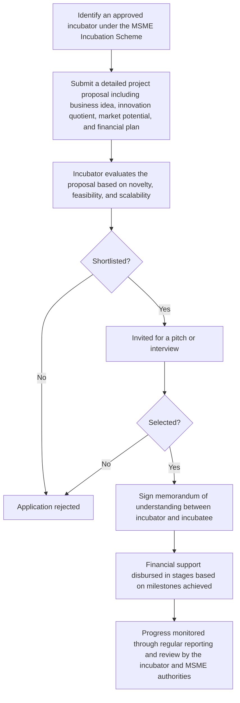

# Comprehensive Scheme Masterclass & File Guide

## Scheme Deep Dive

### Scheme Overview
**Scheme Name:** MSME Incubation Scheme  
**Scheme ID:** row-33  
**Ministry / Category:** MSME  
**Scheme Type:** incubation  
**Geographic Scope:** Pan-India  
**Implementing Agency:** Ministry of Micro, Small and Medium Enterprises  
**Status / Deadlines:** Rolling basis  
**Last Updated:** 2025  
**Application Portal URL:** https://msme.gov.in  

### Objectives
- To support innovative business ideas through incubation  
- To provide financial and infrastructural support to early-stage ventures  
- To promote entrepreneurship and innovation in the MSME sector  
- To reduce the gestation period of startups through mentorship and guidance  
- To enhance the success rate of new enterprises by offering handholding support  
- To create employment opportunities through nurturing of MSMEs  

### Eligibility Matrix
| Eligibility Criteria | Details |
|----------------------|---------|
| Applicant Type | Individuals, startups, and MSMEs with innovative business ideas that are technology-driven and have potential for scalability |
| Registration Status | Must be registered as MSMEs or in the process of registration |
| Idea Requirements | Idea should be novel, feasible, and capable of generating employment and economic value |
| Preference Criteria | Preference may be given to ideas from SC/ST, women, differently-abled, and aspirational districts |
| Exclusions | Scheme does not support pure trading or service-only ideas without innovation |

### Benefits & Financial Support
| Benefit Category | Details |
|------------------|---------|
| Financial Support | Grant-in-aid to approved incubators, who in turn support incubatees. Covers costs related to mentorship, infrastructure usage, prototype development, and other pre-incubation and incubation activities. Quantum of support determined based on project proposal and stage of the idea, with focus on early validation and proof-of-concept. |
| Infrastructure | Access to incubation infrastructure |
| Mentorship | Mentorship from industry experts |
| Networking | Networking opportunities |
| IPR Support | Assistance in IPR filing |
| Market Linkage | Market linkage support |
| Business Guidance | Guidance on business planning and fundraising |
| Prototype Development | Support for prototype development |
| Technology Validation | Technology validation |
| Commercialization Readiness | Commercialization readiness |

### Required Documents
1. Project proposal document  
2. Proof of identity of applicant(s)  
3. MSME registration or application proof  
4. Details of the innovative idea or technology  
5. Financial plan and budget estimate  
6. Background/qualification of promoters  
7. Any existing IP or prior work related to the idea  

### Application Process Flowchart

### Key Caveats
> - Support is subject to the availability of funds and approval by the designated incubator  
> - The incubatee must comply with monitoring and reporting requirements  
> - Funds must be utilized strictly for the approved project activities  
> - Misuse of funds may lead to recovery and blacklisting  
> - The scheme does not support pure trading or service-only ideas without innovation  

---

## Consultant's Field Guide to Generated Files

### 1. SCHEME_MASTER_DATABASE.md
**Real-time Usage:** Keep this open in a background tab during all client calls. When a client asks "What is the turnover limit?" or "Who administers this?", CTRL+F in this document to give an immediate, authoritative answer without checking the portal.

### 2. PITCH_AND_SALES_SCRIPTS.md
**Real-time Usage:** Open this file 5 minutes before your first Discovery Call with a lead. Read the "Problem Framing" out loud to hook them, then use the Qualification Checklist to interrogate their eligibility live on the phone. Keep the Objection Handlers table visible so you can immediately counter when they say "We're too small for this."

### 3. APPLICATION_PLAYBOOK.md
**Real-time Usage:** Print this out or pin it to your desktop once the client signs the retainer. Check off each box in "Stage 1" before moving to "Stage 2". Use the "Client Communication Template" to copy-paste directly into your email when chasing them for pending documents.

### 4. CLIENT_ONBOARDING_AND_CRM.md
**Real-time Usage:** Fill this out during or immediately after the onboarding call. Use the Needs Assessment to record their exact pain points. Update the "Compliance Status" table as they email you documents to maintain a single source of truth for what's missing.

### 5. LIVE_CASE_TRACKER.md
**Real-time Usage:** Review this document every morning during your standup. Update the "Stage" column daily. If a case hits "Stage 07 - Under review", use the Escalation Path notes here to know exactly who to call at the government department today.

### 6. FEE_AND_REVENUE_MODEL.md
**Real-time Usage:** Use this file when drafting the proposal. Look at the client's turnover, map them to the pricing tier in the table, and quote that exact Retainer and Success Fee. Use the monthly projection table to update your personal sales pipeline forecast for the quarter.

### 7. CLIENT_PROPOSAL_TEMPLATE.md
**Real-time Usage:** Copy this entire file, paste it into an email or PDF generator, replace the [PLACEHOLDER] tags with the client's actual details gathered from the CRM, and send it immediately after a successful discovery call.

### 8. COMPLIANCE_AND_LEGAL_PACK.md
**Real-time Usage:** Attach sections 8A and 8B as PDFs to the proposal email. Refuse to start Step 1 of the Application Playbook until the client signs these. Use the Disclaimers to protect yourself legally if the client is rejected by the government agency.