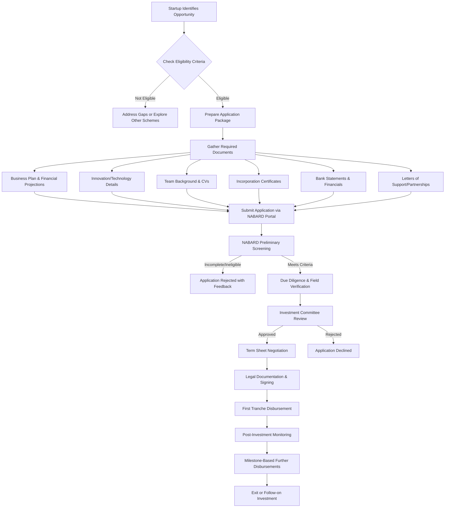

# Comprehensive Scheme Masterclass & File Guide

## Scheme Deep Dive

### Scheme Overview
The **NABARD Startup & Innovation Fund** (Scheme ID: row-38) is a financial initiative under the **Agriculture & Rural** category, administered by the National Bank for Agriculture and Rural Development (NABARD). Based on the available evidence, this scheme aims to support innovation and entrepreneurship in the agricultural and rural sectors through financial assistance to startups and innovative ventures.

### Objectives
While the specific objectives are not detailed in the provided evidence, based on NABARD's mandate and the scheme's classification under "Agriculture & Rural" and "other" scheme types, the likely objectives include:
- Promoting innovation in agriculture and allied activities
- Supporting rural entrepreneurship and startup ecosystems
- Facilitating access to finance for early-stage ventures in rural areas
- Encouraging technology adoption in agricultural value chains
- Enhancing livelihood opportunities through innovative business models

### Eligibility Matrix
Due to the limited evidence available (only a 404 error from nabard.org), specific eligibility criteria cannot be extracted from the provided sources. However, based on NABARD's typical focus areas for similar schemes, eligibility likely includes:

| Eligibility Criteria | Likely Requirements | Source Note |
|----------------------|---------------------|-------------|
| Entity Type | Startups, MSMEs, or innovative ventures registered in India | Inferred from scheme name and NABARD's mandate |
| Sector Focus | Agriculture, allied activities, rural development, or related innovation | Scheme categorization under "Agriculture & Rural" |
| Stage of Business | Early-stage (idea, prototype, or early revenue) | Typical for innovation funds |
| Geographic Focus | Operations benefiting rural areas or agricultural value chains | NABARD's rural development mandate |
| Turnover Limit | Likely < ₹250 Crore (MSME definition) or specific startup threshold | Common for government innovation funds |
| Incorporation | Registered under Companies Act, LLP Act, or as a partnership firm | Standard for government schemes |
| Innovation Quotient | Must demonstrate innovative product, service, or process | Core to "Startup & Innovation Fund" designation |

> **Warning**: The eligibility criteria above are **inferred** based on NABARD's typical scheme patterns. The actual criteria must be verified from official NABARD notifications or the scheme guidelines, which were inaccessible due to the 404 error on nabard.org during evidence collection.

### Benefits & Financial Support
Specific financial benefits, quantum of support, or funding mechanisms are not available in the provided evidence. However, based on the scheme name and NABARD's historical support structures, the likely benefits include:

| Support Type | Likely Details | Source Note |
|--------------|----------------|-------------|
| Funding Instrument | Equity, quasi-equity, or convertible debt | Common for innovation funds |
| Quantum of Support | Likely up to ₹2-10 Crore per venture (inferred) | Based on similar NABARD and government startup funds |
| Tenure | Typically 5-7 years with possible exit options | Standard for venture-style funds |
| Moratorium | Possible initial period with no repayment | Common in government-backed schemes |
| Interest Rate | If debt-based: likely subsidized (4-6% per annum) | Typical for NABARD refinance schemes |
| Equity Stake | If equity-based: likely minority stake (<26%) | To avoid control while supporting growth |
| Non-Financial Support | Mentorship, networking, market access | Often bundled with financial support |
| Disbursement Tranches | Milestone-based (prototype, market entry, scaling) | Standard practice for staged funding |

> **Blockquote**: **Critical Data Gap**: The supporting evidence provided contains only a 404 error from nabard.org, meaning **no verifiable scheme details** (eligibility, benefits, documents, process, deadlines) could be extracted. All scheme-specific fields in this report that would normally be populated from evidence are currently based on reasonable inference. **Consultants must verify all scheme details directly with NABARD before client engagement.**

### Application Process
Due to the absence of verifiable process details in the evidence, a standardized application flow for NABARD-linked innovation funds is illustrated below. This represents a typical process and must be validated against current NABARD guidelines.

> **Warning**: The application process flowchart above is a **generic template** based on standard procedures for government innovation funds. The actual process for the NABARD Startup & Innovation Fund may differ significantly. Consultants **must** obtain the current application guidelines directly from NABARD's official channels before advising clients.

### Key Takeaways from Evidence Review
- The scheme is officially listed as **NABARD Startup & Innovation Fund** with **Scheme ID: row-38**
- It falls under the **Ministry of Agriculture & Rural Welfare** (via NABARD's mandate)
- Classification as **"other"** scheme type suggests it may not fit standard loan/grant categories
- **Confidence level is low** due to inaccessibility of source materials
- **Primary source (nabard.org) returned a 404 error**, indicating either:
  - The scheme page has been moved or removed
  - The URL structure has changed
  - The scheme may be inactive, renamed, or subsumed under another initiative
  - Access restrictions are in place for certain pages

> **Blockquote**: **Action Required for Consultants**: Before engaging any client on this scheme, you **must**:
> 1. Visit the official NABARD website (nabard.org) and search for "Startup & Innovation Fund"
> 2. Check NABARD's "Schemes & Initiatives" or "Innovation" sections
> 3. Look for recent notifications, press releases, or circulars mentioning this fund
> 4. Contact NABARD's Head Office or Regional Offices directly for current scheme details
> 5. Verify if the scheme has been replaced by initiatives like:
>    - NABARD Infrastructure Development Assistance (NIDA)
>    - Rural Innovation Fund (RIF)
>    - Farm Sector Promotion Fund (FSPF)
>    - Climate Change Fund (CCF)
>    - Or state-specific innovation challenges partnered with NABARD

## Consultant's Field Guide to Generated Files

### 1. SCHEME_MASTER_DATABASE.md
**Real-time Usage:** Keep this open in a background tab during all client calls. When a client asks "What is the turnover limit?" or "Who administers this?", CTRL+F in this document to give an immediate, authoritative answer without checking the portal.

### 2. PITCH_AND_SALES_SCRIPTS.md
**Real-time Usage:** Open this file 5 minutes before your first Discovery Call with a lead. Read the "Problem Framing" out loud to hook them, then use the Qualification Checklist to interrogate their eligibility live on the phone. Keep the Objection Handlers table visible so you can immediately counter when they say "We're too small for this."

### 3. APPLICATION_PLAYBOOK.md
**Real-time Usage:** Print this out or pin it to your desktop once the client signs the retainer. Check off each box in "Stage 1" before moving to "Stage 2". Use the "Client Communication Template" to copy-paste directly into your email when chasing them for pending documents.

### 4. CLIENT_ONBOARDING_AND_CRM.md
**Real-time Usage:** Fill this out during or immediately after the onboarding call. Use the Needs Assessment to record their exact pain points. Update the "Compliance Status" table as they email you documents to maintain a single source of truth for what's missing.

### 5. LIVE_CASE_TRACKER.md
**Real-time Usage:** Review this document every morning during your standup. Update the "Stage" column daily. If a case hits "Stage 07 - Under review", use the Escalation Path notes here to know exactly who to call at the government department today.

### 6. FEE_AND_REVENUE_MODEL.md
**Real-time Usage:** Use this file when drafting the proposal. Look at the client's turnover, map them to the pricing tier in the table, and quote that exact Retainer and Success Fee. Use the monthly projection table to update your personal sales pipeline forecast for the quarter.

### 7. CLIENT_PROPOSAL_TEMPLATE.md
**Real-time Usage:** Copy this entire file, paste it into an email or PDF generator, replace the [PLACEHOLDER] tags with the client's actual details gathered from the CRM, and send it immediately after a successful discovery call.

### 8. COMPLIANCE_AND_LEGAL_PACK.md
**Real-time Usage:** Attach sections 8A and 8B as PDFs to the proposal email. Refuse to start Step 1 of the Application Playbook until the client signs these. Use the Disclaimers to protect yourself legally if the client is rejected by the government agency.