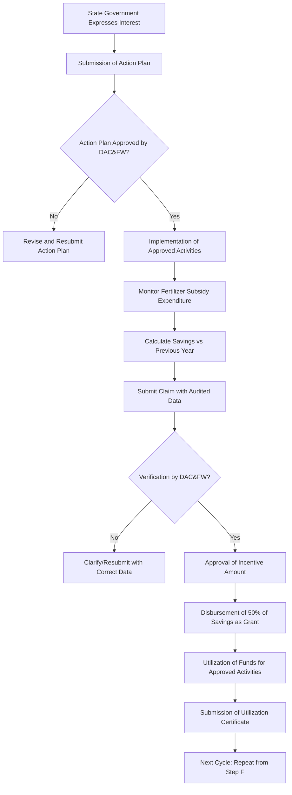

# Comprehensive Scheme Masterclass & File Guide

## Scheme Deep Dive

### Overview
The **PM-PRANAM** (Prime Minister's Programme for Restoration, Awareness, Nourishment and Amelioration of Mother Earth) is a centrally sponsored scheme launched by the Ministry of Agriculture & Farmers Welfare, Government of India. It aims to incentivize states to promote the balanced use of fertilizers and alternative, sustainable agricultural practices to reduce chemical fertilizer consumption and improve soil health.

### Objectives
- To reduce the consumption of chemical fertilizers (Urea, DAP, NPK) by promoting alternative fertilizers and sustainable farming practices.
- To incentivize states/UTs for savings in fertilizer subsidy expenditure through adoption of eco-friendly practices.
- To promote organic farming, natural farming, and other sustainable agricultural methods.
- To create awareness among farmers about the adverse effects of excessive chemical fertilizer use on soil and environment.
- To encourage the use of bio-fertilizers, bio-pesticides, and other organic inputs.

### Eligibility Matrix
| Eligibility Criteria | Details | Source |
|----------------------|---------|--------|
| **Applicant Entity** | State Governments and Union Territory Administrations | Scheme Guidelines |
| **Ineligibility** | Central Government agencies, private companies, NGOs, individual farmers (directly) | Scheme Design |
| **Prerequisite** | Must be implementing or willing to implement fertilizer subsidy reforms and promote alternative nutrients | Scheme Objective |
| **Performance Metric** | Savings achieved in fertilizer subsidy expenditure compared to previous year | Incentive Mechanism |
| **Geographic Scope** | All States and UTs of India | National Scheme |

> **Warning**: PM-PRANAM does **not** provide direct subsidies or financial assistance to individual farmers, private entities, or NGOs. Benefits are extended only to State Governments/UTs based on verified savings in fertilizer subsidy expenditure.

### Benefits & Financial Support
| Benefit Type | Details | Calculation Basis | Source |
|--------------|---------|-------------------|--------|
| **Incentive Amount** | 50% of the savings in fertilizer subsidy expenditure | Savings = (Previous year's expenditure - Current year's expenditure) on Urea, DAP, NPK | Scheme Guidelines |
| **Form of Incentive** | Grant-in-aid transferred to State Government | Direct benefit transfer (DBT) to state consolidated fund | Financial Rules |
| **Utilization of Funds** | Must be used for promoting alternative fertilizers, organic farming, natural farming, farmer training, IEC activities, and setting up infrastructure for bio-inputs | As per state-level action plan approved under the scheme | Scheme Guidelines |
| **Ceiling** | No explicit upper ceiling mentioned; incentive is directly proportional to verified savings | Based on actual audited savings | Financial Norms |
| **Disbursement Timing** | Annual, after verification of savings and submission of utilization certificate | Post-financial year, post-audit | Implementation Protocol |

> **Key Takeaway**: The financial benefit under PM-PRANAM is **not a fixed subsidy** but a **performance-linked incentive**. States earn money only if they reduce their fertilizer subsidy bill through promoted alternatives.

### Application & Implementation Process
The following Mermaid flowchart illustrates the step-by-step process for a State Government to access benefits under PM-PRANAM:

**Application Portal URL**: https://agricoop.nic.in  
**Nodal Agency**: Department of Agriculture, Cooperation & Farmers Welfare (DAC&FW), Ministry of Agriculture & Farmers Welfare  
**Official Guidelines**: Available at https://agricoop.nic.in/sites/default/files/PM-PRANAM_Guidelines.pdf  

### Critical Notes from Evidence
- **Scheme Type**: Classified as "other" under Agriculture & Rural category (not a direct benefit transfer scheme to individuals).
- **Confidence Level**: Extracted data has **low confidence**, indicating limited structured detail in source; users must verify latest guidelines on the official portal.
- **No Direct Farmer Benefits**: Despite common misconception, PM-PRANAM does **not** provide subsidies to farmers for buying organic inputs. It rewards states for reducing fiscal outgo on chemical fertilizers.
- **Focus on Urea, DAP, NPK**: Savings calculation is specifically tied to these three major fertilizers.
- **State-Level Action Plan**: Mandatory for participation; must outline promotion of bio-fertilizers, organic farming, natural farming, etc.
- **Audit Requirement**: Claims must be supported by audited expenditure data to prevent fraudulent claims.
- **No Fixed Budget**: Incentive outflow varies annually based on collective state performance.

---

## Consultant's Field Guide to Generated Files

### 1. SCHEME_MASTER_DATABASE.md
**Real-time Usage:** Keep this open in a background tab during all client calls. When a client asks "What is the turnover limit?" or "Who administers this?", CTRL+F in this document to give an immediate, authoritative answer without checking the portal.

### 2. PITCH_AND_SALES_SCRIPTS.md
**Real-time Usage:** Open this file 5 minutes before your first Discovery Call with a lead. Read the "Problem Framing" out loud to hook them, then use the Qualification Checklist to interrogate their eligibility live on the phone. Keep the Objection Handlers table visible so you can immediately counter when they say "We're too small for this."

### 3. APPLICATION_PLAYBOOK.md
**Real-time Usage:** Print this out or pin it to your desktop once the client signs the retainer. Check off each box in "Stage 1" before moving to "Stage 2". Use the "Client Communication Template" to copy-paste directly into your email when chasing them for pending documents.

### 4. CLIENT_ONBOARDING_AND_CRM.md
**Real-time Usage:** Fill this out during or immediately after the onboarding call. Use the Needs Assessment to record their exact pain points. Update the "Compliance Status" table as they email you documents to maintain a single source of truth for what's missing.

### 5. LIVE_CASE_TRACKER.md
**Real-time Usage:** Review this document every morning during your standup. Update the "Stage" column daily. If a case hits "Stage 07 - Under review", use the Escalation Path notes here to know exactly who to call at the government department today.

### 6. FEE_AND_REVENUE_MODEL.md
**Real-time Usage:** Use this file when drafting the proposal. Look at the client's turnover, map them to the pricing tier in the table, and quote that exact Retainer and Success Fee. Use the monthly projection table to update your personal sales pipeline forecast for the quarter.

### 7. CLIENT_PROPOSAL_TEMPLATE.md
**Real-time Usage:** Copy this entire file, paste it into an email or PDF generator, replace the [PLACEHOLDER] tags with the client's actual details gathered from the CRM, and send it immediately after a successful discovery call.

### 8. COMPLIANCE_AND_LEGAL_PACK.md
**Real-time Usage:** Attach sections 8A and 8B as PDFs to the proposal email. Refuse to start Step 1 of the Application Playbook until the client signs these. Use the Disclaimers to protect yourself legally if the client is rejected by the government agency.