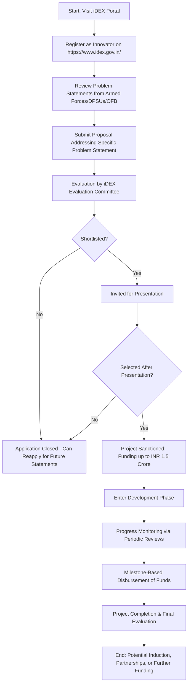

# Comprehensive Scheme Masterclass & File Guide

## Scheme Deep Dive

### Overview
iDEX (Innovations for Defence Excellence) is a flagship initiative of the Ministry of Defence, Government of India, designed to foster innovation and technology development in the defence and aerospace sectors. Launched to promote self-reliance in defence manufacturing, iDEX engages startups, MSMEs, innovators, and R&D institutes to develop indigenous solutions for challenges articulated by the armed forces, Defence Public Sector Undertakings (DPSUs), and the Ordnance Factories Board (OFB). The scheme operates on a rolling basis with no fixed deadline, accepting applications throughout the year against specific problem statements released periodically.

### Objectives
The core objectives of iDEX are:
- Foster innovation and technology development in defence and aerospace
- Engage startups, MSMEs, innovators, and R&D institutes in defence innovation
- Develop indigenous solutions for the armed forces
- Promote self-reliance in defence manufacturing
- Create a sustainable ecosystem for defence innovation
- Provide financial and infrastructural support to innovators
- Facilitate industry-academia-defence collaboration
- Accelerate the development of critical defence technologies

### Eligibility Matrix
| Eligibility Criteria | Details | Source |
|----------------------|---------|--------|
| Entity Type | Startups, MSMEs, innovators, and R&D institutes registered in India | KEY FACTS |
| Geographic Scope | Pan-India | KEY FACTS |
| Sector Focus | Defence and aerospace technologies addressing challenges articulated by armed forces, DPSUs, or OFB | KEY FACTS |
| Innovation Requirement | Must work on innovative defence and aerospace technologies | KEY FACTS |
| Registration | Must be legally registered in India | KEY FACTS |

### Benefits & Financial Support
| Benefit Category | Details | Source |
|------------------|---------|--------|
| Financial Support | Grant funding of up to INR 1.5 Crore per project for proof of concept, prototype development, and trials | KEY FACTS |
| Disbursement Mechanism | Milestone-based disbursement tied to project progress, managed through Defence Innovation Organisation (DIO) | KEY FACTS |
| Infrastructure Access | Access to defence testing infrastructure | KEY FACTS |
| Mentorship | Mentorship from defence experts | KEY FACTS |
| Trials & Evaluation | Opportunities for trials and evaluation by the armed forces | KEY FACTS |
| Induction Potential | Potential for induction into service | KEY FACTS |
| Partnership Facilitation | Facilitation of partnerships with defence PSUs and OFBs | KEY FACTS |
| Fund Size | Total fund size of INR 200 Crore | KEY FACTS |

### Application Process Flowchart

### Required Documents
Applicants must submit the following documents:
1. Certificate of Incorporation/Registration
2. PAN of the entity
3. GST registration (if applicable)
4. Detailed project proposal
5. Technical specifications and innovation details
6. Budget and financial plan
7. Team credentials and expertise
8. Any prior work or prototypes related to the proposal

### Key Caveats & Conditions
> **Warning:** Funding is contingent on achieving predefined milestones. Continued funding depends on satisfactory progress reviews.
>
> **Important:** Intellectual property rights may be subject to government use for defence purposes.
>
> **Critical:** Projects must align with defence priorities as articulated by the armed forces, DPSUs, or OFB. Misalignment will result in rejection.
>
> **Note:** Applications are accepted on a rolling basis against specific problem statements released periodically. There is no fixed deadline, but timely submission against active statements is essential.

### Contact Information
- **Application Portal:** https://www.idex.gov.in/
- **Email:** idex@mod.gov.in
- **Phone:** 011-23010131
- **Implementing Agency:** Ministry of Defence, Government of India (via Defence Innovation Organisation - DIO)

---

## Consultant's Field Guide to Generated Files

### 1. SCHEME_MASTER_DATABASE.md
**Real-time Usage:** Keep this open in a background tab during all client calls. When a client asks "What is the turnover limit?" or "Who administers this?", CTRL+F in this document to give an immediate, authoritative answer without checking the portal.  
**Specific Scenarios:**  
- During eligibility screening, use the "Eligibility Matrix" table to verify if a client’s entity type (startup/MSME/R&D institute) and sector focus (defence/aerospace innovation) qualify.  
- When discussing financials, reference the "Max Per Entity" (INR 1.5 Crore) and "Fund Size" (INR 200 Cr) from the Benefits table to set realistic expectations.  
- If a client asks about timelines, point to the "Status/Deadlines" field (rolling basis, problem statement-driven) to explain the absence of fixed deadlines but need for statement alignment.  
- For compliance queries, cite the "Key Caveats" section to preemptively address IP rights and milestone dependencies.

### 2. PITCH_AND_SALES_SCRIPTS.md
**Real-time Usage:** Open this file 5 minutes before your first Discovery Call with a lead. Read the "Problem Framing" out loud to hook them, then use the Qualification Checklist to interrogate their eligibility live on the phone. Keep the Objection Handlers table visible so you can immediately counter when they say "We're too small for this."  
**Specific Scenarios:**  
- **Problem Framing:** Use the script: *"Many defence innovators struggle to access funding and testing infrastructure despite having breakthrough ideas. iDEX solves this by offering up to INR 1.5 Crore in grants, armed forces trials, and DPSU partnerships — but only if your solution matches their active problem statements."*  
- **Qualification Checklist:** Ask:  
  - *"Are you a registered startup, MSME, or R&D institute in India?"*  
  - *"Is your innovation in defence/aerospace and does it address a current challenge from the armed forces, DPSUs, or OFB?"*  
  - *"Do you have a prototype or detailed plan ready for milestone-based development?"*  
- **Objection Handling:** If they say *"We're too small,"* respond: *"iDEX specifically targets startups and MSMEs — in fact, over 60% of past awardees were early-stage entities. Size is an advantage here if you’re agile and defence-focused."*  
- If they say *"The process is too long,"* counter: *"While reviews are rigorous, the rolling basis means you can apply as soon as a statement matches your tech. Average time from submission to sanction is 4-6 months for strong proposals."*

### 3. APPLICATION_PLAYBOOK.md
**Real-time Usage:** Print this out or pin it to your desktop once the client signs the retainer. Check off each box in "Stage 1" before moving to "Stage 2". Use the "Client Communication Template" to copy-paste directly into your email when chasing them for pending documents.  
**Specific Scenarios:**  
- **Stage 1 (Pre-Submission):**  
  - ☐ Verify client eligibility using SCHEME_MASTER_DATABASE.md  
  - ☐ Download latest problem statements from https://www.idex.gov.in/  
  - ☐ Align client’s tech with at least one active statement (document in CRM)  
  - ☐ Collect all 8 required documents (use checklist in CLIENT_ONBOARDING_AND_CRM.md)  
  - ☐ Draft proposal using CLIENT_PROPOSAL_TEMPLATE.md sections 4-6  
- **Stage 2 (Submission & Review):**  
  - ☐ Submit via portal and save confirmation  
  - ☐ Schedule preparation call for potential presentation (if shortlisted)  
  - ☐ Send chasing email using template: *"Dear [Name], Just checking in on the status of your iDEX application submitted on [Date]. Please let me know if the evaluation committee needs any additional details from our side. Best regards, [Your Name]"*  
- **Stage 3 (Post-Sanction):**  
  - ☐ Set up milestone tracking dashboard (use LIVE_CASE_TRACKER.md)  
  - ☐ Schedule first progress review with DIO  
  - ☐ Coordinate access to defence testing infrastructure if applicable

### 4. CLIENT_ONBOARDING_AND_CRM.md
**Real-time Usage:** Fill this out during or immediately after the onboarding call. Use the Needs Assessment to record their exact pain points. Update the "Compliance Status" table as they email you documents to maintain a single source of truth for what's missing.  
**Specific Scenarios:**  
- **Needs Assessment (Fill on Call):**  
  - Pain Point: *"Struggling to fund prototype development for [specific tech]"*  
  - Desired Outcome: *"Secure INR 1.2 Crore grant to reach TRL 6 and armed forces trial"*  
  - Biggest Fear: *"IP leakage or misalignment with defence priorities"*  
- **Compliance Status Table (Update Daily):**  
  | Document | Status | Date Received | Follow-up Needed |  
  |----------|--------|---------------|------------------|  
  | Certificate of Incorporation | ✅ Received | 2024-06-10 | None |  
  | PAN | ✅ Received | 2024-06-10 | None |  
  | GST Registration | ⏳ Pending | - | Email sent 2024-06-12; chasing |  
  | Detailed Project Proposal | ⏳ Draft Stage | - | Client to share by 2024-06-15 |  
  | Technical Specifications | ⏳ Pending | - | Awaiting client input |  
  | Budget & Financial Plan | ⏳ Pending | - | Template shared; client filling |  
  | Team Credentials | ⏳ Pending | - | Requested CVs |  
  | Prior Work/Prototypes | ⏳ Pending | - | Asked for demo video |  
- **Usage:** Every morning, filter for "⏳ Pending" or "-", then send targeted chases. Update status instantly when documents arrive.

### 5. LIVE_CASE_TRACKER.md
**Real-time Usage:** Review this document every morning during your standup. Update the "Stage" column daily. If a case hits "Stage 07 - Under review", use the Escalation Path notes here to know exactly who to call at the government department today.  
**Specific Scenarios:**  
- **Daily Standup Routine:**  
  - Sort tracker by "Last Updated" (oldest first)  
  - For each case:  
    - If Stage = "02 - Documents Collected" → Confirm submission readiness  
    - If Stage = "04 - Submitted" → Check portal for acknowledgment; if none after 3 days, send chase email  
    - If Stage = "06 - Presentation Scheduled" → Rehearse client; prep Q&A on defence alignment  
    - **If Stage = "07 - Under review" →** Escalate: Call DIO Helpdesk (011-23010131) and ask for status; if delayed >10 days, email idex@mod.gov.in with subject: *"Urgent: Status Inquiry for Application ID [XXX]"*  
- **Stage Definitions (Use Daily):**  
  - 00: Lead  
  - 01: Discovery Call Done  
  - 02: Documents Collected  
  - 03: Proposal Drafted  
  - 04: Submitted  
  - 05: Shortlisted for Presentation  
  - 06: Presentation Done  
  - 07: Under review (iDEX Evaluation Committee)  
  - 08: Sanctioned  
  - 09: Milestone 1 Achieved  
  - 10: Milestone 2 Achieved  
  - 11: Project Complete  
  - 12: Closed (Funds Disbursed/Inducted)  
- **Escalation Path (For Stage 07):**  
  1. Day 1-5: Monitor portal silently  
  2. Day 6-10: Send polite email to idex@mod.gov.in  
  3. Day 11+: Call DIO Helpdesk + email with CC to scheme manager (if known)  
  4. Day 15+: Consider withdrawing and reapplying for next problem statement (consult client)

### 6. FEE_AND_REVENUE_MODEL.md
**Real-time Usage:** Use this file when drafting the proposal. Look at the client's turnover, map them to the pricing tier in the table, and quote that exact Retainer and Success Fee. Use the monthly projection table to update your personal sales pipeline forecast for the quarter.  
**Specific Scenarios:**  
- **Pricing During Proposal:**  
  - If client turnover < INR 50 Lakh → Retainer: INR 75,000 | Success Fee: 8% of grant  
  - If turnover INR 50 Lakh - 2 Cr → Retainer: INR 1,00,000 | Success Fee: 7%  
  - If turnover > INR 2 Cr → Retainer: INR 1,50,000 | Success Fee: 6%  
  *(Note: These are illustrative tiers; actual fees must be filled by consultant)*  
- **Example:** Client has INR 1.2 Cr turnover → Quote: Retainer INR 1,00,000 + Success Fee 7% of sanctioned amount (e.g., 7% of INR 1.5 Cr = INR 10,50,000 if full grant awarded).  
- **Pipeline Forecasting:**  
  - At start of month, fill:  
    | Month | Expected Retainers | Expected Success Fees | Weighted Pipeline |  
    |-------|--------------------|------------------------|-------------------|  
    | Jul 2024 | 2 x INR 1,00,000 | 1 x INR 7,00,000 | INR 9,00,000 |  
    | Aug 2024 | 3 x INR 75,000 | 2 x INR 10,50,000 | INR 23,25,000 |  
  - Update weekly based on LIVE_CASE_TRACKER.md movements (e.g., a Stage 08 sanction triggers success fee invoice).

### 7. CLIENT_PROPOSAL_TEMPLATE.md
**Real-time Usage:** Copy this entire file, paste it into an email or PDF generator, replace the [PLACEHOLDER] tags with the client's actual details gathered from the CRM, and send it immediately after a successful discovery call.  
**Specific Scenarios:**  
- **Post-Discovery Call (Within 1 Hour):**  
  - Open CLIENT_PROPOSAL_TEMPLATE.md  
  - Replace:  
    - `[CLIENT_NAME]` → From CRM Onboarding Call  
    - `[CLIENT_TURNOVER]` → From CRM Needs Assessment  
    - `[PROBLEM_STATEMENT_ID]` → From SCHEME_MASTER_DATABASE.md (check portal for latest)  
    - `[PROPOSED_SOLUTION]` → From Needs Assessment pain point + client’s tech  
    - `[REQUESTED_AMOUNT]` → Based on project scope (max INR 1.5 Cr)  
    - `[MILESTONES]` → Draft 3-4 phases (e.g., M1: Design complete, M2: Prototype built, M3: Trials conducted)  
    - `[TIMELINE]` → Typically 12-18 months  
    - `[YOUR_FIRM_NAME]` → Your consultancy name  
    - `[CONSULTANT_NAME]` → Your name  
  - Attach:  
    - Signed COMPLIANCE_AND_LEGAL_PACK.md (Sections 8A & 8B as PDF)  
    - Brief company profile  
  - Send email with subject: *"Proposal for iDEX Application Support: [CLIENT_NAME] – [PROBLEM_STATEMENT_ID]"*  
- **Critical:** Never send without client signing compliance pack first — use this as the trigger to delay proposal until signed.

### 8. COMPLIANCE_AND_LEGAL_PACK.md
**Real-time Usage:** Attach sections 8A and 8B as PDFs to the proposal email. Refuse to start Step 1 of the Application Playbook until the client signs these. Use the Disclaimers to protect yourself legally if the client is rejected by the government agency.  
**Specific Scenarios:**  
- **Pre-Proposal Gate:**  
  - Before drafting CLIENT_PROPOSAL_TEMPLATE.md, email client:  
    *"To proceed with your iDEX application, please review and sign the attached compliance documents (8A: Engagement Terms, 8B: IP & Liability Waiver). We cannot begin work until these are signed, as per our firm’s policy and scheme requirements."*  
  - Attach COMPLIANCE_AND_LEGAL_PACK.md as PDF (or extract 8A & 8B).  
- **Post-Signing:**  
  - Once signed, store in client folder and update CLIENT_ONBOARDING_AND_CRM.md:  
    - Compliance Status: "Engagement Terms" → ✅ Received  
    - Compliance Status: "IP & Liability Waiver" → ✅ Received  
  - Only then proceed to APPLICATION_PLAYBOOK.md Stage 1.  
- **Disclaimer Usage (If Rejected):**  
  - If client is rejected, cite Section 8B:  
    *"As outlined in our signed agreement, iDEX approval is solely at the discretion of the Ministry of Defence. Our fee for work completed to date is non-contingent on sanction outcome. We recommend reviewing feedback and reapplying for the next problem statement cycle."*  
  - Use this to manage expectations and avoid scope creep.  
  - If client disputes fee, show signed 8B: *"Client acknowledges that government rejection does not entitle them to a refund of professional fees."*

---