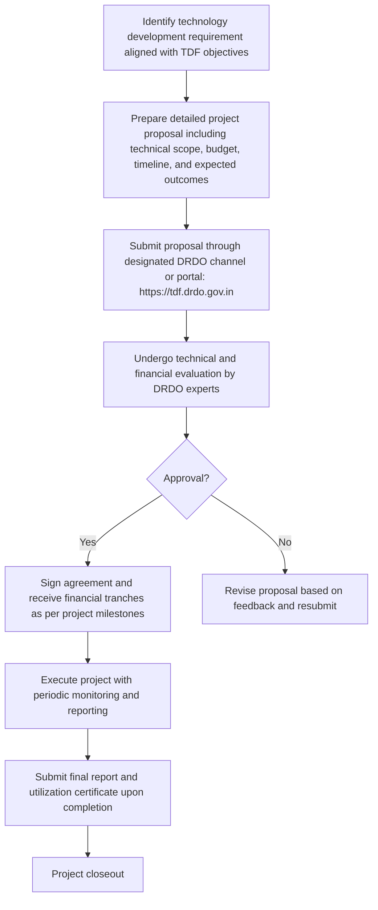

# Comprehensive Scheme Masterclass & File Guide

## Scheme Deep Dive

### Scheme Overview
The **DRDO Technology Development Fund (TDF)** is a grant-based scheme implemented by the Defence Research & Development Organisation (DRDO), Ministry of Defence, Government of India. It operates on a pan-India geographic scope with a rolling application basis—no fixed deadline, accepting applications year-round. The scheme was last updated in 2026 and has a total fund size of **Rs. 100 Crore**.

### Objectives
The TDF scheme aims to:
- Promote development of defence and dual-use systems, subsystems, components, or technologies
- Support Indian Designed, Developed and Manufactured (IDDM) products
- Encourage innovation among startups and MSMEs
- Strengthen the defence R&D ecosystem through industry collaboration
- Achieve self-reliance in critical defence technologies and systems
- Enable indigenisation of defence products and components
- Provide financial support for technology development projects
- Facilitate transfer of technology and technical guidance from DRDO experts

### Eligibility Matrix
| Criteria | Details |
|---------|---------|
| **Target Beneficiaries** | Startups; MSMEs (Micro, Small, and Medium Enterprises) |
| **Geographic Scope** | Pan-India |
| **Implementing Agency** | Defence Research & Development Organisation (DRDO), Ministry of Defence, Government of India |
| **Scheme Type** | Grant |
| **Eligible Entities** | Indian industries, especially MSMEs and startups, for indigenisation of defence products, subsystems and components. Also open for developing new technologies as required by DRDO, Services and DPSUs. |
| **Alignment Requirement** | Projects must align with DRDO's technology development priorities |
| **FDI Compliance** | Beneficiaries must comply with government policies on Foreign Direct Investment (FDI) |
| **IPR Governance** | Intellectual property rights may be governed by DRDO's IPR policy |

### Benefits & Financial Support
| Aspect | Details |
|--------|---------|
| **Fund Size** | Rs. 100 Crore corpus fund |
| **Max Per Entity** | Up to Rs. 10 Crore per project |
| **Funding Percentage** | Industry can get funding up to **90% of project cost** |
| **Financial Support** | Financial support up to 90% of project cost |
| **Non-Financial Benefits** | Access to DRDO's technological and scientific support, testing facilities, technology transfer documents, handholding support, expert guidance from DRDO specialists, and opportunities for collaboration with DRDO laboratories on defence technology development |
| **Royalty Structure** | Royalty of 2% applies for sales in Indian commercial market and exports |
| **ToT Fee** | No ToT fee for Development cum Production Partner (DcPP)/Development Partner (DP)/Production Agency (PA); one-time ToT fee @5% of total project sanction cost for other industries |
| **Testing Support** | Testing and certification support may be subject to availability and prior approval |

### Required Documents
1. Project proposal document  
2. Technical scope and specifications  
3. Detailed budget breakdown  
4. Timeline and milestones  
5. Expected outcomes and deliverables  
6. Company registration documents  
7. Audited financial statements  
8. Tax clearance certificates  
9. Bank account details  
10. Undertaking for compliance with government policies  
11. Reference letter from college/institution (if applicable for academic collaboration)  
12. Memorandum of Association  
13. Certificates of registration as a manufacturing unit  
14. Income Tax returns for preceding three years  
15. Details of shareholding/ownership pattern  

### Application Process

### Key Caveats
> - Funding is subject to technical and financial evaluation by DRDO  
> - Projects must align with DRDO's technology development priorities  
> - Intellectual property rights may be governed by DRDO's IPR policy  
> - Beneficiaries must comply with government policies on Foreign Direct Investment (FDI)  
> - Testing and certification support may be subject to availability and prior approval  
> - Royalty of 2% applies for sales in Indian commercial market and exports  
> - No ToT fee for Development cum Production Partner (DcPP)/Development Partner (DP)/Production Agency (PA); one-time ToT fee @5% of total project sanction cost for other industries  

### Contact Details & Portal
- **Application Portal**: https://tdf.drdo.gov.in  
- **Email**: diitm.hqr@gov.in  
- **Phone**: 011-23007446, 011-23007447  
- **Fax**: 011-23793008  
- **Implementing Agency Address**: Directorate of Industry Interface and Technology Management (DIITM), DRDO Bhawan, Rajaji Marg, New Delhi – 110011  

---

## Consultant's Field Guide to Generated Files

### 1. SCHEME_MASTER_DATABASE.md
**Real-time Usage:** Keep this open in a background tab during all client calls. When a client asks "What is the turnover limit?" or "Who administers this?", CTRL+F in this document to give an immediate, authoritative answer without checking the portal.

### 2. PITCH_AND_SALES_SCRIPTS.md
**Real-time Usage:** Open this file 5 minutes before your first Discovery Call with a lead. Read the "Problem Framing" out loud to hook them, then use the Qualification Checklist to interrogate their eligibility live on the phone. Keep the Objection Handlers table visible so you can immediately counter when they say "We're too small for this."

### 3. APPLICATION_PLAYBOOK.md
**Real-time Usage:** Print this out or pin it to your desktop once the client signs the retainer. Check off each box in "Stage 1" before moving to "Stage 2". Use the "Client Communication Template" to copy-paste directly into your email when chasing them for pending documents.

### 4. CLIENT_ONBOARDING_AND_CRM.md
**Real-time Usage:** Fill this out during or immediately after the onboarding call. Use the Needs Assessment to record their exact pain points. Update the "Compliance Status" table as they email you documents to maintain a single source of truth for what's missing.

### 5. LIVE_CASE_TRACKER.md
**Real-time Usage:** Review this document every morning during your standup. Update the "Stage" column daily. If a case hits "Stage 07 - Under review", use the Escalation Path notes here to know exactly who to call at the government department today.

### 6. FEE_AND_REVENUE_MODEL.md
**Real-time Usage:** Use this file when drafting the proposal. Look at the client's turnover, map them to the pricing tier in the table, and quote that exact Retainer and Success Fee. Use the monthly projection table to update your personal sales pipeline forecast for the quarter.

### 7. CLIENT_PROPOSAL_TEMPLATE.md
**Real-time Usage:** Copy this entire file, paste it into an email or PDF generator, replace the [PLACEHOLDER] tags with the client's actual details gathered from the CRM, and send it immediately after a successful discovery call.

### 8. COMPLIANCE_AND_LEGAL_PACK.md
**Real-time Usage:** Attach sections 8A and 8B as PDFs to the proposal email. Refuse to start Step 1 of the Application Playbook until the client signs these. Use the Disclaimers to protect yourself legally if the client is rejected by the government agency.