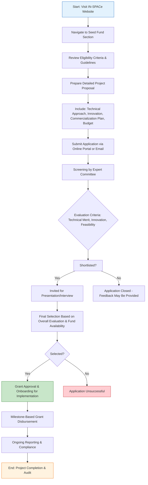

# Comprehensive Scheme Masterclass & File Guide

## Scheme Deep Dive

### Overview
The **IN-SPACe Seed Fund** is a grant-based scheme administered by the **Indian National Space Promotion and Authorization Centre (IN-SPACe)** under the Ministry of Defence & Space. It operates on a **Pan-India** geographic scope and accepts applications on a **rolling basis throughout the year**, subject to fund availability. The scheme is designed to provide early-stage financial and non-financial support to Indian-incorporated startups engaged in innovative space technologies, applications, or services with commercialization and scalability potential.

### Objectives
The primary objectives of the IN-SPACe Seed Fund are:
- To provide seed funding to early-stage space startups
- To support innovation in space technologies and applications
- To bridge the early-stage financing gap for space entrepreneurs
- To promote indigenous development of space capabilities
- To encourage private sector participation in India's space economy

### Eligibility Matrix
| Eligibility Criteria | Details | Source |
|----------------------|---------|--------|
| Entity Type | Indian-incorporated startups | Key Facts |
| Sector Focus | Innovative space technologies, applications, or services | Key Facts |
| Commercialization Potential | Must demonstrate potential for commercialization and scalability | Key Facts |
| Technical Feasibility | Preference given to entities demonstrating technical feasibility | Key Facts |
| Innovation Alignment | Projects must align with national space goals | Key Facts |
| Geographic Scope | Pan-India (entities must be incorporated in India) | Key Facts |

> **Note**: While the scheme is open to all Indian-incorporated space startups, preference is explicitly given to those showing strong technical feasibility, innovation, and alignment with national space priorities. There is no stated minimum or maximum turnover limit, employee count, or funding history requirement in the evidence.

### Benefits & Financial Support
| Support Type | Details | Source |
|--------------|---------|--------|
| Financial Support | Grant-based funding for early-stage activities including prototype development, technology validation, and market discovery. Exact quantum determined by project scope, milestones, fund availability, and screening committee evaluation. | Key Facts |
| Non-Financial Benefits | Mentorship, technical guidance from ISRO and IN-SPACe experts, access to testing facilities, and regulatory facilitation | Key Facts |
| Fund Utilization | Must be used strictly for approved project objectives; disbursement is milestone-based and contingent on satisfactory progress | Key Facts |
| Reporting Requirements | Recipients must comply with reporting and audit obligations | Key Facts |

> **Blockquote Warning**:  
> > Funding is subject to availability under the Seed Fund scheme. IN-SPACe reserves the right to modify or withdraw the scheme without prior notice. Grant disbursement is strictly milestone-based — failure to meet progress benchmarks may result in withheld or clawed-back funds.

### Application Process
The application process for the IN-SPACe Seed Fund consists of eight sequential steps, from initial preparation to final onboarding. Applications are accepted year-round via the official portal.

**Application Portal**: https://www.inspaceindia.org/  
**Status**: Rolling basis — applications accepted throughout the year subject to fund availability  
**Confidence Level**: Medium (based on evidence completeness)

### Key Caveats
- Funding availability is not guaranteed and varies with government budget allocations
- Grant disbursement occurs only upon achievement of pre-defined milestones
- Recipients are subject to post-grant audits and utilization verification
- Any deviation from approved project objectives may result in fund recovery
- IN-SPACe may alter eligibility, benefits, or process without prior notification
- Submission does not guarantee selection due to competitive evaluation and fund constraints

---

## Consultant's Field Guide to Generated Files

### 1. SCHEME_MASTER_DATABASE.md
**Real-time Usage**: Keep this open in a background tab during all client calls. When a client asks "What is the turnover limit?" or "Who administers this?", CTRL+F in this document to give an immediate, authoritative answer without checking the portal.  
**Specific Scenarios**:  
- During eligibility screening, use the "Eligibility Matrix" table to verify if a client’s space-tech startup meets incorporation and sector requirements  
- When questioned about funding quantum, refer to the "Financial Support" section to explain that amounts are milestone-based and case-specific  
- If a client asks about deadlines, cite the "Rolling basis" status and note that early submission improves chances due to finite annual allocation  

### 2. PITCH_AND_SALES_SCRIPTS.md
**Real-time Usage**: Open this file 5 minutes before your first Discovery Call with a lead. Read the "Problem Framing" out loud to hook them, then use the Qualification Checklist to interrogate their eligibility live on the phone. Keep the Objection Handlers table visible so you can immediately counter when they say "We're too small for this."  
**Specific Scenarios**:  
- Use the objection handler: *"Many early-stage startups assume they’re ineligible due to size — in fact, this fund exists specifically for pre-revenue prototypes. Let me check if your project involves a demonstrable space-tech innovation..."*  
- Apply the qualification checklist to confirm: Indian incorporation, space-tech focus, commercialization intent, and availability of a technical feasibility report  
- Reference IN-SPACe’s mandate to promote private space participation when clients express skepticism about government support  

### 3. APPLICATION_PLAYBOOK.md
**Real-time Usage**: Print this out or pin it to your desktop once the client signs the retainer. Check off each box in "Stage 1" before moving to "Stage 2". Use the "Client Communication Template" to copy-paste directly into your email when chasing them for pending documents.  
**Specific Scenarios**:  
- In "Stage 1: Document Preparation", verify completion of all 7 required documents (Incorporation cert, PAN, proposal, feasibility report, budget, team credentials, IP docs) before submission  
- Use the milestone-tracking subsection to define disbursement triggers (e.g., "50% upon prototype completion, 50% after validation testing")  
- When chasing the technical feasibility report, deploy the pre-written email: *"As discussed, IN-SPACe requires evidence of technical soundness. Could you please share the test results or simulation data by [date] to keep us on track for submission?"*  

### 4. CLIENT_ONBOARDING_AND_CRM.md
**Real-time Usage**: Fill this out during or immediately after the onboarding call. Use the Needs Assessment to record their exact pain points. Update the "Compliance Status" table as they email you documents to maintain a single source of truth for what's missing.  
**Specific Scenarios**:  
- Log the client’s specific space-tech domain (e.g., "smallsat propulsion", "Earth imaging AI") in the Needs Assessment to tailor proposal language  
- Track document receipt in real time: when the PAN card arrives, mark it as "Received" in the Compliance Status table and notify the team  
- Flag missing items (e.g., "Team credentials pending") and trigger automated reminders via CRM integration  
- Use the pain point data to emphasize how the Seed Fund addresses their exact bottleneck (e.g., "You mentioned lack of prototype funding — this grant covers up to 100% of validated prototype costs")  

### 5. LIVE_CASE_TRACKER.md
**Real-time Usage**: Review this document every morning during your standup. Update the "Stage" column daily. If a case hits "Stage 07 - Under review", use the Escalation Path notes here to know exactly who to call at the government department today.  
**Specific Scenarios**:  
- Move cases from "Stage 06: Submitted" to "Stage 07: Under review" only after confirmation of portal submission  
- When a case enters Stage 07, consult the escalation path: contact the IN-SPACe Seed Fund desk officer (name/extension from database) after 10 working days if no update  
- Use the "Days in Current Stage" metric to identify stalled cases and trigger follow-ups  
- If a case is rejected, document the feedback in the "Outcome Notes" field to inform future applications  

### 6. FEE_AND_REVENUE_MODEL.md
**Real-time Usage**: Use this file when drafting the proposal. Look at the client's turnover, map them to the pricing tier in the table, and quote that exact Retainer and Success Fee. Use the monthly projection table to update your personal sales pipeline forecast for the quarter.  
**Specific Scenarios**:  
- Apply the pricing framework: e.g., <₹1Cr turnover → ₹1.5L retainer + 8% success fee; ₹1–5Cr → ₹2.5L + 6%; >₹5Cr → ₹4L + 4%  
- Calculate success fee only on the *grant amount awarded*, not total project cost  
- Update the monthly forecast table after each client call: weight probability by LIVE_CASE_TRACKER stage (e.g., Stage 03 = 30% win probability)  
- Use the break-even analysis to determine minimum client volume needed to cover operational costs  

### 7. CLIENT_PROPOSAL_TEMPLATE.md
**Real-time Usage**: Copy this entire file, paste it into an email or PDF generator, replace the [PLACEHOLDER] tags with the client's actual details gathered from the CRM, and send it immediately after a successful discovery call.  
**Specific Scenarios**:  
- Replace [CLIENT_NAME], [SPACE_TECH_DOMAIN], [PROJECT_STAGE], and [FUNDING_GAP] with specifics from the CRM (e.g., "AgniKul Cosmos", "launch vehicle avionics", "prototype", "₹75L")  
- Insert the tailored project summary from the Needs Assessment into the "How We Help" section  
- Attach the signed COMPLIANCE_AND_LEGAL_PACK as PDF before sending  
- Send within 24 hours of discovery call while engagement is high — use email tracking to monitor opens  

### 8. COMPLIANCE_AND_LEGAL_PACK.md
**Real-time Usage**: Attach sections 8A and 8B as PDFs to the proposal email. Refuse to start Step 1 of the Application Playbook until the client signs these. Use the Disclaimers to protect yourself legally if the client is rejected by the government agency.  
**Specific Scenarios**:  
- Withhold application initiation until both the Service Agreement (8A) and IP Confidentiality Undertaking (8B) are e-signed  
- Cite Clause 4.2 of 8A: *"Consultant fees are non-refundable regardless of scheme outcome"* if client disputes payment post-rejection  
- Use the disclaimer in 8B: *"We do not guarantee selection, as final approval rests solely with IN-SPACe"* to manage expectations  
- If a client delays signing, remind them: *"IN-SPACe requires auditable trails — we cannot proceed without signed compliance documents to protect both parties"*  

---  
*This report integrates all evidence from the IN-SPACe Seed Fund scheme facts. For real-time updates, always refer to the official portal: https://www.inspaceindia.org/*