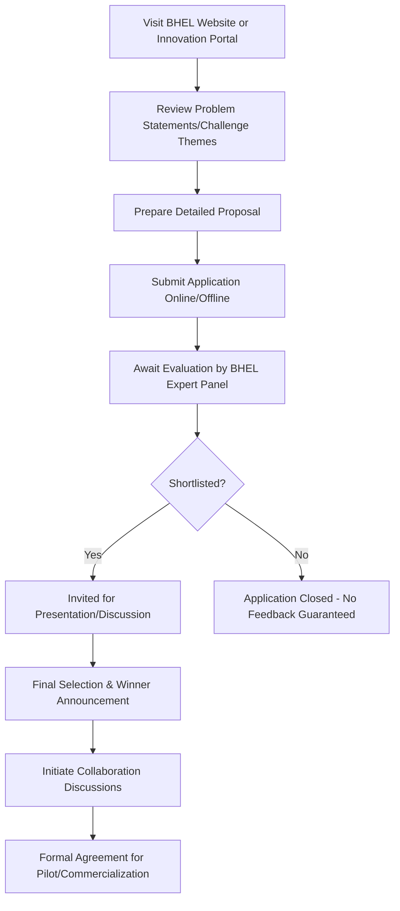

# Comprehensive Scheme Masterclass & File Guide

## Scheme Deep Dive

### Overview
The **BHEL Innovation Challenge** is a recognition-type scheme launched by **Bharat Heavy Electricals Limited (BHEL)**, a Maharatna Public Sector Undertaking under the Ministry of Heavy Industries, Government of India. The scheme operates on a **rolling basis** with no fixed deadline, inviting innovators across India to submit solutions aligned with BHEL’s core operational domains. It is designed to foster indigenous innovation and collaboration under the **Make in India** initiative.

### Objectives
The scheme aims to:
- Identify and promote innovative solutions addressing BHEL’s technological challenges in power generation, transmission, transportation, defence, aerospace, renewable energy, and industrial systems.
- Foster collaboration between BHEL and startups/MSMEs for co-development and pilot projects.
- Support the Make in India initiative by encouraging indigenous innovation.
- Provide a platform for innovators to showcase technologies to a leading PSU.
- Accelerate commercialization of promising innovations in energy, industry, and infrastructure sectors.
- Strengthen BHEL’s innovation ecosystem through external partnerships and idea sourcing.

### Eligibility Matrix
| Eligibility Criteria | Details |
|----------------------|---------|
| **Applicant Type** | Startups, MSMEs, individual innovators, and entities registered in India |
| **Geographic Scope** | Pan-India |
| **Solution Relevance** | Must be relevant to BHEL’s operational domains: power generation, transmission, transportation, defence, aerospace, renewable energy, or industrial systems |
| **Technology Readiness Level** | Suitable for demonstration, pilot testing, or potential integration with BHEL’s products/services |
| **Innovation Requirement** | Must be original; declaration of IP rights required |
| **Entity Status** | Must be legally registered in India (proof required) |

### Benefits & Financial Support
| Benefit Type | Details |
|--------------|---------|
| **Recognition** | Formal recognition from BHEL, a Maharatna PSU |
| **Technical Collaboration** | Opportunities for joint development with BHEL’s R&D and engineering teams |
| **Access to Infrastructure** | Use of BHEL’s facilities, labs, and test beds for validation |
| **Mentorship & Guidance** | Access to BHEL’s experts for technical and commercialization support |
| **Pilot Projects** | Potential for proof-of-concept development or pilot-scale implementation |
| **Commercialization Pathways** | Possible long-term partnerships or integration into BHEL’s supply chain |
| **Visibility** | Exposure within BHEL’s global network (presence in 90+ countries) |
| **Financial Support** | **No direct grants or prize money**. Financial support is contingent on post-selection agreements for pilot projects or commercialization. BHEL invests ~2.5% of turnover in R&D (Rs. 32,350 crores turnover in FY 2025–26 implies ~Rs. 808 crores annual R&D spend). |

> **> Important Note**: The scheme does not offer upfront funding. Any financial engagement occurs only after selection via mutual agreement. Applicants must not expect seed funding or cash awards.

### Required Documents
Applicants must submit:
1. Proposal document detailing the innovation  
2. Proof of entity registration (for startups/MSMEs)  
3. Brief profile of the applicant or team  
4. Technical specifications or schematics of the solution  
5. Any existing prototypes, test results, or pilot data  
6. Declaration of originality and intellectual property rights  

### Application Process

**Application Portal**: https://www.bhel.com  
**Status**: Rolling basis (no fixed deadline)  
**Last Updated**: 2026  
**Implementing Agency**: Bharat Heavy Electricals Limited (BHEL)  
**Confidence Level**: Medium (based on available evidence)

### Key Caveats
- Submission does not guarantee selection or funding  
- Intellectual property terms must be mutually agreed upon  
- BHEL reserves the right to modify or withdraw the challenge without notice  
- Selected participants may need to enter into formal agreements for collaboration  
- Challenge is subject to internal review and alignment with BHEL’s strategic priorities  

---

## Consultant's Field Guide to Generated Files

### 1. SCHEME_MASTER_DATABASE.md
**Real-time Usage**: Keep this open in a background tab during all client calls. When a client asks "What is the turnover limit?" or "Who administers this?", CTRL+F in this document to give an immediate, authoritative answer without checking the portal.

### 2. PITCH_AND_SALES_SCRIPTS.md
**Real-time Usage**: Open this file 5 minutes before your first Discovery Call with a lead. Read the "Problem Framing" out loud to hook them, then use the Qualification Checklist to interrogate their eligibility live on the phone. Keep the Objection Handlers table visible so you can immediately counter when they say "We're too small for this."

### 3. APPLICATION_PLAYBOOK.md
**Real-time Usage**: Print this out or pin it to your desktop once the client signs the retainer. Check off each box in "Stage 1" before moving to "Stage 2". Use the "Client Communication Template" to copy-paste directly into your email when chasing them for pending documents.

### 4. CLIENT_ONBOARDING_AND_CRM.md
**Real-time Usage**: Fill this out during or immediately after the onboarding call. Use the Needs Assessment to record their exact pain points. Update the "Compliance Status" table as they email you documents to maintain a single source of truth for what's missing.

### 5. LIVE_CASE_TRACKER.md
**Real-time Usage**: Review this document every morning during your standup. Update the "Stage" column daily. If a case hits "Stage 07 - Under review", use the Escalation Path notes here to know exactly who to call at the government department today.

### 6. FEE_AND_REVENUE_MODEL.md
**Real-time Usage**: Use this file when drafting the proposal. Look at the client's turnover, map them to the pricing tier in the table, and quote that exact Retainer and Success Fee. Use the monthly projection table to update your personal sales pipeline forecast for the quarter.

### 7. CLIENT_PROPOSAL_TEMPLATE.md
**Real-time Usage**: Copy this entire file, paste it into an email or PDF generator, replace the [PLACEHOLDER] tags with the client's actual details gathered from the CRM, and send it immediately after a successful discovery call.

### 8. COMPLIANCE_AND_LEGAL_PACK.md
**Real-time Usage**: Attach sections 8A and 8B as PDFs to the proposal email. Refuse to start Step 1 of the Application Playbook until the client signs these. Use the Disclaimers to protect yourself legally if the client is rejected by the government agency.