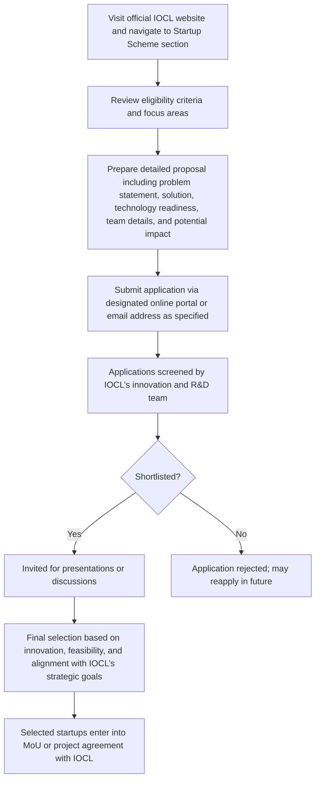

# Comprehensive Scheme Masterclass & File Guide

## Scheme Deep Dive

### Overview
The IOCL Startup Scheme is an incubation-type initiative implemented by Indian Oil Corporation Limited (IOCL), a Public Sector Undertaking (PSU) under the Ministry of Petroleum & Natural Gas. The scheme operates on a rolling basis with applications accepted throughout the year and has a pan-India geographic scope. It aims to identify and nurture innovative startups in the energy and allied sectors, particularly those working on sustainable and green energy solutions.

### Objectives
- To identify and nurture innovative startups in the energy and allied sectors  
- To collaborate with startups on pilot projects and technology validation  
- To support the development of sustainable and green energy solutions  
- To enhance operational efficiency through digital and technological innovation  
- To provide startups with access to IOCL’s infrastructure, expertise, and market reach  
- To promote Atmanirbhar Bharat by encouraging indigenous innovation  
- To create a pipeline of scalable solutions for integration into IOCL’s value chain  

### Eligibility Matrix
| Criteria | Requirement | Source |
|---------|-------------|--------|
| Entity Type | Registered under Companies Act, 2013, LLP Act, 2008, or as a partnership firm | Key Facts |
| Age of Startup | Not more than 10 years from date of incorporation | Key Facts |
| Focus Areas | Renewable energy, green hydrogen, biofuels, carbon capture, AI/ML for energy optimization, sustainable mobility | Key Facts |
| Technology Readiness | Preference given to startups with a working prototype or minimum viable product (MVP) | Key Facts |
| Innovation Focus | Innovative products, services, or processes | Key Facts |
| Geographic Scope | Pan-India | Key Facts |
| Target Beneficiaries | Startups | Key Facts |

### Benefits & Financial Support
| Benefit Type | Details | Source |
|--------------|---------|--------|
| Financial Support | Case-to-case basis; typically grant funding, seed investment, or milestone-based disbursements for joint development projects. Quantum depends on scope, technology readiness level, and commercial potential. IOCL may facilitate access to other funding mechanisms or connect startups with investors. Exact terms negotiated post-selection. | Key Facts |
| Technical Expertise | Access to IOCL’s technical expertise, testing facilities, and pilot plant infrastructure | Key Facts |
| Proof-of-Concept (PoC) | Opportunities for PoC development and joint development projects | Key Facts |
| Commercialization | Potential commercialization or procurement of solutions | Key Facts |
| Mentorship | Mentorship from IOCL’s R&D and business teams | Key Facts |
| Visibility | Visibility through IOCL’s platforms | Key Facts |
| Scaling Support | Support in scaling solutions | Key Facts |
| Milestone-Based Extension | Financial support may be extended based on project milestones and mutual agreement | Key Facts |

### Application Process (Mermaid Flowchart)

**Application Portal**: https://iocl.com (Navigate to Startup Scheme section)  
**Key Sources**: Key Facts section, IOCL website navigation

### Key Caveats
> - Selection does not guarantee funding or commercialization  
> - IOCL retains intellectual property rights as per negotiated agreements  
> - Startups must comply with IOCL’s safety, security, and confidentiality protocols  
> - Projects are subject to technical feasibility and strategic fit review  
> - No assurance of long-term engagement beyond the initial project phase  

### Required Documents
1. Certificate of Incorporation / Registration  
2. PAN of the entity  
3. Audited financial statements (if available)  
4. Detailed project proposal  
5. Proof of concept or prototype details (if any)  
6. Team resumes and background  
7. Intellectual property details (if applicable)  
8. Declaration of compliance with eligibility criteria  

### Status & Deadlines
- **Status**: Active  
- **Deadlines**: Rolling basis — applications accepted throughout the year  
- **Confidence Level**: Medium (based on evidence consistency)  

---

## Consultant's Field Guide to Generated Files

### 1. SCHEME_MASTER_DATABASE.md
**Real-time Usage**: Keep this open in a background tab during all client calls. When a client asks "What is the turnover limit?" or "Who administers this?", CTRL+F in this document to give an immediate, authoritative answer without checking the portal.  
*Example Use Case*: During a discovery call, a client asks about eligibility age limits. You instantly search "10 years" in SCHEME_MASTER_DATABASE.md and confirm: "Startups must not be more than 10 years old from incorporation."

### 2. PITCH_AND_SALES_SCRIPTS.md
**Real-time Usage**: Open this file 5 minutes before your first Discovery Call with a lead. Read the "Problem Framing" out loud to hook them, then use the Qualification Checklist to interrogate their eligibility live on the phone. Keep the Objection Handlers table visible so you can immediately counter when they say "We're too small for this."  
*Example Use Case*: A lead says, "We’re just a two-person team with an idea." You use the objection handler: "Many selected startups began at the MVP stage — IOCL specifically prefers prototypes. Let’s discuss how we can frame your current progress as strength."

### 3. APPLICATION_PLAYBOOK.md
**Real-time Usage**: Print this out or pin it to your desktop once the client signs the retainer. Check off each box in "Stage 1" before moving to "Stage 2". Use the "Client Communication Template" to copy-paste directly into your email when chasing them for pending documents.  
*Example Use Case*: After signing the retainer, you check "Stage 1: Document Collection" and verify the client has uploaded their Certificate of Incorporation and PAN. You then use the template to email: "Hi [Name], thanks for sending the incorporation cert — could you also share the audited financials (if available) by EOD tomorrow?"

### 4. CLIENT_ONBOARDING_AND_CRM.md
**Real-time Usage**: Fill this out during or immediately after the onboarding call. Use the Needs Assessment to record their exact pain points. Update the "Compliance Status" table as they email you documents to maintain a single source of truth for what's missing.  
*Example Use Case*: During onboarding, you log in the Needs Assessment: "Client struggles to scale PoC due to lack of lab access." As they send the prototype video, you update Compliance Status: "Proof of concept details — RECEIVED ✅".

### 5. LIVE_CASE_TRACKER.md
**Real-time Usage**: Review this document every morning during your standup. Update the "Stage" column daily. If a case hits "Stage 07 - Under review", use the Escalation Path notes here to know exactly who to call at the government department today.  
*Example Use Case*: At 9 AM standup, you see a case moved to "Stage 07 - Under review". You check the Escalation Path: "Contact Innovation Team Lead at IOCL R&D Centre, Faridabad — extension 2205." You call before 11 AM to check status.

### 6. FEE_AND_REVENUE_MODEL.md
**Real-time Usage**: Use this file when drafting the proposal. Look at the client's turnover, map them to the pricing tier in the table, and quote that exact Retainer and Success Fee. Use the monthly projection table to update your personal sales pipeline forecast for the quarter.  
*Example Use Case*: A client has ₹8 Cr turnover. You check the pricing tier: "₹5–10 Cr → Retainer: ₹1.5L, Success Fee: 8%". You quote: "Retainer: ₹1,50,000 | Success Fee: 8% of granted amount." You then update your pipeline forecast with this value.

### 7. CLIENT_PROPOSAL_TEMPLATE.md
**Real-time Usage**: Copy this entire file, paste it into an email or PDF generator, replace the [PLACEHOLDER] tags with the client's actual details gathered from the CRM, and send it immediately after a successful discovery call.  
*Example Use Case*: After a positive discovery call, you open CLIENT_PROPOSAL_TEMPLATE.md, replace [CLIENT_NAME], [TURN OVER], [FOCUS_AREA], etc., with live CRM data, generate a PDF, and send: "Proposal for [Client Name]’s green hydrogen solution under IOCL Startup Scheme."

### 8. COMPLIANCE_AND_LEGAL_PACK.md
**Real-time Usage**: Attach sections 8A and 8B as PDFs to the proposal email. Refuse to start Step 1 of the Application Playbook until the client signs these. Use the Disclaimers to protect yourself legally if the client is rejected by the government agency.  
*Example Use Case*: Before sending the proposal, you attach COMPLIANCE_AND_LEGAL_PACK_8A.pdf (Eligibility Declaration) and _8B.pdf (IP & Confidentiality Terms). You email: "Please sign and return these two pages before we begin document preparation — this is mandatory per IOCL guidelines." If rejected later, you cite Section 8B: "As disclosed, IOCL’s selection does not guarantee funding."