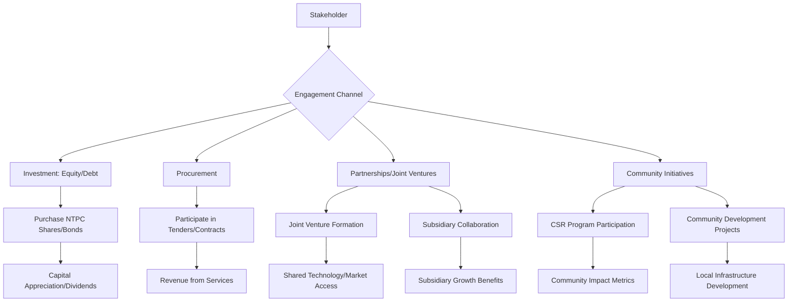

# Comprehensive Scheme Masterclass & File Guide

## Scheme Deep Dive

### Scheme Overview
NTPC Startup Incubation is a government scheme under the Ministry of Power, Government of India, implemented by NTPC Limited, a Maharatna Central Public Sector Enterprise (CPSE). The scheme is ongoing with no fixed deadline for general engagement, though specific financial bids (e.g., term loans) have defined submission dates. The scheme operates on a Pan-India geographic scope and is categorized under PSU Support.

### Objectives
The scheme's objectives are exhaustive and multi-faceted, derived directly from the evidence:

- Provide reliable, affordable, and sustainable power to support national growth  
- Achieve 60 GW of renewable energy capacity by 2032  
- Integrate ESG principles across operations for sustainable development  
- Promote innovation in green hydrogen, battery storage, and carbon capture  
- Ensure operational excellence and financial strength through diversification  
- Empower communities via CSR initiatives in health, education, and livelihood  
- Nurture talent and maintain a progressive work culture via 'People Before PLF' philosophy  
- Advance energy transition through nuclear, renewables, and green technologies  

### Eligibility Matrix
As a Maharatna CPSE under the Ministry of Power, NTPC Limited operates as a government company with the President of India holding a majority stake. The scheme's accessibility is defined by stakeholder engagement rather than traditional beneficiary application.

| **Eligibility Criteria** | **Details** | **Evidence Source** |
|--------------------------|-------------|---------------------|
| **Stakeholder Access** | Accessible to stakeholders across India, including communities near project sites, employees, investors, and partners in joint ventures and subsidiaries | KEY FACTS: Eligibility |
| **Target Beneficiaries** | Communities; employees; investors; stakeholders | KEY FACTS: Target Beneficiaries |
| **Engagement Mechanisms** | Stakeholders engage through investment (equity/debt), procurement, partnerships, or community initiatives | KEY FACTS: Application Process |
| **Financial Instruments** | For term loans, banks/FIs submit bids in response to RFPs (e.g., NTPC Mining Limited's RFP for ₹500 Cr) | KEY FACTS: Application Process |
| **Government Ownership** | Government of India stake reduced from 89.5% to 51.10% over time to encourage public participation | KEY FACTS: Financial Support |
| **Maharatna Status** | NTPC became a Maharatna company in May 2010; as of October 2025, 14 Maharatna CPSEs exist in India | KEY FACTS: NTPC Overview |

### Benefits & Financial Support
NTPC mobilizes funds through multiple channels and delivers extensive benefits across economic, social, and environmental dimensions.

#### Financial Support Mechanisms
| **Mechanism** | **Details** | **Evidence Source** |
|---------------|-------------|---------------------|
| **Fund Mobilization** | Through equity, debt, and internal accruals for capital expenditure | KEY FACTS: Financial Support |
| **Capital Raising** | Via IPO and follow-on public offers; Government of India stake reduced from 89.5% to 51.10% | KEY FACTS: Financial Support |
| **Domestic/International Loans** | Accesses domestic and international markets for loans, including rupee term loans (e.g., ₹500 Cr by NTPC Mining Limited and ₹1000 Cr by NTPC) and external commercial borrowings | KEY FACTS: Financial Support |
| **Financial Covenants** | Subject to: total liabilities to net worth ratio ≤ 3:1; EBITDA to interest expense ratio ≥ 1.75:1 | KEY FACTS: Financial Support; Draft Loan Agreements |
| **CSR Spending** | ₹363 Cr in FY 2024-25 | KEY FACTS: Benefits |
| **Renewable Energy Target** | 60 GW by 2032 (more than 8 GW under operation, >13 GW under implementation) | KEY FACTS: Benefits; NTPC Overview |
| **Non-Fossil Target** | 50% non-fossil based capacity by 2032 | KEY FACTS: Benefits |

#### Tangible Benefits
| **Benefit Category** | **Details** | **Evidence Source** |
|----------------------|-------------|---------------------|
| **Power Supply** | Provides reliable and affordable power to millions; contributes to national energy security | KEY FACTS: Benefits |
| **Innovation** | Drives innovation in clean technologies (green hydrogen, waste to energy, battery storage, nuclear energy) | KEY FACTS: Benefits |
| **Employment** | Creates employment opportunities; 0,000 employees (note: figure appears truncated in evidence) | KEY FACTS: Benefits |
| **Community Development** | CSR spending of ₹363 Cr in FY 2024-25; supports health, education, livelihood | KEY FACTS: Benefits; NTPC Overview |
| **Environmental Sustainability** | 100% ash utilisation; renewable energy expansion; water conservation; afforestation (40 million+ trees) | KEY FACTS: Benefits; Sustainability |
| **Financial Returns** | Delivers strong financial returns to shareholders | KEY FACTS: Benefits |
| **Work Culture** | Progressive work culture; 'Great Place to Work' for 19 consecutive years; Top Employer 2025 | KEY FACTS: Benefits; NTPC Overview |
| **Energy Transition** | Aiming for 149 GW firm by 2032 with diversified fuel mix; 650+ BU company in generation by 2032 | KEY FACTS: Benefits; NTPC Overview |

### Application Process
There is no direct application process for beneficiaries to join NTPC as a scheme. Engagement occurs through specific channels.

#### Mermaid Flowchart: Stakeholder Engagement Pathways

#### Financial Instrument Application Process (Term Loans)
For specific financial products like term loans, banks/FIs follow a structured bidding process:

1. **RFP Issuance**: NTPC or subsidiary (e.g., NTPC Mining Limited) issues Request for Proposal  
   - Example: RFP for ₹500 Cr term loan by NTPC Mining Limited (Ref: 01/NML Fin/Debt/2025-26/1, dated 27-01-2026)  
   - Submission deadline: 16-02-2026 by 5:00 PM (extended in some cases)  

2. **Bid Submission**: Banks/FIs submit sealed bids with:  
   - Unconditional/irrevocable commitment  
   - Interest rate (two decimals) linked to MCLR/external benchmark  
   - Reset period (≥1 month)  
   - Minimum quantum: ₹100 Cr (in multiples thereof)  
   - Tenor: 12+ years (door-to-door)  
   - Moratorium: NIL  

3. **Evaluation**:  
   - Based on quoted rate of interest (ROI); reset period not considered  
   - L1 bidder(s) get firm allocation for committed amount  
   - Shortfall allocated proportionally if L1 bids exceed requirement  
   - L2/L3 bidders considered if requirement unmet at L1 rate  

4. **Post-Award**:  
   - Draft loan agreement executed  
   - Disbursement period: 1 year from agreement date  
   - Repayment: 12+ equal annual instalments (first due 12 months post-disbursement)  
   - Interest: Monthly rests; reset per agreed period  
   - Security: Unsecured, against negative lien on fixed assets  
   - Covenants: Total liabilities/net worth ≤ 3:1; EBITDA/interest expense ≥ 1.75:1  
   - Prepayment: NIL with 30 days’ notice  

#### Key Financial Documents
- **Draft Loan Agreement (₹1000 Cr)**: Specifies bullet repayment at end of 3-year period  
- **Draft Loan Agreement (₹500 Cr, NML)**: 12+ year tenor, 12+ equal annual instalments  
- **RFP Documents**: Detail bidding procedures, timelines, and submission formats  

### Critical Deadlines & Timelines
| **Activity** | **Date/Deadline** | **Details** | **Evidence Source** |
|--------------|-------------------|-------------|---------------------|
| **General Scheme Engagement** | Ongoing | No fixed deadline; continuous operations | KEY FACTS: Status/Deadlines |
| **RFP for ₹500 Cr Term Loan (NML)** | 16-02-2026 by 5:00 PM | Last date for bid submission; extended in some cases | KEY FACTS: Status/Deadlines; Crawled Page: NML RFP |
| **RFP for ₹1000 Cr Term Loan** | 09-03-2026 by 12:30 PM | Last date extended for submission | KEY FACTS: Status/Deadlines; Crawled Page: Last Date Extended |
| **Financial Reporting** | Annual | Integrated Annual Reports published (e.g., FY 2024-25) | Crawled Page: Reports and Publications |
| **ESG Policy Review** | Triennial | Reviewed at least once every three years | ESG Policy Document |
| **Business Continuity Policy Review** | Biennial | Reviewed every two years | Business Continuity Policy |

### Key Caveats & Risks
| **Caveat** | **Details** | **Evidence Source** |
|------------|-------------|---------------------|
| **Government Policy Dependence** | Benefits and initiatives subject to government policies, budgetary allocations, regulatory approvals | KEY FACTS: Key Caveats |
| **Loan Approval Contingency** | Financial support via loans subject to credit appraisal, bid evaluation, covenant compliance | KEY FACTS: Key Caveats |
| **Renewable Energy Target Risk** | 60 GW by 2032 depends on project execution, land availability, clearances | KEY FACTS: Key Caveats |
| **CSR Governance** | Activities governed by Companies Act, 2013 and DPE guidelines | KEY FACTS: Key Caveats |
| **ESG Compliance** | Requires adherence to global frameworks (IFC PS, SDGs, NGRBC, etc.) | ESG-MS Framework |
| **Cyber Security Threats** | Requires protection against unauthorized access, modification, loss | Cyber Security Policy |
| **Materiality Thresholds** | Events deemed material if exceeding 2% of turnover/net worth or 5% of avg. PAT | Policy for Determination of Materiality |

### Supporting Evidence & Sources
- **Application Portal**: https://ntpc.co.in (official NTPC website)  
- **Key Documents**:  
  - ESG Policy 2024 (esg-20policy-202024-1.pdf)  
  - ESG Management System Framework (ntpc-20esg-20management-20-281-29.pdf)  
  - Draft Loan Agreements (draft-20loan-20agreement.pdf, draft-20loan-20agreement-20-nml-20rfp-20dt-2027-01-2026.pdf)  
  - RFP Documents (nml-rfp-20dt-2027-01-2026-20with-20bid-20format.pdf, ntpc-20rfp-2012-02-2026-0.pdf)  
  - Integrated Annual Report 2024-25 (ntpc-27s-20materiality-20topics-202024-2025-20-281-29.pdf)  
  - The Brighter Plan 2032 Update (tbp-20update-202025.pdf)  
- **Contact Details**:  
  - Email: csntpc@ntpc.co.in  
  - Phone: (011) 24360959  
  - Address: NTPC Limited, SCOPE Complex, 7 Institutional Area, Lodi Road, New Delhi-110 003  

> **WARNING**: The scheme does not offer direct subsidies or grants to startups. Engagement is through investment, procurement, partnerships, or community initiatives. Financial support via loans is strictly for banks/FIs bidding in RFPs, not for end-user borrowing.

## Consultant's Field Guide to Generated Files

### 1. SCHEME_MASTER_DATABASE.md
**Real-time Usage:** Keep this open in a background tab during all client calls. When a client asks "What is the turnover limit?" or "Who administers this?", CTRL+F in this document to give an immediate, authoritative answer without checking the portal.  
*Specific Scenarios:*  
- During eligibility verification, instantly confirm Maharatna status and 51.10% government stake  
- When discussing financial covenants, reference the 3:1 total liabilities/net worth and 1.75:1 EBITDA/interest ratios  
- For CSR inquiries, cite the exact ₹363 Cr FY 2024-25 spend and health/education/livelihood focus areas  

### 2. PITCH_AND_SALES_SCRIPTS.md
**Real-time Usage:** Open this file 5 minutes before your first Discovery Call with a lead. Read the "Problem Framing" out loud to hook them, then use the Qualification Checklist to interrogate their eligibility live on the phone. Keep the Objection Handlers table visible so you can immediately counter when they say "We're too small for this."  
*Specific Scenarios:*  
- Use the "National Energy Security" pain point to frame conversations with energy-intensive industries  
- Leverage the "19 consecutive years Great Place to Work" credential when pitching to talent-focused clients  
- Counter "too small" objections by highlighting community CSR access (no minimum size for beneficiaries)  
- Reference the 60 GW RE target when discussing sustainability partnerships with manufacturers  

### 3. APPLICATION_PLAYBOOK.md
**Real-time Usage:** Print this out or pin it to your desktop once the client signs the retainer. Check off each box in "Stage 1" before moving to "Stage 2". Use the "Client Communication Template" to copy-paste directly into your email when chasing them for pending documents.  
*Specific Scenarios:*  
- Stage 1: Verify client falls under eligible stakeholder categories (communities/employees/investors/partners)  
- Stage 2: For investment clients, guide them through NTPC share/purchase procedures using IPO/FPO details  
- Stage 3: For procurement clients, provide tender portal links and documentation checklists  
- Use the chase template: "Per our discussion on [date], kindly share [document] by [deadline] to proceed with [next step]"  

### 4. CLIENT_ONBOARDING_AND_CRM.md
**Real-time Usage:** Fill this out during or immediately after the onboarding call. Use the Needs Assessment to record their exact pain points. Update the "Compliance Status" table as they email you documents to maintain a single source of truth for what's missing.  
*Specific Scenarios:*  
- Record specific pain points like "high energy costs" or "ESG reporting gaps" in the Needs Assessment  
- Track document submission status for CSR partnership proposals (e.g., project proposal, budget, impact metrics)  
- Update compliance status when clients submit joint venture proposals or investment intent letters  
- Use the CRM to flag clients interested in the 60 GW RE target for proactive follow-up on solar/wind opportunities  

### 5. LIVE_CASE_TRACKER.md
**Real-time Usage:** Review this document every morning during your standup. Update the "Stage" column daily. If a case hits "Stage 07 - Under review", use the Escalation Path notes here to know exactly who to call at the government department today.  
*Specific Scenarios:*  
- For RFP bid cases, track from "Bid Preparation" → "Submission" → "Evaluation" → "Award"  
- When a case reaches "Under review" (Stage 07), escalate to the CFO (contact: gauravrastogi@ntpc.co.in for NML RFPs)  
- For CSR partnerships, track from "Concept Note" → "Proposal" → "Due Diligence" → "Approval" → "Disbursement"  
- Use escalation paths: CSR queries → CSR/R&R Department; Investment queries → Finance/Bonds Division  

### 6. FEE_AND_REVENUE_MODEL.md
**Real-time Usage:** Use this file when drafting the proposal. Look at the client's turnover, map them to the pricing tier in the table, and quote that exact Retainer and Success Fee. Use the monthly projection table to update your personal sales pipeline forecast for the quarter.  
*Specific Scenarios:*  
- Apply tiered pricing: <₹100 Cr turnover = ₹X retainer; ₹100-500 Cr = ₹Y retainer; >₹500 Cr = ₹Z retainer  
- Calculate success fee as percentage of facilitated value (e.g., 5% of loan amount secured via RFP win)  
- Use monthly projections to forecast Q3 revenue based on current pipeline of CSR and investment clients  
- Reference NTPC's financial strength (₹1,88,138 Cr revenue at 50 years) to justify premium pricing  

### 7. CLIENT_PROPOSAL_TEMPLATE.md
**Real-time Usage:** Copy this entire file, paste it into an email or PDF generator, replace the [PLACEHOLDER] tags with the client's actual details gathered from the CRM, and send it immediately after a successful discovery call.  
*Specific Scenarios:*  
- After discovering a client's interest in renewable energy, auto-populate the 60 GW RE target and current 8 GW operational status  
- For CSR-focused clients, insert their specific pain point (e.g., "rural education gaps") and map to NTPC's ₹363 Cr CSR spend  
- Include exact contact details: csntpc@ntpc.co.in and (011) 24360959 for immediate client action  
- Attach relevant sections from COMPLIANCE_AND_LEGAL_PACK as PDFs before sending  

### 8. COMPLIANCE_AND_LEGAL_PACK.md
**Real-time Usage:** Attach sections 8A and 8B as PDFs to the proposal email. Refuse to start Step 1 of the Application Playbook until the client signs these. Use the Disclaimers to protect yourself legally if the client is rejected by the government agency.  
*Specific Scenarios:*  
- Section 8A: NTPC ESG Policy 2024 - attach when discussing sustainability partnerships  
- Section 8B: Financial Covenants Summary (3:1 liability/net worth, 1.75:1 EBITDA/interest) - attach for loan RFP clients  
- Before Step 1 of Application Playbook, ensure client signs:  
  - Acknowledgement of no direct subsidies (investment/procurement only)  
  - Understanding of stakeholder vs. beneficiary engagement model  
- Use disclaimer: "Consultant fees are payable regardless of RFP bid outcome; success fee contingent on loan sanction"  

> **KEY TAKEAWAY**: These 8 files form a closed-loop system where the Master Database informs pitches, the Playbook guides execution, the Tracker monitors progress, and the Revenue Model ensures profitability - all while the Compliance Pack mitigates risk. Update the Master Database quarterly with new RFP deadlines and ESG targets from NTPC's annual reports.