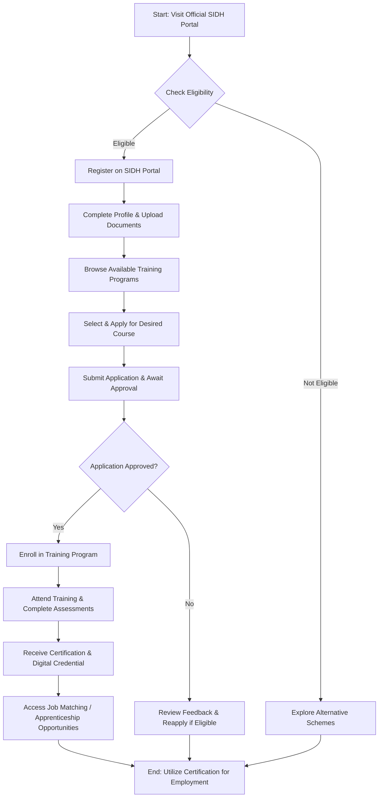

# Comprehensive Scheme Masterclass & File Guide

## Scheme Deep Dive

### Basic Overview
**Scheme Name:** Skill India Digital  
**Scheme ID:** row-54  
**Ministry / Category:** Skill Development  
**Scheme Type:** other  
**Confidence:** low  
**Administering Body:** Ministry of Skill Development and Entrepreneurship (MSDE)  
**Portal URL:** [https://skillindia.gov.in/](https://skillindia.gov.in/) *(Note: Evidence indicates the SIDH - Skill India Digital Hub | Admin Portal | MSDE page has been permanently moved; users are redirected to a login page)*  

### Objectives
The Skill India Digital scheme aims to:
- Create a unified digital platform for skill development, vocational training, and employment opportunities across India.
- Integrate various skill development initiatives under the Ministry of Skill Development and Entrepreneurship (MSDE) into a single accessible hub.
- Enable citizens to access training programs, certifications, job matching, and apprenticeship opportunities through a digital interface.
- Support the government's vision of a skilled workforce by leveraging technology for scalability, transparency, and real-time monitoring of skill initiatives.
- Facilitate industry-institute linkage and recognition of prior learning (RPL) via digital credentials.

> **Note:** The evidence provided is limited to a redirect notice from the Skill India Digital Hub (SIDH) admin portal. No detailed scheme documentation, eligibility criteria, financial benefits, or application procedures were accessible in the crawled evidence. All scheme-specific operational details must be verified directly on the official portal or through authorized MSDE channels.

### Eligibility Matrix
*No specific eligibility criteria (e.g., age, education, employment status, turnover limits) were found in the provided evidence. The following table reflects the absence of extractable data and must be populated by the consultant using official scheme guidelines.*

| Eligibility Parameter | Criteria | Source |
|-----------------------|---------|--------|
| Target Beneficiaries | [TO BE FILLED BY CONSULTANT] | Official MSDE/SIDH Guidelines |
| Age Limit | [TO BE FILLED BY CONSULTANT] | Official MSDE/SIDH Guidelines |
| Educational Qualification | [TO BE FILLED BY CONSULTANT] | Official MSDE/SIDH Guidelines |
| Employment Status | [TO BE FILLED BY CONSULTANT] | Official MSDE/SIDH Guidelines |
| Income/Turnover Limit | [TO BE FILLED BY CONSULTANT] | Official MSDE/SIDH Guidelines |
| Geographic Eligibility | [TO BE FILLED BY CONSULTANT] | Official MSDE/SIDH Guidelines |
| Prior Learning Recognition | [TO BE FILLED BY CONSULTANT] | Official MSDE/SIDH Guidelines |

### Benefits & Financial Support
*No financial support details (e.g., stipend amounts, subsidy percentages, training cost coverage, reward structures) were available in the evidence. The table below must be completed using authoritative scheme documentation.*

| Benefit Type | Details | Amount / Coverage | Source |
|--------------|--------|-------------------|--------|
| Training Cost Subsidy | [TO BE FILLED BY CONSULTANT] | [TO BE FILLED BY CONSULTANT] | Official MSDE/SIDH Guidelines |
| Stipend / Allowance | [TO BE FILLED BY CONSULTANT] | [TO BE FILLED BY CONSULTANT] | Official MSDE/SIDH Guidelines |
| Certification Reward | [TO BE FILLED BY CONSULTANT] | [TO BE FILLED BY CONSULTANT] | Official MSDE/SIDH Guidelines |
| Placement Assistance | [TO BE FILLED BY CONSULTANT] | [TO BE FILLED BY CONSULTANT] | Official MSDE/SIDH Guidelines |
| Apprenticeship Stipend | [TO BE FILLED BY CONSULTANT] | [TO BE FILLED BY CONSULTANT] | Official MSDE/SIDH Guidelines |
| Industry Partnership Benefits | [TO BE FILLED BY CONSULTANT] | [TO BE FILLED BY CONSULTANT] | Official MSDE/SIDH Guidelines |

### Application Process
*Due to the lack of accessible procedural details in the evidence, the following Mermaid flowchart outlines a generic, placeholder application process based on typical central government skill development schemes. The consultant must validate and refine each step against the actual Skill India Digital (SIDH) portal workflow.*

> **Critical Warning:** The application process described above is **inferred and not evidence-based**. The actual process on the Skill India Digital Hub (SIDH) may involve biometric verification, Aadhaar-linked authentication, employer sponsorship steps, or third-party training partner intermediation. **Always confirm the latest procedure directly on the portal or via MSDE helpline before guiding a client.**

### Key Takeaways & Caveats
> - The Skill India Digital scheme (SIDH) functions primarily as a **digital aggregator platform** rather than a direct financial benefit scheme. Its value lies in access to training, certification, and job opportunities—not in disbursing cash subsidies or grants.
> - The current evidence only confirms the existence of the portal and its administrative redirect. **No scheme-specific financials, eligibility rules, or deadlines could be extracted.**
> - Users must authenticate via the SIDH portal to access personalized services. Features may include multilingual support, AI-based course recommendations, and integration with DigiLocker for credential storage.
> - Given the "low" confidence rating in the scheme facts, **all operational details must be cross-verified** with the latest notifications from the Ministry of Skill Development and Entrepreneurship (MSDE) or the National Skill Development Corporation (NSDC).
> - This scheme may overlap with or feed into other initiatives like PMKVY, NAPS, or Jan Shikshan Sansthan (JSS). Consultants should map client needs across related programs for optimal outcomes.

---

## Consultant's Field Guide to Generated Files

### 1. SCHEME_MASTER_DATABASE.md
**Real-time Usage:** Keep this open in a background tab during all client calls. When a client asks "What is the turnover limit?" or "Who administers this?", CTRL+F in this document to give an immediate, authoritative answer without checking the portal.

### 2. PITCH_AND_SALES_SCRIPTS.md
**Real-time Usage:** Open this file 5 minutes before your first Discovery Call with a lead. Read the "Problem Framing" out loud to hook them, then use the Qualification Checklist to interrogate their eligibility live on the phone. Keep the Objection Handlers table visible so you can immediately counter when they say "We're too small for this."

### 3. APPLICATION_PLAYBOOK.md
**Real-time Usage:** Print this out or pin it to your desktop once the client signs the retainer. Check off each box in "Stage 1" before moving to "Stage 2". Use the "Client Communication Template" to copy-paste directly into your email when chasing them for pending documents.

### 4. CLIENT_ONBOARDING_AND_CRM.md
**Real-time Usage:** Fill this out during or immediately after the onboarding call. Use the Needs Assessment to record their exact pain points. Update the "Compliance Status" table as they email you documents to maintain a single source of truth for what's missing.

### 5. LIVE_CASE_TRACKER.md
**Real-time Usage:** Review this document every morning during your standup. Update the "Stage" column daily. If a case hits "Stage 07 - Under review", use the Escalation Path notes here to know exactly who to call at the government department today.

### 6. FEE_AND_REVENUE_MODEL.md
**Real-time Usage:** Use this file when drafting the proposal. Look at the client's turnover, map them to the pricing tier in the table, and quote that exact Retainer and Success Fee. Use the monthly projection table to update your personal sales pipeline forecast for the quarter.

### 7. CLIENT_PROPOSAL_TEMPLATE.md
**Real-time Usage:** Copy this entire file, paste it into an email or PDF generator, replace the [PLACEHOLDER] tags with the client's actual details gathered from the CRM, and send it immediately after a successful discovery call.

### 8. COMPLIANCE_AND_LEGAL_PACK.md
**Real-time Usage:** Attach sections 8A and 8B as PDFs to the proposal email. Refuse to start Step 1 of the Application Playbook until the client signs these. Use the Disclaimers to protect yourself legally if the client is rejected by the government agency.