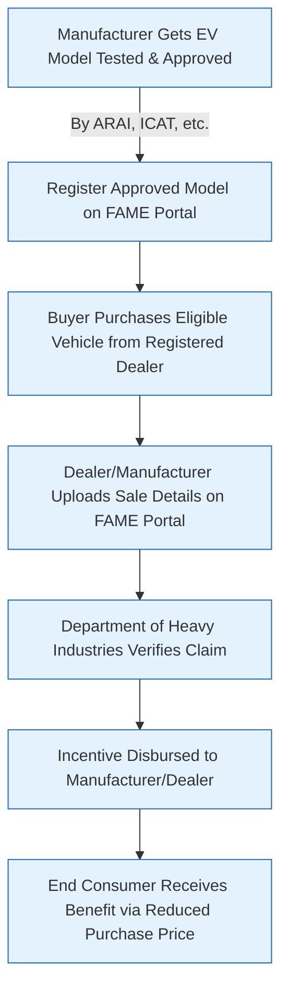

# Comprehensive Scheme Masterclass & File Guide

## Scheme Deep Dive

### Overview
FAME I & II (Faster Adoption and Manufacturing of Hybrid and Electric Vehicles) is a pan-India subsidy scheme implemented by the Department of Heavy Industries, Ministry of Heavy Industries and Public Enterprises. The scheme aims to promote faster adoption of electric and hybrid vehicles, reduce fossil fuel dependence, address vehicular emissions, support charging infrastructure development, encourage indigenous manufacturing, and establish a sustainable electric mobility ecosystem. FAME-II, the current operational phase, was launched on April 1, 2019, for an initial three-year period and has been extended multiple times, remaining operational until further notice as per government notifications. The total financial outlay is ₹10,000 crores.

### Objectives
- Promote faster adoption of electric and hybrid vehicles in India
- Reduce dependence on fossil fuels and address vehicular emissions
- Support the development of charging infrastructure across the country
- Encourage indigenous manufacturing of electric vehicles and components
- Create demand for electric vehicles through upfront incentives
- Establish a sustainable ecosystem for electric mobility

### Eligibility Matrix
Eligibility varies by vehicle segment and buyer type. The following table summarizes the key eligibility criteria based on the evidence:

| **Beneficiary Type**       | **Eligible Vehicle Types**                                                                 | **Key Requirements**                                                                                                                                                               |
|----------------------------|------------------------------------------------------------------------------------------|------------------------------------------------------------------------------------------------------------------------------------------------------------------------------------|
| Individual Buyers          | Electric two-wheelers, three-wheelers, four-wheelers (passenger cars & LCVs), buses      | Must purchase approved electric vehicles listed on the FAME portal that meet specified technical standards; Aadhaar card required for individual beneficiaries.                         |
| Institutional Buyers       | Electric two-wheelers, three-wheelers, four-wheelers, buses                              | Vehicles must be used for public transport, shared mobility, or commercial purposes; must be approved models on FAME portal.                                                         |
| Fleet Operators            | Electric two-wheelers, three-wheelers, four-wheelers, buses                              | Vehicles must be deployed for commercial or public transport use; must meet FAME technical standards and be portal-registered.                                                       |
| Manufacturers              | All electric vehicle models (two-wheelers, three-wheelers, four-wheelers, buses)         | Models must be tested and approved by designated agencies (e.g., ARAI, ICAT) and registered on the FAME portal.                                                                     |
| Service Providers          | Charging infrastructure providers                                                        | Must comply with technical guidelines and obtain site approval from concerned authorities for charging station installation.                                                           |

> **Key Caveats on Eligibility**  
> - Incentives are available only for vehicle models approved and registered on the FAME portal.  
> - The benefit is passed on to the consumer only if the vehicle is purchased from a registered dealer.  
> - Funds are subject to availability and government approvals; the scheme may be modified or withdrawn based on budgetary allocations.  
> - Charging infrastructure support is subject to technical guidelines and site approval by concerned authorities.

### Benefits & Financial Support
The scheme provides financial incentives at the point of sale to reduce the upfront cost of electric vehicles. Incentives are transferred directly to manufacturers or sellers, who pass on the benefit to end consumers by reducing the vehicle's purchase price.

#### Demand Incentive Breakdown (Per kWh)
| **Vehicle Category**       | **Incentive Rate (₹/kWh)** | **Maximum Cap per Vehicle**                                                                 | **Additional Notes**                                                                 |
|----------------------------|----------------------------|-------------------------------------------------------------------------------------------|------------------------------------------------------------------------------------|
| Two-wheelers               | ₹15,000/kWh                | Up to 40% of vehicle cost                                                                 | Highest per kWh incentive; capped at 40% of vehicle cost.                          |
| Three-wheelers             | ₹10,000/kWh                | Not explicitly capped in evidence (subject to vehicle cost and battery size)              | Applies to both passenger and goods carriers.                                      |
| Four-wheelers (Cars)       | ₹10,000/kWh                | ₹1.5 lakh                                                                                 | Applicable to electric passenger cars.                                             |
| Four-wheelers (LCVs)       | ₹10,000/kWh                | ₹1 lakh                                                                                   | Applicable to electric light commercial vehicles.                                  |
| Buses                      | ₹20,000/kWh                | Proportionally higher based on battery size (no fixed cap stated)                         | Highest per kWh rate; incentive scales with battery capacity.                      |

#### Financial Outlay Allocation (₹ in Crores)
| **Allocation Head**                     | **Amount (₹ Crores)** | **Percentage of Total Outlay** | **Purpose**                                                                 |
|-----------------------------------------|------------------------|--------------------------------|-----------------------------------------------------------------------------|
| Demand Incentives                       | 8,596                  | 85.96%                         | Support purchase of electric vehicles across all categories.                |
| Charging Infrastructure                 | 1,000                  | 10.00%                         | Subsidies for setting up public, semi-public, and private charging stations. |
| Administrative Expenses                 | 200                    | 2.00%                          | Scheme implementation and management costs.                                 |
| Publicity, Monitoring, and Evaluation   | 204                    | 2.04%                          | Awareness campaigns, scheme tracking, and impact assessment.                |
| **Total**                               | **10,000**             | **100.00%**                    |                                                                             |

> **Financial Support Notes**  
> - Total financial outlay: ₹10,000 crores (extendable beyond the initial three-year period).  
> - Incentives are paid directly to manufacturers/sellers, ensuring the benefit reaches consumers via reduced purchase price.  
> - The scheme supports both vehicle purchase incentives and charging infrastructure development.

### Application Process
The application process involves multiple stakeholders: manufacturers, dealers, buyers, and the Department of Heavy Industries. The incentive is disbursed to the manufacturer/dealer after verification, with the end consumer benefiting at the point of sale.

> **Application Process Warnings**  
> - The dealer or manufacturer must upload sale details on the FAME portal for the claim to be processed.  
> - Verification by the Department of Heavy Industries is mandatory before disbursement.  
> - End consumers do not apply directly; they benefit indirectly through lower prices at purchase.  
> - Charging infrastructure applicants must follow a separate process involving site approval and technical compliance.

### Supporting Evidence & Sources
- **Application Portal**: https://fame.gov.in/  
- **Contact Details**: Email: fame@dhi.nic.in | Phone: 011-2306-1432  
- **Last Updated**: 2024  
- **Scheme ID**: row-58  
- **Implementing Agency**: Department of Heavy Industries, Ministry of Heavy Industries and Public Enterprises  
- **Status**: Operational until further notice (as per government notifications)  
- **Confidence**: High  

---

## Consultant's Field Guide to Generated Files

### 1. SCHEME_MASTER_DATABASE.md
**Real-time Usage:** Keep this open in a background tab during all client calls. When a client asks "What is the turnover limit?" or "Who administers this?", CTRL+F in this document to give an immediate, authoritative answer without checking the portal.

### 2. PITCH_AND_SALES_SCRIPTS.md
**Real-time Usage:** Open this file 5 minutes before your first Discovery Call with a lead. Read the "Problem Framing" out loud to hook them, then use the Qualification Checklist to interrogate their eligibility live on the phone. Keep the Objection Handlers table visible so you can immediately counter when they say "We're too small for this."

### 3. APPLICATION_PLAYBOOK.md
**Real-time Usage:** Print this out or pin it to your desktop once the client signs the retainer. Check off each box in "Stage 1" before moving to "Stage 2". Use the "Client Communication Template" to copy-paste directly into your email when chasing them for pending documents.

### 4. CLIENT_ONBOARDING_AND_CRM.md
**Real-time Usage:** Fill this out during or immediately after the onboarding call. Use the Needs Assessment to record their exact pain points. Update the "Compliance Status" table as they email you documents to maintain a single source of truth for what's missing.

### 5. LIVE_CASE_TRACKER.md
**Real-time Usage:** Review this document every morning during your standup. Update the "Stage" column daily. If a case hits "Stage 07 - Under review", use the Escalation Path notes here to know exactly who to call at the government department today.

### 6. FEE_AND_REVENUE_MODEL.md
**Real-time Usage:** Use this file when drafting the proposal. Look at the client's turnover, map them to the pricing tier in the table, and quote that exact Retainer and Success Fee. Use the monthly projection table to update your personal sales pipeline forecast for the quarter.

### 7. CLIENT_PROPOSAL_TEMPLATE.md
**Real-time Usage:** Copy this entire file, paste it into an email or PDF generator, replace the [PLACEHOLDER] tags with the client's actual details gathered from the CRM, and send it immediately after a successful discovery call.

### 8. COMPLIANCE_AND_LEGAL_PACK.md
**Real-time Usage:** Attach sections 8A and 8B as PDFs to the proposal email. Refuse to start Step 1 of the Application Playbook until the client signs these. Use the Disclaimers to protect yourself legally if the client is rejected by the government agency.