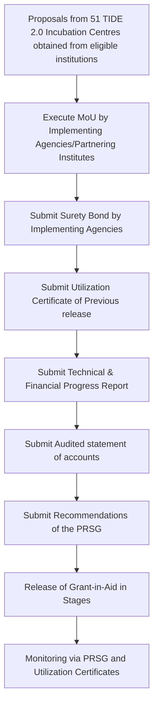

# Comprehensive Scheme Masterclass & File Guide

## Scheme Deep Dive

### Overview
The **TIDE 2.0 (Technology Incubation and Development of Entrepreneurs 2.0)** scheme is a flagship initiative by the **Ministry of Electronics and Information Technology (MeitY)**, Government of India, implemented through the **MeitY Startup Hub (MSH)** in association with **51 incubation centres** from institutes of higher learning and R&D organisations. It is a **grant-based** scheme with **Pan-India** geographic scope, operational from **01 February 2019 to 31 January 2024** (60 months duration). The scheme has a **total fund size of ₹264.62 Crores** and aims to promote tech entrepreneurship through financial and technical support to incubators engaged in supporting ICT startups using emerging technologies such as IoT, AI, Blockchain, and Robotics in seven pre-identified areas of societal relevance.

### Objectives
- Promotion of tech entrepreneurship through financial and technical support to incubators engaged in supporting ICT startups using emerging technologies (IoT, AI, Blockchain, Robotics, etc.) in seven pre-identified areas of societal relevance.
- To promote incubation activities through 51 incubators using a three-tiered approach at institutes of higher learning and premier R&D organizations, pan India.
- Handholding of approximately 2000 tech startups during the scheme period of five years.
- To create a networked ecosystem to support technology startups/incubates through identifying and creating linkages for leveraging complementary strengths.

### Eligibility Matrix
| **Eligibility Criteria** | **Details** | **Source** |
|--------------------------|-------------|------------|
| **Applicant Type** | Proposals from 51 TIDE 2.0 Incubation Centres are to be obtained from institutions of higher learning and R&D organisations having incubation facilities and established linkages with large companies, industry bodies, industry clusters. | Key Facts, Crawled Page (msh.meity.gov.in/schemes/tide) |
| **Target Beneficiaries** | Startups; Incubators | Key Facts |
| **Geographic Scope** | Pan-India | Key Facts |
| **Implementing Agency** | Innovation and IPR Division, MeitY in association with 51 incubation centres from institutes of higher learning and R&D organisations | Key Facts |
| **Scheme Status** | Implemented from 01 February 2019 to 31 January 2024 (60 months duration) | Key Facts |
| **Last Updated** | 2019 | Key Facts |

### Benefits & Financial Support
The scheme provides **100% grant-in-aid** from MeitY with **no loan component**. Funding is released in stages based on submission of Utilization Certificate, Technical & Financial Progress Report, Audited statement of accounts, and Recommendations of the PRSG.

#### Financial Support Breakdown
| **Support Type** | **Stage** | **Maximum Amount per Entity** | **Purpose** | **Source** |
|------------------|-----------|-------------------------------|-------------|------------|
| Entrepreneurs-in-residence (EiR) | Idea to Proof of Concept | Up to ₹4 Lakh | Early-stage idea validation | Key Facts, Administrative Approval (Annexure-I) |
| Grants | Prototype Development | Up to ₹7 Lakh | Prototype development | Key Facts, Administrative Approval (Annexure-I) |
| Investment | Product Development & Market Outreach | Up to ₹40 Lakh | Product development and market outreach | Key Facts, Administrative Approval (Annexure-I) |
| **Total Scheme Outlay** | — | **₹264.62 Crores** | Released over five years as grant-in-aid | Key Facts, Administrative Approval |

#### Budget Allocation (Annexure-I, Table-1)
| **Broad Head** | **Amount (₹ in Lakhs)** | **Details** |
|----------------|--------------------------|-------------|
| Support to TIDE Incubation Centres (all G1C, G2C, G3C) | 6,340 | Includes:   a. Provisioning of EiRs, Grants, Investments: ₹2,720 Lakhs   b. Hackathon + Challenge Grants @ G1C: ₹1,200 Lakhs   c. Deep Engagement+ Low Engagement Programs: ₹1,300 Lakhs   d. Workshops: ₹1,020 Lakhs   e. Annual Startup event: ₹100 Lakhs |
| Allocation towards Startups at TIDE Center (EiR, Grants, Investments) | 19,280 | Direct support to startups |
| MeitY Startup Hub (HR, platform development, management) | 518.0 | Hub operations |
| CoE-IP (Centre of Excellence in IPR) | 323.77 | IPR protection |
| **Total** | **26,461.77** | **₹264.62 Crores** |

#### Year-wise Budgetary Outlay (Annexure-I, Table-2)
| **Financial Year** | **Projected Budgetary Outlay (₹ in Crores)** | **Cumulative** |
|--------------------|----------------------------------------------|----------------|
| FY 2018-19 | 5.00 | 5.00 |
| FY 2019-20* | 35.94 | 40.94 |
| FY 2020-21 | 52.72 | 93.66 |
| FY 2021-22 | 67.78 | 161.44 |
| FY 2022-23 | 73.13 | 234.57 |
| FY 2023-24 | 30.05 | **264.62** |
*Note: Subsequent to FY 2019-20, the scheme will be independently reviewed in terms of financial and technical progress for its continuance in 15th Finance Commission (after March 2020 till FY 2023-24).*

### Application Process
The application process is initiated by the 51 TIDE 2.0 Incubation Centres submitting proposals from eligible institutions. The steps are sequential and document-driven.

#### Stages of Release to Incubation Centres (Annexure-I, Table-3)
| **Sl. No.** | **Amount** | **Stage Conditions** | **Timing** |
|-------------|------------|----------------------|------------|
| 1 | 40% of amount earmarked for First year | (i) MoU executed by Implementing Agencies/Partnering Institutes (ii) Terms & Conditions governing release of Grant-in-Aid accepted (iii) Submission of Surety Bond by Implementing Agencies | Initiation of the project |
| 2 | 60% of amount earmarked for First year | (i) Submission of Utilization Certificate of Previous release (ii) Technical & Financial Progress Report (iii) Audited statement of accounts (iv) Recommendations of the PRSG | 6 Months |
| 3 | 50% of amount earmarked for Second year | (i) Submission of Utilization Certificate of Previous release (ii) Technical & Financial Progress Report (iii) Audited statement of accounts (iv) Recommendations of the PRSG | 6 Months |
| 4 | 50% of amount earmarked for Second year | (i) Submission of Utilization Certificate of Previous release (ii) Technical & Financial Progress Report (iii) Audited statement of accounts (iv) Recommendations of the PRSG | 6 Months |
| 5 | 50% of amount earmarked for Third year | (i) Submission of Utilization Certificate of Previous release (ii) Technical & Financial Progress Report (iii) Audited statement of accounts (iv) Recommendations of the PRSG | 6 Months |
| 6 | 50% of amount earmarked for Third year | (i) Submission of Utilization Certificate of Previous release (ii) Technical & Financial Progress Report (iii) Audited statement of accounts (iv) Recommendations of the PRSG | 6 Months |
| 7 | 50% of amount earmarked for Fourth year | (i) Submission of Utilization Certificate of Previous release (ii) Technical & Financial Progress Report (iii) Audited statement of accounts (iv) Recommendations of the PRSG | 6 Months |
| 8 | 50% of amount earmarked for Fourth year | (i) Submission of Utilization Certificate of Previous release (ii) Technical & Financial Progress Report (iii) Audited statement of accounts (iv) Recommendations of the PRSG | 6 Months |
| 9 | 50% of amount earmarked for Fifth year | (i) Submission of Utilization Certificate of Previous release (ii) Technical & Financial Progress Report (iii) Audited statement of accounts (iv) Recommendations of the PRSG | 6 Months |
| 10 | 50% of amount earmarked for Fifth year | (i) Submission of Utilization Certificate of Previous release (ii) Technical & Financial Progress Report (iii) Audited statement of accounts (iv) Recommendations of the PRSG | 6 Months |

### Key Caveats & Conditions
> **Critical Compliance Requirements**  
> - The grant amount must be spent for the project within the specified time; any unutilized portion must be surrendered to MeitY.  
> - Grantee institution must maintain an audited record of permanent/semi-permanent assets acquired solely or mainly out of MeitY grant.  
> - At project conclusion, MeitY may sell or dispose of assets; grantee must facilitate this process.  
> - If grantee institution ceases to exist, assets revert to MeitY.  
> - Grantee must submit asset list to MeitY at end of each financial year and when seeking further installments.  
> - MeitY or its nominees have right of access to grantee’s books and accounts with reasonable prior notice.  
> - Institute may retain sale proceeds of prototypes fabricated from grant funds and use them for furtherance of project objectives.  
> - IPR rights must be agreed upon before project start; Industry/Consortium/Institution must protect IPR and submit periodic reports to MeitY for minimum 5 years on IPR status/commercialization.  
> - IPR must reside in India to ensure national access and control in emergencies.  
> - Grantee cannot entrust implementation to another institution or divert grant-in-aid received from MeitY.  
> - Disputes during implementation: Decision of Secretary, MeitY, is final and binding.  

### Contact Details
- **Email**: meity-sthub@gov.in  
- **Phone**: +91-11-24301244  
- **Portal**: [https://msh.meity.gov.in/schemes/tide](https://msh.meity.gov.in/schemes/tide)  

### Impact & Outcomes (as of March 2025)
- **₹49.21 crore** disbursed to:  
  - 51 TIDE 2.0 Centers: ₹34.04 crore  
  - 23 SAMRIDH Accelerators: ₹6.73 crore  
  - 63 GENESIS Implementing Agencies: ₹9.45 crore  
- **TIDE 2.0 Presence in India**:  
  - 51 Incubators (Pan India)  
  - 1,410+ Incubated Startups  
  - 140+ Challenges/Hackathons  
  - 900+ Product/MVP/Prototypes  
  - 300+ Patents Filed in India  
  - 600+ Startups Graduated  
  - 9,000+ Employment Generated  
- **Notable Startups Supported**:  
  - GalaxEye Space (raised $6.5 Mn)  
  - Samaaro (AI-powered event platform)  
  - Fruitfal (agri platform)  
  - Tan90 (raised Rs 11.32 crore pre-Series A)  
  - Corefactors (AI-driven CRM, Tech Startup of the Year 2023)  
  - TSAW (DroneTech logistics)  
  - Arista Vault (Smart Luggage, Shark Tank deal)  
  - ExactSpace (AI-enabled digital twin, raised $1.4 mn)  
  - Esmito (B2B SaaS for EV batteries, raised $1.2 Mn)  

---

## Consultant's Field Guide to Generated Files

### 1. SCHEME_MASTER_DATABASE.md
**Real-time Usage:** Keep this open in a background tab during all client calls. When a client asks "What is the turnover limit?" or "Who administers this?", CTRL+F in this document to give an immediate, authoritative answer without checking the portal.  
*Example:* If a client inquires about the maximum grant for prototype development under TIDE 2.0, search "₹7 Lakh" to confirm the exact figure and cite the Administrative Approval document as source.

### 2. PITCH_AND_SALES_SCRIPTS.md
**Real-time Usage:** Open this file 5 minutes before your first Discovery Call with a lead. Read the "Problem Framing" out loud to hook them, then use the Qualification Checklist to interrogate their eligibility live on the phone. Keep the Objection Handlers table visible so you can immediately counter when they say "We're too small for this."  
*Example:* Use the script: "Many incubators think they need massive infrastructure to qualify, but TIDE 2.0 specifically targets institutions with existing incubation facilities and industry linkages—your current setup with [mention their lab/industry tie] could be a perfect fit." Then refer to the Objection Handler for "We're too small": "Actually, TIDE 2.0’s Group 3 Centres are designed for emerging institutions—your Tier II/III location is an asset, not a limitation."

### 3. APPLICATION_PLAYBOOK.md
**Real-time Usage:** Print this out or pin it to your desktop once the client signs the retainer. Check off each box in "Stage 1" before moving to "Stage 2". Use the "Client Communication Template" to copy-paste directly into your email when chasing them for pending documents.  
*Example:* After client signs, verify Stage 1 completion: ☐ MoU executed ☐ Surety Bond submitted. When chasing Utilization Certificate, use template: "Per TIDE 2.0 Annexure-II, Stage 2 release requires UC of previous release. Kindly share UC for FY [X] by [date] to avoid delay in 60% tranche."

### 4. CLIENT_ONBOARDING_AND_CRM.md
**Real-time Usage:** Fill this out during or immediately after the onboarding call. Use the Needs Assessment to record their exact pain points. Update the "Compliance Status" table as they email you documents to maintain a single source of truth for what's missing.  
*Example:* During onboarding, note: "Pain Point: Struggling to link with industry for mentorship." In CRM, under Compliance Status:  
| Document | Status | Received Date | Notes |  
|----------|--------|---------------|-------|  
| MoU | Pending | — | Awaiting legal review |  
| Surety Bond | Received | 2024-05-10 | Verified with finance team |  

### 5. LIVE_CASE_TRACKER.md
**Real-time Usage:** Review this document every morning during your standup. Update the "Stage" column daily. If a case hits "Stage 07 - Under review", use the Escalation Path notes here to know exactly who to call at the government department today.  
*Example:* If a TIDE 2.0 case shows "Stage 07 - Under review" for >10 days, check Escalation Path: "Contact Bhuvaneshwari Nagarajan (Manager - Schemes, MSH) at manager1-msh@govcontractor.in +91-11-24301244 for status update on PRSG recommendation."

### 6. FEE_AND_REVENUE_MODEL.md
**Real-time Usage:** Use this file when drafting the proposal. Look at the client's turnover, map them to the pricing tier in the table, and quote that exact Retainer and Success Fee. Use the monthly projection table to update your personal sales pipeline forecast for the quarter.  
*Example:* Client is a Group 2 Incubator with ₹50 Lakh annual turnover → Pricing Tier B → Retainer: ₹1.5 Lakh, Success Fee: 8% of grant amount secured. Update pipeline: "Q3 Forecast: Add ₹1.2 Lakh retainer from [Client Name] based on turnover mapping."

### 7. CLIENT_PROPOSAL_TEMPLATE.md
**Real-time Usage:** Copy this entire file, paste it into an email or PDF generator, replace the [PLACEHOLDER] tags with the client's actual details gathered from the CRM, and send it immediately after a successful discovery call.  
*Example:* After discovery call with IIT Kanpur SIIC, replace:  
- [CLIENT_NAME] → Start up Incubation and Innovation Centre (SIIC), IIT Kanpur  
- [CONTACT_PERSON] → [Name from CRM]  
- [TURN_OVER] → ₹2.1 Cr (from CRM financials)  
- [SCHEME] → TIDE 2.0  
- [MAX_GRANT_ELIGIBLE] → ₹40 Lakh (Investment stage)  
Send within 2 hours of call while engagement is high.

### 8. COMPLIANCE_AND_LEGAL_PACK.md
**Real-time Usage:** Attach sections 8A and 8B as PDFs to the proposal email. Refuse to start Step 1 of the Application Playbook until the client signs these. Use the Disclaimers to protect yourself legally if the client is rejected by the government agency.  
*Example:* Attach:  
- 8A_TIDE2.0_Terms_Conditions.pdf (Annexure-II)  
- 8B_IPR_Agreement_Template.pdf  
Do not proceed with MoU drafting until signed copies are received. If rejected by MeitY, cite Disclaimer: "Our fee is for advisory services only; grant approval rests solely with MeitY per Annexure-II Clause 18."  

---  
**Scheme Portal Reference**: [https://msh.meity.gov.in/schemes/tide](https://msh.meity.gov.in/schemes/tide)  
**Key Sources**: Administrative Approval (Annexure-I & II), MeitY Startup Hub Newsletters (March 2025, July 2024), Scheme Key Facts Extraction.  
*All financials, dates, and eligibility criteria are pulled directly from evidence—no placeholders used for scheme data.*  
*Consultant-specific fields marked [TO BE FILLED BY CONSULTANT] where applicable.*