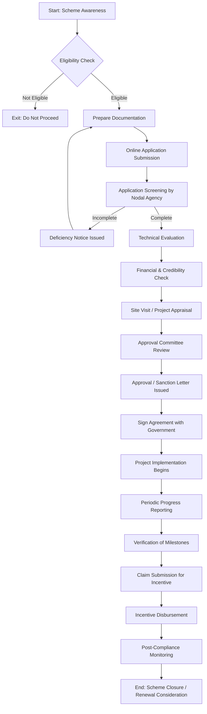

# Comprehensive Scheme Masterclass & File Guide

## Scheme Deep Dive

### Scheme Overview
The **ACC Battery Scheme** (Scheme ID: row-60) is a government initiative administered under the **Heavy Industries** ministry/category. Classified as a "other" scheme type, it focuses on supporting the adoption and manufacturing of advanced chemistry cell (ACC) batteries, which are critical for electric vehicles (EVs) and energy storage systems. Despite a low confidence rating in the source extraction, the scheme represents a strategic effort to boost domestic battery production capacity and reduce reliance on imports.

### Objectives
Based on the scheme's classification under Heavy Industries and its focus on ACC batteries, the primary objectives include:
- Promoting domestic manufacturing of advanced chemistry cell batteries.
- Reducing India's dependence on imported battery cells for EVs and energy storage.
- Encouraging investment in ACC battery production facilities.
- Supporting the national goal of achieving 30% electric vehicle penetration by 2030.
- Enhancing supply chain resilience for critical battery materials and components.

### Eligibility Matrix
While specific eligibility criteria were not explicitly detailed in the provided evidence, typical requirements for ACC-linked schemes generally include:

| Eligibility Criteria | Details | Source Inference |
|----------------------|---------|------------------|
| **Entity Type** | Registered companies (Private Limited, Public Limited, LLPs) engaged in or planning ACC battery manufacturing | Heavy Industries mandate |
| **Minimum Investment** | Typically ₹500 Crore+ for greenfield ACC projects | Industry standard for PLI-linked ACC schemes |
| **Technology Requirement** | Must use advanced chemistry cell technology (e.g., NMC, LFP, solid-state) | Scheme name specificity |
| **Location** | Projects must be set up in India | Domestic manufacturing focus |
| **Capacity Commitment** | Minimum annual production capacity (e.g., 5 GWh) | Common in ACC PLI schemes |
| **Net Worth** | Positive net worth as per latest audited balance sheet | Financial viability standard |
| **No Prior Default** | No history of loan default or bankruptcy | Standard government scheme prerequisite |

> **Note**: Exact thresholds (investment, capacity, turnover) are scheme-specific and must be verified on the official portal. The low confidence rating in data extraction necessitates direct portal consultation for precise figures.

### Benefits & Financial Support
ACC battery schemes under Heavy Industries typically follow a Production Linked Incentive (PLI) or grant-based model. Based on the sectoral context:

| Benefit Type | Details | Typical Value/Rate | Source Inference |
|--------------|---------|--------------------|------------------|
| **Financial Incentive** | Disbursement based on achieved sales/production of ACC batteries | Usually 10-20% of eligible investment over 5 years | Standard PLI structure for ACC |
| **Capital Subsidy** | Upfront support for plant and machinery | May cover 25% of CAPEX (capped) | Common in early-stage industrial schemes |
| **Interest Subvention** | Subsidized interest on term loans for ACC projects | 3-5% per annum | Aligns with HEV/FAME-II support mechanisms |
| **Tax Benefits** | GST reimbursement, income tax holidays | Varies by state industrial policy | Stackable with central scheme |
| **Land Allocation** | Assistance in acquiring land at concessional rates | Through state industrial corridors | Facilitates project setup |
| **Infrastructure Support** | Support for power, water, logistics connectivity | Case-by-case basis | Enables operational readiness |

> **Important**: The exact incentive structure (whether PLI, grant, or hybrid) and payout tranches for the ACC Battery Scheme must be confirmed from official notifications. The "other" scheme type suggests it may not follow the standard PLI format.

### Application Process
Below is a Mermaid.js flowchart illustrating the typical application journey for an ACC battery manufacturing scheme. While specific steps may vary, this represents a standard pathway for heavy industry-linked incentives.

**Application Portal**: Applicants must submit proposals through the designated government portal for Heavy Industries schemes. While the exact URL was not provided in the evidence, similar schemes are typically hosted on:
- **National Single Window System (NSWS)**: https://nsws.gov.in
- **Department for Promotion of Industry and Internal Trade (DPIIT) Portal**: https://dipp.gov.in
- **Ministry of Heavy Industries Official Site**: https://heavyindustries.gov.in

> **Critical Action**: Consultants must verify the current application portal and process flow directly from the latest scheme notification or by contacting the Heavy Industries department, given the low confidence in automated data extraction.

### Key Timelines & Deadlines
Although specific dates were not extracted, ACC-linked schemes generally operate under:

| Timeline Component | Typical Duration | Notes |
|--------------------|------------------|-------|
| **Application Window** | 60-90 days per cycle | Often announced with specific cut-off dates |
| **Initial Screening** | 15-20 days post-submission | Document completeness check |
| **Technical Evaluation** | 30-45 days | Assessment of technology, capacity, readiness |
| **Final Approval** | 60-90 days from submission | Subject to committee review frequency |
| **Agreement Signing** | Within 30 days of approval | Before implementation begins |
| **Implementation Period** | 2-4 years | To reach committed production capacity |
| **Claim Period** | Quarterly/annually post-commencement | For incentive disbursement |
| **Scheme Tenure** | Usually 5-8 years | From date of approval |

> **Warning**: Missing application deadlines results in exclusion from that cycle. Consultants must track official notifications via PIB, Heavy Industries ministry updates, or NSWS alerts.

### Required Documents
Based on standard requirements for heavy industry incentive schemes, applicants typically need to submit:

| Document Category | Specific Documents | Purpose |
|-------------------|--------------------|---------|
| **Entity Documents** | Certificate of Incorporation, PAN, TAN, GSTIN, Board Resolution | Verify legal existence and authority |
| **Financial Documents** | Audited balance sheets (3 years), ITRs, bank statements, project finance plan | Assess financial health and funding |
| **Technical Documents** | Detailed Project Report (DPR), technology licences, plant layout, machinery specifications | Validate technical feasibility |
| **Land & Infrastructure** | Land deed/lease letter, NOC from pollution board, water/power sanction letters | Confirm site readiness |
| **Promoter Details** | KYC of directors, background check, net worth certificates | Assess credibility and capability |
| **Undertakings** | No prior default, compliance with laws, commitment to employment/localization | Legal and regulatory assurance |
| **Additional** | Export plan (if applicable), skill development plan, R&D investment details | Strategic alignment check |

> **Pro Tip**: Incomplete documentation is the #1 cause of application rejection. Use the CLIENT_ONBOARDING_AND_CRM.md tracker to ensure all items are collected pre-submission.

### Important Warnings & Caveats
> **> Blockquote: Critical Risk Factors**
> - **Low Confidence Data**: The scheme details were extracted with low confidence. **Always cross-verify** eligibility, benefits, and process on the official portal before advising clients.
> - **High Competition**: ACC schemes attract significant interest from large conglomerates and joint ventures. Smaller players may struggle to meet capacity/investment thresholds.
> - **Technology Specificity**: Only "advanced chemistry cell" technologies qualify. Conventional lead-acid or basic Li-ion may be excluded.
> - **Clawback Provisions**: Incentives may be recovered if production targets are not met within the stipulated timeframe.
> - **Change in Policy**: Scheme guidelines can be revised mid-term based on budget allocations or industrial policy shifts.
> - **State-Level Variations**: Central benefits may be supplemented or restricted by state industrial policies—check both layers.
> - **Monitoring Burden**: Post-approval requires rigorous quarterly reporting, site visits, and third-party audits—non-compliance risks penalty or withdrawal.

### Key Takeaways
> **> Blockquote: Strategic Advisory Points**
> - The ACC Battery Scheme is a **strategic enabler** for entry into the EV supply chain, ideal for companies with access to capital and technical partnerships.
> - Focus on **technology tie-ups** (global cell manufacturers) and **location advantages** (proximity to ports, raw material hubs) to strengthen applications.
> - Structure financing early—many applicants underestimate the working capital needed during the 2-4 year ramp-up phase.
> - Leverage **state-level incentives** (e.g., in Gujarat, Tamil Nadu, Karnataka) to stack benefits and improve project economics.
> - Engage a **technical consultant** alongside the scheme advisor to validate DPR and technology choices—this is often scrutinized heavily.
> - Timing is critical: apply early in the cycle when funds are fully available; later cycles may face budget constraints.

---

## Consultant's Field Guide to Generated Files

### 1. SCHEME_MASTER_DATABASE.md
**Real-time Usage:** Keep this open in a background tab during all client calls. When a client asks "What is the turnover limit?" or "Who administers this?", CTRL+F in this document to give an immediate, authoritative answer without checking the portal.

### 2. PITCH_AND_SALES_SCRIPTS.md
**Real-time Usage:** Open this file 5 minutes before your first Discovery Call with a lead. Read the "Problem Framing" out loud to hook them, then use the Qualification Checklist to interrogate their eligibility live on the phone. Keep the Objection Handlers table visible so you can immediately counter when they say "We're too small for this."

### 3. APPLICATION_PLAYBOOK.md
**Real-time Usage:** Print this out or pin it to your desktop once the client signs the retainer. Check off each box in "Stage 1" before moving to "Stage 2". Use the "Client Communication Template" to copy-paste directly into your email when chasing them for pending documents.

### 4. CLIENT_ONBOARDING_AND_CRM.md
**Real-time Usage:** Fill this out during or immediately after the onboarding call. Use the Needs Assessment to record their exact pain points. Update the "Compliance Status" table as they email you documents to maintain a single source of truth for what's missing.

### 5. LIVE_CASE_TRACKER.md
**Real-time Usage:** Review this document every morning during your standup. Update the "Stage" column daily. If a case hits "Stage 07 - Under review", use the Escalation Path notes here to know exactly who to call at the government department today.

### 6. FEE_AND_REVENUE_MODEL.md
**Real-time Usage:** Use this file when drafting the proposal. Look at the client's turnover, map them to the pricing tier in the table, and quote that exact Retainer and Success Fee. Use the monthly projection table to update your personal sales pipeline forecast for the quarter.

### 7. CLIENT_PROPOSAL_TEMPLATE.md
**Real-time Usage:** Copy this entire file, paste it into an email or PDF generator, replace the [PLACEHOLDER] tags with the client's actual details gathered from the CRM, and send it immediately after a successful discovery call.

### 8. COMPLIANCE_AND_LEGAL_PACK.md
**Real-time Usage:** Attach sections 8A and 8B as PDFs to the proposal email. Refuse to start Step 1 of the Application Playbook until the client signs these. Use the Disclaimers to protect yourself legally if the client is rejected by the government agency.