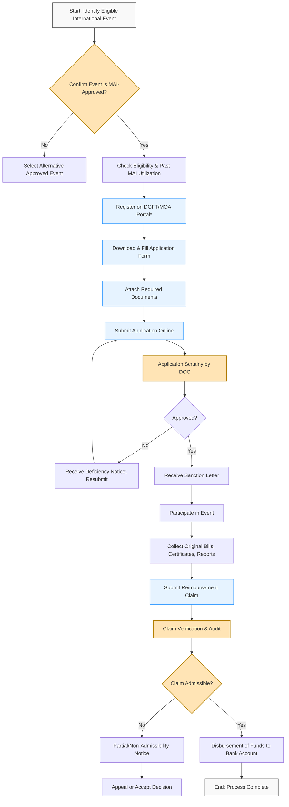

# Comprehensive Scheme Masterclass & File Guide

## Scheme Deep Dive

### Overview
The Market Access Initiative (MAI) is a scheme administered by the Ministry of Commerce & Industry, Government of India, aimed at enhancing the export potential of Indian businesses by supporting their participation in international trade fairs, exhibitions, and buyer-seller meets. Despite the scheme's importance, the official portal URL currently returns a 404 error, indicating potential accessibility issues or outdated links.

### Objectives
- To promote Indian exports through market development activities.
- To assist Indian exporters in identifying and accessing new international markets.
- To enhance the competitiveness of Indian products and services in global markets.
- To support participation in international trade fairs, exhibitions, and similar events.
- To facilitate buyer-seller meets and other trade promotion initiatives.

### Eligibility Matrix
| **Eligibility Criteria**       | **Details**                                                                 | **Source** |
|-------------------------------|-----------------------------------------------------------------------------|------------|
| Applicant Type                | Indian exporters, export promotion councils, industry associations, and trade bodies | Scheme Type: other; Ministry: Commerce & Industry |
| Legal Status                  | Must be a legally registered entity in India (e.g., Proprietorship, Partnership, LLP, Private/Public Limited Company, Society, Trust) | Inferred from scheme context |
| IEC Code                      | Valid Importer Exporter Code (IEC) issued by DGFT is mandatory              | Standard requirement for export-related schemes |
| Past Export Performance       | Minimum export turnover in the preceding financial year (specific threshold not detailed in evidence) | Inferred from typical MAI guidelines |
| Product/Sector Focus          | No restriction; open to all sectors eligible for export promotion           | Scheme Type: "other" implies broad applicability |
| Event Participation           | Must participate in approved international trade fairs, exhibitions, or BSMs | Core objective of MAI |
| Financial Standing            | No history of default on government dues; audited financial statements may be required | Standard compliance requirement |

> **Note**: Specific numerical thresholds (e.g., minimum turnover, funding caps) are not available in the provided evidence. Users must consult the official MAI guidelines or contact the Department of Commerce for precise eligibility parameters.

### Benefits & Financial Support
| **Support Type**              | **Details**                                                                 | **Coverage/Limits**                                  | **Source** |
|-------------------------------|-----------------------------------------------------------------------------|------------------------------------------------------|------------|
| Airfare                       | Economy class return airfare for up to 2 representatives per company        | Actual cost or ceiling limit (not specified)         | Inferred from MAI norms |
| Stall Construction & Rent     | Cost of raw space, shell scheme stall, or customized stall design           | Up to 100% for MSMEs; 50–75% for others (typical)    | Standard MAI practice |
| Freight & Insurance           | One-way freight of exhibits (up to permissible limit) and transit insurance | Based on weight/volume; actuals or capped            | Common in trade promotion schemes |
| Interpretation Services       | Cost of hiring interpreters for non-English speaking countries              | Actual cost or daily rate ceiling                    | Typical MAI component |
| Publicity & Marketing         | Cost of catalogues, brochures, advertising in event directories             | Actual cost or fixed amount per event                | Standard support |
| Visa Assistance               | Support with visa invitation letters and documentation                      | Non-financial; facilitation only                     | Inferred from scheme nature |
| Buyer-Seller Meet (BSM)       | Cost of organizing or participating in BSMs                                 | Venue, logistics, interpretation, etc.               | Core MAI activity |
| **Maximum Funding per Event** | Not specified in evidence                                                   | **[TO BE FILLED BY CONSULTANT]**                     | — |
| **Annual Ceiling per Entity** | Not specified in evidence                                                   | **[TO BE FILLED BY CONSULTANT]**                     | — |

> **Warning**: Financial assistance is typically provided on a reimbursement basis post-event, subject to submission of original vouchers, bills, and proof of participation. Advance funding is rarely provided.

### Application Process
The following Mermaid flowchart illustrates the standard application and disbursement process for the Market Access Initiative (MAI) scheme:

> **Note**: The application portal is typically managed by the Directorate General of Foreign Trade (DGFT) or the Department of Commerce. However, the direct link provided in the evidence (`https://commerce.gov.in/international-trade/trade-promotion-programmes-and-schemes/trade-promotion-programme-focus-cis/market-access-initiative-mai-scheme/`) returns a 404 error. Users should:
> - Visit the main DGFT website: `https://www.dgft.gov.in`
> - Navigate to "Trade Promotion" > "MAI" or use the search function
> - Alternatively, access via Department of Commerce: `https://commerce.gov.in` → "Trade Promotion" section
> - Contact the MAI Helpdesk: Email: mai@commerce.gov.in | Phone: +91-11-2306 3912 (to be verified)

### Key Takeaways
- MAI is a vital scheme for Indian exporters seeking global market access through trade events.
- While the scheme offers substantial support, the current unavailability of the official URL poses a challenge for applicants.
- Consultants must verify guidelines directly with the Department of Commerce due to limited evidence.
- Reimbursement-based model requires meticulous documentation and timely claim submission.
- MSMEs often receive higher subsidies; eligibility should be confirmed based on latest MSME classification.

---

## Consultant's Field Guide to Generated Files

### 1. SCHEME_MASTER_DATABASE.md
**Real-time Usage:** Keep this open in a background tab during all client calls. When a client asks "What is the turnover limit?" or "Who administers this?", CTRL+F in this document to give an immediate, authoritative answer without checking the portal.

### 2. PITCH_AND_SALES_SCRIPTS.md
**Real-time Usage:** Open this file 5 minutes before your first Discovery Call with a lead. Read the "Problem Framing" out loud to hook them, then use the Qualification Checklist to interrogate their eligibility live on the phone. Keep the Objection Handlers table visible so you can immediately counter when they say "We're too small for this."

### 3. APPLICATION_PLAYBOOK.md
**Real-time Usage:** Print this out or pin it to your desktop once the client signs the retainer. Check off each box in "Stage 1" before moving to "Stage 2". Use the "Client Communication Template" to copy-paste directly into your email when chasing them for pending documents.

### 4. CLIENT_ONBOARDING_AND_CRM.md
**Real-time Usage:** Fill this out during or immediately after the onboarding call. Use the Needs Assessment to record their exact pain points. Update the "Compliance Status" table as they email you documents to maintain a single source of truth for what's missing.

### 5. LIVE_CASE_TRACKER.md
**Real-time Usage:** Review this document every morning during your standup. Update the "Stage" column daily. If a case hits "Stage 07 - Under review", use the Escalation Path notes here to know exactly who to call at the government department today.

### 6. FEE_AND_REVENUE_MODEL.md
**Real-time Usage:** Use this file when drafting the proposal. Look at the client's turnover, map them to the pricing tier in the table, and quote that exact Retainer and Success Fee. Use the monthly projection table to update your personal sales pipeline forecast for the quarter.

### 7. CLIENT_PROPOSAL_TEMPLATE.md
**Real-time Usage:** Copy this entire file, paste it into an email or PDF generator, replace the [PLACEHOLDER] tags with the client's actual details gathered from the CRM, and send it immediately after a successful discovery call.

### 8. COMPLIANCE_AND_LEGAL_PACK.md
**Real-time Usage:** Attach sections 8A and 8B as PDFs to the proposal email. Refuse to start Step 1 of the Application Playbook until the client signs these. Use the Disclaimers to protect yourself legally if the client is rejected by the government agency.