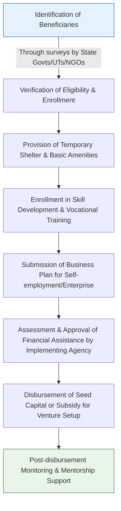

# Comprehensive Scheme Masterclass & File Guide

## Scheme Deep Dive

### Scheme Overview
The **SMILE Scheme** (Support for Marginalized Individuals for Livelihood and Enterprise) is a **subsidy**-type initiative launched by the **Ministry of Social Justice and Empowerment, Government of India**. It operates on a **Pan-India** geographic scope and is currently active with a **rolling basis** status — identification and enrollment are ongoing through periodic surveys conducted by State Governments/UT Administrations or implementing agencies.

### Objectives
The scheme aims to achieve the following objectives:
- Provide rehabilitation and livelihood support to transgender persons and persons engaged in begging
- Establish shelter homes with basic facilities for target beneficiaries
- Offer skill development and vocational training for sustainable livelihoods
- Facilitate access to medical care, counselling, and legal aid
- Promote self-employment and enterprise development through financial assistance and subsidies
- Ensure social inclusion and protection of rights of marginalized communities
- Strengthen outreach and identification of beneficiaries through surveys and surveys
- Monitor and evaluate the implementation of the scheme for effective delivery

### Eligibility Matrix
| Eligibility Criteria | Details | Source |
|----------------------|---------|--------|
| Target Beneficiaries | Transgender persons; persons engaged in begging; marginalized individuals; SC/ST; OBC | Key Facts |
| Citizenship Requirement | Must be Indian citizens | Key Facts |
| Identification Mechanism | Identified through surveys conducted by State Governments/UT Administrations or implementing agencies | Key Facts |
| Income Ceiling | No income ceiling specified; priority given to those living in extreme poverty or without sustainable livelihood | Key Facts |
| Exclusions | Duplicate benefits from other Central or State schemes for the same purpose are not permitted | Key Facts |

### Benefits & Financial Support
| Benefit Category | Specific Benefits | Disbursement Mechanism | Source |
|------------------|-------------------|------------------------|--------|
| Financial Assistance | One-time financial assistance for income-generating activities; seed capital and margin money for entrepreneurial activities | Disbursed through implementing agencies after verification of business plans and training completion | Key Facts |
| Shelter & Basic Amenities | Access to shelter homes with food and sanitation facilities | Provided during verification and enrollment phase | Key Facts |
| Skill Development | Enrollment in skill development and vocational training programs | Part of the application process post-identification | Key Facts |
| Health & Wellness | Medical health cards; counselling services | Provided as part of rehabilitation support | Key Facts |
| Legal & Educational Support | Legal aid for identity documentation; support for education and scholarships | Extended to beneficiaries post-enrollment | Key Facts |

> **Important Notes on Financial Support:**
> - The scheme does **not** provide recurring monthly stipends; support is primarily for initial setup and rehabilitation.
> - Financial assistance is subject to availability of funds and State-level allocation.
> - Benefits are contingent upon successful completion of skill training and submission of viable business plans.

### Application Process Flowchart

### Key Caveats
> - Financial assistance is subject to availability of funds and State-level allocation  
> - Benefits are contingent upon successful completion of skill training and submission of viable business plans  
> - Duplicate benefits from other Central or State schemes for the same purpose are not permitted  
> - The scheme does not provide recurring monthly stipends; support is primarily for initial setup and rehabilitation  

### Application Portal & Sources
- **Application Process Managed By**: Ministry of Social Justice and Empowerment, Government of India  
- **Implementation Mechanism**: Surveys by State Governments/UT Administrations or implementing agencies  
- **Evidence Source**: Structured Key Facts (Scheme ID: row-67) under Ministry of Social Justice & Empowerment  

---

## Consultant's Field Guide to Generated Files

### 1. SCHEME_MASTER_DATABASE.md
**Real-time Usage:** Keep this open in a background tab during all client calls. When a client asks "What is the turnover limit?" or "Who administers this?", CTRL+F in this document to give an immediate, authoritative answer without checking the portal.

### 2. PITCH_AND_SALES_SCRIPTS.md
**Real-time Usage:** Open this file 5 minutes before your first Discovery Call with a lead. Read the "Problem Framing" out loud to hook them, then use the Qualification Checklist to interrogate their eligibility live on the phone. Keep the Objection Handlers table visible so you can immediately counter when they say "We're too small for this."

### 3. APPLICATION_PLAYBOOK.md
**Real-time Usage:** Print this out or pin it to your desktop once the client signs the retainer. Check off each box in "Stage 1" before moving to "Stage 2". Use the "Client Communication Template" to copy-paste directly into your email when chasing them for pending documents.

### 4. CLIENT_ONBOARDING_AND_CRM.md
**Real-time Usage:** Fill this out during or immediately after the onboarding call. Use the Needs Assessment to record their exact pain points. Update the "Compliance Status" table as they email you documents to maintain a single source of truth for what's missing.

### 5. LIVE_CASE_TRACKER.md
**Real-time Usage:** Review this document every morning during your standup. Update the "Stage" column daily. If a case hits "Stage 07 - Under review", use the Escalation Path notes here to know exactly who to call at the government department today.

### 6. FEE_AND_REVENUE_MODEL.md
**Real-time Usage:** Use this file when drafting the proposal. Look at the client's turnover, map them to the pricing tier in the table, and quote that exact Retainer and Success Fee. Use the monthly projection table to update your personal sales pipeline forecast for the quarter.

### 7. CLIENT_PROPOSAL_TEMPLATE.md
**Real-time Usage:** Copy this entire file, paste it into an email or PDF generator, replace the [PLACEHOLDER] tags with the client's actual details gathered from the CRM, and send it immediately after a successful discovery call.

### 8. COMPLIANCE_AND_LEGAL_PACK.md
**Real-time Usage:** Attach sections 8A and 8B as PDFs to the proposal email. Refuse to start Step 1 of the Application Playbook until the client signs these. Use the Disclaimers to protect yourself legally if the client is rejected by the government agency.