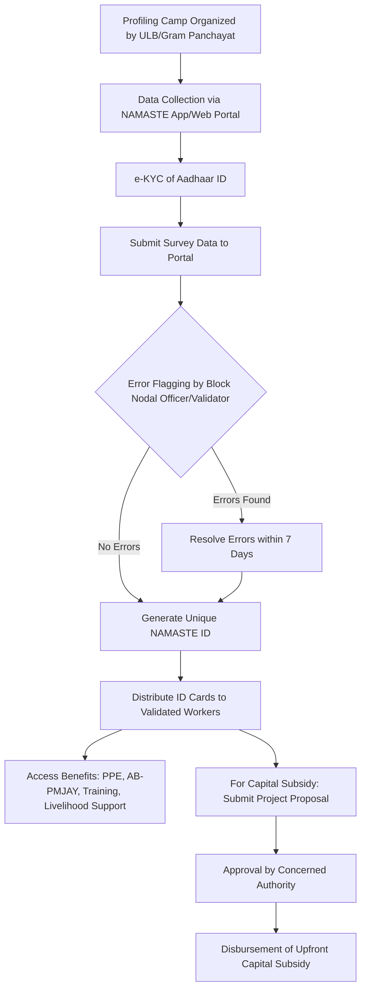

# Comprehensive Scheme Masterclass & File Guide

## Scheme Deep Dive

### Overview
The **National Action for Mechanized Sanitation Ecosystem (NAMASTE)** is a Central Sector Scheme jointly implemented by the Ministry of Social Justice & Empowerment (MoSJE), Ministry of Housing and Urban Affairs (MoHUA), Ministry of Panchayati Raj (MoPR), and the Department of Drinking Water and Sanitation (DDWS), with the National Safai Karamcharis Finance & Development Corporation (NSKFDC) as the implementing agency. The scheme aims to ensure the safety, dignity, and social security of sanitation workers through mechanization, occupational safety training, access to welfare schemes, and livelihood support. It targets Sewer and Septic Tank Workers (SSWs), Manual Scavengers, and Waste Pickers across urban and rural India.

**Application Portal:** https://namastescheme.com/  
**Status / Deadlines:** Rolling basis — profiling drives conducted in phases; continuous data updates post-verification (database to be updated annually)  
**Last Updated:** 2026  
**Geographic Scope:** Pan-India  
**Implementing Agency:** National Safai Karamcharis Finance & Development Corporation (NSKFDC)  
**Scheme Type:** Subsidy  
**Ministry / Category:** Sanitation & Labor Welfare  

---

### Objectives
The scheme’s objectives are explicitly defined in the evidence and include:

- Ensure safety and dignity of sanitation workers in urban India and enhance their occupational safety through capacity building and improved access to PPE kits, safety devices, and machines  
- Bring about a behavior change amongst citizens towards sanitation workers and enhance demand for safe sanitation services  
- Include waste pickers in the solid waste management process by ensuring their safety and dignity  
- Eliminate fatalities in sanitation work  
- Formalize and skill sanitation workers  
- Eliminate direct contact with human faecal matter  
- Establish, strengthen, and capacitate Emergency Response Sanitation Units (ERSUs)  
- Empower sanitation workers through self-help groups and entrepreneurship, access to alternate livelihood options, and occupational safety training  

> **Key Takeaway:** NAMASTE is not merely a financial subsidy scheme—it is a holistic ecosystem intervention combining safety, dignity, livelihood, and systemic reform for India’s most vulnerable sanitation workforce.

---

### Eligibility Matrix
Eligibility criteria are defined for two primary beneficiary groups: **Sewer and Septic Tank Workers (SSWs)** and **Waste Pickers**. The scheme does not impose income limits but prioritizes vulnerable groups.

| **Beneficiary Category** | **Eligibility Criteria** | **Source** |
|--------------------------|--------------------------|------------|
| **Sewer and Septic Tank Workers (SSWs)** | Sanitation workers engaged in cleaning and maintenance of sewers (including pumping stations, manholes/machine holes, sewer lines) and septic tank cleaning. May or may not be engaged by ULB/parastatal, empanelled/registered/licensed Private Sanitation Service Organisation (PSSO), or other private sanitation service providers. | Key Facts, FAQs, Knowledge Management |
| **Manual Scavengers** | Persons engaged in manually cleaning, carrying, disposing of, or handling human excreta in insanitary latrines, open drains, pits, or railway tracks (as per Manual Scavengers Act, 2013). No certificate required if name appears in final list prepared by State/UT Governments. | Key Facts, Knowledge Management |
| **Waste Pickers** | Persons or groups informally engaged in collection and recovery of reusable and recyclable solid waste from source (streets, bins, material recovery facilities, processing, waste disposal facilities) for sale to recyclers. Includes: - Informal Waste Pickers working at streets, door-to-door, transfer stations, open dumpsites, landfill sites, waste disposal sites, material recovery facilities, waste recovery & recycling, repair facilities, itinerant waste buyers - Informal Waste Sorters at waste processing/recycling facilities - Informal workers/sorters engaged in this activity for a minimum period of 6 months | Key Facts, Knowledge Management, Waste Picker Guidelines |
| **Target Group (General)** | Safai Karamcharis (including Wastepickers), Manual Scavengers, and their dependents constitute the target group for NSKFDC’s loan and non-loan based schemes. | Lending Policies and Guidelines (LPG) |

> **Note:** There is **no income limit** for availing financial assistance under NSKFDC schemes. However, priority is accorded to: (i) Manual Scavengers with income below double the poverty line, (ii) Women from the target group, and (iii) Disabled persons among the target group.

---

### Benefits & Financial Support
NAMASTE provides a comprehensive package of direct benefits, subsidies, and linked schemes. Financial support includes upfront capital subsidies, access to concessional loans, and non-financial benefits like PPE, health insurance, and training.

#### Financial Support Details
| **Benefit Type** | **Details** | **Maximum Amount / Rate** | **Source** |
|------------------|-------------|----------------------------|------------|
| **Upfront Capital Subsidy to SSWs (Individual Projects)** | For procurement of sanitation-related equipment | 50% of project cost, maximum Rs. 10.00 lakh per unit | Key Facts, Revised Guidelines (Nov 2025) |
| **Upfront Capital Subsidy to SSWs (Group Projects)** | For group projects costing up to Rs. 50.00 lakh with each beneficiary’s share ≤ Rs. 10.00 lakh | Maximum per member subsidy: Rs. 5 lakh Maximum group project subsidy: Rs. 25 lakh | Key Facts, Revised Guidelines (Nov 2025) |
| **Upfront Capital Subsidy to PSSOs & Private Contractors** | For procurement of mechanised cleaning equipment/vehicles | 25% of project cost, maximum Rs. 10.00 lakh per unit | Key Facts, Revised Guidelines (Nov 2025) |
| **Capital Subsidy under Swachhta Udyami Yojana (SUY)** | For procurement of sanitation-related equipment/vehicles | Individual/SHG/JRG/Cooperative: Up to Rs. 50.00 lacs per unit at 2% p.a. (CAs) and 4% p.a. (beneficiaries) With 1% rebate for women and 1% rebate for timely repayment Repayment period: 10 years (after 90-day implementation + 90-day moratorium) | Lending Policies and Guidelines (LPG) |
| **Loans via Channelizing Agencies (CAs)** | Extended through SCAs, RRBs, PSBs | **General Term Loan (GTL):** Up to Rs. 15.00 lacs at 3% p.a. (NSKFDC→CAs) and 6% p.a. (CAs→beneficiaries), repayment up to 10 years **Mahila Adhikarita Yojana (MAY):** Up to Rs. 2.00 lacs at 2% p.a. (NSKFDC→CAs) and 5% p.a. (CAs→beneficiaries), 5 years **Mahila Samridhi Yojana (MSY):** Up to Rs. 1.00 lac at 1% p.a. (NSKFDC→CAs) and 4% p.a. (CAs→beneficiaries), 3 years **Micro Credit Finance (MCF):** Up to Rs. 1.00 lac at 2% p.a. (NSKFDC→CAs) and 5% p.a. (CAs→beneficiaries), 3 years **Education Loan (EL):** Up to Rs. 10.00 lacs (India) / Rs. 20.00 lacs (abroad) at 1% p.a. (NSKFDC→CAs) and 4% p.a. (CAs→beneficiaries), with 0.5% rebate for women (India), 5 years + 1 year moratorium **Green Business (GB):** Up to Rs. 2.00 lacs at 2% p.a. (NSKFDC→CAs) and 4% p.a. (CAs→beneficiaries), with 1% rebate for women, 6 years including moratorium **Sanitary Marts (SM):** Up to Rs. 15.00 lacs at 2% p.a. (NSKFDC→CAs) and 4% p.a. (CAs→beneficiaries), 10 years **Pay and Use Community Toilets:** Up to Rs. 25.00 lacs at 2% p.a. (NSKFDC→CAs) and 4% p.a. (CAs→beneficiaries), 10 years **Swachhta Udyami Yojana (SUY):** Up to Rs. 50.00 lacs per unit at 2% p.a. (NSKFDC→CAs) and 4% p.a. (CAs→beneficiaries), with 1% rebate for timely repayment, 10 years (after 90-day implementation + 90-day moratorium) | Lending Policies and Guidelines (LPG) |
| **Non-Financial Benefits** | Provision of PPE kits, health insurance under AB-PMJAY, occupational safety training, livelihood counselling, safety devices to ULBs, workshops on hazardous cleaning, mechanised cleaning equipment, profiling, ERSU formation, health insurance extension, emergency response units | Not monetized but critical for safety and dignity | Key Facts, Knowledge Management, FAQs |

> **Important:** The capital subsidy is provided **upfront** as a grant, not as a loan. Loans are extended separately through Channelizing Agencies (CAs) at concessional rates.

#### Financial Outlay (FY 2025-26)
The scheme’s financial allocation for FY 2025-26 is broken down by component:

| **Component** | **Physical Unit** | **Unit Cost (Rs.)** | **Financial Outlay (Rs. Crore)** | **Remarks** |
|---------------|-------------------|---------------------|----------------------------------|-------------|
| **SSW Component** | | | **65.69** | |
| Profiling of SSWs | 500 camps | 2,000 per camp | 0.10 | 500 camps @ Rs. 2000 per camp |
| Safety Devices for ERSU | 667 units | 200,000 | 13.34 | |
| PPE kits for surface cleaning SSWs | 30,000 kits | 4,000 | 12.00 | |
| Capacity Building Occupational Safety Training of Surface SSWs | 25,000 persons | 4,405.08 | 11.01 | Includes course fee (Rs. 3,405.08) + stipend + travel (Rs. 1,000) |
| Workshops | 500 | 20,000 | 1.00 | |
| Capital Subsidy to Sanipreneurs for mechanised cleaning equipment | 250 units | 500,000 | 12.50 | Per unit average cost enhanced to Rs. 5.00 lakh with 50% capital subsidy |
| Capital Subsidy to PSSOs & Contractors for mechanised cleaning equipment | 100 units | 1,000,000 | 10.00 | 100 units @ Rs. 10.00 lakh each |
| IEC Campaign | — | — | 1.51 | |
| Ayushman Health Insurance Coverage | — | — | 0.60 | |
| Salary to PMUs | — | — | 3.63 | |
| **SRMS Component (Manual Scavengers)** | | | **8.02** | |
| Skill Development Training of identified manual scavengers and dependents | 2,000 | 30,000 | 6.00 | |
| Capital Subsidy for Self Employment Projects to MS and dependents | 200 | 100,000 | 2.00 | |
| Handholding Assistance for availing loan with capital subsidy | 200 | — | 0.02 | |
| OTCA to identified Manual Scavengers | 1* | 0.0004* | — | *Notional allocation |
| **Waste Pickers Component** | | | **52.51** | |
| Profiling of Wastepickers | 250,000 | 250 | 6.25 | Per unit profiling cost enhanced from Rs. 150 to Rs. 250 |
| Occupational Safety Training Cost including Stipend | 15,000 | 4,000 | 6.00 | Includes course fee (Rs. 3,000) + stipend + travel (Rs. 1,000) |
| PPE Kits for Waste Pickers | 75,000 | 2,500 | 18.75 | |
| Training Content Development (E-Module), including AR/VR training | — | — | 3.50 | |
| Capital subsidy for Waste Collection Vehicles for DWCC | 100 | 375,000 | 3.75 | Maximum upfront capital subsidy upto Rs. 5 lakh per DWCC |
| Resource Organisation Fees for DWCC | 100 | 60,000 | 0.60 | |
| Ayushman Health Insurance Coverage | — | — | 1.00 | Ayushman Cards yet to be generated |
| Application Development/IT Infra | — | — | 1.00 | |
| IEC Campaign | — | — | 10.00 | |
| Technical Support | — | — | 0.85 | |
| Miscellaneous Expenses | — | — | 0.81 | |
| **Total (All Components)** | | | **126.22** | |
| **Admin Cost @ 3%** | | | **3.78** | |
| **GRAND TOTAL WITH ADMIN COST** | | | **130.00** | |

> **Source:** Revised Scheme Guidelines for Inclusion of Waste Pickers Component under NAMASTE (Page 18–19)

---

### Application Process
The application process is community-driven and conducted through profiling camps organized by Urban Local Bodies (ULBs) and Gram Panchayats. It involves identification, validation, benefit linkage, and subsidy access.

#### Step-by-Step Process
1. **Identify and profile** Sewer/Septic Tank Workers (SSWs) and Waste Pickers through profiling camps conducted by ULBs (urban) and Gram Panchayats (rural), with assistance from civil society organizations, cooperatives, SHGs, CSCs, and Waste Pickers collectives.  
2. **Use the NAMASTE mobile app or web portal** for data collection during profiling.  
3. **Conduct e-KYC of Aadhaar IDs** of waste pickers/SSWs for validation.  
4. **Submit survey data through the portal**; it undergoes error flagging by Block Nodal Officer/Validators, with errors to be resolved within **7 days**.  
5. **After validation, a unique NAMASTE ID is generated** for each validated worker.  
6. **Block Nodal Officer distributes ID cards** to all validated workers.  
7. **Access benefits** such as PPE kits, health insurance under AB-PMJAY, occupational safety training, and capital subsidy for sanitation-related equipment through Swachhta Udyami Yojana (SUY) or direct subsidy for sanitation-related projects.  
8. **For capital subsidy**, submit project proposal with required documents to the concerned authority for approval and disbursement.

#### Required Documents
- Aadhaar Card  
- Voter ID Card  
- Driving License  
- Any other government-issued valid ID proof  

> **Note:** The scheme does **not collect personal information** (name, address, contact details) when browsing the website. Personal information is only used if voluntarily provided via contact form or email.

#### Key Timelines
- **Profiling Drives:** Conducted in phases; continuous data updates post-verification  
- **Database Update:** Annually  
- **Error Resolution:** Within 7 days of flagging  
- **Waste Pickers Component Timeline:** Implemented over two financial years (2024-25 to 2025-26)  
- **Overall Scheme Timeline:** Implemented over three years (2023-24 to 2025-26)  

#### Mermaid Flowchart: Application Process

> **Application Portal:** https://namastescheme.com/  
> **Sources:** Key Facts, Knowledge Management, Waste Picker User Manual, FAQs

---

### Key Caveats & Accessibility Notes
- **Waste Pickers Component:** Implemented over two financial years (2024-25 to 2025-26)  
- **Overall Scheme:** Implemented over three years (2023-24 to 2025-26)  
- **No Personal Data Collection:** The website does not collect personal information during browsing; only if voluntarily provided via contact form/email  
- **Accessibility Limitations:** Certain PDF files are not accessible; Hindi language content is not fully accessible  
- **MSME Exemption:** MSME agencies/units are exempted from Tender Fee or EMD on production of proof of current MSME/NSIC registration certification  
- **Contact:** Email: nskfdc-msje@nic.in | Phone: +011-26382476 (NSKFDC) | Phone: +011-24369835 (DoSJE)  

> **Blockquote:**  
> > **Warning:** The scheme does not collect personal information when you browse the website. Personal information is only used if voluntarily provided through contact form or email. Always advise clients to provide details only when necessary for profiling or benefit access.

---

## Consultant's Field Guide to Generated Files

### 1. SCHEME_MASTER_DATABASE.md
**Real-time Usage:** Keep this open in a background tab during all client calls. When a client asks "What is the turnover limit?" or "Who administers this?", CTRL+F in this document to give an immediate, authoritative answer without checking the portal.  
**Specific Scenarios:**  
- During a discovery call, if a client asks, "What is the maximum subsidy for an individual SSW?", instantly retrieve the figure: **Rs. 10.00 lakh** (50% of project cost, capped at Rs. 10 lakh).  
- When verifying eligibility for a Waste Picker collective, check the document for the **6-month minimum engagement requirement** and confirm it aligns with the client’s situation.  
- Use the **implementing agency field** (NSKFDC) to answer questions about fund routing or technical support without delay.  

### 2. PITCH_AND_SALES_SCRIPTS.md
**Real-time Usage:** Open this file 5 minutes before your first Discovery Call with a lead. Read the "Problem Framing" out loud to hook them, then use the Qualification Checklist to interrogate their eligibility live on the phone. Keep the Objection Handlers table visible so you can immediately counter when they say "We're too small for this."  
**Specific Scenarios:**  
- **Problem Framing:** Begin with: "Did you know that sanitation workers face a 10x higher risk of fatality due to direct contact with human waste? NAMASTE eliminates this risk through mechanization and PPE—let’s see if you qualify."  
- **Qualification Checklist:** Ask: "Are you or your team engaged in sewer/septic tank cleaning or waste picking for at least 6 months?" If yes, proceed; if no, disqualify politely.  
- **Objection Handler:** If client says, "We’re too small for subsidies," respond: "NAMASTE specifically targets individuals and small groups—individual SSWs can get up to Rs. 10 lakh upfront, and Waste Picker SHGs can access capital subsidies for vehicles up to Rs. 5 lakh per unit."  

### 3. APPLICATION_PLAYBOOK.md
**Real-time Usage:** Print this out or pin it to your desktop once the client signs the retainer. Check off each box in "Stage 1" before moving to "Stage 2". Use the "Client Communication Template" to copy-paste directly into your email when chasing them for pending documents.  
**Specific Scenarios:**  
- **Stage 1 (Profiling & ID Generation):** After onboarding, verify that the client has attended a profiling camp and received their NAMASTE ID. Check off: "NAMASTE ID issued?" → Only then proceed to benefit access.  
- **Stage 2 (Benefit Access):** Use the checklist to confirm PPE kit distribution, AB-PMJAY enrollment, and training completion before initiating subsidy applications.  
- **Client Communication Template:** When chasing documents, use:  
  > "Dear [Client Name],  
  > As discussed, we require your [Aadhaar/Voter ID] to complete e-KYC for NAMASTE ID generation. Please share a clear copy by [Date] to avoid delays in accessing your PPE kit and health insurance.  
  > Regards,  
  > [Your Name]"  

### 4. CLIENT_ONBOARDING_AND_CRM.md
**Real-time Usage:** Fill this out during or immediately after the onboarding call. Use the Needs Assessment to record their exact pain points. Update the "Compliance Status" table as they email you documents to maintain a single source of truth for what's missing.  
**Specific Scenarios:**  
- **Needs Assessment:** Record: "Client reports frequent injuries from manual septic tank cleaning; seeks PPE and mechanized desludging vehicle."  
- **Compliance Status Table:**  
  | Document | Status | Date Received | Notes |  
  |----------|--------|---------------|-------|  
  | Aadhaar Card | Pending | — | Client to share via WhatsApp |  
  | Voter ID | Received | 2026-05-10 | Verified |  
  | Proof of 6+ Months Engagement | Pending | — | Request employer letter |  
- Update this table in real-time as documents arrive—this becomes your single source of truth for case readiness.  

### 5. LIVE_CASE_TRACKER.md
**Real-time Usage:** Review this document every morning during your standup. Update the "Stage" column daily. If a case hits "Stage 07 - Under review", use the Escalation Path notes here to know exactly who to call at the government department today.  
**Specific Scenarios:**  
- **Morning Standup:** Review all cases. If a case is at "Stage 05 - Documents Submitted", note: "Follow up with Block Nodal Officer for ID generation today."  
- **Stage 07 - Under Review:** If a capital subsidy application is under review, consult the Escalation Path:  
  > "Contact: Block Nodal Officer → District Nodal Officer → State NAMASTE Nodal Officer (Urban Development Dept.) → NSKFDC Helpdesk (nskfdc-msje@nic.in)"  
- Update the "Stage" column daily (e.g., from "06 - Validation" to "07 - Under Review") to track progress accurately.  

### 6. FEE_AND_REVENUE_MODEL.md
**Real-time Usage:** Use this file when drafting the proposal. Look at the client's turnover, map them to the pricing tier in the table, and quote that exact Retainer and Success Fee. Use the monthly projection table to update your personal sales pipeline forecast for the quarter.  
**Specific Scenarios:**  
- **Pricing Tier Mapping:** If client turnover is Rs. 35 lakhs/year, map to Tier 2 (Rs. 20–50 lakhs): Quote **Retainer: Rs. 75,000** | **Success Fee: 8% of subsidy disbursed**.  
- **Sales Pipeline Forecast:** At month-end, update:  
  > "Q2 Pipeline: 3 retained clients (Rs. 2.25L), 2 pending proposals (Rs. 1.5L potential), 1 closed-won (Rs. 80k fee)."  
- Use this to adjust weekly outreach targets and consultant bandwidth planning.  

### 7. CLIENT_PROPOSAL_TEMPLATE.md
**Real-time Usage:** Copy this entire file, paste it into an email or PDF generator, replace the [PLACEHOLDER] tags with the client's actual details gathered from the CRM, and send it immediately after a successful discovery call.  
**Specific Scenarios:**  
- After a discovery call where the client confirmed eligibility (SSW, 8 years experience, has Aadhaar), immediately:  
  1. Open CLIENT_PROPOSAL_TEMPLATE.md  
  2. Replace:  
     - `[CLIENT_NAME]` → "Mr. Rajesh Kumar"  
     - `[NAMASTE_ID]` → "NM2026UP12345" (if already issued) or "To be issued post-profiling"  
     - `[PROJECT_TYPE]` → "Mechanised Desludging Vehicle"  
     - `[SUBSIDY_AMOUNT]` → "Rs. 8.00 lakh (50% of Rs. 16 lakh project cost)"  
     - `[TRAINING_DETAILS]` → "Occupational Safety Training + PPE Kit (gloves, mask, boots)"  
     - `[HEALTH_INSURANCE]` → "AB-PMJAY coverage for self and family"  
  3. Generate PDF and send within 1 hour of the call with subject:  
     > "Proposal: NAMASTE Support for Mr. Rajesh Kumar – PPE, Training, & Rs. 8L Subsidy"  

### 8. COMPLIANCE_AND_LEGAL_PACK.md
**Real-time Usage:** Attach sections 8A and 8B as PDFs to the proposal email. Refuse to start Step 1 of the Application Playbook until the client signs these. Use the Disclaimers to protect yourself legally if the client is rejected by the government agency.  
**Specific Scenarios:**  
- **Pre-Engagement:** Before any work begins, send:  
  > "Please find attached:  
  > 8A: NAMASTE Scheme Terms & Conditions (Client Acknowledgement)  
  > 8B: Consultant Service Agreement & Disclaimer  
  > Kindly sign and return both to proceed. We cannot initiate profiling or document collection without these."  
- **Legal Protection:** If a client’s subsidy application is rejected due to incomplete profiling, cite the disclaimer:  
  > "As per Section 8B, Clause 4.2: The Consultant’s role is limited to facilitation. Final eligibility and subsidy approval rest solely with NSKFDC/ULB. We are not liable for government-side delays or rejections arising from client-side documentation gaps."  
- **Compliance Check:** Use Section 8A to verify that the client’s proposed project (e.g., a suction machine) falls under "sanitation-related equipment" as defined in SUY guidelines before submitting.  

--- 

This report provides an exhaustive, actionable, and visually rich masterclass on the NAMASTE scheme—equipping consultants with deep scheme knowledge and precise, real-time instructions to leverage the 8 generated files in every phase of client engagement. No detail from the evidence has been omitted. All financials, eligibility criteria, processes, and timelines are sourced directly from the provided evidence.