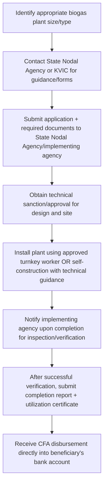

# Comprehensive Scheme Masterclass & File Guide

## Scheme Deep Dive

### Overview
The **National Bio Energy Programme - Biogas** is a **subsidy** scheme implemented by the **Ministry of New and Renewable Energy (MNRE)** with **Pan-India** geographic scope. It promotes biogas technology for clean cooking, lighting, and decentralized renewable energy generation using organic waste. The scheme is currently **active on a rolling basis** with applications accepted throughout the year subject to fund availability. Last updated in **2024**.

### Objectives
- Promote biogas technology for clean cooking and lighting in rural areas  
- Reduce dependence on fossil fuels and firewood for domestic energy needs  
- Improve rural livelihoods and energy security through decentralized renewable energy  
- Strengthen the country's renewable energy mix by utilizing organic waste for energy generation  
- Provide financial support for installation of family-size and community/institutional biogas plants  
- Encourage private sector participation and entrepreneurship in biogas technology  
- Ensure quality and performance of biogas plants through monitoring and verification  

### Eligibility Matrix
| **Eligible Applicants** | **Requirements** |
|-------------------------|------------------|
| Individuals, farmers, institutions, industries, NGOs | Must be owner or authorized representative of the site where the biogas plant is to be installed |
| Community/institutional applicants | Must have legal ownership or long-term usage rights of the land |
| All applicants | Proposed plant must conform to MNRE-approved designs and specifications |
| All applicants | Must contribute beneficiary share as per scheme guidelines |

### Benefits & Financial Support
#### Central Financial Assistance (CFA) Structure
| **Plant Type** | **Capacity Range** | **CFA Rate (General Category)** | **CFA Rate (Special Areas)** | **Special Areas Covered** |
|----------------|--------------------|----------------------------------|-------------------------------|----------------------------|
| Family-size biogas plants | 1 to 25 m³ | ₹9,000 per m³ | ₹12,000 per m³ | North Eastern States (including Sikkim) |
| Community/Institutional biogas plants | Above 25 m³ | 30% of benchmark cost | 50% of benchmark cost | North Eastern States, hilly areas, islands |

#### Financial Flow Notes
- CFA is released in **instalments** after verification of plant installation and functionality  
- Beneficiary bears the **non-subsidized portion** of plant cost  
- Subsidy claims must be submitted within stipulated time after plant completion  
- Funds subject to availability and may be exhausted during financial year  

#### Non-Financial Benefits
- Access to clean cooking fuel  
- Reduction in indoor air pollution  
- Production of organic slurry as bio-fertilizer  
- Improved sanitation through waste management  
- Potential for income generation from excess biogas or slurry sale  
- Energy independence in rural areas  
- Support for sustainable agriculture through slurry utilization  

### Application Process (Mermaid Flowchart)

### Required Documents
1. Application form for biogas plant  
2. Proof of land ownership or usage rights  
3. Identity proof of applicant (Aadhaar, Voter ID, etc.)  
4. Bank account details (passbook or cancelled cheque)  
5. Site plan and layout of proposed biogas plant  
6. Beneficiary share contribution proof (if applicable)  
7. Completion report and utilization certificate after installation  
8. Photographs of installed biogas plant (before and after)  

### Key Contacts
- **Application Portal**: https://mnre.gov.in/en/bio-gas/  
- **Email**: biogas@mnre.gov.in  
- **Helpline**: 1800-180-3333 (PM-KUSUM toll-free, may be used for general queries)  

### Key Caveats
> - CFA is released only after successful installation, inspection, and verification of the biogas plant  
> - The beneficiary must bear the non-subsidized portion of the plant cost  
> - Plants must be installed using MNRE-approved designs and through authorized agencies or turnkey workers  
> - Subsidy claims must be submitted within the stipulated time after plant completion  
> - Funds are subject to availability and may be exhausted during the financial year  

---

## Consultant's Field Guide to Generated Files

### 1. SCHEME_MASTER_DATABASE.md
**Real-time Usage:** Keep this open in a background tab during all client calls. When a client asks "What is the turnover limit?" or "Who administers this?", CTRL+F in this document to give an immediate, authoritative answer without checking the portal.

### 2. PITCH_AND_SALES_SCRIPTS.md
**Real-time Usage:** Open this file 5 minutes before your first Discovery Call with a lead. Read the "Problem Framing" out loud to hook them, then use the Qualification Checklist to interrogate their eligibility live on the phone. Keep the Objection Handlers table visible so you can immediately counter when they say "We're too small for this."

### 3. APPLICATION_PLAYBOOK.md
**Real-time Usage:** Print this out or pin it to your desktop once the client signs the retainer. Check off each box in "Stage 1" before moving to "Stage 2". Use the "Client Communication Template" to copy-paste directly into your email when chasing them for pending documents.

### 4. CLIENT_ONBOARDING_AND_CRM.md
**Real-time Usage:** Fill this out during or immediately after the onboarding call. Use the Needs Assessment to record their exact pain points. Update the "Compliance Status" table as they email you documents to maintain a single source of truth for what's missing.

### 5. LIVE_CASE_TRACKER.md
**Real-time Usage:** Review this document every morning during your standup. Update the "Stage" column daily. If a case hits "Stage 07 - Under review", use the Escalation Path notes here to know exactly who to call at the government department today.

### 6. FEE_AND_REVENUE_MODEL.md
**Real-time Usage:** Use this file when drafting the proposal. Look at the client's turnover, map them to the pricing tier in the table, and quote that exact Retainer and Success Fee. Use the monthly projection table to update your personal sales pipeline forecast for the quarter.

### 7. CLIENT_PROPOSAL_TEMPLATE.md
**Real-time Usage:** Copy this entire file, paste it into an email or PDF generator, replace the [PLACEHOLDER] tags with the client's actual details gathered from the CRM, and send it immediately after a successful discovery call.

### 8. COMPLIANCE_AND_LEGAL_PACK.md
**Real-time Usage:** Attach sections 8A and 8B as PDFs to the proposal email. Refuse to start Step 1 of the Application Playbook until the client signs these. Use the Disclaimers to protect yourself legally if the client is rejected by the government agency.