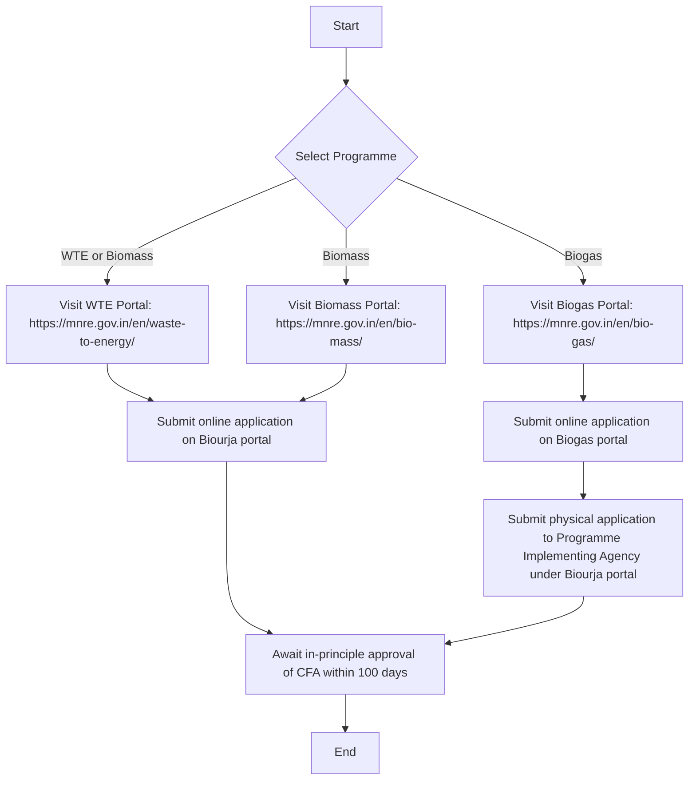

# Comprehensive Scheme Masterclass & File Guide

## Scheme Deep Dive

### Scheme Overview
The **National Bio Energy Programme - Biomass** is a subsidy scheme implemented by the **Ministry of New and Renewable Energy (MNRE)** with pan-India geographic scope. It provides **Central Financial Assistance (CFA)** for setting up bioenergy projects, including Waste to Energy (WTE), Biomass, and Biogas programmes. The scheme aims to promote biomass-based energy projects, support WTE and Biomass programmes through CFA, support Biogas programme through CFA, encourage online applications via the Biourja portal, strengthen the renewable energy mix through biomass utilization, and promote pellet and briquette manufacturing plants via updated CFA rates.

**Application Portal:** https://biourja.mnre.gov.in  
**Status / Deadlines:** 100 days for in-principle approval of CFA for WTE and Biomass projects  
**Last Updated:** 2024-25  
**Confidence:** Medium

### Objectives
- Promote biomass-based energy projects in the country  
- Support Waste to Energy (WTE) programme through CFA  
- Support Biomass programme through CFA  
- Support Biogas programme through CFA  
- Encourage project developers to submit online applications via Biourja portal  
- Provide CFA for setting up bioenergy projects including biogas, biomass, and WTE  
- Strengthen the country’s renewable energy mix through biomass utilization  
- Promote pellet and briquette manufacturing plants via updated CFA rates  

### Eligibility Matrix
| Eligible Applicant Type | Details |
|-------------------------|---------|
| Individuals | Any individual can apply |
| Organizations | Any organization can apply |
| Industries | Any industry can apply |
| Government/Semi-government Agencies | Any government or semi-government agency can apply |
| Farmers | Explicitly listed as target beneficiary |
| Co-operatives | Explicitly listed as target beneficiary |

**Target Beneficiaries:** individuals; farmers; industries; co-operatives; organizations; government/semi-government agencies  
**Note:** For WTE and Biomass programmes, project developers must submit online applications on the Biourja portal. For Biogas programme, applicants must submit online application on the Biogas portal and physical application to the Programme Implementing Agency under the Biourja portal.

### Benefits & Financial Support
CFA is provided for setting up bioenergy projects under the National Bio Energy Programme (NBP). The exact quantum and mechanism are detailed in the scheme guidelines and related office memoranda.

| Programme Type | CFA Basis | Additional Notes |
|----------------|-----------|------------------|
| WTE and Biomass programmes | CFA is based on benchmark costs | State Implementing Agencies (SIAs) are eligible for service charges of 1.33% of the eligible CFA |
| Biogas programme | CFA is available as per the scheme guidelines | State Implementing Agencies (SIAs) are eligible for service charges of 1.33% of the eligible CFA |

**Additional Financial Support:**  
- State Implementing Agencies (SIAs) are eligible for service charges of 1.33% of the eligible CFA for both WTE/Biomass and Biogas programmes.

### Application Process

**Key Process Steps:**  
1. Visit the respective portal: WTE (https://mnre.gov.in/en/waste-to-energy/), Biomass (https://mnre.gov.in/en/bio-mass/), or Biogas (https://mnre.gov.in/en/bio-gas/)  
2. Submit online application on the Biourja portal for WTE and Biomass programmes  
3. For Biogas programme, submit online application on the Biogas portal and physical application to the Programme Implementing Agency under the Biourja portal  
4. Await in-principle approval of CFA within 100 days  

### Key Caveats & Critical Requirements
> **Caveats that must be strictly adhered to:**  
> - CFA shall be exclusively earmarked for the project and must not be diverted for any other purpose  
> - Selected applicants must submit a Performance Bank Guarantee of 5% of the approved CFA along with project acceptance  
> - Final instalment of CFA released after comparison of approved and actual cost, with the lower amount considered for re-calculation  
> - Signage must be prominently displayed on the front of the project stating: 'Project is funded under National Bio Energy Programme'  
> - All documents submitted for CFA release must be signed by the applicant or authorized representative  

> **Critical Deadlines:**  
> - **100 days** for in-principle approval of CFA for WTE and Biomass projects  
> - Performance Bank Guarantee (5% of approved CFA) required upon project acceptance  
> - Final CFA instalment released post-verification of approved vs. actual cost  

## Consultant's Field Guide to Generated Files

### 1. SCHEME_MASTER_DATABASE.md
**Real-time Usage:** Keep this open in a background tab during all client calls. When a client asks "What is the turnover limit?" or "Who administers this?", CTRL+F in this document to give an immediate, authoritative answer without checking the portal.  
*Specific Application:* During a discovery call, if a client asks "Is there a turnover cap for eligibility?", immediately search for "turnover" in this file to confirm there is **no turnover limit** specified in the eligibility criteria (any individual, organization, industry, or government/semi-government agency can apply). If asked about administering agency, search for "Implementing Agency" to confirm it's the **Ministry of New and Renewable Energy (MNRE)**.

### 2. PITCH_AND_SALES_SCRIPTS.md
**Real-time Usage:** Open this file 5 minutes before your first Discovery Call with a lead. Read the "Problem Framing" out loud to hook them, then use the Qualification Checklist to interrogate their eligibility live on the phone. Keep the Objection Handlers table visible so you can immediately counter when they say "We're too small for this."  
*Specific Application:* Before a call with a small farmer cooperative, review the Objection Handler for "We're too small" which should reference the scheme's explicit inclusion of **farmers and co-operatives** as target beneficiaries with **no minimum turnover or size requirement**. During the call, use the Qualification Checklist to verify they fall under "individuals; farmers; industries; co-operatives; organizations; government/semi-government agencies" and confirm they plan to use the **Biourja portal** for WTE/Biomass or Biogas portal + physical submission for Biogas.

### 3. APPLICATION_PLAYBOOK.md
**Real-time Usage:** Print this out or pin it to your desktop once the client signs the retainer. Check off each box in "Stage 1" before moving to "Stage 2". Use the "Client Communication Template" to copy-paste directly into your email when chasing them for pending documents.  
*Specific Application:* After retainer signing, use Stage 1 checklist to:  
1. Confirm client has selected correct programme (WTE/Biomass/Biogas)  
2. Verify they have accessed the correct portal (Biourja for WTE/Biomass; Biogas portal for Biogas)  
3. Ensure they understand the **100-day in-principle approval timeline**  
4. Use the Client Communication Template to email: "Per our discussion, please submit your online application via [relevant portal] today so we can start the 100-day approval clock. For Biogas, remember you also need a physical submission to the Programme Implementing Agency."

### 4. CLIENT_ONBOARDING_AND_CRM.md
**Real-time Usage:** Fill this out during or immediately after the onboarding call. Use the Needs Assessment to record their exact pain points. Update the "Compliance Status" table as they email you documents to maintain a single source of truth for what's missing.  
*Specific Application:* During onboarding, record in Needs Assessment: "Client struggles with biomass feedstock logistics for their 2TPD pellet plant." In Compliance Status table, track:  
- [ ] Online application submitted via Biourja portal  
- [ ] Project acceptance received  
- [ ] Performance Bank Guarantee (5% of CFA) arranged  
- [ ] Signage design approved for "Project is funded under National Bio Energy Programme"  
Update this table in real-time as documents arrive (e.g., when client emails the signed application, tick "Online application submitted").

### 5. LIVE_CASE_TRACKER.md
**Real-time Usage:** Review this document every morning during your standup. Update the "Stage" column daily. If a case hits "Stage 07 - Under review", use the Escalation Path notes here to know exactly who to call at the government department today.  
*Specific Application:* Each morning, sort tracker by "Stage" descending. For any case in "Stage 07 - Under review" (awaiting in-principle approval), check the Escalation Path notes which should specify: "Contact MNRE Bio Energy Division via biourja@mnre.gov.in or call 011-2436-XXXX for status on CFA approval beyond 100 days." If a case hits Stage 07, immediately initiate this contact per the notes.

### 6. FEE_AND_REVENUE_MODEL.md
**Real-time Usage:** Use this file when drafting the proposal. Look at the client's turnover, map them to the pricing tier in the table, and quote that exact Retainer and Success Fee. Use the monthly projection table to update your personal sales pipeline forecast for the quarter.  
*Specific Application:* For a client with ₹50 crore turnover (mid-tier), consult the pricing table to quote: **Retainer: ₹2.5 lakh, Success Fee: 8% of CFA received**. Update your quarterly forecast using the monthly projection table: if you expect 3 such clients this month, project ₹7.5 lakh retainer revenue + variable success fees based on projected CFA awards.

### 7. CLIENT_PROPOSAL_TEMPLATE.md
**Real-time Usage:** Copy this entire file, paste it into an email or PDF generator, replace the [PLACEHOLDER] tags with the client's actual details gathered from the CRM, and send it immediately after a successful discovery call.  
*Specific Application:* After a discovery call where you confirmed the client is a rice mill owner interested in a biomass cogeneration plant:  
1. Copy the entire template  
2. Replace `[CLIENT_NAME]` with "ABC Rice Mills Pvt Ltd"  
3. Replace `[PROJECT_TYPE]` with "Biomass programme under National Bio Energy Programme"  
4. Replace `[CFA_AMOUNT]` with "To be determined based on benchmark costs (typically ₹X lakh per TPH)"  
5. Replace `[PORTAL_LINK]` with "https://biourja.mnre.gov.in"  
6. Replace `[TIMELINE]` with "100 days for in-principle approval"  
7. Send immediately as PDF via email.

### 8. COMPLIANCE_AND_LEGAL_PACK.md
**Real-time Usage:** Attach sections 8A and 8B as PDFs to the proposal email. Refuse to start Step 1 of the Application Playbook until the client signs these. Use the Disclaimers to protect yourself legally if the client is rejected by the government agency.  
*Specific Application:*  
1. Attach **8A (Scheme Terms & Conditions)** and **8B (Data Privacy Consent)** as PDFs to the proposal email  
2. Before beginning any work (Step 1 of Application Playbook), verify signed copies of both are in your CRM  
3. If client is rejected by MNRE, cite the Disclaimer section stating: "Consultant fees are non-refundable as they cover advisory work completed irrespective of scheme outcome, per signed agreement in COMPLIANCE_AND_LEGAL_PACK.md Section 8B."  
4. Use the indemnification clause to deflect client claims for reimbursement of consultant fees post-rejection.