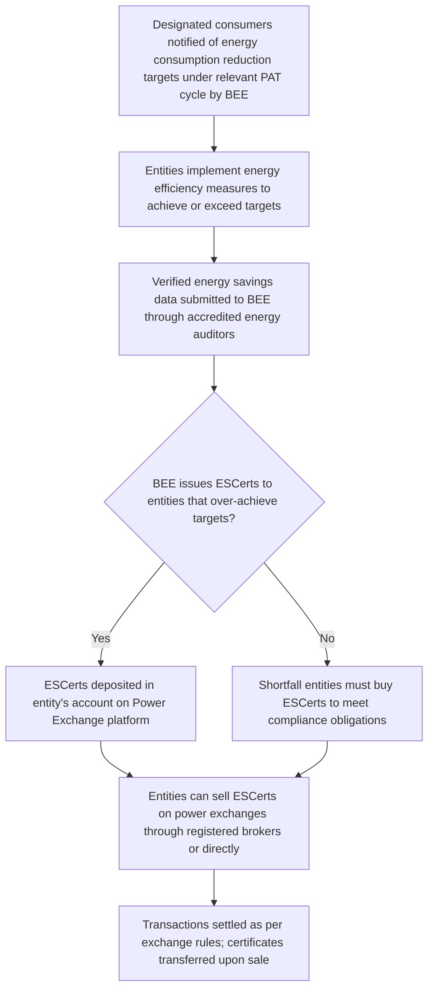

# Comprehensive Scheme Masterclass & File Guide

## Scheme Deep Dive

### Scheme Overview
**Scheme Name:** Carbon Credit Trading Scheme 2023  
**Scheme ID:** row-81  
**Ministry / Category:** Environment & Energy  
**Scheme Type:** other  
**Geographic Scope:** Pan-India  
**Implementing Agency:** Bureau of Energy Efficiency (BEE), Ministry of Power  
**Application Portal:** https://www.iexindia.com/  
**Status / Deadlines:** Aligned with PAT cycle timelines; issuance and trading of ESCerts occur after target period completion and verification, typically on an annual basis per cycle.  
**Last Updated:** 2023  

### Objectives
- Promote energy efficiency in energy-intensive industries  
- Reduce greenhouse gas emissions through market-based mechanisms  
- Enable trading of Energy Savings Certificates (ESCerts) for over-achievement of targets  
- Support India's Nationally Determined Contributions (NDCs) under the Paris Agreement  
- Encourage adoption of clean technologies and best practices in energy use  
- Create a transparent and credible carbon credit market in India  
- Facilitate cost-effective compliance with energy efficiency norms  
- Strengthen the Perform, Achieve and Trade (PAT) scheme through tradable instruments  

### Eligibility Matrix
| Eligibility Criteria | Details |
|----------------------|---------|
| **Eligible Entities** | Designated consumers under the Energy Conservation Act, 2001, including industries and establishments in sectors notified by the Central Government (such as thermal power plants, cement, iron & steel, aluminium, fertilizers, pulp & paper, textiles, and petrochemicals) |
| **Target Beneficiaries** | Industries; power sector entities; designated consumers |
| **Key Requirement** | Entities must be assigned specific energy consumption reduction targets under the PAT cycle |
| **Participation Condition** | Entities that over-achieve their energy savings targets are issued Energy Savings Certificates (ESCerts) that can be traded on power exchanges |
| **Exclusion** | Under-achievement requires purchasing certificates to comply; only over-achievement results in issuance of ESCerts |

### Benefits & Financial Support
| Benefit Type | Details |
|--------------|---------|
| **Financial Support** | The scheme does not provide direct financial subsidies or grants. Instead, it enables financial gains through the market-based trading of Energy Savings Certificates (ESCerts) on power exchanges like Indian Energy Exchange (IEX) and Power Exchange India Ltd (PXIL). The value of ESCerts is determined by market demand and supply, with each certificate representing one metric tonne of oil equivalent (mtoe) of energy saved. |
| **Financial Benefits** | Revenue generation from sale of ESCerts |
| **Non-Financial Benefits** | Recognition for energy efficiency improvements; compliance with regulatory targets; enhanced corporate sustainability profile; access to green finance; contribution to national climate goals; promotion of technology upgradation and operational efficiency in participating industries |

### Required Documents
1. Verified energy audit report from an accredited energy auditor  
2. Baseline and assessment year energy consumption data  
3. Details of energy efficiency measures implemented  
4. Form A (for target fulfillment) as per PAT scheme guidelines  
5. Certificate of registration as a designated consumer under EC Act, 2001  
6. Board resolution approving participation in PAT scheme  
7. No objection certificate from the State Designated Agency (if applicable)  

### Application Process

### Key Caveats
> - Only over-achievement of targets results in issuance of ESCerts; under-achievement requires purchasing certificates to comply  
> - ESCerts have a validity period and must be traded within the compliance period  
> - Trading is permitted only on recognized power exchanges (IEX, PXIL) under CERC regulations  
> - The scheme is applicable only to notified designated consumers under the Energy Conservation Act, 2001  
> - Double counting of ESCerts is strictly prohibited; each certificate can be traded only once  

### Contact Details
- **Email:** bee@beeindia.gov.in  
- **Helpline:** 1800-180-3333  

### Sources
- Scheme Key Facts (extracted structured data)  
- Application Portal: https://www.iexindia.com/  
- Supporting Evidence: Energy Conservation and Energy Transition | Ministry Of Power (https://powermin.gov.in/offerings/schemes-and-services/details/energy-conservation-energy-transition-EjN5MTMtQWa)  

---

## Consultant's Field Guide to Generated Files

### 1. SCHEME_MASTER_DATABASE.md
**Real-time Usage:** Keep this open in a background tab during all client calls. When a client asks "What is the turnover limit?" or "Who administers this?", CTRL+F in this document to give an immediate, authoritative answer without checking the portal.

### 2. PITCH_AND_SALES_SCRIPTS.md
**Real-time Usage:** Open this file 5 minutes before your first Discovery Call with a lead. Read the "Problem Framing" out loud to hook them, then use the Qualification Checklist to interrogate their eligibility live on the phone. Keep the Objection Handlers table visible so you can immediately counter when they say "We're too small for this."

### 3. APPLICATION_PLAYBOOK.md
**Real-time Usage:** Print this out or pin it to your desktop once the client signs the retainer. Check off each box in "Stage 1" before moving to "Stage 2". Use the "Client Communication Template" to copy-paste directly into your email when chasing them for pending documents.

### 4. CLIENT_ONBOARDING_AND_CRM.md
**Real-time Usage:** Fill this out during or immediately after the onboarding call. Use the Needs Assessment to record their exact pain points. Update the "Compliance Status" table as they email you documents to maintain a single source of truth for what's missing.

### 5. LIVE_CASE_TRACKER.md
**Real-time Usage:** Review this document every morning during your standup. Update the "Stage" column daily. If a case hits "Stage 07 - Under review", use the Escalation Path notes here to know exactly who to call at the government department today.

### 6. FEE_AND_REVENUE_MODEL.md
**Real-time Usage:** Use this file when drafting the proposal. Look at the client's turnover, map them to the pricing tier in the table, and quote that exact Retainer and Success Fee. Use the monthly projection table to update your personal sales pipeline forecast for the quarter.

### 7. CLIENT_PROPOSAL_TEMPLATE.md
**Real-time Usage:** Copy this entire file, paste it into an email or PDF generator, replace the [PLACEHOLDER] tags with the client's actual details gathered from the CRM, and send it immediately after a successful discovery call.

### 8. COMPLIANCE_AND_LEGAL_PACK.md
**Real-time Usage:** Attach sections 8A and 8B as PDFs to the proposal email. Refuse to start Step 1 of the Application Playbook until the client signs these. Use the Disclaimers to protect yourself legally if the client is rejected by the government agency.