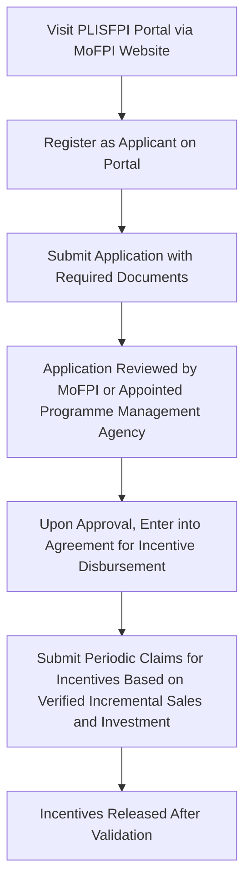

# Comprehensive Scheme Masterclass & File Guide

## Scheme Deep Dive

### Overview
The **Production Linked Incentive Scheme for Food Processing Industry (PLISFPI)** is a central sector subsidy scheme implemented by the **Ministry of Food Processing Industries (MoFPI)** under the Government of India. It operates on a **pan-India** geographic scope and accepts applications on a **rolling basis throughout the year** as per scheme guidelines. The scheme is designed to enhance domestic manufacturing, boost exports, support SMEs, promote innovation, and strengthen the food processing value chain from farm to retail.

### Objectives
The scheme aims to:
- Enhance domestic manufacturing and exports in the food processing sector  
- Provide incentives on incremental sales and investments over five years  
- Support SMEs in the food processing industry  
- Promote innovative and organic food products  
- Encourage branding and marketing initiatives  
- Strengthen the value chain from farm to retail  
- Increase processing levels and reduce agricultural wastage  
- Boost farmer income and rural employment  

### Eligibility Matrix
| Eligibility Criteria | Details |
|----------------------|--------|
| **Entity Type** | Food processing units engaged in manufacturing |
| **Priority Focus** | SMEs, innovative/organic products, entities undertaking branding and marketing activities |
| **Geographic Scope** | Pan-India |
| **Target Beneficiaries** | SMEs, innovative/organic products, food processing units |
| **Scheme Type** | Subsidy |
| **Implementing Agency** | Ministry of Food Processing Industries |
| **Application Portal** | https://mofpi.gov.in |

> **Note**: Specific eligibility criteria are defined under the scheme guidelines for each incentive category. Entities must maintain proper records and submit periodic reports.

### Benefits & Financial Support
| Support Type | Details |
|--------------|--------|
| **Financial Incentives** | Provided as a percentage of incremental sales over base year sales and as a percentage of investment in plant, machinery, and related infrastructure |
| **Disbursement Period** | Annually over five years based on verified claims |
| **Additional Support** | Support for branding and marketing; incentives for innovative and organic products; assistance in scaling up operations and market access |
| **Incentive Basis** | Only incremental sales over base year are considered for incentive calculation |
| **Key Caveats** | <ul><li>Incentives are contingent on achieving minimum threshold of incremental sales or investment</li><li>Claims must be verified and audited as per scheme norms</li><li>Incentives are disbursed over five years based on annual performance</li><li>Entities must maintain proper records and submit periodic reports</li></ul> |

### Required Documents
1. Certificate of Incorporation / Registration  
2. PAN of the entity  
3. GST registration  
4. Details of plant and machinery investment  
5. Sales turnover details (base year and incremental)  
6. Product list and manufacturing process  
7. Branding and marketing expenditure proof (if applicable)  
8. Bank account details  
9. Authorization letter from signatory  
10. Undertaking as per scheme guidelines  

### Application Process

**Application Portal**: https://mofpi.gov.in  
**Status**: Rolling basis — applications accepted throughout the year  
**Confidence Level**: Medium (based on evidence extraction)

---

## Consultant's Field Guide to Generated Files

### 1. SCHEME_MASTER_DATABASE.md
**Real-time Usage**: Keep this open in a background tab during all client calls. When a client asks "What is the turnover limit?" or "Who administers this?", CTRL+F in this document to give an immediate, authoritative answer without checking the portal.

### 2. PITCH_AND_SALES_SCRIPTS.md
**Real-time Usage**: Open this file 5 minutes before your first Discovery Call with a lead. Read the "Problem Framing" out loud to hook them, then use the Qualification Checklist to interrogate their eligibility live on the phone. Keep the Objection Handlers table visible so you can immediately counter when they say "We're too small for this."

### 3. APPLICATION_PLAYBOOK.md
**Real-time Usage**: Print this out or pin it to your desktop once the client signs the retainer. Check off each box in "Stage 1" before moving to "Stage 2". Use the "Client Communication Template" to copy-paste directly into your email when chasing them for pending documents.

### 4. CLIENT_ONBOARDING_AND_CRM.md
**Real-time Usage**: Fill this out during or immediately after the onboarding call. Use the Needs Assessment to record their exact pain points. Update the "Compliance Status" table as they email you documents to maintain a single source of truth for what's missing.

### 5. LIVE_CASE_TRACKER.md
**Real-time Usage**: Review this document every morning during your standup. Update the "Stage" column daily. If a case hits "Stage 07 - Under review", use the Escalation Path notes here to know exactly who to call at the government department today.

### 6. FEE_AND_REVENUE_MODEL.md
**Real-time Usage**: Use this file when drafting the proposal. Look at the client's turnover, map them to the pricing tier in the table, and quote that exact Retainer and Success Fee. Use the monthly projection table to update your personal sales pipeline forecast for the quarter.

### 7. CLIENT_PROPOSAL_TEMPLATE.md
**Real-time Usage**: Copy this entire file, paste it into an email or PDF generator, replace the [PLACEHOLDER] tags with the client's actual details gathered from the CRM, and send it immediately after a successful discovery call.

### 8. COMPLIANCE_AND_LEGAL_PACK.md
**Real-time Usage**: Attach sections 8A and 8B as PDFs to the proposal email. Refuse to start Step 1 of the Application Playbook until the client signs these. Use the Disclaimers to protect yourself legally if the client is rejected by the government agency.