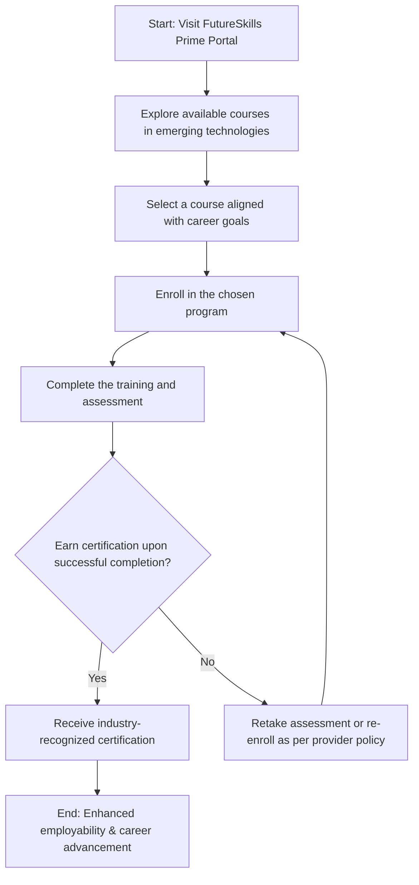

# Comprehensive Scheme Masterclass & File Guide

## Scheme Deep Dive

### Overview
Future Skills PRIME is a collaborative initiative between the Ministry of Electronics and Information Technology (MeitY) and the National Association of Software and Service Companies (NASSCOM). It is designed to transform India into a Digital Talent Nation by providing industry-backed skill development and certification programs in emerging digital technologies. The scheme operates on a rolling basis with no fixed deadline, accepting applications year-round through its dedicated portal: https://futureskillsprime.in/. Last updated in 2024, the program focuses on upskilling students, professionals, and job seekers in high-demand domains such as artificial intelligence, data analytics, cloud computing, cybersecurity, and related fields aligned with National Occupational Standards (NOS) and the National Skills Qualification Framework (NSQF).

### Objectives
The core objectives of Future Skills PRIME are:
- Transform India into a Digital Talent Nation  
- Provide cutting-edge knowledge in emerging technologies including AI, data analytics, cloud computing, and cybersecurity  
- Align certification programs with National Occupational Standards (NOS) and National Skills Qualification Framework (NSQF)  
- Enhance employability by offering industry-backed credentials  
- Support lifelong learning and upskilling in digital technology domains  

### Eligibility Matrix
| **Beneficiary Type** | **Eligibility Criteria**                                                                 | **Target Domains**                                                                 |
|----------------------|----------------------------------------------------------------------------------------|----------------------------------------------------------------------------------|
| Students             | Open to all students seeking skills in digital technology domains                      | Artificial Intelligence, Data Analytics, Cloud Computing, Cybersecurity, etc.    |
| Professionals        | Open to working professionals aiming to upskill or reskill                             | Machine Learning Engineer, Data Scientist, Business Intelligence Analyst, InfoSec Analyst, etc. |
| Job Seekers          | Open to individuals seeking employment in digital technology roles                     | Roles aligned with NOS and NSQF frameworks                                       |

*Note: Eligibility is open to all Indian citizens regardless of educational background, provided they seek skills in NSQF/NOS-aligned digital technology domains.*

### Benefits & Financial Support
| **Benefit Category**       | **Details**                                                                                                                                                               |
|----------------------------|---------------------------------------------------------------------------------------------------------------------------------------------------------------------------|
| Certification              | Industry-recognized certification aligned with NOS and NSQF                                                                                                               |
| Employability Enhancement  | Enhanced employability in digital technology roles such as machine learning engineer, data scientist, business intelligence analyst, and information security analyst     |
| Learning Environment       | Access to a dynamic learning environment                                                                                                                                  |
| Career Advancement         | Validation of skills for career advancement in the digital economy                                                                                                        |
| Financial Support          | **The scheme does not provide direct financial support to individuals**; it focuses on skill development and certification through industry-backed programs offered by NASSCOM and MeitY. |

*Note: While no stipends, scholarships, or direct monetary aid are provided, the value lies in free or subsidized access to premium certification programs that would otherwise carry significant market costs.*

### Application Process Flowchart

**Application Portal:** https://futureskillsprime.in/  
**Status:** Rolling basis — no fixed deadline. Applications accepted year-round.  
**Implementing Agency:** Ministry of Electronics and Information Technology (MeitY) in collaboration with National Association of Software and Service Companies (NASSCOM)  
**Geographic Scope:** Pan-India  
**Scheme Type:** Other (Skill Development & Certification)  
**Last Updated:** 2024  

### Key Caveats
> **Certification is subject to successful completion of training and assessment**  
> **Program availability and course offerings may vary based on industry demand and updates to NOS/NSQF**

---

## Consultant's Field Guide to Generated Files

### 1. SCHEME_MASTER_DATABASE.md
**Real-time Usage:** Keep this open in a background tab during all client calls. When a client asks "What is the turnover limit?" or "Who administers this?", CTRL+F in this document to give an immediate, authoritative answer without checking the portal.  
*Example Use Case:* During a discovery call, a professional asks, "Is this scheme run by the government?" You instantly search "Implementing Agency" and reply: "Yes, it's a joint initiative by MeitY and NASSCOM — Ministry of Electronics and Information Technology and National Association of Software and Service Companies."

### 2. PITCH_AND_SALES_SCRIPTS.md
**Real-time Usage:** Open this file 5 minutes before your first Discovery Call with a lead. Read the "Problem Framing" out loud to hook them, then use the Qualification Checklist to interrogate their eligibility live on the phone. Keep the Objection Handlers table visible so you can immediately counter when they say "We're too small for this."  
*Example Use Case:* A student says, "I’m just in my first year of college — am I eligible?" You pull up the Qualification Checklist, confirm "Open to students" under Eligibility, and respond: "Absolutely — Future Skills PRIME is designed for students at any stage. Let’s find the right AI or cloud course for your level."

### 3. APPLICATION_PLAYBOOK.md
**Real-time Usage:** Print this out or pin it to your desktop once the client signs the retainer. Check off each box in "Stage 1" before moving to "Stage 2". Use the "Client Communication Template" to copy-paste directly into your email when chasing them for pending documents.  
*Example Use Case:* After enrollment, you use the checklist to verify: "Has the client completed Module 3?" If not, you trigger the automated email template: "Hi [Name], just a friendly reminder to complete your cloud computing assessment by EOD Friday to stay on track for certification."

### 4. CLIENT_ONBOARDING_AND_CRM.md
**Real-time Usage:** Fill this out during or immediately after the onboarding call. Use the Needs Assessment to record their exact pain points. Update the "Compliance Status" table as they email you documents to maintain a single source of truth for what's missing.  
*Example Use Case:* A professional mentions they need certification for a data scientist role. You log this in Needs Assessment. When they send their resume and ID proof, you update Compliance Status from "Pending ID" to "Documents Received — Awaiting Course Selection."

### 5. LIVE_CASE_TRACKER.md
**Real-time Usage:** Review this document every morning during your standup. Update the "Stage" column daily. If a case hits "Stage 07 - Under review", use the Escalation Path notes here to know exactly who to call at the government department today.  
*Example Use Case:* A client completes their cybersecurity course and submits the final assessment. You update the tracker to "Stage 06 - Awaiting Certification." The next day, seeing no update, you check the Escalation Path and contact the NASSCOM certification helpline listed in the file to inquire about processing time.

### 6. FEE_AND_REVENUE_MODEL.md
**Real-time Usage:** Use this file when drafting the proposal. Look at the client's turnover, map them to the pricing tier in the table, and quote that exact Retainer and Success Fee. Use the monthly projection table to update your personal sales pipeline forecast for the quarter.  
*Example Use Case:* A corporate client with ₹50 Cr turnover inquires about upskilling 50 employees. You refer to the pricing tier for ₹40–60 Cr turnover, quote a ₹1.5 Lakh retainer and 10% success fee, then log the projected revenue in your quarterly forecast.

### 7. CLIENT_PROPOSAL_TEMPLATE.md
**Real-time Usage:** Copy this entire file, paste it into an email or PDF generator, replace the [PLACEHOLDER] tags with the client's actual details gathered from the CRM, and send it immediately after a successful discovery call.  
*Example Use Case:* After a call where a job seeker expresses interest in AI engineering, you open the template, replace `[Client Name]`, `[Target Role]`, `[Selected Course]`, and `[Expected Outcome]`, then send: "As discussed, here’s your proposal for the Future Skills PRIME AI Engineer certification path..."

### 8. COMPLIANCE_AND_LEGAL_PACK.md
**Real-time Usage:** Attach sections 8A and 8B as PDFs to the proposal email. Refuse to start Step 1 of the Application Playbook until the client signs these. Use the Disclaimers to protect yourself legally if the client is rejected by the government agency.  
*Example Use Case:* Before beginning work, you send the Compliance Pack. The client signs and returns the "Eligibility Attestation" and "Data Consent" forms. You file these securely. If they later fail the assessment, you reference the disclaimer: "As outlined in Section 8B, certification is contingent on successful completion — we provided access, but outcomes depend on individual performance."