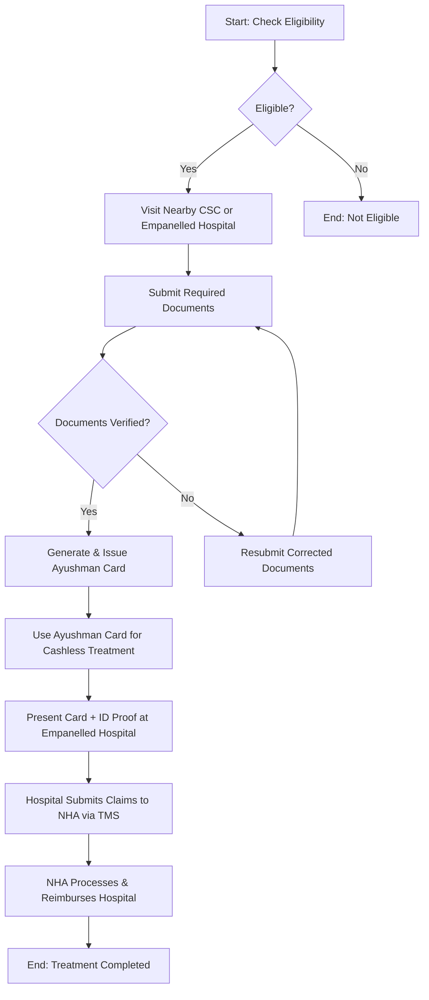

# Comprehensive Scheme Masterclass & File Guide

## Scheme Deep Dive

### Scheme Overview
**Scheme Name:** Ayushman Bharat PM-JAY  
**Scheme ID:** row-91  
**Ministry / Category:** Healthcare & Insurance  
**Scheme Type:** subsidy  
**Geographic Scope:** Pan-India  
**Implementing Agency:** National Health Authority (NHA)  
**Application Portal:** https://pmjay.gov.in/  
**Status / Deadlines:** Rolling basis — applications are accepted throughout the year.  
**Last Updated:** 2026  
**Fund Size (Cr):** 61501  
**Max Per Entity:** ₹5 lakhs per family per year  

### Objectives
- Achieve Universal Health Coverage  
- Provide health cover of Rs. 5 lakhs per family per year for secondary and tertiary care hospitalization  
- Reduce out-of-pocket expenditure for medical treatments  
- Ensure cashless access to healthcare services at empanelled hospitals  
- Promote gender equity in access to quality healthcare  
- Incentivize and encourage healthcare providers to focus on delivering patient-centric services  
- Strengthen fraud detection and claims adjudication through digital initiatives like AB PM-JAY Auto-Adjudication Hackathon  
- Expand hospital empanelment and improve quality of care through performance-based incentives  

### Eligibility Matrix
| Eligibility Criteria | Details |
|----------------------|---------|
| **Beneficiary Identification** | Based on deprivation and occupational criteria from the Socio Economic Caste Census (SECC) database |
| **Rural Areas** | Households living in only one room, no adult member aged 16-59, female-headed households with no adult male member, households with disabled members and no able-bodied adult, SC/ST households, landless households deriving major income from manual casual labour |
| **Urban Areas** | Workers in specified occupational categories: ragpickers, beggars, domestic workers, street vendors, construction workers, etc. |
| **Coverage** | Poor and vulnerable families as per SECC data; implemented in 36 States/UTs, with West Bengal being the latest to join |
| **No Caps** | No cap on family size, age, or gender; pre-existing diseases covered from day one |
| **Verification** | Beneficiaries must ensure details are updated in SECC database for continued eligibility |

### Benefits & Financial Support
| Benefit Type | Details |
|--------------|---------|
| **Financial Coverage** | Health cover of Rs. 5 lakhs per family per year on a family floater basis; total amount usable by one or all family members |
| **Fund Utilization** | As of latest data, ₹61,501 crore worth of free treatment authorized; over 5 crore hospital admissions authorized |
| **Cashless Treatment** | For secondary and tertiary care hospitalization at any empanelled hospital across India |
| **Procedures Covered** | 1,949 procedures under 27 specialties including medical oncology, emergency care, orthopaedics, and urology |
| **Women-Specific Benefits** | Over 141 medical procedures exclusively earmarked for women; approximately 49% of Ayushman Card recipients are women; over 48% of authorized hospital admissions availed by women |
| **Additional Benefits** | Portability of benefits across states; coverage for pre-existing diseases from day one; no cap on family size or age; co-branded PVC Ayushman Cards issued |
| **Funding** | Entirely funded by Government of India; funds allocated to States/UTs for implementation; NHA oversees financial management including disbursement and utilization monitoring |

> **> Important Note:** Benefits are limited to secondary and tertiary care hospitalization only; outpatient care is not covered. Treatment must be availed only at empanelled hospitals under the scheme. The scheme does not cover expenses outside hospitalization such as OPD consultations, diagnostics, or medicines unless part of hospitalized treatment.

### Application Process Flowchart

### Required Documents
1. Proof of identity (Aadhaar card, Voter ID, PAN card, etc.)  
2. Proof of address (ration card, electricity bill, etc.)  
3. Ration card or SECC verification document  
4. Passport-sized photographs  
5. Mobile number for OTP verification  

### Contact Details
- **Toll-Free Call Centre No:** 14555 (NHA/PM-JAY)  
- **Email:** webmaster-pmjay@nha.gov.in  

### Key Caveats
- Benefits limited to secondary and tertiary care hospitalization only; outpatient care not covered  
- Treatment must be availed only at empanelled hospitals under the scheme  
- Scheme does not cover expenses outside hospitalization such as OPD consultations, diagnostics, or medicines unless part of hospitalized treatment  
- Beneficiaries must ensure details are updated in SECC database for continued eligibility  
- Fraudulent claims may lead to penalties and debarment of hospitals or agencies  
- Ayushman Card must be renewed periodically as per state-specific guidelines  

### Supporting Statistics (as of 2026)
- **Ayushman Cards Issued:** 44,22,33,525  
- **Authorized Hospital Admissions:** 10,90,84,454  
- **Hospitals Empanelled:** 36,319  
- **Amount Authorized for Hospital Admissions:** ₹1,50,965 cr  
- **ABHA Cards Created:** 91,86,41,157  
- **ABHA Linked Health Records:** 1,02,63,52,221  
- **Health Facilities Registered:** 5,26,495  
- **Healthcare Professionals Registered:** 9,13,931  

> **> Source:** National Health Authority Integrated Portal (https://nha.gov.in/) - Last Updated: 14-06-2026, 5:45 PM  

## Consultant's Field Guide to Generated Files

### 1. SCHEME_MASTER_DATABASE.md
**Real-time Usage:** Keep this open in a background tab during all client calls. When a client asks "What is the turnover limit?" or "Who administers this?", CTRL+F in this document to give an immediate, authoritative answer without checking the portal.

### 2. PITCH_AND_SALES_SCRIPTS.md
**Real-time Usage:** Open this file 5 minutes before your first Discovery Call with a lead. Read the "Problem Framing" out loud to hook them, then use the Qualification Checklist to interrogate their eligibility live on the phone. Keep the Objection Handlers table visible so you can immediately counter when they say "We're too small for this."

### 3. APPLICATION_PLAYBOOK.md
**Real-time Usage:** Print this out or pin it to your desktop once the client signs the retainer. Check off each box in "Stage 1" before moving to "Stage 2". Use the "Client Communication Template" to copy-paste directly into your email when chasing them for pending documents.

### 4. CLIENT_ONBOARDING_AND_CRM.md
**Real-time Usage:** Fill this out during or immediately after the onboarding call. Use the Needs Assessment to record their exact pain points. Update the "Compliance Status" table as they email you documents to maintain a single source of truth for what's missing.

### 5. LIVE_CASE_TRACKER.md
**Real-time Usage:** Review this document every morning during your standup. Update the "Stage" column daily. If a case hits "Stage 07 - Under review", use the Escalation Path notes here to know exactly who to call at the government department today.

### 6. FEE_AND_REVENUE_MODEL.md
**Real-time Usage:** Use this file when drafting the proposal. Look at the client's turnover, map them to the pricing tier in the table, and quote that exact Retainer and Success Fee. Use the monthly projection table to update your personal sales pipeline forecast for the quarter.

### 7. CLIENT_PROPOSAL_TEMPLATE.md
**Real-time Usage:** Copy this entire file, paste it into an email or PDF generator, replace the [PLACEHOLDER] tags with the client's actual details gathered from the CRM, and send it immediately after a successful discovery call.

### 8. COMPLIANCE_AND_LEGAL_PACK.md
**Real-time Usage:** Attach sections 8A and 8B as PDFs to the proposal email. Refuse to start Step 1 of the Application Playbook until the client signs these. Use the Disclaimers to protect yourself legally if the client is rejected by the government agency.