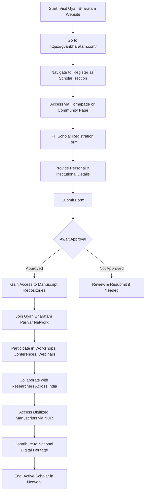

# Comprehensive Scheme Masterclass & File Guide

## Scheme Deep Dive

### Overview
The **Gyan Bharatam Mission** (Scheme ID: row-98) is a flagship initiative of the **Ministry of Culture, Government of India**, launched to safeguard, preserve, digitize, and share India’s vast manuscript heritage. Envisioned by the Hon’ble Prime Minister, Shri Narendra Modi, and announced in the Union Budget 2025–26 (Paragraph 84) on 1st February 2025, the mission aims to create a **National Digital Repository (NDR)** as a living source of knowledge for generations. The mission operates on a **pan-India** geographic scope with **rolling admissions** — applications are accepted year-round with no fixed deadline. The Standing Finance Committee (SFC) has sanctioned **Rs 491.66 crore** for the period **2025–2031** to support survey, conservation, digitization, and NDR creation.

### Objectives
The mission’s objectives are exhaustive and multi-dimensional:
- Safeguard and revitalize India’s Manuscript Heritage through systematic survey and documentation  
- Conserve manuscripts through scientific methods for preservation while training experts to care for them  
- Digitize and protect manuscripts with smart, sustainable technology for the future  
- Work with academicians & scholars to decode ancient manuscripts through translation and transliteration  
- Study and share knowledge of manuscripts through publication of critically edited manuscripts  
- Ensure accessibility of the National Digital Repository for research, education, and public engagement  

These objectives are operationalized via the **Five Pillars** approach:
1. **Survey & Cataloguing**: Mapping and recording manuscripts across India, implementing Standardized National Surveys for manuscript identification  
2. **Conservation & Capacity Building**: Conserving manuscripts through scientific methods while training experts  
3. **Technology & Digitization**: Digitizing and protecting manuscripts with smart, sustainable technology  
4. **Linguistics & Translation**: Working with academicians & scholars to decode ancient manuscripts through translation and transliteration  
5. **Research, Publication & Outreach**: Studying and sharing knowledge through publication of critically edited manuscripts  

### Eligibility Matrix
The scheme is **open to individuals and institutions** holding manuscripts who wish to participate in preservation, digitization, and sharing. There are **no turnover limits, no sector restrictions, and no minimum/maximum manuscript thresholds** for basic registration as a Gyan Bharatam Scholar. However, deeper engagement (e.g., MoUs, conservation partnerships) may require institutional capacity.

| Eligibility Criteria | Details | Source |
|----------------------|---------|--------|
| **Who Can Apply** | Individuals and institutions holding manuscripts | Key Facts, Community Page |
| **Eligible Entities** | Citizen contributors, scholars, libraries, monasteries, temples, academic institutions across India | Key Facts |
| **Geographic Scope** | Pan-India (all states and UTs) | Key Facts |
| **Manuscript Types** | Palm-leaf, birch bark, paper, sanchipat, cloth, and other materials; in languages including Sanskrit, Persian, regional languages, Ayurveda, Astronomy, Mathematics, Medicine, Governance, Philosophy, Poetry, Spirituality, Arts | About Page, FAQ |
| **Minimum Manuscripts Required** | None for scholar registration; even one manuscript qualifies | Community Page (e.g., single manuscript submissions shown) |
| **Institutional Requirements** | No formal registration or legal status required for basic participation; MoUs required for conservation/centre status | Community Page (Cluster Centres, Independent Centres) |
| **Exclusions** | None explicitly stated; open to all who wish to participate | Key Facts, About Page |

> **> 💡 Key Takeaway**: The scheme follows an **inclusive, low-barrier entry model**. Anyone with a manuscript — even a single palm-leaf folio — can register as a Gyan Bharatam Scholar. Institutional partnerships (MoUs) are for advanced roles like conservation centres, not basic access.

### Benefits & Financial Support
While the scheme does not offer direct cash grants to individuals, it provides **in-kind, access-based, and collaborative benefits** of significant value. Financial support (Rs 491.66 crore) is allocated to the mission’s operational costs (survey, conservation, digitization, NDR), not disbursed to beneficiaries.

| Benefit Category | Specific Benefits | Details | Source |
|------------------|-------------------|---------|--------|
| **Access & Use** | Access to digitized manuscripts | For research, education, and public engagement via National Digital Repository | Key Facts, About Page |
| **Recognition** | Opportunity to register as a Gyan Bharatam Scholar | Become a recognised scholar; join the Gyan Bharatam Parivar network | Key Facts, Community Page |
| **Collaboration** | Participation in workshops, conferences, webinars | Regular events calendar; opportunities to engage with researchers across India | Key Facts, Events Page |
| **Network Access** | Collaboration with researchers across India; access to manuscript repositories | Global network of Cluster Centres, Independent Centres, and global partners | Community Page |
| **Contribution** | Contribution to national digital heritage infrastructure | By digitizing and sharing manuscripts, contributors become part of NDR | About Page |
| **Recognition** | Recognition as part of a living network of seekers, scholars, teachers, and knowledge-keepers | Emphasis on Guru–Śiṣya Paramparā blended with modern scholarship | Community Page |
| **Educational** | Access to publications, research papers, digital editions | Publications section includes critical editions like *Yuddhādarśa*, *Sabhāvinoda* | Publication Page, FAQ |
| **Technical** | Access to AI tools (Gyan Mitram AI, BharatiyaGPT) | Experience manuscripts with AI; compare outputs for research | Homepage |

> **> ⚠️ Caveat**: Financial support (Rs 491.66 crore) is **not disbursed to applicants**. It funds mission operations. Benefits are **non-monetary** — access, recognition, collaboration, and contribution to national heritage. Manuscript conservation and digitization efforts are subject to institutional partnerships and MoUs. Access to certain manuscript collections may be restricted based on custodian policies.

### Application Process
The process to join as a **Gyan Bharatam Scholar** is simple and entirely online. There is no formal proposal or document submission beyond basic registration. Deeper engagement (e.g., becoming a conservation centre) requires MoUs and institutional assessment.

#### Step-by-Step Breakdown:
1. **Visit Portal**: Go to the official application portal: **https://gyanbharatam.com/**  
2. **Navigate**: Find the **‘Register as Scholar’** section — accessible from the homepage or the Community page (`/community`)  
3. **Fill Form**: Complete the scholar registration form with:  
   - Personal details (name, contact, affiliation)  
   - Institutional details (if applicable: name, type, location)  
   - Manuscript details (optional at registration: type, language, condition)  
4. **Submit**: Submit the form online  
5. **Approval**: Await confirmation from the Gyan Bharatam secretariat (contact: gyanbharatam2025@gmail.com, +91-11-23315625)  
6. **Access**: Upon approval, gain immediate access to:  
   - Manuscript repositories  
   - Collaboration opportunities  
   - Event invitations  
   - Publication access  
   - AI research tools (Gyan Mitram AI, BharatiyaGPT)  
7. **Engage**: Participate in the living network — attend workshops, contribute manuscripts, collaborate on research  

> **> ℹ️ Note**: For institutions seeking to become **Cluster Centres, Independent Centres, or Conservation Centres**, the process involves:  
> - Expressing interest via contact details  
> - Negotiating and signing an MoU with the Ministry of Culture  
> - Meeting infrastructure and capacity criteria (e.g., conservation facilities, digitization units)  
> - Examples: Abhay Jain Library (Bikaner) became Rajasthan’s first manuscript conservation centre via MoU (Oct 2025); 17 institutions signed MoUs in Oct 2025; target of 20+ MoUs stated for Oct 25, 2025 event  

### Key Contacts
| Name | Designation | Contact | Source |
|------|-------------|---------|--------|
| Shri Samar Nanda | Joint Secretary | +91 11 23386504 | js-culture-candm@gov.in | Contact Page |
| Shri Inderjeet Singh | Director (Ministry of Culture) | +91 11 24014229 | dir-gbm-culture@gov.in | Contact Page |
| Prof. Anirban Dash | Project Director (Gyan Bharatam) | +91 11 23315625 | director.namami@nic.in | Contact Page, About Page |
| Shri Gajendra Singh Shekhawat | Hon'ble Minister of Culture | +91 11 24014301 / +91 11 24014302 | gsingh.shekhawat@gov.in | About Page |
| Shri Rao Inderjit Singh | Hon'ble Minister of State for Culture | +91 11 21402909 / +91 11 23096561-62 | mos-culture@gov.in | About Page |
| Shri Vivek Aggarwal | Secretary (Ministry of Culture) | +91 11 24014303 / +91 11 24014304 | secy-culture@nic.in | About Page |
| General Inquiry | — | Email: gyanbharatam2025@gmail.com | Phone: +91-11-23315625 | FAQ, Contact Page |

### Important Deadlines & Status
- **Application Basis**: **Rolling** — no fixed deadline; applications accepted **year-round**  
- **Last Updated**: 2025 (per Key Facts)  
- **Funding Period**: **2025–2031** (Rs 491.66 crore sanctioned by SFC)  
- **Recent Milestones**:  
  - MoU signing with 17 institutions (Oct 24–26, 2025) at National Gallery of Modern Art, New Delhi  
  - Abhay Jain Library, Bikaner became Rajasthan’s first manuscript conservation centre (Oct 25, 2025)  
  - Target to sign MoUs with ~20 institutes (Oct 25, 2025 event)  
  - Union Budget 2025–26 announcement (Feb 1, 2025)  

### Supporting Evidence & Sources
- **Application Portal**: https://gyanbharatam.com/  
- **Key Pages**:  
  - Homepage: https://gyanbharatam.com/  
  - About: https://gyanbharatam.com/about  
  - Community: https://gyanbharatam.com/community  
  - Events: https://gyanbharatam.com/events  
  - Press Releases: https://gyanbharatam.com/press-releases (implied from news items)  
  - Contact: https://gyanbharatam.com/contact  
  - FAQ: https://gyanbharatam.com/faq  
- **News Items Cited**:  
  - Tara Prakashana MoU (Jan 12, 2026)  
  - Abhay Jain Library Conservation Centre (Oct 26, 2025)  
  - MoU signing milestone (Oct 24, 2025)  
  - MoU signing event announcement (Oct 25, 2025)  
  - Minister’s statement on Praṇamya Bhārat (Oct 24, 2025)  

---

## Consultant's Field Guide to Generated Files

### 1. SCHEME_MASTER_DATABASE.md
**Real-time Usage:** Keep this open in a background tab during all client calls. When a client asks "What is the turnover limit?" or "Who administers this?", CTRL+F in this document to give an immediate, authoritative answer without checking the portal.

### 2. PITCH_AND_SALES_SCRIPTS.md
**Real-time Usage:** Open this file 5 minutes before your first Discovery Call with a lead. Read the "Problem Framing" out loud to hook them, then use the Qualification Checklist to interrogate their eligibility live on the phone. Keep the Objection Handlers table visible so you can immediately counter when they say "We're too small for this."

### 3. APPLICATION_PLAYBOOK.md
**Real-time Usage:** Print this out or pin it to your desktop once the client signs the retainer. Check off each box in "Stage 1" before moving to "Stage 2". Use the "Client Communication Template" to copy-paste directly into your email when chasing them for pending documents.

### 4. CLIENT_ONBOARDING_AND_CRM.md
**Real-time Usage:** Fill this out during or immediately after the onboarding call. Use the Needs Assessment to record their exact pain points. Update the "Compliance Status" table as they email you documents to maintain a single source of truth for what's missing.

### 5. LIVE_CASE_TRACKER.md
**Real-time Usage:** Review this document every morning during your standup. Update the "Stage" column daily. If a case hits "Stage 07 - Under review", use the Escalation Path notes here to know exactly who to call at the government department today.

### 6. FEE_AND_REVENUE_MODEL.md
**Real-time Usage:** Use this file when drafting the proposal. Look at the client's turnover, map them to the pricing tier in the table, and quote that exact Retainer and Success Fee. Use the monthly projection table to update your personal sales pipeline forecast for the quarter.

### 7. CLIENT_PROPOSAL_TEMPLATE.md
**Real-time Usage:** Copy this entire file, paste it into an email or PDF generator, replace the [PLACEHOLDER] tags with the client's actual details gathered from the CRM, and send it immediately after a successful discovery call.

### 8. COMPLIANCE_AND_LEGAL_PACK.md
**Real-time Usage:** Attach sections 8A and 8B as PDFs to the proposal email. Refuse to start Step 1 of the Application Playbook until the client signs these. Use the Disclaimers to protect yourself legally if the client is rejected by the government agency.