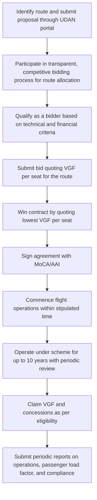

# Comprehensive Scheme Masterclass & File Guide

## Scheme Deep Dive

### Overview
The Modified UDAN Scheme (Regional Connectivity Scheme - RCS Udan) is a subsidy-based initiative implemented by the Ministry of Civil Aviation (MoCA) through the Airports Authority of India (AAI). It aims to enhance connectivity to underserved and unserved airports, make air travel affordable, and promote balanced regional growth. The scheme operates on a rolling basis with periodic bidding for routes and has no fixed annual deadline. The application portal is https://www.aai.aero/en/rcs-udan.

### Objectives
- Enhance connectivity to underserved and unserved airports  
- Make air travel more affordable for the common citizen  
- Make operations and connectivity sustainable through market-based mechanisms  
- Promote balanced regional growth and economic development  
- Support tourism, trade, and employment generation in remote areas  
- Encourage private sector participation through PPP and concessions  
- Develop aviation infrastructure in underserved regions  
- Ensure long-term viability of regional routes after initial government support  

### Eligibility Matrix
| Eligibility Criteria | Details |
|----------------------|---------|
| Eligible Entities | Scheduled airline operators (domestic and international airlines) |
| Qualification Basis | Transparent, competitive bidding process for specific routes |
| Technical Criteria | Aircraft suitability, operational capability, compliance with regulatory requirements set by MoCA and AAI |
| Financial Criteria | Must meet financial criteria set by MoCA and AAI |
| Preference | Given to zero-VGF bids, but operators can opt for VGF support if needed |
| Participation | Open to both domestic and international airlines, including code-sharing arrangements |
| Ineligibility | Cargo operators are not eligible for VGF under the scheme |

### Benefits & Financial Support
| Benefit Type | Details |
|--------------|---------|
| **Financial Support** | Viability Gap Funding (VGF) bridges the gap between operational costs and expected revenues on regional routes. VGF is determined via competitive bidding where airlines quote the lowest VGF per seat. Central government provides 80% of VGF (90% for North Eastern States and Union Territories) through the Regional Connectivity Fund (RCF). State governments provide the remaining share. VGF is indexed to ATF prices and inflation and is available for up to 10 years from commencement of operations. RCF is funded by a levy on domestic flights (excluding RCS, Cat II/Cat IIA, and small aircraft below 80 seats) and premiums from international route capacity entitlements. |
| **Financial Benefits** | VGF for up to 50% of aircraft capacity; concessional excise duty of 2% on ATF for three years; reimbursement of GST on RCS seats (for UDAN 1-3) |
| **Non-Financial Benefits** | Waiver of landing, parking, and Terminal Navigation Landing Charges (TNLC); nominal Route Navigation and Facilitation Charges (RNFC); permission for self-ground handling; freedom to enter code-share agreements with domestic and international airlines; provision of free security, fire, electricity, water, and utility services by state governments at concessional rates; state governments provide land free of cost and multi-modal hinterland connectivity |

### Application Process Flowchart

### Key Details from Evidence
- **Application Portal**: https://www.aai.aero/en/rcs-udan  
- **Contact Details**: Email: rcs@aai.aero | Contact No.: 91-11-24632950  
- **Status / Deadlines**: Rolling basis — bids are invited periodically for different routes; no fixed annual deadline.  
- **Last Updated**: 2026  
- **Geographic Scope**: Pan-India  
- **Implementing Agency**: Ministry of Civil Aviation (MoCA), implemented by Airports Authority of India (AAI)  
- **Target Beneficiaries**: Airline operators; passengers; underserved regions; unserved airports  
- **Required Documents**:  
  1. Certificate of Incorporation / Registration  
  2. Air Operator’s Permit (AOP)  
  3. Aircraft Registration and Airworthiness Certificates  
  4. Financial Statements and Bank Guarantees  
  5. Route Proposal Document  
  6. Bid Submission Form  
  7. Security Clearance (if applicable)  
  8. Undertaking for Compliance with Scheme Guidelines  
  9. Details of Aircraft Fleet and Seating Capacity  
  10. Operational Plan and Schedule  
- **Key Caveats**:  
  - VGF is provided only for a limited period (up to 10 years) and is subject to periodic review  
  - Operations must maintain minimum Passenger Load Factor (PLF) to continue receiving VGF  
  - Route may be withdrawn if not operated as per agreement  
  - Exclusivity period of 3 years on awarded routes prevents competition  
  - State government concessions (e.g., VAT on ATF ≤1%) are mandatory for route activation  
  - Only 50% of seats are eligible for fare caps; remaining seats are market-priced  
  - Cargo operators are not eligible for VGF under the scheme  

> **Important Note**: The scheme has operationalized 669 routes as of 15-05-2026, with 73-RCS Airports operationalized as of 03-02-2023, increasing to 75 by 15-09-2023 and 95 by 25-03-2026.

## Consultant's Field Guide to Generated Files

### 1. SCHEME_MASTER_DATABASE.md
**Real-time Usage:** Keep this open in a background tab during all client calls. When a client asks "What is the turnover limit?" or "Who administers this?", CTRL+F in this document to give an immediate, authoritative answer without checking the portal.

### 2. PITCH_AND_SALES_SCRIPTS.md
**Real-time Usage:** Open this file 5 minutes before your first Discovery Call with a lead. Read the "Problem Framing" out loud to hook them, then use the Qualification Checklist to interrogate their eligibility live on the phone. Keep the Objection Handlers table visible so you can immediately counter when they say "We're too small for this."

### 3. APPLICATION_PLAYBOOK.md
**Real-time Usage:** Print this out or pin it to your desktop once the client signs the retainer. Check off each box in "Stage 1" before moving to "Stage 2". Use the "Client Communication Template" to copy-paste directly into your email when chasing them for pending documents.

### 4. CLIENT_ONBOARDING_AND_CRM.md
**Real-time Usage:** Fill this out during or immediately after the onboarding call. Use the Needs Assessment to record their exact pain points. Update the "Compliance Status" table as they email you documents to maintain a single source of truth for what's missing.

### 5. LIVE_CASE_TRACKER.md
**Real-time Usage:** Review this document every morning during your standup. Update the "Stage" column daily. If a case hits "Stage 07 - Under review", use the Escalation Path notes here to know exactly who to call at the government department today.

### 6. FEE_AND_REVENUE_MODEL.md
**Real-time Usage:** Use this file when drafting the proposal. Look at the client's turnover, map them to the pricing tier in the table, and quote that exact Retainer and Success Fee. Use the monthly projection table to update your personal sales pipeline forecast for the quarter.

### 7. CLIENT_PROPOSAL_TEMPLATE.md
**Real-time Usage:** Copy this entire file, paste it into an email or PDF generator, replace the [PLACEHOLDER] tags with the client's actual details gathered from the CRM, and send it immediately after a successful discovery call.

### 8. COMPLIANCE_AND_LEGAL_PACK.md
**Real-time Usage:** Attach sections 8A and 8B as PDFs to the proposal email. Refuse to start Step 1 of the Application Playbook until the client signs these. Use the Disclaimers to protect yourself legally if the client is rejected by the government agency.