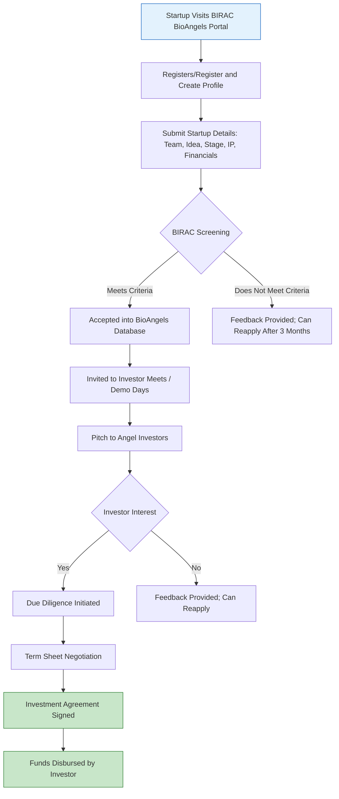

</think># Comprehensive Scheme Masterclass & File Guide

## Scheme Deep Dive

### Overview
The BIRAC BioAngels Network is an initiative under the Biotechnology Industry Research Assistance Council (BIRAC), a Public Sector Undertaking of the Department of Biotechnology (DBT), Ministry of Science and Technology, Government of India. It functions as a platform to connect early-stage biotechnology startups with angel investors, mentors, and industry experts to facilitate funding, guidance, and commercialization support.

### Objectives
- To bridge the funding gap for early-stage biotech startups by connecting them with accredited angel investors.
- To provide mentorship and strategic guidance to startups through experienced industry professionals.
- To foster innovation in the biotechnology sector by enabling access to capital and expertise.
- To create a sustainable ecosystem for biotech entrepreneurship in India.

### Eligibility Matrix
| Criteria | Details | Source |
|--------|---------|--------|
| **Applicant Type** | Biotechnology startups registered in India | [BIRAC BioAngels Network](https://birac.nic.in/bioangels.php) |
| **Stage of Startup** | Early-stage (idea to pre-revenue or early revenue) | [BIRAC BioAngels Network](https://birac.nic.in/bioangels.php) |
| **Sector Focus** | Biotechnology, life sciences, healthcare innovation, agri-biotech, industrial biotech | [BIRAC BioAngels Network](https://birac.nic.in/bioangels.php) |
| **Incorporation** | Must be a legally registered entity (Private Limited, LLP, etc.) under Indian law | [BIRAC BioAngels Network](https://birac.nic.in/bioangels.php) |
| **Founder Commitment** | Full-time commitment of founders to the venture | [BIRAC BioAngels Network](https://birac.nic.in/bioangels.php) |
| **IP Status** | Preference given to startups with filed or granted IP (patents, copyrights) | [BIRAC BioAngels Network](https://birac.nic.in/bioangels.php) |

> **Note**: While the scheme aims to support early-stage biotech ventures, final selection is at the discretion of the BioAngels Network members based on due diligence and investment thesis.

### Benefits & Financial Support
| Support Type | Details | Source |
|-------------|---------|--------|
| **Funding Access** | Introduction to accredited angel investors within the BioAngels Network for potential equity investment | [BIRAC BioAngels Network](https://birac.nic.in/bioangels.php) |
| **Mentorship** | Access to experienced mentors and industry experts for strategic guidance | [BIRAC BioAngels Network](https://birac.nic.in/bioangels.php) |
| **Networking Opportunities** | Participation in investor meets, demo days, and sector-specific forums | [BIRAC BioAngels Network](https://birac.nic.in/bioangels.php) |
| **Investment Readiness Support** | Assistance in refining pitch decks, financial models, and business plans | [BIRAC BioAngels Network](https://birac.nic.in/bioangels.php) |
| **No Direct Grant** | The scheme does not provide direct grants; it facilitates investor connections | [BIRAC BioAngels Network](https://birac.nic.in/bioangels.php) |

> **Important**: BIRAC BioAngels Network is a facilitation platform, not a funding scheme. It does not offer grants, subsidies, or direct financial aid. All investments are made directly by angel investors based on mutual agreement.

### Application Process
The application process involves online registration, profile submission, screening, and invitation to network events where startups can pitch to angel investors.

> **Key Points**:
> - Registration is free of cost.
> - Startups must maintain an updated profile to remain visible in the network.
> - BIRAC does not guarantee investment; it only facilitates introductions.
> - All investment terms are negotiated directly between the startup and the investor.
> - Confidentiality is maintained; investor details are shared only post-mutual interest.

### Application Portal
- **Official URL**: [https://birac.nic.in/bioangels.php](https://birac.nic.in/bioangels.php)
- **Note**: As of the latest crawl, the page returned a "File not found" error. Users are advised to visit the BIRAC homepage ([https://birac.nic.in](https://birac.nic.in)) and navigate to the BioAngels Network section or contact BIRAC directly for updated access.

> **Warning**: The inaccessibility of the dedicated portal URL may indicate temporary maintenance, restructuring, or discontinuation. Consultants should verify current status via BIRAC’s official communication channels before advising clients.

---

## Consultant's Field Guide to Generated Files

### 1. SCHEME_MASTER_DATABASE.md
**Real-time Usage:** Keep this open in a background tab during all client calls. When a client asks "What is the turnover limit?" or "Who administers this?", CTRL+F in this document to give an immediate, authoritative answer without checking the portal.

### 2. PITCH_AND_SALES_SCRIPTS.md
**Real-time Usage:** Open this file 5 minutes before your first Discovery Call with a lead. Read the "Problem Framing" out loud to hook them, then use the Qualification Checklist to interrogate their eligibility live on the phone. Keep the Objection Handlers table visible so you can immediately counter when they say "We're too small for this."

### 3. APPLICATION_PLAYBOOK.md
**Real-time Usage:** Print this out or pin it to your desktop once the client signs the retainer. Check off each box in "Stage 1" before moving to "Stage 2". Use the "Client Communication Template" to copy-paste directly into your email when chasing them for pending documents.

### 4. CLIENT_ONBOARDING_AND_CRM.md
**Real-time Usage:** Fill this out during or immediately after the onboarding call. Use the Needs Assessment to record their exact pain points. Update the "Compliance Status" table as they email you documents to maintain a single source of truth for what's missing.

### 5. LIVE_CASE_TRACKER.md
**Real-time Usage:** Review this document every morning during your standup. Update the "Stage" column daily. If a case hits "Stage 07 - Under review", use the Escalation Path notes here to know exactly who to call at the government department today.

### 6. FEE_AND_REVENUE_MODEL.md
**Real-time Usage:** Use this file when drafting the proposal. Look at the client's turnover, map them to the pricing tier in the table, and quote that exact Retainer and Success Fee. Use the monthly projection table to update your personal sales pipeline forecast for the quarter.

### 7. CLIENT_PROPOSAL_TEMPLATE.md
**Real-time Usage:** Copy this entire file, paste it into an email or PDF generator, replace the [PLACEHOLDER] tags with the client's actual details gathered from the CRM, and send it immediately after a successful discovery call.

### 8. COMPLIANCE_AND_LEGAL_PACK.md
**Real-time Usage:** Attach sections 8A and 8B as PDFs to the proposal email. Refuse to start Step 1 of the Application Playbook until the client signs these. Use the Disclaimers to protect yourself legally if the client is rejected by the government agency.