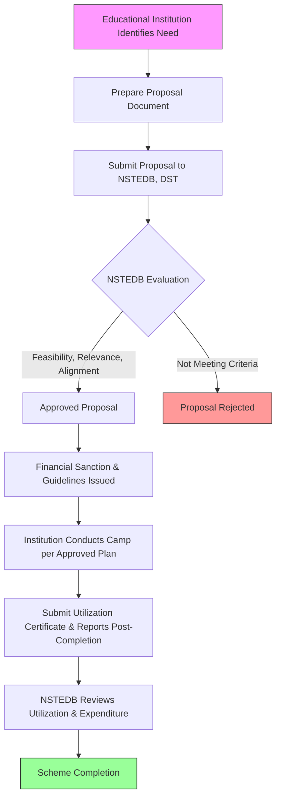

# Comprehensive Scheme Masterclass & File Guide

## Scheme Deep Dive

### Overview
The NSTEDB Entrepreneurship Awareness Camps is a grant scheme implemented by the National Science and Technology Entrepreneurship Development Board (NSTEDB), Department of Science and Technology (DST), Ministry of Science and Technology. The scheme aims to promote entrepreneurship awareness among students and youth through educational institutions. It provides financial support as grant-in-aid to educational institutions for organizing Entrepreneurship Awareness Camps. The scheme has been active since 1970 and operates on a pan-India geographic scope.

### Objectives
- Create awareness about entrepreneurship as a career option among students and youth
- Promote innovation and entrepreneurial mindset in educational institutions
- Encourage the establishment of startups and small enterprises
- Provide information about government schemes and support mechanisms for entrepreneurs
- Foster linkages between academia, industry, and financial institutions for entrepreneurial support

### Eligibility Matrix
| Eligibility Criteria | Details | Source |
|----------------------|---------|--------|
| Eligible Institutions | Universities, colleges, polytechnics, and technical institutions | KEY FACTS |
| Infrastructure Requirement | Institutions must have necessary infrastructure to conduct such programs | KEY FACTS |
| Faculty Requirement | Institutions must have faculty capable of conducting entrepreneurship awareness programs | KEY FACTS |
| Preference Criteria | Preference may be given to institutions in backward regions or those serving underrepresented groups | KEY FACTS |
| Target Beneficiaries | Students, youth, and educational institutions | KEY FACTS |

### Benefits & Financial Support
| Support Type | Details | Coverage | Source |
|--------------|---------|----------|--------|
| Financial Support | Grant-in-aid to educational institutions for organizing Entrepreneurship Awareness Camps | Covers honorarium for resource persons and coordinators, TA/DA for participants, printing of study materials, venue expenses, and other incidental costs | KEY FACTS |
| Quantum of Support | Varies based on scale and duration of the camp, subject to NSTEDB guidelines | Exact amount not fixed; determined case-by-case | KEY FACTS |
| Non-Financial Benefits | Access to expert resource persons, networking opportunities with industry and financial institutions, exposure to government schemes for entrepreneurship support | Provides ecosystem access beyond direct funding | KEY FACTS |

### Application Process

**Application Portal**: Applications are submitted directly to NSTEDB, DST. While no specific online portal URL is provided in the evidence, the scheme details, the DST website (https://dst.gov.in) serves as the primary gateway for scheme information and contact.

**Key Process Notes**:
- Proposals must include: objectives, target audience, duration, resource persons, budget estimate, and expected outcomes
- Evaluation criteria: feasibility, relevance, and alignment with scheme objectives
- Post-implementation requirement: utilization certificates and audited statements of expenditure
- Funds must be utilized strictly for approved purpose within stipulated time frame
- Scheme does not support recurring or ongoing entrepreneurial activities beyond the awareness camp

### Key Caveats
> **Financial Support Subject to Availability**: Financial support is subject to availability of funds and approval by NSTEDB
> 
> **Mandatory Reporting**: Institutions must submit utilization reports and audited statements of expenditure after the camp
> 
> **Strict Utilization**: Funds must be utilized strictly for the approved purpose and within the stipulated time frame
> 
> **Scope Limitation**: The scheme does not support recurring or ongoing entrepreneurial activities beyond the awareness camp

### Important URLs
- **Primary Scheme Information**: https://dst.gov.in/nstedb (Note: This URL returned "Page not found" in crawl, but is referenced as the scheme's administrative page)
- **DST Main Portal**: https://dst.gov.in
- **Applications Throughout Year**: https://dst.gov.in/announcement/applications-invited-throughout-year
- **DST Schemes Page**: https://dst.gov.in/schemes-programmes

## Consultant's Field Guide to Generated Files

### 1. SCHEME_MASTER_DATABASE.md
**Real-time Usage**: Keep this open in a background tab during all client calls. When a client asks "What is the turnover limit?" or "Who administers this?", CTRL+F in this document to give an immediate, authoritative answer without checking the portal.

### 2. PITCH_AND_SALES_SCRIPTS.md
**Real-time Usage**: Open this file 5 minutes before your first Discovery Call with a lead. Read the "Problem Framing" out loud to hook them, then use the Qualification Checklist to interrogate their eligibility live on the phone. Keep the Objection Handlers table visible so you can immediately counter when they say "We're too small for this."

### 3. APPLICATION_PLAYBOOK.md
**Real-time Usage**: Print this out or pin it to your desktop once the client signs the retainer. Check off each box in "Stage 1" before moving to "Stage 2". Use the "Client Communication Template" to copy-paste directly into your email when chasing them for pending documents.

### 4. CLIENT_ONBOARDING_AND_CRM.md
**Real-time Usage**: Fill this out during or immediately after the onboarding call. Use the Needs Assessment to record their exact pain points. Update the "Compliance Status" table as they email you documents to maintain a single source of truth for what's missing.

### 5. LIVE_CASE_TRACKER.md
**Real-time Usage**: Review this document every morning during your standup. Update the "Stage" column daily. If a case hits "Stage 07 - Under review", use the Escalation Path notes here to know exactly who to call at the government department today.

### 6. FEE_AND_REVENUE_MODEL.md
**Real-time Usage**: Use this file when drafting the proposal. Look at the client's turnover, map them to the pricing tier in the table, and quote that exact Retainer and Success Fee. Use the monthly projection table to update your personal sales pipeline forecast for the quarter.

### 7. CLIENT_PROPOSAL_TEMPLATE.md
**Real-time Usage**: Copy this entire file, paste it into an email or PDF generator, replace the [PLACEHOLDER] tags with the client's actual details gathered from the CRM, and send it immediately after a successful discovery call.

### 8. COMPLIANCE_AND_LEGAL_PACK.md
**Real-time Usage**: Attach sections 8A and 8B as PDFs to the proposal email. Refuse to start Step 1 of the Application Playbook until the client signs these. Use the Disclaimers to protect yourself legally if the client is rejected by the government agency.