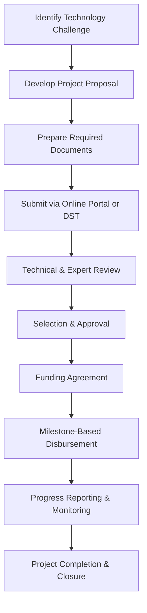

</think># Comprehensive Scheme Masterclass & File Guide

## Scheme Deep Dive

### Overview
**Mission Innovation India** is a pan-India innovation grant scheme administered by the **Department of India** under the Ministry of Innovation Grants. The scheme is designed to accelerate clean energy innovation by providing financial and technical support to eligible entities working on innovative clean energy technologies aligned with national goals.

### Objectives
- Accelerate clean energy innovation through increased public and private investment  
- Demonstrate scalable clean energy technologies at pilot and commercial scale  
- Strengthen international collaboration in clean energy research and development  
- Support early-stage startups and SMEs in the clean energy sector  
- Enhance capacity building and skill development in clean energy technologies  

### Eligibility Matrix
| Eligible Entity Type       | Specific Criteria                                                                 | Notes                                                                 |
|----------------------------|---------------------------------------------------------------------------------|-----------------------------------------------------------------------|
| Indian Startups            | Must be registered in India; working on innovative clean energy technologies     | Early-stage focus                                                     |
| MSMEs                      | Must meet MSME definition; engaged in clean energy R&D or demonstration          | Up to 50% cost coverage                                               |
| Academic Institutions      | Universities, colleges, or research bodies in India                              | Up to 100% cost coverage                                              |
| Research Organizations     | Recognized R&D labs or institutes                                               | Up to 100% cost coverage                                              |
| Industry Partners          | Companies investing in clean energy innovation                                  | Up to 50% cost coverage; must demonstrate scalability and impact      |
| Collaborating Partners     | Domestic or international entities (if applicable)                              | Details must be provided in application                               |

> **Key Caveats**  
> - Funding is subject to availability of budgetary allocations  
> - Projects must comply with environmental and safety regulations  
> - Intellectual property generated may be subject to government-use clauses  
> - Progress reports and utilization certificates are mandatory for continued funding  

### Benefits & Financial Support
| Support Type               | Details                                                                 | Coverage Coverage
|----------------------------|-------------------------------------------------------------------------|------|
| Financial Grant            | Disbursed in milestones based on project progress                       | Up to 100% for academic/research institutions; up to 50% for industry partners |
| Testing & Validation       | Access to government-approved testing and validation facilities         | Available for pilot and demonstration projects |
| Mentorship                 | Guidance from subject-matter experts                                    | Throughout project lifecycle |
| International Collaboration| Facilitation of partnerships with global clean energy initiatives       | Encouraged for knowledge exchange |
| Technology Transfer        | Support for scaling and commercialization of developed technologies     | Includes facilitation of IP management and market linkage |

### Application Process

#### Step-by-Step Breakdown
1. **Identify a relevant technology challenge or innovation gap in clean energy**  
2. **Develop a project proposal aligned with Mission Innovation India’s thematic areas**  
3. **Submit the proposal through the designated online portal or via the Department of Science and Technology (DST)**  
4. **Proposals undergo technical and expert review**  
5. **Selected projects are approved for funding and monitoring**  
6. **Funds are released in stages based on project progress**  

#### Required Documents
1. Project proposal detailing objectives, methodology, and expected outcomes  
2. Budget breakdown and justification  
3. Technical feasibility report  
4. Information on applicant organization (registration, PAN, etc.)  
5. Details of collaborating partners (if any)  
6. Intellectual property status and management plan  

> **Application Portal**: [https://dst.gov.in/mission-innovation-india](https://dst.gov.in/mission-innovation-india) *(Note: Verify current URL as portal may be updated)*  
> **Source**: Scheme Key Facts (row-103), Confidence: low  

---

## Consultant's Field Guide to Generated Files

### 1. SCHEME_MASTER_DATABASE.md
**Real-time Usage:** Keep this open in a background tab during all client calls. When a client asks "What is the turnover limit?" or "Who administers this?", CTRL+F in this document to give an immediate, authoritative answer without checking the portal.

### 2. PITCH_AND_SALES_SCRIPTS.md
**Real-time Usage:** Open this file 5 minutes before your first Discovery Call with a lead. Read the "Problem Framing" out loud to hook them, then use the Qualification Checklist to interrogate their eligibility live on the phone. Keep the Objection Handlers table visible so you can immediately counter when they say "We're too small for this."

### 3. APPLICATION_PLAYBOOK.md
**Real-time Usage:** Print this out or pin it to your desktop once the client signs the retainer. Check off each box in "Stage 1" before moving to "Stage 2". Use the "Client Communication Template" to copy-paste directly into your email when chasing them for pending documents.

### 4. CLIENT_ONBOARDING_AND_CRM.md
**Real-time Usage:** Fill this out during or immediately after the onboarding call. Use the Needs Assessment to record their exact pain points. Update the "Compliance Status" table as they email you documents to maintain a single source of truth for what's missing.

### 5. LIVE_CASE_TRACKER.md
**Real-time Usage:** Review this document every morning during your standup. Update the "Stage" column daily. If a case hits "Stage 07 - Under review", use the Escalation Path notes here to know exactly who to call at the government department today.

### 6. FEE_AND_REVENUE_MODEL.md
**Real-time Usage:** Use this file when drafting the proposal. Look at the client's turnover, map them to the pricing tier in the table, and quote that exact Retainer and Success Fee. Use the monthly projection table to update your personal sales pipeline forecast for the quarter.

### 7. CLIENT_PROPOSAL_TEMPLATE.md
**Real-time Usage:** Copy this entire file, paste it into an email or PDF generator, replace the [PLACEHOLDER] tags with the client's actual details gathered from the CRM, and send it immediately after a successful discovery call.

### 8. COMPLIANCE_AND_LEGAL_PACK.md
**Real-time Usage:** Attach sections 8A and 8B as PDFs to the proposal email. Refuse to start Step 1 of the Application Playbook until the client signs these. Use the Disclaimers to protect yourself legally if the client is rejected by the government agency.