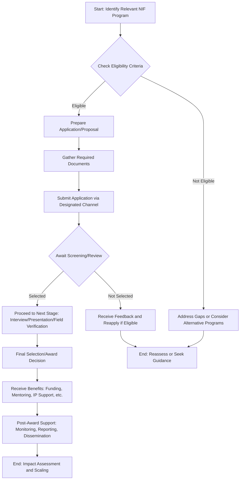

# Comprehensive Scheme Masterclass & File Guide

## Scheme Deep Dive

### Overview
The National Innovation Foundation (NIF) - India is India's national initiative to strengthen grassroots technological innovations and outstanding traditional knowledge. Established in March 2000 with the support of the Department of Science and Technology (DST), Government of India, NIF serves as an autonomous body under DST. Its core mission is to help India become inventive and creative, and to become a global leader in sustainable technologies without social and economic handicaps affecting the evolution and diffusion of green grassroots innovations. NIF actively scouts, supports, and spawns grassroots technological innovations developed by individuals and local communities across any technological field, facilitating human survival without reliance on the formal sector. It ensures that grassroots innovators and traditional knowledge holders receive due recognition, respect, and reward for their work, and strives to widely diffuse these innovations through commercial and/or non-commercial channels, thereby generating incentives for them and others involved in the value chain.

### Objectives
The primary objectives of NIF, as set by the Department of Science & Technology (DST) in March 2000, are:
- To help India become an innovative and creative society and global leader in sustainable technologies by scouting, spawning and sustaining grassroots level innovations.
- To ensure evolution and diffusion of green grassroots innovations in a time bound and a mission oriented manner so as to meet the socio-economic and environmental needs of our society.
- To facilitate scaling up of grassroots innovations and traditional knowledge with or without value addition through commercial and / or non-commercial channels.
- To influence public policy and conduct, co-ordinate and support research, design and development efforts in the country on grassroots innovations so as to attain and maintain technological competitiveness of farmers, artisans, mechanics etc., in the informal sector.
- To enable protection of the intellectual property rights of the knowledge holders wherever applicable and upholding their Prior Informed Consent (PIC) before transferring their technology to any third party, ensuring in the process a fair and just benefit sharing.
- To build linkages between excellence in formal scientific systems and informal knowledge systems and create a knowledge network to link various stakeholders through applications of information technologies and also otherwise.
- To promote wider social awareness and applications of innovations and traditional knowledge and encourage their incorporation in educational curriculum, developmental policies and programs.

### Eligibility Matrix
NIF's eligibility criteria vary depending on the specific program or initiative. Based on the evidence, the following eligibility criteria apply to key NIF programs:

| Program/Initiative | Eligibility Criteria | Source |
|--------------------|----------------------|--------|
| **Expression of Interest (EOI) from Institutions/Organisations** | Registered Indian organisation with experience in science, technology, innovation based documentation and/or dissemination or similar nature; demonstrable competency in undertaking same/similar activities through projects and credentials of core team members | [Scouting, Documentation and Database Management (SDDM)](https://nif.org.in/sd) |
| **Internship Programme for Scouting and Documentation of Grassroots Innovations (GRIs)** | Students doing Graduation or Master Degree in Science, Engineering, Social Science, Development studies etc.; strong passion for working in rural India for grassroots innovation, sustainable development, and social impact; excellent research, analytical, and documentation skills; ability to work independently and in a team; proficiency in written and spoken English and local language; prior experience in fieldwork, community engagement, or social impact projects preferable | [Internship Programme](https://nif.org.in/sd) |
| **INSPIRE - MANAK Scheme** | Students from all government or private schools across the country, irrespective of educational boards (national and state); must submit original and creative technological ideas/innovations focusing on common problems and come up with solutions on their own (household or for porters, labourers, society etc.) | [INSPIRE - MANAK](https://nif.org.in/inspire-awards) |
| **Biennial National Grassroots Innovation Awards** | Grassroots innovators and outstanding traditional knowledge holders from across India; innovations must be need-based, cost-effective, and sustainable solutions originating from first-hand experience of problems | [Business Development](https://nif.org.in/bd) |
| **Technology Transfer and Commercialisation** | Grassroots innovators with innovations having business potential; innovations must be need-based, cost-effective, and sustainable solutions | [Business Development](https://nif.org.in/bd) |
| **Dissemination and Social Diffusion (DSD) Projects** | Grassroots innovators with technologies suitable for dissemination; innovators must be willing to hand over rights of their technologies to NIF for social diffusion | [Dissemination and Social Diffusion (DSD)](https://nif.org.in/dsd) |

### Benefits & Financial Support
NIF provides various forms of support to grassroots innovators and traditional knowledge holders, including financial assistance, mentoring, prototyping support, intellectual property protection, and technology transfer facilitation. The following table summarizes the benefits and financial support based on evidence:

| Benefit/Support Type | Details | Source |
|----------------------|---------|--------|
| **Financial Support for Prototyping and Product Development** | NIF provides technical and financial support to innovators to improve design, performance, and marketability of innovations during prototyping/product development phase | [VARD and IPM – Engineering](https://nif.org.in/vard_engineering) |
| **Micro Venture Innovation Fund (MVIF)** | Provided risk capital to 238 innovation-based enterprise projects; supported by SIDBI | [About NIF](https://nif.org.in/aboutnif) |
| **Technology Licensing Revenue Sharing** | Innovators receive revenue shares from technology licensing (e.g., Aaruni Cart: Rs 21,000, 23,000, 40,000 to three entrepreneurs; Beauty Care Umbrella: upfront fee of Rs 2 lacs for India marketing rights and Rs 3 lacs for abroad + 6% royalty; Cassava Peeling Machine: upfront fee of Rs 85,000 + 2% royalty + 30% national equity stake for innovator and NIF North East Cell) | [Business Development](https://nif.org.in/bd) |
| **Direct Benefit Transfer (DBT) under INSPIRE - MANAK** | Disbursement of INR 10,000 into bank accounts of students | [INSPIRE - MANAK](https://nif.org.in/inspire-awards) |
| **Internship Stipend** | Monthly stipend provided to cover travel expenses, stationary, postage, etc. | [Internship Programme](https://nif.org.in/sd) |
| **Certificate of Completion** | Provided upon successful completion of internship | [Internship Programme](https://nif.org.in/sd) |
| **Recognition and Awards** | National awards, state awards, consolation awards, appreciation awards, lifetime achievement award, partnership award; cash prizes (e.g., GYTI Awards: 15 students awarded Rs 15 lakh each by DBT, 100 students awarded Rs 1 lakh each) | [Festival of Innovation and Entrepreneurship 2019](https://nif.org.in/fine-2018), [INSPIRE - MANAK](https://nif.org.in/inspire-awards) |
| **Intellectual Property Rights (IPR) Protection** | Facilitation of patent filing, design registrations, trademark applications, PPV & FRA applications; NIF has filed over 1,478 patent applications (including 8 in USA and 28 PCT), with 725 patents granted in India and 5 in USA; 24 Design registrations and 11 trademark applications; 95 PPV & FRA applications filed, 44 registered | [About NIF](https://nif.org.in/aboutnif) |
| **Technology Dissemination and Diffusion** | Facilitation of diffusion of grassroots innovations through commercial and/or non-commercial channels; examples include transplantation of 20,000 HRMN 99 apple saplings to 1500+ farmers' fields and 25 organizations in 30 states; later 65,000 HRMN apple saplings across North Eastern states; 15,000 apple saplings distributed in Bihar | [Dissemination and Social Diffusion (DSD)](https://nif.org.in/dsd) |
| **Incubation and Entrepreneurship Support** | NIF Incubation and Entrepreneurship Council (NIF-ientreC) provides in situ and ex situ mentoring, business guidance, technology transfer and commercialisation support, technology prototyping and validation | [Business Development](https://nif.org.in/bd) |
| **Capacity Building Workshops** | Training programs on grassroots innovations, internship opportunities, skill development for students and innovators | [Capacity Building Workshop PDF](1782807081-pdf.pdf), [Enhancement of Livelihood and Drudgery Reduction Workshop PDF](1782807029-pdf.pdf) |
| **Participatory On-Farm Trials** | Free seeds provided to farmers for trials (e.g., PARVATI SUT-27 rice variety: 43 selected farmers received seeds at no cost) | [Participatory On-Farm Trials PDF](1782807136-pdf.pdf) |
| **Technology Demonstration Camps** | Live demonstrations of grassroots innovations in remote areas to familiarize participants with features, utility, and benefits | [Technology Demonstration Camps PDF](1782981850-pdf.pdf) |
| **Training Programmes** | Hands-on training and live demonstrations to enhance occupational safety, improve efficiency, and reduce physical drudgery (e.g., Multi Tree Climber training for 30 Goud community members) | [Multi Tree Climber Training PDF](1782981595-pdf.pdf) |

### Application Process
The application process varies significantly depending on the specific NIF program. Below is a generalized flowchart illustrating the typical stages for key NIF initiatives such as the Expression of Interest (EOI) from institutions, internship programs, and award nominations.

**Key Application Channels:**
- **Expression of Interest (EOI) from Institutions/Organisations**: Submit via email to vivekkumar@nifindia.org or campaign@nifindia.org, or by post to: Dr Vivek Kumar, Scientist F, National Innovation Foundation - India, Amrapur, Gandhinagar-Mahudi Road, Gandhinagar, Gujarat-382650
- **Internship Programme**: Submit comprehensive resume/CV via Google Form: https://forms.gle/sbkYtzhAVzfVVrA5A
- **INSPIRE - MANAK Scheme**: Nominations submitted online through E-MIAS portal: www.inspireawards-dst.gov.in
- **Biennial National Grassroots Innovation Awards**: Entries solicited through national campaigns; details available on NIF website during campaign periods
- **Technology Transfer and Commercialisation**: Initiated through Business Development (BD) department; innovators can express interest via NIF website or direct contact
- **Dissemination and Social Diffusion (DSD) Projects**: Innovators willing to hand over rights sign agreement with NIF; details available through DSD department

**Important Deadlines:**
- Entries for 15th National Biennial Campaign for Green Grassroots unaided Technological Innovations, Ideas & Outstanding Traditional Knowledge are open till 31st March 2027 (as per NIF homepage)
- INSPIRE - MANAK: Nominations for F.Y 2024-25 are now closed (as per INSPIRE - MANAK page)
- Biennial Awards: Typically announced biennially; 11th Biennial awards presented on 10th April 2023; 10th Biennial awards presented on 15th March 2019

**Application Portal URL:** https://nif.org.in  
**Key Sources:**  
- NIF Homepage: https://nif.org.in  
- Scouting, Documentation and Database Management (SDDM): https://nif.org.in/sd  
- INSPIRE - MANAK: https://nif.org.in/inspire-awards  
- Business Development: https://nif.org.in/bd  
- Dissemination and Social Diffusion (DSD): https://nif.org.in/dsd  
- About NIF: https://nif.org.in/aboutnif  
- VARD and IPM – Engineering: https://nif.org.in/vard_engineering  
- Festival of Innovation and Entrepreneurship 2019: https://nif.org.in/fine-2018  
- Festival of Innovation and Entrepreneurship 2023: fine-2023-report.pdf  
- Internship Programme: https://nif.org.in/sd  
- Participatory On-Farm Trials: 1782807136-pdf.pdf  
- Technology Demonstration Camps: 1782981850-pdf.pdf  
- Multi Tree Climber Training: 1782981595-pdf.pdf  
- Capacity Building Workshop: 1782807081-pdf.pdf  
- Enhancement of Livelihood and Drudgery Reduction Workshop: 1782807029-pdf.pdf  

> **Blockquote: Key Takeaways for Consultants**  
> - NIF operates through multiple specialized departments (SDDM, VARD, BD, DSD, etc.), each managing distinct programs with unique eligibility criteria and application processes.  
> - Financial support is often indirect (e.g., revenue sharing from licensing, prototyping support) rather than direct grants, except for specific schemes like INSPIRE - MANAK (INR 10,000 DBT).  
> - The Biennial National Grassroots Innovation Awards are a flagship recognition program with significant prestige, often leading to further awards like Padma Shri.  
> - Technology transfer and commercialisation are central to NIF's model, with numerous success stories demonstrating revenue generation for innovators.  
> - Consultants must verify the specific program's current status and deadlines directly on the NIF website, as campaigns and schemes operate on cyclical timelines.  
> - NIF emphasizes Prior Informed Consent (PIC) and fair benefit sharing in all technology transfer and commercialisation activities.  

## Consultant's Field Guide to Generated Files

### 1. SCHEME_MASTER_DATABASE.md
**Real-time Usage:** Keep this open in a background tab during all client calls. When a client asks "What is the turnover limit?" or "Who administers this?", CTRL+F in this document to give an immediate, authoritative answer without checking the portal.

### 2. PITCH_AND_SALES_SCRIPTS.md
**Real-time Usage:** Open this file 5 minutes before your first Discovery Call with a lead. Read the "Problem Framing" out loud to hook them, then use the Qualification Checklist to interrogate their eligibility live on the phone. Keep the Objection Handlers table visible so you can immediately counter when they say "We're too small for this."

### 3. APPLICATION_PLAYBOOK.md
**Real-time Usage:** Print this out or pin it to your desktop once the client signs the retainer. Check off each box in "Stage 1" before moving to "Stage 2". Use the "Client Communication Template" to copy-paste directly into your email when chasing them for pending documents.

### 4. CLIENT_ONBOARDING_AND_CRM.md
**Real-time Usage:** Fill this out during or immediately after the onboarding call. Use the Needs Assessment to record their exact pain points. Update the "Compliance Status" table as they email you documents to maintain a single source of truth for what's missing.

### 5. LIVE_CASE_TRACKER.md
**Real-time Usage:** Review this document every morning during your standup. Update the "Stage" column daily. If a case hits "Stage 07 - Under review", use the Escalation Path notes here to know exactly who to call at the government department today.

### 6. FEE_AND_REVENUE_MODEL.md
**Real-time Usage:** Use this file when drafting the proposal. Look at the client's turnover, map them to the pricing tier in the table, and quote that exact Retainer and Success Fee. Use the monthly projection table to update your personal sales pipeline forecast for the quarter.

### 7. CLIENT_PROPOSAL_TEMPLATE.md
**Real-time Usage:** Copy this entire file, paste it into an email or PDF generator, replace the [PLACEHOLDER] tags with the client's actual details gathered from the CRM, and send it immediately after a successful discovery call.

### 8. COMPLIANCE_AND_LEGAL_PACK.md
**Real-time Usage:** Attach sections 8A and 8B as PDFs to the proposal email. Refuse to start Step 1 of the Application Playbook until the client signs these. Use the Disclaimers to protect yourself legally if the client is rejected by the government agency.