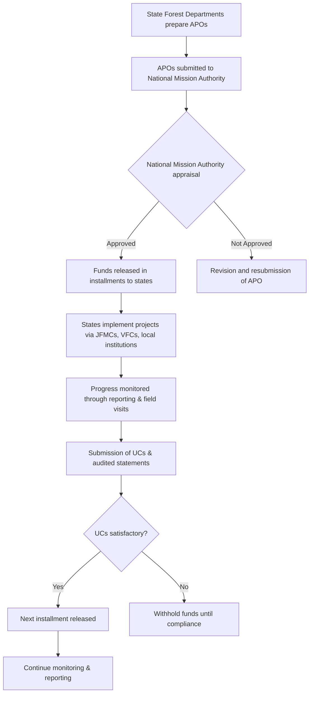

# Comprehensive Scheme Masterclass & File Guide

## Scheme Deep Dive

### Scheme Overview
The **Green India Mission (GIM)**, identified by Scheme ID `row-106`, is a **grant-type** scheme under the **Carbon & Environment** category, implemented pan-India by the **Ministry of Environment, Forest and Climate Change (MoEF&CC)**. The scheme operates on an **annual planning cycle**, with Annual Plans of Operations (APOs) typically submitted before the start of each financial year for approval. The scheme was last updated in **2024**.

### Objectives
The mission aims to:
- Increase forest/tree cover by **5 million hectares (mha)** and improve the quality of forest/tree cover on another **5 mha** of forest/non-forest lands.
- Enhance ecosystem services, including carbon sequestration and storage, hydrological services, and biodiversity.
- Increase forest-based livelihood income for approximately **3 million households**.
- Enhance carbon dioxide sequestration by **50-60 million tonnes by 2020**.
- Promote holistic development through convergence with other missions and schemes.
- Strengthen capacity building and training for stakeholders.
- Ensure monitoring and evaluation through robust mechanisms.

### Eligibility Matrix
| Eligible Entities | Description |
|-------------------|-------------|
| State Forest Departments | Primary implementing agencies |
| Joint Forest Management Committees (JFMCs) | Local community-based forest management bodies |
| Village Forest Committees (VFCs) | Grassroots-level forest conservation groups |
| Panchayati Raj Institutions (PRIs) | Local self-governance bodies at village, block, and district levels |
| NGOs | Non-governmental organizations engaged in afforestation and conservation |
| Local Communities | Forest-dependent and other local communities participating in mission activities |

**Target Beneficiaries**: Forest-dependent communities, local communities, PRIs, JFMCs, NGOs, and state forest departments.

### Benefits & Financial Support
| Benefit Category | Details |
|------------------|---------|
| Financial Assistance | Grants provided to state forest departments and implementing agencies for afforestation, reforestation, and eco-restoration activities. Funds released based on approved APOs and utilization certificates. |
| Covered Costs | Plantation, maintenance, soil and moisture conservation, and community mobilization. |
| Capacity Building | Training and skill development for stakeholders. |
| Livelihood Opportunities | Enhanced income through non-timber forest produce (NTFP) and eco-tourism. |
| Ecosystem Services | Improved water conservation, soil erosion control, biodiversity conservation, and carbon sequestration. |
| Climate Goals | Contribution to national climate change mitigation via carbon sequestration. |

**Financial Support Mechanism**:  
Funds are disbursed in installments upon approval of APOs. Subsequent releases are contingent on submission of utilization certificates (UCs) and audited statements of expenditure, ensuring satisfactory utilization of prior installments.

### Required Documents
1. Annual Plan of Operations (APO)  
2. Perspective Plan for the state  
3. Utilization Certificates (UCs)  
4. Audited Statements of Expenditure  
5. Progress Reports (physical and financial)  
6. Geo-tagged photographs of plantation sites  
7. Minutes of JFMC/VFC meetings  
8. Land records and community consent documents  

### Application Process (Mermaid Flowchart)

**Application Portal**: [https://moef.gov.in/](https://moef.gov.in/)  
**Key Source**: Scheme Key Facts (extracted structured data)

### Key Caveats
> - Funds released subject to satisfactory utilization of previous installments and submission of utilization certificates.  
> - Projects must conform to approved perspective plan and annual plans of operations.  
> - Afforestation must use native and ecologically appropriate species.  
> - Land tenure and community rights must be respected; no activities on disputed or private land without consent.  
> - Mission convergence with other schemes (e.g., MGNREGA, CAMPA) is encouraged for optimal resource use.

---

## Consultant's Field Guide to Generated Files

### 1. SCHEME_MASTER_DATABASE.md
**Real-time Usage**: Keep this open in a background tab during all client calls. When a client asks "What is the turnover limit?" or "Who administers this?", CTRL+F in this document to give an immediate, authoritative answer without checking the portal.

### 2. PITCH_AND_SALES_SCRIPTS.md
**Real-time Usage**: Open this file 5 minutes before your first Discovery Call with a lead. Read the "Problem Framing" out loud to hook them, then use the Qualification Checklist to interrogate their eligibility live on the phone. Keep the Objection Handlers table visible so you can immediately counter when they say "We're too small for this."

### 3. APPLICATION_PLAYBOOK.md
**Real-time Usage**: Print this out or pin it to your desktop once the client signs the retainer. Check off each box in "Stage 1" before moving to "Stage 2". Use the "Client Communication Template" to copy-paste directly into your email when chasing them for pending documents.

### 4. CLIENT_ONBOARDING_AND_CRM.md
**Real-time Usage**: Fill this out during or immediately after the onboarding call. Use the Needs Assessment to record their exact pain points. Update the "Compliance Status" table as they email you documents to maintain a single source of truth for what's missing.

### 5. LIVE_CASE_TRACKER.md
**Real-time Usage**: Review this document every morning during your standup. Update the "Stage" column daily. If a case hits "Stage 07 - Under review", use the Escalation Path notes here to know exactly who to call at the government department today.

### 6. FEE_AND_REVENUE_MODEL.md
**Real-time Usage**: Use this file when drafting the proposal. Look at the client's turnover, map them to the pricing tier in the table, and quote that exact Retainer and Success Fee. Use the monthly projection table to update your personal sales pipeline forecast for the quarter.

### 7. CLIENT_PROPOSAL_TEMPLATE.md
**Real-time Usage**: Copy this entire file, paste it into an email or PDF generator, replace the [PLACEHOLDER] tags with the client's actual details gathered from the CRM, and send it immediately after a successful discovery call.

### 8. COMPLIANCE_AND_LEGAL_PACK.md
**Real-time Usage**: Attach sections 8A and 8B as PDFs to the proposal email. Refuse to start Step 1 of the Application Playbook until the client signs these. Use the Disclaimers to protect yourself legally if the client is rejected by the government agency.