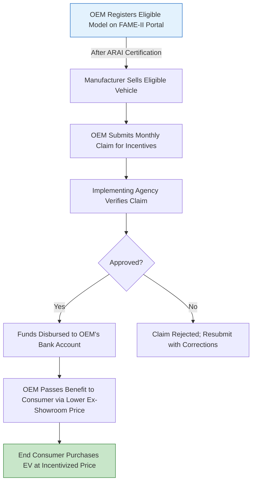

</think># Comprehensive Scheme Masterclass & File Guide

## Scheme Deep Dive

### Scheme Overview
**Scheme Name:** Faster Adoption of Manufacturing of Hybrid and Electric Vehicles (FAME)  
**Scheme ID:** row-107  
**Ministry / Category:** Carbon & Environment  
**Scheme Type:** Subsidy  
**Geographic Scope:** Pan-India  
**Implementing Agency:** Department of Heavy Industry, Ministry of Heavy Industries and Public Enterprises  
**Application Portal:** [https://fame2.heavyindustries.gov.in](https://fame2.heavyindustries.gov.in)  
**Status / Deadlines:** Valid until March 31, 2024, or until exhaustion of funds, whichever occurs earlier  
**Last Updated:** 2024  
**Fund Size:** ₹10,000 Crore  

### Objectives
- Incentivize adoption of hybrid and electric vehicles in India  
- Develop charging infrastructure for electric vehicles  
- Encourage domestic manufacturing of electric vehicles and components  
- Reduce dependence on fossil fuels and curb vehicular emissions  
- Create demand for electric vehicles through upfront incentives  
- Support pilot projects for electric buses and other commercial vehicles  

### Eligibility Matrix
| Beneficiary Type | Eligibility Criteria | Key Requirements |
|------------------|----------------------|------------------|
| **Electric Two-Wheelers** | ARAI-approved; meets performance & localization criteria | Max 15 kWh battery; incentive: ₹10,000 per kWh |
| **Electric Three-Wheelers** | ARAI-approved; meets performance & localization criteria | Max 10 kWh battery; incentive: ₹20,000 per kWh |
| **Electric Four-Wheelers** | ARAI-approved; meets performance & localization criteria | Max 15 kWh battery; incentive: ₹10,000 per kWh |
| **Electric Buses** | Used for public/commercial transport; ARAI-approved | >12 meters: up to ₹20 lakhs per bus |
| **Electric Trucks** | Used for public/commercial transport; ARAI-approved | Subject to specific performance & localization norms |
| **OEMs/Manufacturers** | Registered under FAME-II; models on approved list | Must enroll vehicles on FAME-II portal post-ARAI certification |
| **Individual Consumers** | Must purchase from OEMs enrolled under FAME-II | Cannot claim subsidy directly; benefit passed via reduced ex-showroom price |
| **Public Transport Operators** | Fleet used for public transport | Eligible for buses/trucks meeting FAME-II criteria |
| **Fleet Operators** | Commercial fleet operators | Eligible for goods/passenger vehicles under scheme |
| **Institutional Buyers** | Govt./PSU/private institutions buying EVs | Must procure from FAME-II enrolled OEMs |
| **Charging Infrastructure Entities** | Govt., PSUs, private players | Separate guidelines apply; subsidies for setting up stations |

> **Key Caveats:**  
> - Incentives available only for vehicles manufactured by OEMs enrolled under FAME-II  
> - Subsidy is passed to consumer; **cannot be claimed directly by end users**  
> - Funds limited; scheme may close early if budget exhausted before March 31, 2024  
> - Only vehicles with specified battery capacity & performance criteria eligible  
> - Charging infrastructure subsidies subject to separate guidelines & approvals  

### Financial Support & Benefits
| Vehicle Category | Battery Capacity Limit | Incentive Rate | Max Incentive per Vehicle |
|------------------|------------------------|----------------|----------------------------|
| Electric Two-Wheelers | Up to 15 kWh | ₹10,000 per kWh | ₹150,000 (15 kWh × ₹10,000) |
| Electric Three-Wheelers | Up to 10 kWh | ₹20,000 per kWh | ₹200,000 (10 kWh × ₹20,000) |
| Electric Four-Wheelers | Up to 15 kWh | ₹10,000 per kWh | ₹150,000 (15 kWh × ₹10,000) |
| Electric Buses (>12m) | N/A | Fixed subsidy | Up to ₹2,000,000 per bus |
| Charging Infrastructure | N/A | As per separate guidelines | Varies by project approval |

**Benefits Summary:**  
- Upfront incentive at point of purchase (reduced ex-showroom price)  
- Support for charging infrastructure setup (govt., PSU, private entities)  
- Promotion of domestic manufacturing via localization requirements  
- Lower operating costs (electricity vs. fossil fuels; reduced maintenance)  
- Environmental sustainability via reduced tailpipe emissions  

### Application Process Flow

**Application Steps:**  
1. OEMs register eligible vehicle models on FAME-II portal after obtaining ARAI certification  
2. Manufacturers submit monthly claims for incentives based on vehicles sold  
3. Claims verified by Department of Heavy Industry  
4. Upon approval, funds disbursed to manufacturer’s account  
5. End consumers benefit through reduced ex-showroom prices at time of purchase  

### Required Documents
1. Vehicle type approval certificate from ARAI or designated testing agency  
2. Invoice of sale  
3. Registration certificate of the vehicle  
4. Proof of subsidy passing to end consumer  
5. Bank account details of the OEM for fund transfer  
6. Monthly sales report of eligible vehicles  

### Contact Details
- **Email:** fame2@dhi.nic.in  
- **Phone:** 011-2306-1342  

---

## Consultant's Field Guide to Generated Files

### 1. SCHEME_MASTER_DATABASE.md
**Real-time Usage:** Keep this open in a background tab during all client calls. When a client asks "What is the turnover limit?" or "Who administers this?", CTRL+F in this document to give an immediate, authoritative answer without checking the portal.  
**Pro Tip:** Search for "Implementing Agency" to instantly reply: *Department of Heavy Industry, Ministry of Heavy Industries and Public Enterprises*. Use the "Fund Size" field (₹10,000 Cr) to quickly assess scheme scalability for large fleet clients.

### 2. PITCH_AND_SALES_SCRIPTS.md
**Real-time Usage:** Open this file 5 minutes before your first Discovery Call with a lead. Read the "Problem Framing" out loud to hook them, then use the Qualification Checklist to interrogate their eligibility live on the phone. Keep the Objection Handlers table visible so you can immediately counter when they say "We're too small for this."  
**Example Script:**  
> *"Many fleet operators like you are losing ₹2–3 lakhs/year per vehicle on fuel and maintenance. FAME-II can offset up to ₹2 lakhs per electric bus or ₹20,000/kWh for three-wheelers—effectively making EVs cheaper than diesel upfront."*  
Use the Objection Handler for *"We're too small"*:  
> *"FAME-II has no minimum fleet size. Even a single electric three-wheeler qualifies for up to ₹200,000 subsidy. We’ve helped auto-rickshaw operators with 1–2 vehicles access this."*

### 3. APPLICATION_PLAYBOOK.md
**Real-time Usage:** Print this out or pin it to your desktop once the client signs the retainer. Check off each box in "Stage 1" before moving to "Stage 2". Use the "Client Communication Template" to copy-paste directly into your email when chasing them for pending documents.  
**Stage 1 Checklist Example:**  
- [ ] Confirm client is purchasing from FAME-II enrolled OEM  
- [ ] Verify vehicle model is on approved list via [fame2.heavyindustries.gov.in](https://fame2.heavyindustries.gov.in)  
- [ ] Obtain ARAI certificate and sale invoice  
- [ ] Ensure OEM agrees to pass subsidy to consumer (get written confirmation)  
**Email Template Snippet:**  
> *Dear [Client Name],*  
> *As discussed, we need the following to submit your FAME-II claim:*  
> 1. *Copy of vehicle registration certificate*  
> 2. *Proof of payment showing net amount after incentive*  
> *Please reply by [Date] to avoid missing the March 31, 2024 deadline.*

### 4. CLIENT_ONBOARDING_AND_CRM.md
**Real-time Usage:** Fill this out during or immediately after the onboarding call. Use the Needs Assessment to record their exact pain points. Update the "Compliance Status" table as they email you documents to maintain a single source of truth for what's missing.  
**Needs Assessment Fields to Complete:**  
- Current annual fuel expenditure: ________  
- Maintenance costs  
- Target EV fleet size: ________  
- Preferred vehicle category: [2W / 3W / 4W / Bus]  
**Compliance Status Table (Update Live):**  
| Document | Status | Received Date | Follow-Up Needed |  
|----------|--------|---------------|------------------|  
| ARAI Certificate | ☐ Received | _________ | ☐ Yes / ☐ No |  
| Sale Invoice | ☐ Received | _________ | ☐ Yes / ☐ No |  
| Registration Certificate | ☐ Received | _________ | ☐ Yes / ☐ No |  

### 5. LIVE_CASE_TRACKER.md
**Real-time Usage:** Review this document every morning during your standup. Update the "Stage" column daily. If a case hits "Stage 07 - Under review", use the Escalation Path notes here to know exactly who to call at the government department today.  
**Stage Definitions:**  
- **Stage 01:** Lead Qualification  
- **Stage 02:** Retainer Signed  
- **Stage 03:** Document Collection  
- **Stage 04:** Application Submission  
- **Stage 05:** Under Verification  
- **Stage 06:** Approval Pending  
- **Stage 07:** Under Review (by DHI)  
- **Stage 08:** Funds Disbursed  
- **Stage 09:** Closed / Rejected  
**Escalation Path for Stage 07:**  
> *Call DHI Helpdesk: 011-2306-1342 → Ask for "FAME-II Claims Division" → Reference Claim ID: [XXXX] → If unresolved in 48hrs, email fame2@dhi.nic.in with subject: "URGENT: Delay in Claim Verification - [Client Name]"*

### 6. FEE_AND_REVENUE_MODEL.md
**Real-time Usage:** Use this file when drafting the proposal. Look at the client's turnover, map them to the pricing tier in the table, and quote that exact Retainer and Success Fee. Use the monthly projection table to update your personal sales pipeline forecast for the quarter.  
**Pricing Tiers (Based on Client EV Investment):**  
| Client Annual EV Spend | Retainer Fee | Success Fee |  
|------------------------|--------------|-------------|  
| < ₹5 lakhs | ₹25,000 | 8% of subsidy claimed |  
| ₹5–20 lakhs | ₹50,000 | 6% of subsidy claimed |  
| > ₹20 lakhs | ₹75,000 | 4% of subsidy claimed |  
**Monthly Projection Example:**  
> *Q3 Pipeline: 3 clients in ₹5–20L tier → Expected revenue: (3 × ₹50,000) + (3 × 6% × avg. ₹1.5L subsidy) = ₹150,000 + ₹16,200 = ₹166,200*

### 7. CLIENT_PROPOSAL_TEMPLATE.md
**Real-time Usage:** Copy this entire file, paste it into an email or PDF generator, replace the [PLACEHOLDER] tags with the client's actual details gathered from the CRM, and send it immediately after a successful discovery call.  
**Critical Placeholders to Replace:**  
- `[CLIENT_NAME]` → e.g., *GreenLogistics Pvt. Ltd.*  
- `[VEHICLE_TYPE]` → e.g., *Electric Three-Wheelers (Load)*  
- `[SUBSIDY_AMOUNT]` → e.g., *₹180,000 (based on 9 kWh × ₹20,000/kWh)*  
- `[DEADLINE]` → *March 31, 2024* (or earlier if funds exhaust)  
**Proposal Snippet:**  
> *Based on your plan to acquire 15 electric three-wheelers (9 kWh each), you are eligible for a total FAME-II subsidy of:*  
> *15 vehicles × 9 kWh × ₹20,000/kWh = **₹2,700,000***  
> *Our success fee of 6% (₹162,000) is payable only upon fund disbursement to your OEM.*

### 8. COMPLIANCE_AND_LEGAL_PACK.md
**Real-time Usage:** Attach sections 8A and 8B as PDFs to the proposal email. Refuse to start Step 1 of the Application Playbook until the client signs these. Use the Disclaimers to protect yourself legally if the client is rejected by the government agency.  
**Section 8A: Client Authorization Letter**  
> *I, [Client Name], authorize [Consultant Firm] to act on my behalf for FAME-II subsidy claims, including document submission and liaison with DHI.*  
**Section 8B: Fee Agreement**  
> *Retainer: ₹[Amount] | Success Fee: [X]% of verified subsidy | Payable within 15 days of fund receipt.*  
**Disclaimer (Mandatory):**  
> *FAME-II scheme closure is subject to fund exhaustion before March 31, 2024. We do not guarantee approval, as final discretion rests with the Department of Heavy Industry. All incentives are passed to consumers via OEMs; direct claims by beneficiaries are not permitted under scheme guidelines.*  

---  
*Sources: FAME-II Portal ([https://fame2.heavyindustries.gov.in](https://fame2.heavyindustries.gov.in)), Key Facts Evidence Base (Scheme ID: row-107), Department of Heavy Industry Guidelines.*  
*Last Updated: 2024 | Confidence: Medium*  
*Note: Always verify current status on portal due to potential early closure from fund exhaustion.*