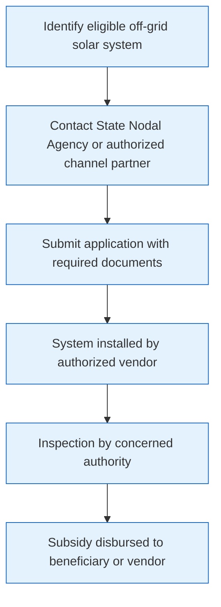

# Comprehensive Scheme Masterclass & File Guide

## Scheme Deep Dive

### Scheme Overview
The **MNRE Off-grid Solar Power Schemes** is a subsidy-based initiative implemented by the **Ministry of New and Renewable Energy (MNRE)** with pan-India geographic scope. The scheme operates on a rolling basis with no fixed deadline, last updated in 2024. It aims to provide electricity access to unelectrified households and villages, promote solar-powered irrigation, support decentralized renewable energy applications in remote areas, reduce dependence on diesel generators and fossil fuels, and enhance livelihoods through reliable solar power supply.

### Objectives
- Provide electricity access to unelectrified households and villages  
- Promote solar-powered irrigation through solar water pumps  
- Support decentralized renewable energy applications in remote areas  
- Reduce dependence on diesel generators and fossil fuels in off-grid settings  
- Enhance livelihoods and productivity through reliable solar power supply  

### Eligibility Matrix
| Beneficiary Category | Eligibility Criteria | Priority Groups | Technical Requirements |
|----------------------|----------------------|-----------------|------------------------|
| Individuals | Residents of off-grid or poorly electrified areas | SC/ST, women, border regions | Systems must comply with MNRE technical standards |
| Farmers | Agricultural operators in off-grid areas | SC/ST, women, border regions | Must be installed by MNRE-authorized channel partners |
| Cooperatives | Registered cooperative societies | SC/ST, women, border regions | Systems must use approved models under ALMM |
| Panchayats | Local self-government institutions | SC/ST, women, border regions | No prior subsidy for same purpose under other schemes |
| Government Institutions | Public sector entities | SC/ST, women, border regions | Post-installation maintenance responsibility with beneficiary |

### Benefits & Financial Support
| Benefit Type | Details | Financial Support Mechanism |
|--------------|---------|-----------------------------|
| Solar Home Lights | Subsidy for individual household lighting | Central Financial Assistance (CFA) as subsidy |
| Solar Street Lights | Subsidy for community/public lighting | 30% to 90% of benchmark cost based on beneficiary category and region |
| Solar Pumps | Subsidy for agricultural irrigation | Higher subsidy for NE/hilly/island areas |
| Mini-grids | Subsidy for community-scale power distribution | Disbursed through State Nodal Agencies after installation and inspection |
| Reduced Electricity Costs | Lower operational expenses vs. diesel/grid | Funds released post-inspection to beneficiary or vendor |
| Reliable Power Supply | 24/7 availability in off-grid areas | Subject to ALMM compliance and authorized installation |
| Environmental Benefits | Reduced emissions from fossil fuel substitution | Monitoring and maintenance responsibility lies with beneficiary |
| Agricultural Productivity | Enhanced irrigation via solar pumps | Priority to SC/ST, women, border regions |

> **Key Caveats**  
> - Subsidy limited to approved models and manufacturers under ALMM  
> - Systems must be installed by MNRE-authorized channel partners  
> - Beneficiary must not have availed subsidy for same purpose under any other government scheme  
> - Post-installation monitoring and maintenance responsibility lies with the beneficiary  

### Application Process Flowchart

### Required Documents
1. Proof of identity (Aadhaar/Voter ID/PAN)  
2. Proof of address  
3. Land ownership or consent document (for community/installation site)  
4. Technical specification of the proposed system  
5. Bank account details for subsidy transfer  
6. Photographs of installation site (before and after)  

### Implementation Timeline
As a rolling basis scheme, applications are accepted continuously. Key operational timelines include:
- **Document Submission**: Immediate upon eligibility confirmation  
- **Installation**: Within 30-45 days of approval (subject to vendor availability)  
- **Inspection**: Within 15 days of installation completion  
- **Subsidy Disbursement**: Within 30 days post-inspection verification  

### Key Implementation Bodies
- **Implementing Agency**: Ministry of New and Renewable Energy (MNRE)  
- **Execution Channel**: State Nodal Agencies (SNAs) and MNRE-authorized channel partners  
- **Oversight**: Ministry of New and Renewable Energy (MNRE)  
- **Funding Disbursement**: Through State Nodal Agencies post-verification  

### Geographic Focus
- **Pan-India** coverage with enhanced support for:  
  - North Eastern (NE) states  
  - Hilly regions  
  - Island territories  
  - Border areas  
  - SC/ST dominated regions  
  - Women-headed households  

### Scheme Integration
This scheme complements other MNRE initiatives including:
- **PM-KUSUM** (for agricultural solar pumps)  
- **National Solar Mission**  
-NSA** (State Nodal Agencies)  
- **ALMM** (Approved List of Models and Manufacturers) compliance requirement  

### Financial Mechanics
- **Subsidy Range**: 30%-90% of benchmark cost  
- **Determining Factors**:  
  - Beneficiary category (individual/farmer/cooperative/etc.)  
  - Geographic location (NE/hilly/island = higher subsidy)  
  - System type (home light/street light/pump/mini-grid)  
- **Disbursement Trigger**: Successful installation + inspection + verification  
- **Recipient Flexibility**: Subsidy can go directly to beneficiary or to authorized vendor  

### Quality & Compliance
- **Technical Standards**: MNRE-mandated specifications for all system types  
- **Manufacturer Compliance**: ALMM-listed models only  
- **Installer Authorization**: MNRE-authorized channel partners exclusively  
- **Verification Protocol**: Third-party inspection by concerned authority  
- **Beneficiary Obligation**: Post-installation O&M responsibility  

### Portal Reference
**Application Portal**: https://mnre.gov.in (MNRE official website)  
**Key Information Source**: MNRE scheme documentation and implementing agency guidelines  

---

## Consultant's Field Guide to Generated Files

### 1. SCHEME_MASTER_DATABASE.md
**Real-time Usage:** Keep this open in a background tab during all client calls. When a client asks "What is the turnover limit?" or "Who administers this?", CTRL+F in this document to give an immediate, authoritative answer without checking the portal.

### 2. PITCH_AND_SALES_SCRIPTS.md
**Real-time Usage:** Open this file 5 minutes before your first Discovery Call with a lead. Read the "Problem Framing" out loud to hook them, then use the Qualification Checklist to interrogate their eligibility live on the phone. Keep the Objection Handlers table visible so you can immediately counter when they say "We're too small for this."

### 3. APPLICATION_PLAYBOOK.md
**Real-time Usage:** Print this out or pin it to your desktop once the client signs the retainer. Check off each box in "Stage 1" before moving to "Stage 2". Use the "Client Communication Template" to copy-paste directly into your email when chasing them for pending documents.

### 4. CLIENT_ONBOARDING_AND_CRM.md
**Real-time Usage:** Fill this out during or immediately after the onboarding call. Use the Needs Assessment to record their exact pain points. Update the "Compliance Status" table as they email you documents to maintain a single source of truth for what's missing.

### 5. LIVE_CASE_TRACKER.md
**Real-time Usage:** Review this document every morning during your standup. Update the "Stage" column daily. If a case hits "Stage 07 - Under review", use the Escalation Path notes here to know exactly who to call at the government department today.

### 6. FEE_AND_REVENUE_MODEL.md
**Real-time Usage:** Use this file when drafting the proposal. Look at the client's turnover, map them to the pricing tier in the table, and quote that exact Retainer and Success Fee. Use the monthly projection table to update your personal sales pipeline forecast for the quarter.

### 7. CLIENT_PROPOSAL_TEMPLATE.md
**Real-time Usage:** Copy this entire file, paste it into an email or PDF generator, replace the [PLACEHOLDER] tags with the client's actual details gathered from the CRM, and send it immediately after a successful discovery call.

### 8. COMPLIANCE_AND_LEGAL_PACK.md
**Real-time Usage:** Attach sections 8A and 8B as PDFs to the proposal email. Refuse to start Step 1 of the Application Playbook until the client signs these. Use the Disclaimers to protect yourself legally if the client is rejected by the government agency.