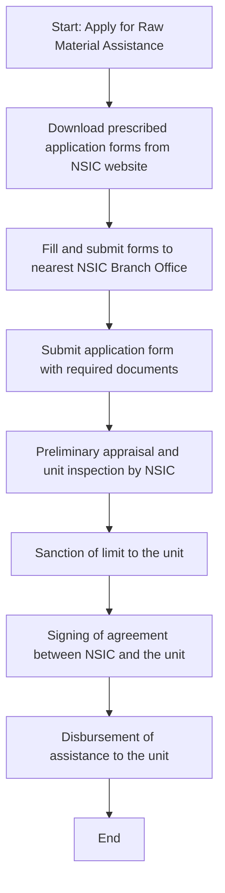

# Comprehensive Scheme Masterclass & File Guide

## Scheme Deep Dive

### Scheme Overview
The **NSIC Credit Support Scheme** (Scheme ID: row-11) is a **loan**-type scheme implemented by the **National Small Industries Corporation Ltd. (NSIC)**, a Government of India Enterprise under the Ministry of MSME. It operates on a **rolling basis** with **Pan-India** geographic scope and was last updated in **2026**. The scheme provides **credit support for raw material procurement against the security of a Bank Guarantee from approved banks**.

### Objectives
- Facilitate procurement of raw material with credit support up to 180 days  
- Help MSMEs avail economics of purchases like bulk purchase and cash discount  
- Enable MSMEs to focus better on manufacturing quality products  
- Provide financial assistance for raw material procurement against Bank Guarantee security  

### Eligibility Matrix
| Criteria | Details |
|---------|---------|
| **Target Beneficiaries** | MSME (Micro, Small, and Medium Enterprises) |
| **Registration Requirement** | Udyam Registration mandatory |
| **Eligible Activities** | Manufacturing and services only |
| **Ineligible Activities** | Traders, wholesale trading, retail trading, commission agents, manufacture of medicine and drugs (except Ayurvedic, Unani, Siddha, and Homeopathic medicines) |
| **Additional Eligibility** | Units must have commenced commercial production but may not have completed one year of existence for provisional registration (monetary limit: Rs. 5.00 Lacs) |
| **Ineligibility Triggers** | Units blacklisted; proprietor/partner/director/Karta convicted of criminal offence |

### Benefits & Financial Support
#### Interest Rate Structure (Effective from 01.07.2025)
| SME Rating | Unit Type | Rate of Interest (% p.a.) | Notes |
|------------|-----------|----------------------------|-------|
| Valid SME 1 rating | Micro | 8.75% | Concessional rate applicable only if timely repayments made within 180 days |
| Valid SME 1 rating | Small & Medium | 9.25% | |
| Valid SME 2 rating | Micro | 9.25% | |
| Valid SME 2 rating | Small & Medium | 9.75% | |
| Other units | Micro | 9.75% | |
| Other units | Small & Medium | 10.25% | |

#### Fee Structure
| Fee Type | Micro (% p.a.) | Small & Medium (% p.a.) | Applicability |
|----------|----------------|--------------------------|---------------|
| **Processing Fee (New Sanctions)** | 1.0% | 1.0% | On new sanctions |
| **Processing Fee (Renewal)** | 0.5% | 1.0% | On renewal |
| **Penal Charge (Delayed Payment >180 days)** | 1.25% per quarter | 1.25% per quarter | Over and above normal rate of interest |

#### Key Financial Benefits
- Credit support for raw material procurement up to **180 days**  
- Facilitates bulk purchase and cash discount advantages  
- Issue of Tender Sets free of cost  
- Exemption from payment of Earnest Money Deposit (EMD)  
- In tender participation: MSEs quoting price within L1+15% band can supply up to 25% of requirement by matching L1 price  
- Consortia facility for Tender Marketing  
- Annual procurement goal: Central Ministries/Departments/PSUs must source minimum **25%** of total annual purchases from MSEs  
  - Of this 25%, **4%** earmarked for SC/ST-owned units  
  - **3%** earmarked for women-owned units  
- **358 items** reserved for exclusive purchase from MSE Sector  

### Application Process (Mermaid Flowchart)

#### Step-by-Step Process Details
1. Apply for Raw Material Assistance only on prescribed application forms  
2. Download application forms from the link provided on the NSIC website  
3. Fill and submit the forms to the nearest NSIC Branch Office  
4. Submit application form along with required documents  
5. Preliminary appraisal and unit inspection carried out by NSIC  
6. Sanction of limit to the unit  
7. Signing of agreement between NSIC and the unit  
8. Disbursement of assistance to the unit  

### Required Documents (Self-attested unless specified)
1. PAN card  
2. Udyam Registration  
3. Details of Plant & Machinery (Annexure B-1)  
4. Copy of ownership document of premises or Lease/Rent Deed  
5. List of quality control equipment and testing facility available in factory  
6. Latest Electricity Bill Copy  
7. Face of Audited Balance Sheet, Profit and Loss A/cs, Schedule of Fixed Assets, Schedule of Revenue from Operations (last 3 years, duly signed by authorized person under seal)  
8. Statement showing Results of Operation for last 3 years duly signed by Chartered Accountant with UDIN (Annexure C-1)  
9. Bankers’ Report giving details of financial status as per Performa (Draft at Annexure E) (Annexure E-1)  
10. Declaration signed by applicant MSE Unit accepting conditions of registration (Annexure D)  

### Key Caveats & Warnings
> **Security Requirement**: Bank Guarantee from Approved Banks is **mandatory** for availing assistance under this scheme.  
>  
> **Interest Rate Concession**: Concessional interest rates apply **only if timely repayments are made**; otherwise, normal rates (Sl. No. iii in interest table) apply.  
>  
> **Penal Charges**: Delayed payment beyond 180 days attracts **1.25% per quarter** over and above the normal rate of interest.  
>  
> **Processing Fee**: Applicable on **new sanctions** (1.0% p.a. for both Micro and Small & Medium) and **renewals** (0.5% p.a. for Micro, 1.0% p.a. for Small & Medium).  
>  
> **Trader Exclusion**: The scheme **does not cover traders**.  
>  
> **Medicine Exclusion**: Units engaged in manufacture of medicine and drugs **except Ayurvedic, Unani, Siddha, and Homeopathic medicines** are **not eligible**.  
>  
> **Blacklist Bar**: Units blacklisted or with proprietor/partner/director/Karta convicted of criminal offence are **not eligible**.  

### Application Portal & Sources
- **Application Forms**: Available for download from [NSIC Raw Material Assistance Against Bank Guarantee page](https://nsic.co.in/Schemes/RawMaterialAgainstBG)  
- **Key Sources**:  
  - NSIC Official Website: https://nsic.co.in  
  - Scheme Details: https://nsic.co.in/Schemes/RawMaterialAgainstBG  
  - Supporting Evidence: Key Facts block and crawled web pages (especially RMA against BG page)  

---

## Consultant's Field Guide to Generated Files

### 1. SCHEME_MASTER_DATABASE.md
**Real-time Usage:** Keep this open in a background tab during all client calls. When a client asks "What is the turnover limit?" or "Who administers this?", CTRL+F in this document to give an immediate, authoritative answer without checking the portal.  
*Example:* If a client queries about penal charges, search "1.25% per quarter" to instantly confirm the delayed payment penalty structure.

### 2. PITCH_AND_SALES_SCRIPTS.md
**Real-time Usage:** Open this file 5 minutes before your first Discovery Call with a lead. Read the "Problem Framing" out loud to hook them, then use the Qualification Checklist to interrogate their eligibility live on the phone. Keep the Objection Handlers table visible so you can immediately counter when they say "We're too small for this."  
*Example:* When a micro-enterprise hesitates due to perceived complexity, use the script: "This scheme is designed specifically for units like yours—even those with less than one year of operation can access up to Rs. 5 Lacs provisionally."

### 3. APPLICATION_PLAYBOOK.md
**Real-time Usage:** Print this out or pin it to your desktop once the client signs the retainer. Check off each box in "Stage 1" before moving to "Stage 2". Use the "Client Communication Template" to copy-paste directly into your email when chasing them for pending documents.  
*Example:* After document submission, use the template to email: "Dear [Client], Your application is now at Stage 5 (Preliminary Appraisal). We expect NSIC to complete inspection within 7–10 working days. Please ensure your premises are accessible."

### 4. CLIENT_ONBOARDING_AND_CRM.md
**Real-time Usage:** Fill this out during or immediately after the onboarding call. Use the Needs Assessment to record their exact pain points. Update the "Compliance Status" table as they email you documents to maintain a single source of truth for what's missing.  
*Example:* If a client mentions cash flow strain from raw material purchases, log this under "Pain Points" and track submission of their audited balance sheets in the CRM table.

### 5. LIVE_CASE_TRACKER.md
**Real-time Usage:** Review this document every morning during your standup. Update the "Stage" column daily. If a case hits "Stage 07 - Under review", use the Escalation Path notes here to know exactly who to call at the government department today.  
*Example:* When a case shows "Under review", contact the NSIC Branch Office Sanctioning Authority using the escalation matrix: Branch Manager → Zonal Office Head → NSIC HO Credit Vertical.

### 6. FEE_AND_REVENUE_MODEL.md
**Real-time Usage:** Use this file when drafting the proposal. Look at the client's turnover, map them to the pricing tier in the table, and quote that exact Retainer and Success Fee. Use the monthly projection table to update your personal sales pipeline forecast for the quarter.  
*Example:* For a Small Enterprise with Rs. 2 Cr turnover, apply the tier: Retainer = Rs. 25,000 + Success Fee = 8% of sanctioned limit.

### 7. CLIENT_PROPOSAL_TEMPLATE.md
**Real-time Usage:** Copy this entire file, paste it into an email or PDF generator, replace the [PLACEHOLDER] tags with the client's actual details gathered from the CRM, and send it immediately after a successful discovery call.  
*Example:* After validating Udyam registration and turnover, insert client-specific data into the proposal: "Based on your Rs. 1.8 Cr turnover and SME 2 rating, you qualify for 9.25% p.a. interest."

### 8. COMPLIANCE_AND_LEGAL_PACK.md
**Real-time Usage:** Attach sections 8A and 8B as PDFs to the proposal email. Refuse to start Step 1 of the Application Playbook until the client signs these. Use the Disclaimers to protect yourself legally if the client is rejected by the government agency.  
*Example:* Before document collection, obtain signed Annexure D (Declaration) and Bank Guarantee undertaking—without these, do not proceed to Stage 2 of the playbook.