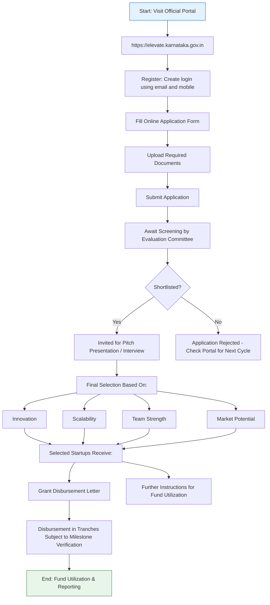

</think># Comprehensive Scheme Masterclass & File Guide

## Scheme Deep Dive

### Scheme Overview
The **KDEM Elevate Programme** (Scheme ID: row-111) is a **grant**-type initiative administered by the **Karnataka Digital Economy Mission (KDEM)** under the State Level (Karnataka) category. It is designed to support early-stage startups domiciled in Karnataka through non-dilutive funding and ecosystem enablement. The programme operates via periodic application cycles, with specific dates announced on the official portal: [https://elevate.karnataka.gov.in](https://elevate.karnataka.gov.in). There is no fixed deadline; applications are accepted only during announced windows.

### Objectives
The programme aims to:
- Identify and support high-potential early-stage startups in Karnataka
- Provide seed funding to validate and scale innovative business ideas
- Offer mentorship and guidance from industry experts and mentors
- Facilitate market access and networking opportunities for startups
- Strengthen the startup ecosystem in Karnataka through structured incubation

### Eligibility Matrix
| Criterion | Requirement | Source |
|---------|-------------|--------|
| **Geographic Scope** | Startup must be registered in Karnataka | Key Facts |
| **Legal Structure** | Incorporated as Private Limited Company, LLP, or Partnership Firm | Key Facts |
| **Product Stage** | Must have a Minimum Viable Product (MVP) or prototype | Key Facts |
| **Prior Funding** | Must not have received more than INR 50 lakh in funding before application | Key Facts |
| **Innovation Focus** | Working on an innovative product, service, or process with scalability potential | Key Facts |
| **Target Beneficiary** | Startups (early-stage) | Key Facts |

> **> Warning**: Failure to meet any eligibility criterion results in automatic disqualification. The implementing agency (KDEM) reserves the right to reject applications without assigning any reason.

### Benefits & Financial Support
| Benefit Type | Details | Value / Scope | Source |
|--------------|---------|---------------|--------|
|----------|----------|---------------|
| Grant** | Up to INR 50 lakh per selected startup | Key Facts |
| **Disbursement Mode** | One-time grant disbursed in tranches based on milestone achievement | Tranche-linked to milestones | Key Facts |
| **Usage Permitted** | Product development, market validation, team building, initial operational expenses | As per grant agreement | Key Facts |
| **Equity Dilution** | None | 0% | Key Facts |
| **Repayment Obligation** | None | Non-repayable grant | Key Facts |
| **Mentorship** | Access to domain experts | Included | Key Facts |
| **Incubation Support** | At recognized centers | Included | Key Facts |
| **Fundraising Assistance** | Help with investor connects, fundraising readiness | Included | Key Facts |
| **Investor Exposure** | Participation in investor meets and demo days | Included | Key Facts |
| **Operational Support** | Legal, accounting, and technical support for compliance and efficiency | Included | Key Facts |
| **Tax Implication** | Grant amount subject to applicable taxes as per government norms | Taxable as per IT Act | Key Facts |

> **> Critical Note**: The maximum grant per entity is **INR 50 lakh**. Startups must utilize funds only for approved purposes. Failure to meet milestones may result in discontinuation of further tranches. The grant is taxable under prevailing government norms.

### Application Process Flowchart

### Required Documents
1. Certificate of Incorporation / Registration  
2. PAN card of the startup  
3. Aadhaar and PAN of founders/directors  
4. Product description or prototype details  
5. Team profiles with LinkedIn or professional backgrounds  
6. Bank account details of the startup  
7. Declaration of compliance with eligibility criteria  

### Contact Details
- **Email**: info@kdem.karnataka.gov.in  
- **Phone**: 080-4666-6666  

### Key Caveats
- Grant is disbursed in tranches subject to milestone verification  
- Startups must utilize funds only for approved purposes as per the grant agreement  
- Failure to meet milestones may result in discontinuation of further tranches  
- The grant amount is subject to applicable taxes as per government norms  
- KDEM reserves the right to reject applications without assigning any reason  
- Applications are accepted only in periodic cycles; specific dates announced on portal  

---

## Consultant's Field Guide to Generated Files

### 1. SCHEME_MASTER_DATABASE.md
**Real-time Usage:** Keep this open in a background tab during all client calls. When a client asks "What is the turnover limit?" or "Who administers this?", CTRL+F in this document to give an immediate, authoritative answer without checking the portal.

### 2. PITCH_AND_SALES_SCRIPTS.md
**Real-time Usage:** Open this file 5 minutes before your first Discovery Call with a lead. Read the "Problem Framing" out loud to hook them, then use the Qualification Checklist to interrogate their eligibility live on the phone. Keep the Objection Handlers table visible so you can immediately counter when they say "We're too small for this."

### 3. APPLICATION_PLAYBOOK.md
**Real-time Usage:** Print this out or pin it to your desktop once the client signs the retainer. Check off each box in "Stage 1" before moving to "Stage 2". Use the "Client Communication Template" to copy-paste directly into your email when chasing them for pending documents.

### 4. CLIENT_ONBOARDING_AND_CRM.md
**Real-time Usage:** Fill this out during or immediately after the onboarding call. Use the Needs Assessment to record their exact pain points. Update the "Compliance Status" table as they email you documents to maintain a single source of truth for what's missing.

### 5. LIVE_CASE_TRACKER.md
**Real-time Usage:** Review this document every morning during your standup. Update the "Stage" column daily. If a case hits "Stage 07 - Under review", use the Escalation Path notes here to know exactly who to call at the government department today.

### 6. FEE_AND_REVENUE_MODEL.md
**Real-time Usage:** Use this file when drafting the proposal. Look at the client's turnover, map them to the pricing tier in the table, and quote that exact Retainer and Success Fee. Use the monthly projection table to update your personal sales pipeline forecast for the quarter.

### 7. CLIENT_PROPOSAL_TEMPLATE.md
**Real-time Usage:** Copy this entire file, paste it into an email or PDF generator, replace the [PLACEHOLDER] tags with the client's actual details gathered from the CRM, and send it immediately after a successful discovery call.

### 8. COMPLIANCE_AND_LEGAL_PACK.md
**Real-time Usage:** Attach sections 8A and 8B as PDFs to the proposal email. Refuse to start Step 1 of the Application Playbook until the client signs these. Use the Disclaimers to protect yourself legally if the client is rejected by the government agency.