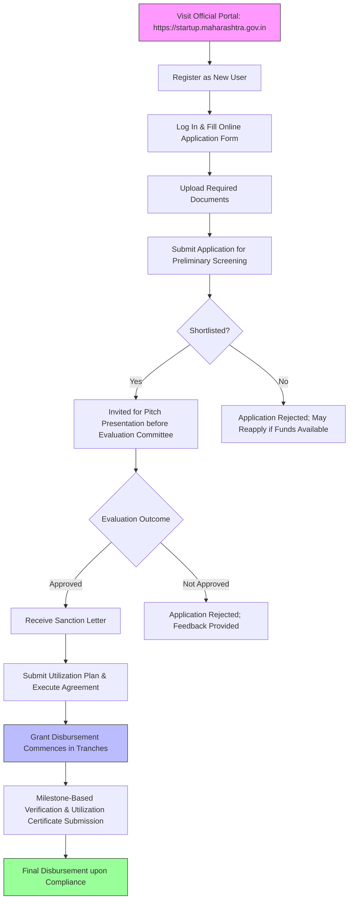

</think># Comprehensive Scheme Masterclass & File Guide

## Scheme Deep Dive

### Overview
The **Maha Startup Scheme** (Scheme ID: row-113) is a **state-level grant scheme** implemented by the **Directorate of Industries, Government of Maharashtra**. It is designed to support early-stage startups in Maharashtra through financial assistance and ecosystem enablement. The scheme operates on a **rolling basis** with applications accepted throughout the year, subject to fund availability. The total fund size is **INR 200 Crore**, with a maximum grant of **INR 20 Lakhs per eligible entity**.

### Objectives
The scheme aims to:
- Promote innovation and entrepreneurship across Maharashtra  
- Provide financial support to early-stage startups for product development and market validation  
- Encourage participation of women and socially disadvantaged entrepreneurs  
- Strengthen the startup ecosystem through incubation and mentorship  
- Facilitate job creation and economic growth in the state  
- Enable access to prototyping, testing, and market linkage facilities  
- Support startups in technology, manufacturing, and service sectors  

### Eligibility Matrix
| Criteria | Requirement | Evidence |
|--------|-------------|----------|
| **Legal Structure** | Private Limited Company, LLP, or Partnership Firm under Companies Act, 2013 or LLP Act, 2008 | Eligibility section |
| **Incorporation Age** | Not more than 5 years ago | Eligibility section |
| **Annual Turnover** | Must not exceed INR 25 Crore in any preceding financial year | Eligibility section |
| **Innovation Focus** | Working on innovative products, services, or processes with potential for commercialization | Eligibility section |
| **Founder Residency** | At least one founder must be a resident of Maharashtra | Eligibility section |
| **Geographic Scope** | Startup must be registered in Maharashtra | Geographic Scope: Maharashtra only |
| **Target Beneficiaries** | Startups; women entrepreneurs; SC/ST; MSME (preference given) | Eligibility & Target Beneficiaries |

> **Note**: Preference is given to startups led by women, SC/ST, or differently abled individuals. Startups that have received similar grants from other central or state government schemes may not be eligible.

### Benefits & Financial Support
| Benefit Category | Details | Evidence |
|------------------|---------|----------|
| **Financial Grant** | One-time grant of up to **INR 20 Lakhs** per eligible startup | Max Per Entity: INR 20 Lakhs; Financial Support section |
| **Disbursement Mode** | Released in tranches based on milestone achievement; directly to startup’s bank account after due diligence and approval of utilization reports | Financial Support section |
| **Equity Stake** | **No equity** taken by the government | Financial Support section |
| **Incubation Support** | Access to state-approved incubation centers with infrastructure, mentorship, and networking opportunities | Benefits section |
| **IPR & Legal Assistance** | Assistance in intellectual property rights (IPR) filing and legal compliance | Benefits section |
| **Event Participation** | Support for participation in national and international startup events and exhibitions | Benefits section |
| **Funding Readiness** | Guidance on funding readiness and investor connect | Benefits section |
| **Technical Facilities** | Access to shared labs, prototyping facilities, and technical guidance through empanelled knowledge partners | Benefits section |
| **Fund Size** | Total scheme fund: **INR 200 Crore** | Fund Size (Cr): 200 |

> **Warning**: The grant must be utilized strictly for the approved purpose within **12 months of sanction**. Failure to utilize funds or submit reports may lead to recovery of the grant amount.

### Application Process (Mermaid Flowchart)

### Key Deadlines & Operational Notes
- **Application Basis**: Rolling basis — applications accepted throughout the year subject to availability of funds.  
- **Last Updated**: 2024  
- **Contact Details**:  
  - Email: mahastartup@industries.maharashtra.gov.in  
  - Helpline: 022-22025565  
- **Application Portal**: https://startup.maharashtra.gov.in  
- **Caveats**:  
  - Grant disbursed only after milestone-based verification and submission of utilization certificates  
  - Startups that have received similar grants from other central or state government schemes may not be eligible  
  - The grant must be utilized strictly for the approved purpose within 12 months of sanction  
  - Failure to utilize funds or submit reports may lead to recovery of the grant amount  
  - The scheme is subject to budget availability and may be revised or withdrawn without prior notice  

### Required Documents
1. Certificate of Incorporation / Registration  
2. PAN Card of the startup  
3. Aadhaar and PAN of all founders  
4. Pitch deck or business plan (max 10 slides)  
5. Bank account details of the startup  
6. Declaration of innovation and compliance with scheme guidelines  
7. Proof of registration in Maharashtra (address proof of registered office)  
8. Details of any prior funding or grants received  

---

## Consultant's Field Guide to Generated Files

### 1. SCHEME_MASTER_DATABASE.md
**Real-time Usage:** Keep this open in a background tab during all client calls. When a client asks "What is the turnover limit?" or "Who administers this?", CTRL+F in this document to give an immediate, authoritative answer without checking the portal.  
*Example Use Case*: During a discovery call, a founder asks, "Is the 25 Crore turnover limit based on the last financial year or any year?" You instantly search "turnover" in SCHEME_MASTER_DATABASE.md and reply: "The scheme specifies that annual turnover must not exceed INR 25 Crore in **any** preceding financial year — this is a hard eligibility criterion."

### 2. PITCH_AND_SALES_SCRIPTS.md
**Real-time Usage:** Open this file 5 minutes before your first Discovery Call with a lead. Read the "Problem Framing" out loud to hook them, then use the Qualification Checklist to interrogate their eligibility live on the phone. Keep the Objection Handlers table visible so you can immediately counter when they say "We're too small for this."  
*Example Use Case*: A client says, "We’re only 6 months old with no revenue — surely we don’t qualify." You refer to the Objection Handlers table and respond: "Actually, early-stage startups are the **primary target** of this scheme. There’s no minimum turnover requirement — only a maximum of INR 25 Crore. Being pre-revenue or early-stage is an advantage, not a disqualifier."

### 3. APPLICATION_PLAYBOOK.md
**Real-time Usage:** Print this out or pin it to your desktop once the client signs the retainer. Check off each box in "Stage 1" before moving to "Stage 2". Use the "Client Communication Template" to copy-paste directly into your email when chasing them for pending documents.  
*Example Use Case*: After signing the retainer, you begin Stage 1: Document Collection. You check off "Certificate of Incorporation obtained" and "PAN card verified" in the playbook. When the client delays sending their pitch deck, you copy-paste the template: "Hi [Name], just a gentle reminder to upload your 10-slide pitch deck by EOD tomorrow to keep your application on track for committee review. Let me know if you need to submit this before we can proceed to the pitch presentation stage."

### 4. CLIENT_ONBOARDING_AND_CRM.md
**Real-time Usage:** Fill this out during or immediately after the onboarding call. Use the Needs Assessment to record their exact pain points. Update the "Compliance Status" table as they email you documents to maintain a single source of truth for what's missing.  
*Example Use Case*: During onboarding, you learn the client struggles with prototyping costs. You log this under "Pain Points" → "High cost of prototype iteration." As they send documents, you update the Compliance Status table: "Pitch deck: ✅ Received", "Founder Aadhaar: ⏳ Pending", allowing you to send a targeted follow-up: "We’re only waiting on Founder Aadhaar and PAN — all other docs are in!"

### 5. LIVE_CASE_TRACKER.md
**Real-time Usage:** Review this document every morning during your standup. Update the "Stage" column daily. If a case hits "Stage 07 - Under review", use the Escalation Path notes here to know exactly who to call at the government department today.  
*Example Use Case*: At your 9 AM standup, you see a case moved to "Stage 07 - Under review". You check the Escalation Path and call the Directorate of Industries helpdesk at 022-22025565, asking for the evaluation committee liaison to confirm receipt and expected timeline — reducing client anxiety and demonstrating proactive management.

### 6. FEE_AND_REVENUE_MODEL.md
**Real-time Usage:** Use this file when drafting the proposal. Look at the client's turnover, map them to the pricing tier in the table, and quote that exact Retainer and Success Fee. Use the monthly projection table to update your personal sales pipeline forecast for the quarter.  
*Example Use Case*: A*: 18 Crore turnover falls into Tier 2 (INR 10–25 Crore). You quote the retainer of INR 1.5 Lakhs and success fee of 8% of grant amount (max INR 1.6 Lakhs). You then update your pipeline forecast: "1 likely closure this month → projected revenue: INR 3 Lakhs."

### 7. CLIENT_PROPOSAL_TEMPLATE.md
**Real-time Usage:** Copy this entire file, paste it into an email or PDF generator, replace the [PLACEHOLDER] tags with the client's actual details gathered from the CRM, and send it immediately after a successful discovery call.  
*Example Use Case*: After a positive discovery call where the client confirmed eligibility and interest, you open CLIENT_PROPOSAL_TEMPLATE.md, replace [CLIENT_NAME], [TURNOVER], [FOUNDER_DETAILS], etc., generate a PDF, and send it within 1 hour with the subject: "Proposal: Maha Startup Scheme Application Support for [Client Name]".

### 8. COMPLIANCE_AND_LEGAL_PACK.md
**Real-time Usage:** Attach sections 8A and 8B as PDFs to the proposal email. Refuse to start Step 1 of the Application Playbook until the client signs these. Use the Disclaimers to protect yourself legally if the client is rejected by the government agency.  
*Example Use Case*: You attach the signed NDA and service agreement (from 8A and 8B) to the proposal email and write: "Per our engagement terms, we cannot begin document collection until these are signed. Please review and return at your earliest convenience." If the client is later rejected due to prior central grant receipt, you cite the disclaimer: "As noted in Section 8C, eligibility is subject to government verification, and we do not guarantee approval."