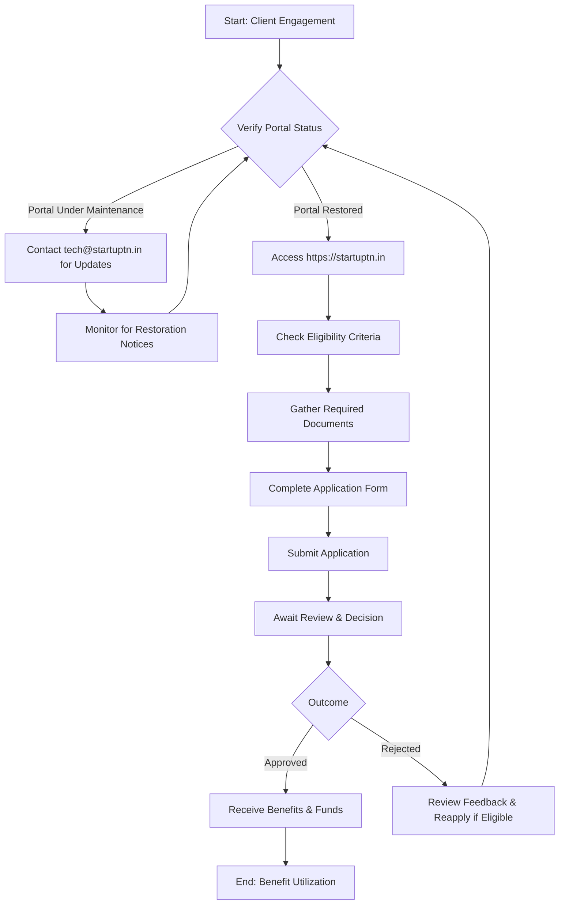

</think># Comprehensive Scheme Masterclass & File Guide

## Scheme Deep Dive

### Overview
The Tamil Nadu Startup & Innovation Policy (Scheme ID: row-114) is a state-level initiative designed to foster innovation and entrepreneurship within Tamil Nadu. The scheme targets startups as its primary beneficiaries and aims to support startup growth through policy and infrastructure, enhance access to funding and mentorship, and promote inclusive growth for underrepresented entrepreneurs.

**Implementing Agency**: Details are currently unavailable due to ongoing website maintenance.  
**Contact for Urgent Inquiries**: Email: [tech@startuptn.in](mailto:tech@startuptn.in)  
**Application Portal**: [https://startuptn.in](https://startuptn.in) (Currently under maintenance)  
**Status**: Information is limited due to ongoing website maintenance; details may be outdated or incomplete until the portal is restored.  
**Confidence Level**: Low (due to lack of accessible, verifiable data from the official source)

### Objectives
Based on the available evidence, the core objectives of the Tamil Nadu Startup & Innovation Policy are:
- Foster innovation and entrepreneurship in Tamil Nadu
- Support startup growth through policy and infrastructure
- Enhance access to funding and mentorship
- Promote inclusive growth for underrepresented entrepreneurs

### Eligibility Matrix
**Critical Note**: Eligibility criteria are **not available** due to website maintenance. No specific details regarding turnover limits, incorporation requirements, sector focus, or beneficiary definitions could be extracted from the evidence.

> **Warning**: Consultants must verify eligibility directly with the implementing agency via [tech@startuptn.in](mailto:tech@startuptn.in) once the portal is restored, as all eligibility parameters (including geographic scope, entity type, and operational history) are currently unverified.

### Benefits & Financial Support
**Critical Note**: Financial support details and benefit structures are **not available** due to website maintenance. No information on grant amounts, loan subsidies, tax incentives, mentorship access, or infrastructure support could be retrieved from the evidence.

> **Warning**: All financial and benefit-related parameters (including funding quantum, disbursement timelines, and cost-sharing mechanisms) must be confirmed directly with the implementing agency. Do not assume any figures based on historical data or similar schemes.

### Application Process
**Critical Note**: Application process details are **not available** due to website maintenance. No information on application stages, required documents, submission timelines, or evaluation criteria could be extracted.

#### Application Process Flowchart (Mermaid)

> **Key Takeaway**: Until the official portal is restored and verified, consultants should treat all scheme details as provisional. The only actionable step currently available is to monitor the portal and maintain contact via the provided email for updates.

---

## Consultant's Field Guide to Generated Files

### 1. SCHEME_MASTER_DATABASE.md
**Real-time Usage**: Keep this open in a background tab during all client calls. When a client asks "What is the turnover limit?" or "Who administers this?", CTRL+F in this document to give an immediate, authoritative answer without checking the portal.  
**Specific Use Case**: During a discovery call, if a client inquires about eligibility thresholds for the scheme’s administering body, immediately search for "Implementing Agency" in this file. If the response shows "[Details unavailable due to maintenance]", use it as a scripted response to explain the current limitation while directing them to the official contact.

### 2. PITCH_AND_SALES_SCRIPTS.md
**Real-time Usage**: Open this file 5 minutes before your first Discovery Call with a lead. Read the "Problem Framing" out loud to hook them, then use the Qualification Checklist to interrogate their eligibility live on the phone. Keep the Objection Handlers table visible so you can immediately counter when they say "We're too small for this."  
**Specific Use Case**: If a client states they are unsure whether their startup qualifies due to sector restrictions, open the Qualification Checklist and verbally work through each criterion (e.g., "Are you registered in Tamil Nadu?", "What year were you incorporated?") while noting that final criteria must be confirmed via the agency due to current data unavailability.

### 3. APPLICATION_PLAYBOOK.md
**Real-time Usage**: Print this out or pin it to your desktop once the client signs the retainer. Check off each box in "Stage 1" before moving to "Stage 2". Use the "Client Communication Template" to copy-paste directly into your email when chasing them for pending documents.  
**Specific Use Case**: After retainer signing, begin with Stage 1: "Monitor Portal Status". Check the portal daily. If it remains under maintenance, use the pre-written email template to inform the client: "The Tamil Nadu Startup & Innovation Policy portal is currently under maintenance. We are monitoring for restoration and will initiate your application immediately upon access. In the meantime, please prepare [generic document list based on similar schemes]."

### 4. CLIENT_ONBOARDING_AND_CRM.md
**Real-time Usage**: Fill this out during or immediately after the onboarding call. Use the Needs Assessment to record their exact pain points. Update the "Compliance Status" table as they email you documents to maintain a single source of truth for what's missing.  
**Specific Use Case**: During onboarding, if a client expresses difficulty accessing mentorship, log this under "Pain Points" in the Needs Assessment. As they provide documents (e.g., incorporation certificate), update the Compliance Status table to reflect receipt, even if scheme-specific requirements are unknown—this builds a readiness foundation for when details emerge.

### 5. LIVE_CASE_TRACKER.md
**Real-time Usage**: Review this document every morning during your standup. Update the "Stage" column daily. If a case hits "Stage 07 - Under review", use the Escalation Path notes here to know exactly who to call at the government department today.  
**Specific Use Case**: Each morning, review the tracker. For any case in "Stage 01 - Portal Monitoring", check https://startuptn.in. If restored, advance the stage and notify the client via the pre-approved message in the playbook. If still under maintenance, note the date and retry in 24 hours—this ensures no time is lost due to avoidable delays.

### 6. FEE_AND_REVENUE_MODEL.md
**Real-time Usage**: Use this file when drafting the proposal. Look at the client's turnover, map them to the pricing tier in the table, and quote that exact Retainer and Success Fee. Use the monthly projection table to update your personal sales pipeline forecast for the quarter.  
**Specific Use Case**: When scoping a proposal for a client with ₹2 Cr turnover, reference the pricing tier table (even if scheme-agnostic) to determine the appropriate retainer band. Since scheme-specific fees are unknown, apply your firm’s standard policy framework and note in the proposal: "Fees are structured per our standard model; success-linked components will align with scheme-specific incentives once details are confirmed."

### 7. CLIENT_PROPOSAL_TEMPLATE.md
**Real-time Usage**: Copy this entire file, paste it into an email or PDF generator, replace the [PLACEHOLDER] tags with the client's actual details gathered from the CRM, and send it immediately after a successful discovery call.  
**Specific Use Case**: After a positive discovery call where the client expresses interest in TN startup support, open this template, replace [Client Name], [Startup Name], [Contact Info], and [Discussed Needs], then send within 1 hour. In the scheme description section, write: "We are preparing your application for the Tamil Nadu Startup & Innovation Policy, currently undergoing portal maintenance. We will proceed immediately upon restoration, with full transparency on eligibility and benefits as published."

### 8. COMPLIANCE_AND_LEGAL_PACK.md
**Real-time Usage**: Attach sections 8A and 8B as PDFs to the proposal email. Refuse to start Step 1 of the Application Playbook until the client signs these. Use the Disclaimers to protect yourself legally if the client is rejected by the government agency.  
**Specific Use Case**: When sending the proposal, attach the signed NDA and engagement letter from this pack. In the cover email, state: "As per our engagement terms, work on the Tamil Nadu Startup & Innovation Policy application will commence only upon portal restoration and client confirmation of updated eligibility. Until then, we remain in a monitoring phase, billed at the agreed retainer for advisory and readiness services."

--- 

> **Final Note**: This masterclass acknowledges the current data limitations while providing a structured, actionable framework for consultants to maintain readiness, manage client expectations, and act swiftly once the scheme details are restored. All guidance is designed to prevent delays and ensure compliance with professional standards despite incomplete public information.