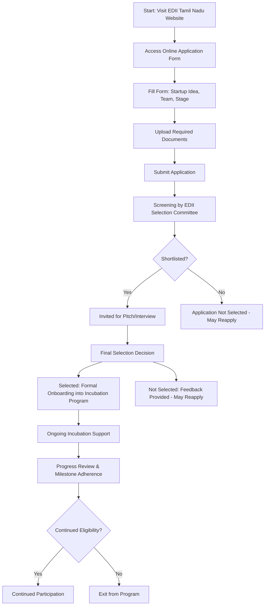

</think># Comprehensive Scheme Masterclass & File Guide

## Scheme Deep Dive

### Overview
The **EDII Tamil Nadu Incubation Scheme** is a state-level incubation initiative implemented by the Entrepreneurship Development Institute of India (EDII), Tamil Nadu Chapter. It operates on a rolling basis with no fixed deadlines, accepting applications throughout the year via the official portal: [https://edii.org.in](https://edii.org.in). The scheme does not offer direct financial grants or seed funding but focuses on non-financial support to nurture early-stage startups in Tamil Nadu.

### Objectives
- To nurture innovative startup ideas through structured incubation support  
- To provide access to mentorship, infrastructure, and networking opportunities  
- To enhance the survival and growth rate of early-stage ventures in Tamil Nadu  
- To promote inclusive entrepreneurship by supporting diverse founder profiles  

### Eligibility Matrix
| Criteria | Requirement | Source |
|--------|-------------|--------|
| Geographic Scope | Startups must be incorporated in Tamil Nadu | Key Facts |
| Entity Type | Startups; early-stage entrepreneurs | Key Facts |
| Stage of Venture | Pre-revenue or early revenue; viable innovative idea or prototype | Key Facts |
| Founder Commitment | Entrepreneurs committed to building scalable ventures | Key Facts |
| Sector Preference | Preference may be given to startups aligned with Tamil Nadu’s priority sectors *(not explicitly listed but noted as a caveat)* | Key Facts |

> **Note**: While no explicit sector restrictions are stated, alignment with Tamil Nadu’s withheld priority sectors is given to startups  

### Benefits & Financial Support
| Benefit Type | Details | Source |
|-------------|---------|--------|
| Incubation Infrastructure | Access to physical incubation facilities (workspace, labs, etc.) | Key Facts |
| Mentorship | Guidance from industry experts and academics | Key Facts |
| Networking | Connections with investors, peers, and ecosystem stakeholders, and other entrepreneurs | Key Facts |
| Business Support | Assistance with business modeling, legal compliance, and fundraising strategy | Key Facts |
| Prototype Development | Support in prototype development and market validation activities | Key Facts |
| Financial Support | **No direct financial grants or seed funding provided** | Key Facts |

> **Critical Caveat**: The scheme provides **zero monetary assistance**. All support is non-financial in nature. Startups seeking capital must look elsewhere or use the incubation support to become investment-ready.

### Application Process Flowchart

### Required Documents
1. Certificate of Incorporation or Registration  
2. PAN card of the startup or founders  
3. Pitch deck or business plan  
4. Founder profiles and resumes  
5. Proof of address or domicile in Tamil Nadu  
6. Details of any existing funding or support received  

### Key Caveats
- **No direct financial assistance or seed fund** is provided under this scheme  
- Incubation support is **time-bound** and subject to **periodic review**  
- Continued participation is **contingent on progress** and adherence to milestones  
- Preference may be given to startups aligned with **Tamil Nadu’s priority sectors**  
- Applications are accepted on a **rolling basis** — no fixed deadlines  

### Implementation & Governance
- **Implementing Agency**: Entrepreneurship Development Institute of India (EDII), Tamil Nadu Chapter  
- **Application Portal**: [https://edii.org.in](https://edii.org.in)  
- **Scheme Type**: Incubation (non-financial support)  
- **Geographic Scope**: Tamil Nadu only  
- **Status**: Active, rolling admissions  

---

## Consultant's Field Guide to Generated Files

### 1. SCHEME_MASTER_DATABASE.md
**Real-time Usage:** Keep this open in a background tab during all client calls. When a client asks "What is the turnover limit?" or "Who administers this?", CTRL+F in this document to give an immediate, authoritative answer without checking the portal.  
*Example Use Case*: During a discovery call, a founder asks, “Do I need to be revenue-generating to apply?” You instantly search “revenue” in the master database and reply: “The scheme accepts pre-revenue or early-revenue startups — no minimum turnover is specified.”

### 2. PITCH_AND_SALES_SCRIPTS.md
**Real-time Usage:** Open this file 5 minutes before your first Discovery Call with a lead. Read the "Problem Framing" out loud to hook them, then use the Qualification Checklist to interrogate their eligibility live on the phone. Keep the Objection Handlers table visible so you can immediately counter when they say "We're too small for this."  
*Example Use Case*: A client says, “We’re just two founders with an idea — is this for us?” You refer to the objection handler: “Actually, early-stage ideas are *preferred*. Let me check your incorporation status in Tamil Nadu…” and proceed with qualification.

### 3. APPLICATION_PLAYBOOK.md
**Real-time Usage:** Print this out or pin it to your desktop once the client signs the retainer. Check off each box in "Stage 1" before moving to "Stage 2". Use the "Client Communication Template" to copy-paste directly into your email when chasing them for pending documents.  
*Example Use Case*: After signing the client, you print the playbook. During document collection, you check off “PAN card obtained” and “Proof of address collected,” then use the template to email: “Hi [Name], just needing your pitch deck to complete Stage 1 — can you send by EOD today?”

### 4. CLIENT_ONBOARDING_AND_CRM.md
**Real-time Usage:** Fill this out during or immediately after the onboarding call. Use the Needs Assessment to record their exact pain points. Update the "Compliance Status" table as they email you documents to maintain a single source of truth for what's missing.  
*Example Use Case*: On the call, you note in Needs Assessment: “Client struggles with prototyping and investor outreach.” As they send incorporation docs, you update the CRM table: “Incorporation: ✅ | Pitch Deck: ⏳ | Founder Resumes: ⏳”.

### 5. LIVE_CASE_TRACKER.md
**Real-time Usage:** Review this document every morning during your standup. Update the "Stage" column daily. If a case hits "Stage 07 - Under review", use the Escalation Path notes here to know exactly who to call at the government department today.  
*Example Use Case*: At standup, you see a case moved to “Stage 07 - Under review.” You check the escalation path: “Contact Selection Committee Coordinator at EDII Tamil Nadu via incubation@edii.org.in” and send a polite follow-up email.

### 6. FEE_AND_REVENUE_MODEL.md
**Real-time Usage:** Use this file when drafting the proposal. Look at the client's turnover, map them to the pricing tier in the table, and quote that exact Retainer and Success Fee. Use the monthly projection table to update your personal sales pipeline forecast for the quarter.  
*Example Use Case*: A client has ₹8 lakhs turnover. You see they fall under Tier 2 (₹5L–₹15L), quote ₹75,000 retainer + 8% success fee, and add the projected revenue to your Q3 forecast tracker.

### 7. CLIENT_PROPOSAL_TEMPLATE.md
**Real-time Usage:** Copy this entire file, paste it into an email or PDF generator, replace the [PLACEHOLDER] tags with the client's actual details gathered from the CRM, and send it immediately after a successful discovery call.  
*Example Use Case*: After a positive discovery call, you open the template, replace [CLIENT_NAME], [STARTUP_NAME], [TURNover], etc., generate a PDF, and email it within 15 minutes with subject line: Proposal: EDII Tamil Nadu Incubation Support.”

###  hour with: “As discussed, here’s your tailored proposal for EDII Tamil Nadu incubation support.”

### 8. COMPLIANCE_AND_LEGAL_PACK.md
**Real-time Usage:** Attach sections 8A and 8B as PDFs to the proposal email. Refuse to start Step 1 of the Application Playbook until the client signs these. Use the Disclaimers to protect yourself legally if the client is rejected by the government agency.  
*Example Use Case*: You attach the signed NDA and engagement letter (8A/B) to the proposal. You state: “Per our policy, we begin work only after these are signed.” If rejected later, you cite the disclaimer: “We advised based on current scheme rules; outcomes depend on EDII’s selection committee.”