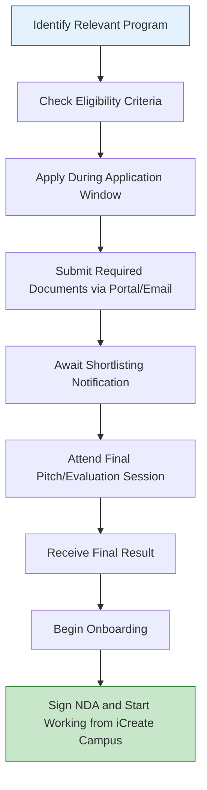

# Comprehensive Scheme Masterclass & File Guide

## Scheme Deep Dive

### Overview
iCreate – International Centre for Entrepreneurship and Technology is a state-level (Gujarat) incubation scheme supported by the Government of Gujarat and the Government of India. It operates as a Technology Business Incubator (TBI) recognized by the Department of Science and is designed to facilitate 'Next Generation Entrepreneurship' by supporting tech-based startups at every stage of their journey. The scheme has a pan-India geographic scope with international collaborations and is headquartered at Opp. Kensville Golf Club and Resort, Off. Bavla - Rajkot Highway, Deo Dholera, Ahmedabad, Gujarat 382240. The application portal is https://icreate.org.in/program_listing/spark-up-idea-fund/ and the scheme was last updated in 2026.

### Objectives
- Facilitate 'Next Generation Entrepreneurship' by supporting tech-based startups
- Empower Indian youth to pursue entrepreneurial dreams instead of seeking jobs
- Provide incubation, mentorship, and funding support at every stage of the entrepreneurial journey stage Leverage world-class innovation to address national priorities through centres of excellence
- Build a vibrant entrepreneurial ecosystem involving corporates, government, investors, and institutional partners
- Support prototype development and market readiness through rapid prototyping labs and validation
- Enable global collaboration via international accelerator programs like India Israel Innovation Accelerator (i3A)
- Disburse government grants and funding schemes available from central and state governments

### Eligibility Matrix
Eligibility varies significantly by program. The following table summarizes the key criteria:

| Program | Eligibility Criteria | Key Requirements |
|---------|----------------------|------------------|
| **Spark-up Idea Fund** | Any student or team from any discipline and college | Idea must be implementable, commercially viable, and new or a better alternative; committed individual/team; proof of student status required |
| **NIDHI-SSS** | Slightly mature startups (1-3 years old) | Advanced prototyping, revenue generation, bootstrapped funding; incorporated as Private Limited Company or capable of incorporation within 45 days; revenue-generating startups preferred |
| **iCreate Pro-Fund Gateway** | Individual innovators, students, or startups | Indian citizens; Idea-to-PoC or PoC stage; hardware/software tech innovation; for Government of Gujarat grants: startup must be registered as LLP or private limited company in Gujarat |
| **iCreate Idea Catalyst (iIC)** | Entrepreneurs, teams, university/college students, inventors, researchers, individuals | Passionate about solving problems with innovative ideas; idea-stage startups seeking to translate idea into profitable business plan |
| **Government of Gujarat Grants** | Startups registered in Gujarat | Must be registered as LLP or private limited company in Gujarat |
| **NIDHI-EIR** | Aspiring/budding entrepreneurs | Must be pursuing a promising technology business idea; support discontinued if external funding is raised |
| **NIDHI-PRAYAS** | Youth innovators | Focus on prototype development; preference for young innovators, women innovators, bootstrapped projects, clear roadmap for startup creation |
| **TIDE 2.0** | Nascent startups | Definite proof of concept to be developed into MVP; focus on ICT startups using emerging technologies addressing societal challenges |
| **TEC Grant** | Open to all (students, professionals) | Project must have technology innovation at core; PoC to be developed in 90 days |

### Benefits & Financial Support
Financial support and benefits vary by program. The following tables detail the specifics:

#### Financial Support by Program
| Program | Maximum Funding | Duration | Key Conditions |
|---------|-----------------|----------|----------------|
| **Spark-up Idea Fund** | Up to Rs 50,000 | 3-day bootcamp + ongoing support | For students only; non-returnable grant |
| **NIDHI-PRAYAS** | Up to Rs 10 lakhs | Up to 18 months (extendable by 6 months) | For prototype development; disbursed in tranches subject to progress review |
| **TIDE 2.0** | Up to Rs 7 lakhs | Project-based | For nascent startups with PoC to develop MVP; disbursed in tranches |
| **Government of Gujarat Startup Gujarat** | Up to Rs 30 lakhs | 12 months | For product development and go-to-market; go-to-market; requires Gujarat registration (LLP/Pvt Ltd) |
| **TEC Grant** | Up to Rs 2 lakhs | 90 days | For PoC development; disbursed in tranches (first tranche in advance, remainder subject to progress); no-cost and non-returnable) |
| **NIDHI-EIR** | Rs 10,000–30,000 per month | Up to 12 months | Monthly stipend; discontinued if recipient raises external funding |
| **NIDHI-SSS** | Rs 25 lakhs to Rs 45 lakhs (up to Rs 100 lakhs exceptional) | Up to 2 years | Interest-bearing debt or equity (7.5% equity at par); repayment required |
| **iCreate Pro-Fund Gateway** | Facilitates access to multiple grants | Varies by grant | Gateway to NIDHI-PRAYAS, TIDE 2.0, Startup Gujarat, NIDHI-EIR, TEC grants |

#### Non-Financial Benefits
- Mentorship from domain experts (technical and business)
- Access to iLab@iCreate rapid prototyping facilities
- Hostel and office space on iCreate campus
- Market and investor connects
- Participation in accelerator programs
- Alumni network access
- Business and technical mentorship
- Capacity building workshops
- Library access
- Cafeteria and hostel accommodation
- Support for commercialization and expansion
- Access to Cisco's largest Innovation Lab in India
- Sector-specific Centre of Excellence (CoE) support (e.g., EV CoE)
- International collaboration opportunities (e.g., India Israel Innovation Accelerator i3A)

### Application Process
The application process follows a standardized sequence across programs, though specific dates vary. Below is a Mermaid flowchart illustrating the general process:

#### Key Dates (Spark-up Idea Fund Example)
- Application Open: 1 July
- Application Close: 31 July
- Announcing Shortlisted Startups: 10 August
- Final Pitch: 16 August
- Announcing Final Result: 20 August
- Onboarding Startups: 26 August

#### Required Documents
1. Certificate of Incorporation / Registration
2. PAN of the entity
3. Pitch deck or business description
4. Authorization letter from authorized signatory
5. Details of funding received (if any)
6. Proof of student status (for Spark-up Idea Fund)
7. Business plan
8. Proof of concept or prototype details
9. Incorporation documents (for Gujarat-based startups under Government of Gujarat grants)
10. Project report and roadmap

### Key Caveats
> **Warning:** Funds are disbursed in tranches subject to progress review (e.g., NIDHI-PRAYAS, TEC grant).  
> **Warning:** Equity may be taken by iCreate in certain programs (e.g., NIDHI-SSS: 7.5% equity at par).  
> **Warning:** Some grants are interest-bearing debt to be repaid (e.g., NIDHI-SSS).  
> **Warning:** NIDHI-EIR support discontinues if recipient raises external funding.  
> **Warning:** Government of Gujarat grants require startup to be registered as LLP or private limited company in Gujarat.  
> **Warning:** iCreate Idea Catalyst (iIC) batch timings are fixed (e.g., Batch 4 in July 2026).  
> **Warning:** Spark-up Idea Fund is only for students.  
> **Warning:** NIDHI-SSS is for slightly mature startups (1-3 years old) with revenue preference.

### Contact Details
- **Email:** info@icreate.org.in
- **Phone:** +91 90998 43432
- **Address:** Opp. Kensville Golf Club and Resort, Off. Bavla - Rajkot Highway, Deo Dholera, Ahmedabad, Gujarat 382240

---

## Consultant's Field Guide to Generated Files

### 1. SCHEME_MASTER_DATABASE.md
**Real-time Usage:** Keep this open in a background tab during all client calls. When a client asks "What is the turnover limit?" or "Who administers this?", CTRL+F in this document to give an immediate, authoritative answer without checking the portal.

### 2. PITCH_AND_SALES_SCRIPTS.md to give an immediate, authoritative answer without checking the portal. Use it to verify eligibility criteria, funding limits, and program-specific requirements during live consultations. Reference the exact tables and bullet points from this masterclass to ensure accuracy.

### 2. PITCH_AND_SALES_SCRIPTS.md
**Real-time Usage:** Open this file 5 minutes before your first Discovery Call with a lead. Read the "Problem Framing" out loud to hook them, then use the Qualification Checklist to interrogate their eligibility live on the phone. Keep the Objection Handlers table visible so you can immediately counter when they say "We're too small for this." Use the program-specific talking points to tailor your pitch based on whether the client is a student (Spark-up Idea Fund), early-stage startup (Pro-Fund Gateway), or revenue-generating venture (NIDHI-SSS).

### 3. APPLICATION_PLAYBOOK.md
**Real-time Usage:** Print this out or pin it to your desktop once the client signs the retainer. Check off each box in "Stage 1" before moving to "Stage 2". Use the "Client Communication Template" to copy-paste directly into your email when chasing them for pending documents. Follow the Mermaid flowchart stages rigorously, updating progress after each client interaction. Use the document checklist to ensure all 10 required documents are collected before submission.

### 4. CLIENT_ONBOARDING_AND_CRM.md
**Real-time Usage:** Fill this out during or immediately after the onboarding call. Use the Needs Assessment to record their exact pain points. Update the "Compliance Status" table as they email you documents to maintain a single source of truth for what's missing. Track which specific program they're applying for and note any special requirements (e.g., Gujarat registration for State grants, student proof for Spark-up).

### 5. LIVE_CASE_TRACKER.md
**Real-time Usage:** Review this document every morning during your standup. Update the "Stage" column daily. If a case hits "Stage 07 - Under review", use the Escalation Path notes here to know exactly who to call at the government department today. Reference the program-specific timelines (e.g., for Spark-up Idea Fund, know that shortlisting happens on 10 Aug) to anticipate next steps and prepare clients accordingly.

### 6. FEE_AND_REVENUE_MODEL.md
**Real-time Usage:** Use this file when drafting the proposal. Look at the client's turnover, map them to the pricing tier in the table, and quote that exact Retainer and Success Fee. Use the monthly projection table to update your personal sales pipeline forecast for the quarter. Align your fees with the client's potential funding amount (e.g., higher success fee for NIDHI-SSS applications targeting Rs 45 lakhs vs. Spark-up Idea Fund's Rs 50,000).

### 7. CLIENT_PROPOSAL_TEMPLATE.md
**Real-time Usage:** Copy this entire file, paste it into an email or PDF generator, replace the [PLACEHOLDER] tags with the client's actual details gathered from the CRM, and send it immediately after a successful discovery call. Ensure the proposal references the correct program and includes all required documents list. Customize the benefits section based on the client's stage (e.g., highlight iLab access for prototype-focused clients).

### 8. COMPLIANCE_AND_LEGAL_PACK.md
**Real-time Usage:** Attach sections 8A and 8B as PDFs to the proposal email. Refuse to start Step 1 of the Application Playbook until the client signs these. Use the Disclaimers to protect yourself legally if the client is rejected by the government agency. Pay special attention to the equity and repayment clauses for NIDHI-SSS and the progress-review conditions for tranche-based grants.