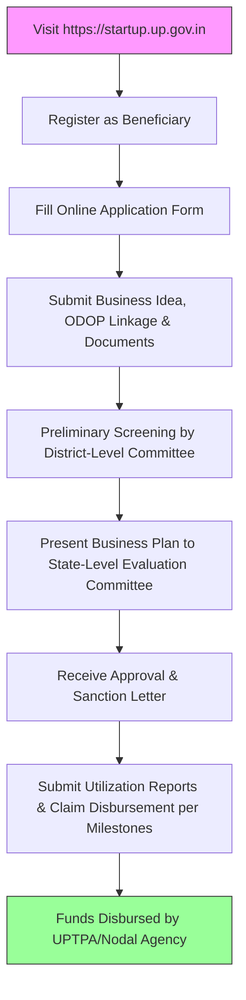

</think># Comprehensive Scheme Masterclass & File Guide

## Scheme Deep Dive

### Overview
The **UP Startup Policy & One District One Product (ODOP)** is a state-level grant scheme administered by the **Uttar Pradesh Trade Promotion Authority (UPTPA)**, under the Department of Infrastructure and Industrial Development, Government of Uttar Pradesh. It aims to promote entrepreneurship and innovation across all 75 districts of Uttar Pradesh by integrating startup support with the ODOP initiative. Applications are accepted on a **rolling basis** throughout the year, subject to fund availability, via the official portal: [https://startup.up.gov.in](https://startup.up.gov.in).

### Objectives
- Promote entrepreneurship and innovation across all 75 districts of Uttar Pradesh  
- Strengthen the One District One Product (ODOP) initiative by linking it with startup support  
- Provide financial assistance, incubation, and mentorship to early-stage startups  
- Enhance market access and branding for ODOP products through e-commerce and exhibitions  
- Support skill development and training for entrepreneurs and artisans  
- Encourage women, SC/ST, and rural entrepreneurs to participate in the startup ecosystem  
- Facilitate convergence with central government schemes like Startup India, Stand-Up India, and PMFME  
- Create employment opportunities and boost local economic development  

### Eligibility Matrix
| **Beneficiary Category**       | **Eligibility Criteria**                                                                 | **Special Preference**                     |
|-------------------------------|----------------------------------------------------------------------------------------|--------------------------------------------|
| Startups                      | Must be registered in Uttar Pradesh; recognized by DPIIT or registered under UP Startup Policy | Women, SC/ST, rural entrepreneurs          |
| MSMEs                         | Must be registered in Uttar Pradesh                                                    | Women, SC/ST, rural entrepreneurs          |
| Artisans                      | Engaged in ODOP-identified products                                                    | Women, SC/ST, rural entrepreneurs          |
| Self-Help Groups (SHGs)       | Engaged in ODOP-identified products                                                    | Women, SC/ST, rural entrepreneurs          |
| Individuals                   | Engaged in ODOP-identified products                                                    | Women, SC/ST, rural entrepreneurs          |
| Agri-startups                 | Must be linked to ODOP-identified agri-products                                        | Women, SC/ST, rural entrepreneurs          |

> **Note**: Entities must have a viable business plan related to ODOP products or services and comply with state government guidelines. Preference is given to women, SC/ST, and rural entrepreneurs.

### Financial Support & Benefits
| **Support Type**              | **Amount / Details**                                                                   | **Purpose**                                |
|-------------------------------|----------------------------------------------------------------------------------------|--------------------------------------------|
| Grant                         | Up to INR 10 lakhs per entity                                                          | Product development, certification, market promotion |
| Interest-Free Loan            | Up to INR 25 lakhs                                                                     | Working capital, machinery                 |
| Seed Funding                  | Up to INR 5 lakhs                                                                      | Idea validation                            |
| Certification Reimbursement   | Up to 50% of costs                                                                     | ISO, FSSAI, or other certifications        |
| Incubation Support            | At state-approved incubators                                                           | Mentorship, infrastructure                 |
| Mentorship                    | From industry experts                                                                  | Business guidance                          |
| IPR Assistance                | Patent filing and IPR support                                                          | Intellectual property protection           |
| Trade Fair Participation      | National and international trade fairs                                                 | Market exposure                            |
| E-commerce Integration        | Platform integration support                                                           | Online sales enablement                    |
| Branding & Packaging          | Design and development support                                                         | Product presentation                       |
| Raw Material Banks            | Access to subsidized raw materials                                                     | Input cost reduction                       |
| Common Facility Centers       | Shared infrastructure access                                                           | Operational efficiency                     |

> **Disbursement**: Funds are released through UPTPA or designated nodal agencies after project appraisal and milestone-based utilization reports.

### Application Process Flow

### Key Caveats
> - Financial assistance is subject to availability of funds and budget allocation  
> - Beneficiaries must utilize funds only for the approved purpose and submit utilization certificates  
> - Failure to comply with project timelines may lead to cancellation of sanction  
> - Double benefits from other central or state schemes for the same activity are not permitted  
> - The policy is subject to revision or withdrawal by the state government  

### Contact Details
- **Email**: support@startup.up.gov.in  
- **Helpline**: 1800-1800-456  
- **Portal**: [https://startup.up.gov.in](https://startup.up.gov.in)  

---

## Consultant's Field Guide to Generated Files

### 1. SCHEME_MASTER_DATABASE.md
**Real-time Usage:** Keep this open in a background tab during all client calls. When a client asks "What is the turnover limit?" or "Who administers this?", CTRL+F in this document to give an immediate, authoritative answer without checking the portal.

### 2. PITCH_AND_SALES_SCRIPTS.md
**Real-time Usage:** Open this file 5 minutes before your first Discovery Call with a lead. Read the "Problem Framing" out loud to hook them, then use the Qualification Checklist to interrogate their eligibility live on the phone. Keep the Objection Handlers table visible so you can immediately counter when they say "We're too small for this."

### 3. APPLICATION_PLAYBOOK.md
**Real-time Usage:** Print this out or pin it to your desktop once the client signs the retainer. Check off each box in "Stage 1" before moving to "Stage 2". Use the "Client Communication Template" to copy-paste directly into your email when chasing them for pending documents.

### 4. CLIENT_ONBOARDING_AND_CRM.md
**Real-time Usage:** Fill this out during or immediately after the onboarding call. Use the Needs Assessment to record their exact pain points. Update the "Compliance Status" table as they email you documents to maintain a single source of truth for what's missing.

### 5. LIVE_CASE_TRACKER.md
**Real-time Usage:** Review this document every morning during your standup. Update the "Stage" column daily. If a case hits "Stage 07 - Under review", use the Escalation Path notes here to know exactly who to call at the government department today.

### 6. FEE_AND_REVENUE_MODEL.md
**Real-time Usage:** Use this file when drafting the proposal. Look at the client's turnover, map them to the pricing tier in the table, and quote that exact Retainer and Success Fee. Use the monthly projection table to update your personal sales pipeline forecast for the quarter.

### 7. CLIENT_PROPOSAL_TEMPLATE.md
**Real-time Usage:** Copy this entire file, paste it into an email or PDF generator, replace the [PLACEHOLDER] tags with the client's actual details gathered from the CRM, and send it immediately after a successful discovery call.

### 8. COMPLIANCE_AND_LEGAL_PACK.md
**Real-time Usage:** Attach sections 8A and 8B as PDFs to the proposal email. Refuse to start Step 1 of the Application Playbook until the client signs these. Use the Disclaimers to protect yourself legally if the client is rejected by the government agency.