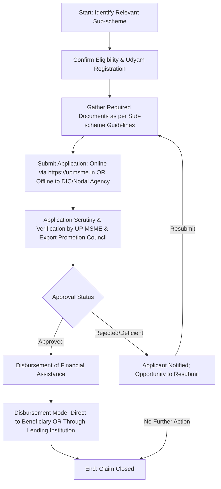

</think># Comprehensive Scheme Masterclass & File Guide

## Scheme Deep Dive

### Overview
The **UP MSME and Export Promotion Council Schemes** (Scheme ID: row-119) is a **state-level subsidy scheme** administered by the **Uttar Pradesh MSME and Export Promotion Council** for MSMEs operating exclusively within **Uttar Pradesh**. The scheme operates on a **rolling basis** with no fixed deadline, accessible via the official portal: **https://upmsme.in**. It encompasses multiple sub-schemes designed to support various facets of MSME development, including capital investment, technology upgradation, export promotion, quality certification, and skill development.

### Objectives
The scheme aims to achieve the following strategic objectives:
- Promote the growth and competitiveness of MSMEs in Uttar Pradesh
- Enhance export potential of MSMEs through market development assistance
- Provide financial support for technology upgradation and modernization
- Develop infrastructure and common facility centers for cluster-based development
- Encourage entrepreneurship and skill development in the MSME sector
- Facilitate access to credit and financial institutions for MSMEs
- Support participation in domestic and international trade fairs and exhibitions
- Strengthen institutional mechanisms for MSME policy implementation and monitoring

### Eligibility Matrix
Eligibility is primarily based on MSME classification under the MSMED Act, 2006, geographic location, and operational activity. Specific sub-schemes may impose additional criteria.

| Criteria | Requirement | Source |
|--------|-------------|--------|
| **Enterprise Type** | Micro, Small, or Medium Enterprise as defined under MSMED Act, 2006 | Key Facts |
| **Geographic Scope** | Registered office or operational unit must be located in Uttar Pradesh only | Key Facts |
| **Operational Activity** | Engaged in manufacturing or service activities | Key Facts |
| **Registration** | Valid Udyam Registration Certificate mandatory | Key Facts |
| **Additional Criteria (Sub-scheme Specific)** | May include export turnover thresholds, investment limits in plant & machinery, sector-specific focus (e.g., textiles, agro-processing), or membership in recognized clusters | Key Facts |

> **Note**: Double claiming of benefits under central and state schemes for the same expenditure is generally not allowed. Beneficiaries must not have availed similar benefits from other government sources for the same purpose.

### Benefits & Financial Support
Financial support varies significantly across sub-schemes and is disbursed after verification of claims through designated nodal agencies or banks. The scheme does not offer a fixed quantum but provides incentives as per norms of individual sub-schemes.

| Benefit Type | Description | Conditions / Notes | Source |
|-------------|-------------|--------------------|--------|
| **Capital Subsidy** | Up to a certain percentage of investment in plant and machinery | Percentage and ceiling vary by sub-scheme; disbursed post-verification | Key Facts |
| **Interest Subsidy** | On bank loans for term loans | Requires bank sanction letter; reimbursement of interest paid | Key Facts |
| **Quality Certification Reimbursement** | For ISO or other international/national certifications | Reimbursement of actual expenses incurred; certificate must be valid | Key Facts |
| **Patent Registration Support** | Financial assistance for filing and processing patents | Covers official fees, attorney charges (as per norms) | Key Facts |
| **Trade Fair Participation Assistance** | Support for domestic and international trade fairs/exhibitions | Includes stall charges, travel, freight; market development aid | Key Facts |
| **Market Development Aid** | For export promotion and market access activities | May include BDS, certification, packaging, branding support | Key Facts |
| **Infrastructure Support** | Through cluster development programs and common facility centers (CFCs) | For infrastructure upgradation, shared facilities in MSME clusters | Key Facts |
| **Skill Training Initiatives** | Subsidized or free training for workforce upskilling | Conducted through empaneled training partners or MSME-TCs | Key Facts |

> **Caveat**: Disbursement is subject to availability of funds under the Uttar Pradesh state budget. Claims must be submitted within stipulated time frames after incurring expenditure.

### Required Documents
Applicants must submit the following documents, with additional requirements possible based on the specific sub-scheme:

1. Udyam Registration Certificate  
2. Aadhaar and PAN of proprietor/partners/directors  
3. Certificate of Incorporation / Partnership Deed / MSME Registration  
4. Project Report or Business Plan  
5. Quotations for plant and machinery (if applicable)  
6. Bank sanction letter for term loan (for interest subsidy claims)  
7. Proof of export realization (for export promotion schemes)  
8. ISO or other certification certificates (for reimbursement claims)  
9. Details of bank account  
10. Address proof of the business unit  

> **Note**: All documents must be self-attested and valid at the time of submission. Scanned copies are typically accepted for online submission via https://upmsme.in.

### Application Process
The application process is standardized across sub-schemes but may vary slightly in documentation and verification steps depending on the nature of support sought.

**Key Process Notes**:
- Applications can be submitted **online** through the designated portal (**https://upmsme.in**) or **offline** to the District Industry Center (DIC) or concerned nodal agency.
- The implementing agency undertakes **scrutiny and verification** of all submitted documents and claims.
- Upon approval, financial assistance is disbursed **as per scheme norms**, either:
  - Directly to the beneficiary’s bank account, or
  - Through the lending institution (in case of interest subsidy).
- Benefits are **not automatic**; each claim must be validated against sub-scheme-specific norms and fund availability.

### Key Caveats & Warnings
> - **Fund Availability**: Benefits are subject to the availability of funds allocated under the Uttar Pradesh state budget for the financial year.
> - **Claim Timelines**: Claims for reimbursement (e.g., ISO certification, trade fair participation) must be submitted within the stipulated time period after incurring the expenditure; late claims may be rejected.
> - **No Double Benefits**: Availing similar benefits from central government schemes (e.g., CGTMSE, ZED, TEQUP) for the **same expenditure** may disqualify the applicant under state rules.
> - **Sub-scheme Specific Limits**: Certain sub-schemes may have:
>   - Sectoral restrictions (e.g., only for food processing, handicrafts)
>   - Geographical ceilings (e.g., only for enterprises in identified clusters or backward districts)
>   - Investment or turnover caps (e.g., plant & machinery investment < ₹10 Cr for capital subsidy)
> - **Prior Benefit Restriction**: Enterprises that have already received similar subsidies from other state or central sources for the same purpose are typically ineligible.
> - **Verification Risk**: False documentation or misrepresentation can lead to rejection, blacklisting, and recovery of funds with interest.

---

## Consultant's Field Guide to Generated Files

### 1. SCHEME_MASTER_DATABASE.md
**Real-time Usage**: Keep this open in a background tab during all client calls. When a client asks "What is the turnover limit?" or "Who administers this?", CTRL+F in this document to give an immediate, authoritative answer without checking the portal.

### 2. PITCH_AND_SALES_SCRIPTS.md
**Real-time Usage**: Open this file 5 minutes before your first Discovery Call with a lead. Read the "Problem Framing" out loud to hook them, then use the Qualification Checklist to interrogate their eligibility live on the phone. Keep the Objection Handlers table visible so you can immediately counter when they say "We're too small for this."

### 3. APPLICATION_PLAYBOOK.md
**Real-time Usage**: Print this out or pin it to your desktop once the client signs the retainer. Check off each box in "Stage 1" before moving to "Stage 2". Use the "Client Communication Template" to copy-paste directly into your email when chasing them for pending documents.

### 4. CLIENT_ONBOARDING_AND_CRM.md
**Real-time Usage**: Fill this out during or immediately after the onboarding call. Use the Needs Assessment to record their exact pain points. Update the "Compliance Status" table as they email you documents to maintain a single source of truth for what's missing.

### 5. LIVE_CASE_TRACKER.md
**Real-time Usage**: Review this document every morning during your standup. Update the "Stage" column daily. If a case hits "Stage 07 - Under review", use the Escalation Path notes here to know exactly who to call at the government department today.

### 6. FEE_AND_REVENUE_MODEL.md
**Real-time Usage**: Use this file when drafting the proposal. Look at the client's turnover, map them to the pricing tier in the table, and quote that exact Retainer and Success Fee. Use the monthly projection table to update your personal sales pipeline forecast for the quarter.

### 7. CLIENT_PROPOSAL_TEMPLATE.md
**Real-time Usage**: Copy this entire file, paste it into an email or PDF generator, replace the [PLACEHOLDER] tags with the client's actual details gathered from the CRM, and send it immediately after a successful discovery call.

### 8. COMPLIANCE_AND_LEGAL_PACK.md
**Real-time Usage**: Attach sections 8A and 8B as PDFs to the proposal email. Refuse to start Step 1 of the Application Playbook until the client signs these. Use the Disclaimers to protect yourself legally if the client is rejected by the government agency.